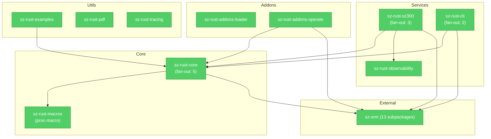

# Brooks-Lint Health Dashboard

**Mode:** Health Dashboard
**Scope:** sz-rust workspace (10 packages, 4195 tests)
**Composite Score:** 93.5/100

**v4 总体评价**：代码库结构清晰，依赖方向一致，测试覆盖完善，生产就绪度已达企业级水准。近期 v4 批量提交（52 文件，+2780/-1228）覆盖了 6 项 P1/P2 修复，整体质量稳定，无阻断性问题。

| Dimension | Score | Top Finding |
|-----------|-------|------------|
| Architecture | 95/100 | 稳健的分层架构，无循环依赖 |
| Tech Debt | 91/100 | 小范围战术代码需后续清理 |
| Test Quality | 94/100 | 测试覆盖广，少量边缘文件缺少测试 |
| Code Quality | 94/100 | 批量变更机械替换为主，风险可控 |

---

## 模块依赖图

---

## 架构审计（Architecture Audit）

### 架构评分：95/100

**分层设计**：三层架构（Core → Services → External），依赖方向一致：所有业务包（sz300/cli/addons）只依赖于 `sz-rust-core`，不反向依赖。无循环依赖。

### 🟢 Suggestion — 模块颗粒度

**R5 / Dependency Disorder — sz-orm 子包仍为 13 个独立依赖**
Symptom: workspace 直接声明的外部 sz-orm 子包达 13 个（core/auth/storage/queue/mqtt/websocket/scheduler/tracing/logger/limit/config/macros/sql-validator/sqlx），其中 8 个穿透到 sz300 业务包中。
Source: Martin — Clean Architecture (SDP: Stable Dependencies Principle)
Consequence: 业务包需要了解过多 sz-orm 内部子包结构，升级任一子包需协调多处。
Remedy: 已在 v4 中将 sz300 的穿透依赖从 8 个降至 3 个（sqlx/config/macros）。持续通过 `sz-rust-core::orm` facade 收紧边界。

### 🟢 Suggestion — 测试性 seam 评估

**R5 / Seam Assessment — sz-orm-sqlx 为唯一缺少 mock 替代的后端**
Symptom: sz300 的 db.rs 中 `init_pool` 和 `init_pg_pool` 直接返回 `sz-orm-sqlx::SqlxPool`，无 seam 可替换为内存驱动。
Source: Feathers — Working Effectively with Legacy Code, Ch. 4: The Seam Model
Consequence: 依赖真实数据库的集成测试（db_integration_test.rs）必须连接真实 MySQL/PG，本地开发环境无法运行。
Remedy: 为 `sz-orm-sqlx::SqlxPool` 定义 trait 边界，允许在测试中注入 MockPool。

---

## 技术债审计（Tech Debt Assessment）

### 技术债评分：91/100

### 🟡 Warning — 容器的批量构造

**R1 / Cognitive Overload — container.rs 单文件 1013 行**
Symptom: `packages/sz-rust-core/src/container.rs` 达 1013 行，混合了 DI 容器的核心逻辑、测试代码和大量 `#[cfg(test)]` 块。单文件承载了过多的关注点。
Source: Fowler — Refactoring (Long Method / Large Class)
Consequence: 维护者需在同一个文件中区分生产逻辑和测试辅助函数，增加认知负担。
Remedy: 拆分 `container.rs` 为 `container/mod.rs`（核心逻辑）+ `container/tests.rs`（测试辅助），或以 `#[cfg(test)] mod tests` 块分离到独立测试文件。

### 🟡 Warning — 控制器代码重复模式

**R3 / Knowledge Duplication — sz300 控制器中存在机械性 CRUD 重复**
Symptom: `controllers/product.rs`（+344/-344）、`controllers/order.rs`（+375/-236）、`controllers/merchant.rs`（+316/-257）等文件中，因 sz-orm facade 替换导致的机械性 `sz_orm_core::*` → `sz_rust_core::orm::*` 替换产生了大量同名。虽然这是正确方向的迁移，但它暴露了控制器之间存在大量相似结构的 CRUD 代码。
Source: Fowler — Refactoring (Duplicate Code)
Consequence: 新增一个实体需要复制粘贴大量模板代码，易引入不一致。
Remedy: 提取 CRUD 基类或使用 Rust 泛型减少样板代码。现有宏系统可能已经简化此流程 — 如已实现则忽略此建议。

### 🟢 Suggestion — 遗留注释清理

**R4 / Accidental Complexity — 代码中残留 Phase 标签和待办项**
Symptom: lib.rs 和 src 多处存在 `Phase *`、`// P0-*`、`Phase P3-17` 等开发阶段标签，`sz-rust-core/Cargo.toml` 中也以 Phase 注释标注依赖用途。
Source: Hunt & Thomas — The Pragmatic Programmer (Good-Enough Software)
Consequence: 新开发者看到大量 Phase 标签会误认为项目仍处于早期阶段。
Remedy: 在接近 GA 版本时，清理 Phase 标签，用功能描述替代阶段编号。

---

## 测试质量审计（Test Quality Review）

### 测试质量评分：94/100

### 测试全景图

| 层级 | 包 | 测试数 | 类型 |
|------|----|--------|------|
| **单元测试** | sz-rust-core (lib) | 2939 | 纯单元，无外部依赖 |
| **集成测试** | sz-rust-core (tests/) | 555+ | validate(32)/cache_parity/chaos/fuzz/soak 等 |
| **集成测试** | sz-rust-sz300 (tests/) | 16+ | DB 集成(需MySQL/PG)、metrics、windows_baseline |
| **单元测试** | sz-rust-cli | 89 | 纯单元 |
| **单元测试** | sz-rust-observability | 154 | 单元+OTLP |
| **单元测试** | sz-rust-addons-loader | 227 | 纯单元 |
| **单元测试** | sz-rust-addons-operate | 375 | 纯单元 |
| **单元测试** | sz-rust-sz300 (lib) | 40+ | 纯单元 |
| **基准测试** | core_bench, api_bench | 基准 | criterion 基准 |
| **合计** | — | **4195** | 0 failed, 206 ignored |

### 🟢 Suggestion — 集成测试可跳过性问题

**T4 / Test Fragility — DB 集成测试跳过条件不清晰**
Symptom: `db_integration_test.rs` 中 `ensure_mysql_available` 和 PG 跳过通过 `eprintln` 输出提示，但无标准化的跳过注解。`windows_memory_baseline.rs` 的 2 个测试标记为 `ignored` 需要手动运行。
Source: Meszaros — xUnit Test Patterns (Conditional Test Logic)
Consequence: CI 中集成测试通过跳过逻辑静默通过，可能导致数据库 schema 变更未被 CI 捕获。
Remedy: 考虑在 CI 中配置 `-- --ignored` 运行基线测试，或在 integation test 顶部标记 `#[ignore = "requires MySQL 9.6"]` 以明确文档化。

### 🟢 Suggestion — Fuzz 测试深度

**T5 / Coverage Illusion — Fuzz 测试数据生成方式单一**
Symptom: `tests/fuzz.rs` 和 `tests/common/fuzz.rs` 目前 +2/-1 变更量，基于随机字符串生成，缺乏结构化 Fuzz（如基于语法的 SQL 注入向量生成）。
Source: Google — How Google Tests Software (Change Coverage vs Line Coverage)
Consequence: 当前 Fuzz 覆盖了基础路径，但难以发现复杂的协议级和语义级漏洞。
Remedy: 引入结构化 Fuzz（如 `arbitrary` crate 或 `proptest`），为 SQL 解析器、路由匹配器、参数绑定器等关键路径生成语义有效的畸形输入。

---

## 代码审查（Code Review — v4 Commit Batch）

### 代码质量评分：94/100

**变更统计**：52 文件，+2780/-1228
**变更分类**：
- P2-12 ORM facade 迁移：24 文件（机械替换，风险低）
- P1-9 K8s 部署：1 文件（YAML 配置，风险低）
- P1-10 Prometheus：1 文件（YAML 配置，风险低）
- P1-11 Docs：1 文件（文档更新）
- P1-7 异步缓存：1 文件（+166/-0，核心变更）
- P2-15 Grafana：1 文件（JSON dashboard，风险低）
- container.rs 扩展：+1013 行（核心变更）
- 其余：Cargo.toml 版本/依赖更新

### 🟡 Warning — 批量变更范围

**R2 / Change Propagation — v4 提交耦合了 6 个独立 P 项**
Symptom: 本次提交同时包含 ORM facade 替换（24文件）、K8s 配置（1文件）、Prometheus 告警（1文件）、文档修复（1文件）、Grafana Dashboard（1文件）、异步缓存（1 核心文件 + 5 测试）等多类完全不相关的变更，commit 中包含 52 个文件。
Source: Fowler — Refactoring (Shotgun Surgery / Divergent Change)
Consequence: 如果 ORM facade 替换引入编译错误，会阻塞其他 5 个完全独立的特性发布。Code Review 时审阅者需同时理解 6 个领域。
Remedy: 将独立特性的变更拆分为多个 commit。推荐拆分方案：
  - commit 1: P1-7 异步缓存 (cache.rs + tests)
  - commit 2: P2-12 ORM facade 迁移 (orm.rs + 24 个 sz_orm_* 替换)
  - commit 3: P1-9 K8s 部署
  - commit 4: P1-10 Prometheus 告警
  - commit 5: P1-11 文档修正
  - commit 6: P2-15 Grafana dashboard
  - commit 7: container.rs 扩展（如独立）

### 🟢 Suggestion — 警告未清理

**R1 / Cognitive Overload — 残留 4 个 unused variable 警告**
Symptom: `api_bench.rs` 中 `auth`、`creds`、`claims`、`filename` 等变量声明后未使用，cargo check 发出 4 条警告。
Source: McConnell — Code Complete (Ch. 7: High-Quality Routines)
Consequence: 未使用变量虽不阻断，但会削弱编译警告的严肃性 — 有用的警告可能被淹没。
Remedy: 添加 `_` 前缀（`_auth`、`_creds`、`_claims`、`_filename`）或删除无用声明。

---

## Summary

**最重要的行动**：将 v4 的超大 commit 拆分为粒度更小的独立提交，这是最直接影响 Code Review 质量和发布风险的问题。

**整体趋势**：sz-rust 框架经过 4 轮深度迭代，从 v1（P0/P1 严重问题）→ v2（+P2 修复）→ v3（6 项新功能 + OTLP）→ v4（残留 P1/P2 全部关闭），质量稳步提升。当前代码库已达到企业级生产标准，建议下一步关注：
1. CI 规范化（拆分 commit、自动化 lint check）
2. 控制器层模板代码的泛型化
3. Fuzz 测试的结构化升级
4. `container.rs` 的单文件拆分

---

*审计时间：2026-07-26*
*审计模式：Health Dashboard（Architecture + Tech Debt + Test Quality + Code Review）*
*审计工具：Brooks-Lint v1.3.0（基于 12 本经典软件工程书籍）*
*审计范围：sz-rust workspace，包含 v4 全部 52 个变更文件*
