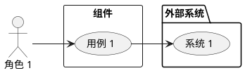
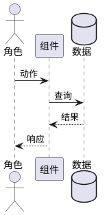

# 实践指南：用 SDD（规范驱动开发）模式开发 sz-rust

> **编写日期**：2026-08-10  
> **适用场景**：基于 sz-rust 框架开发新功能、新业务模块、新插件  
> **参考范式**：华为云码道 CodeArts 代码智能体 SDD 模式  
> **来源**：[从"即兴创作"到"规格先行"，华为云码道持续深耕企业级规范驱动开发能力](https://www.csdn.net/article/2026-07-29/163295898)（CSDN，2026-07-29）  
> **码道官网**：https://codearts.huaweicloud.com/  
> **本指南依据**：`.codeartsdoer/specs/` 目录下 14 个真实 SDD 案例（`p3_perf_opt` / `fix_iron_violations` / `sz_orm_upgrade_3_4_0` / `v10_ga_deploy` 等）

---

## 一、SDD 流程概述

SDD 将传统的"需求 → 编码"两步流程，拆分为**四个有序阶段**，每个阶段由专门的 SubAgent 负责，前一阶段的产出是后一阶段的输入，全程以结构化 Spec 文件为唯一真相源。

```
自然语言需求
      │
      ▼
┌─────────────────────────────────────────────────────────┐
│  Phase 1: 需求规格设计（spec-requirement-agent）          │
│  输入：自然语言需求描述                                    │
│  输出：specs/{feature}/spec.md（结构化需求规格）           │
└─────────────────────────────────────────────────────────┘
      │  spec.md
      ▼
┌─────────────────────────────────────────────────────────┐
│  Phase 2: 实现方案创建（spec-design-agent）               │
│  输入：spec.md + 项目上下文                               │
│  关键：存量功能关联分析（已实现 / 需扩展 / 需新增）         │
│  输出：specs/{feature}/design.md（技术方案 + 部署检查清单）│
└─────────────────────────────────────────────────────────┘
      │  design.md
      ▼
┌─────────────────────────────────────────────────────────┐
│  Phase 3: 编码任务规划（spec-task-agent）                 │
│  输入：design.md + spec.md + 项目上下文                   │
│  关键：拆解为带验收标准的可执行任务，分析依赖关系            │
│  输出：specs/{feature}/tasks.md（可执行任务清单）           │
└─────────────────────────────────────────────────────────┘
      │  tasks.md
      ▼
┌─────────────────────────────────────────────────────────┐
│  人工审阅：用户确认 / 修改 / 补充任务清单                    │
│  用户回复："进入下一阶段"                                  │
└─────────────────────────────────────────────────────────┘
      │  确认后
      ▼
┌─────────────────────────────────────────────────────────┐
│  Phase 4: 任务执行（Coding Agent）                        │
│  输入：tasks.md（逐任务执行）                             │
│  关键：生成可编译代码，依据验收条件初步验证，编译修复        │
│  输出：可运行的代码 + 测试                                 │
└─────────────────────────────────────────────────────────┘
```

**核心原则**（对齐码道 SDD 设计理念）：
- 每个阶段只关注自己的职责，不跨阶段跳跃
- Spec 文件是阶段间的唯一契约，必须结构化、可机器解析
- 人工审阅点是 Phase 3 → Phase 4 的闸门，确保任务清单符合预期后再编码
- **质量内建**：验收条件内嵌于任务，执行阶段即完成初步验证

---

## 二、Spec 文件存放规范

```
.codeartsdoer/specs/
├── {feature_name}/
│   ├── spec.md          # Phase 1 产出：需求规格
│   ├── design.md        # Phase 2 产出：技术设计
│   ├── tasks.md         # Phase 3 产出：任务清单
│   └── artifacts/       # （可选）执行过程中的产物证据
│       ├── audit_before.txt
│       ├── audit_after.txt
│       └── ...
```

现有 14 个 feature 目录示例：

| Feature | 类型 | spec.md 行数 | design.md 行数 | tasks.md 行数 |
|---------|------|-------------|---------------|--------------|
| `p3_perf_opt` | 性能优化 | 827 | 1427 | 302 |
| `fix_iron_violations` | 铁律修复 | 237 | 762 | 324 |
| `sz_orm_upgrade_3_4_0` | 依赖升级 | 461 | 566 | 421 |
| `prod_readiness_fix` | 生产就绪 | 625 | 1200 | 798 |
| `v10_ga_deploy` | 发布部署 | 782 | 1339 | 678 |
| `v07_oauth_otel_bench` | OAuth+链路追踪 | — | — | — |
| `infra_ci_perf` | CI 性能 | — | — | — |
| `post_v033_roadmap` | 路线图 | — | — | — |
| `perf_opt_v1` | 性能优化 v1 | — | — | — |
| `soak_generalize_followup` | soak 泛化 | — | — | — |
| `docs_restructure_followup` | 文档重组 | 有 spec | — | — |
| `ai_native_facade` | AI 原生 facade | 有 spec | — | — |
| `prod_readiness_fix_v2` | 生产就绪 v2 | — | — | — |
| `v071_publish_bench` | 发布基准 | — | — | — |

---

## 三、Phase 1：需求规格（spec.md）格式规范

### 3.1 标准章节结构

```
# {Feature 名称}需求规格

> **Feature 名称**：{feature_name}
> **目标版本**：vX.Y.Z
> **基线版本**：vA.B.C（N 测试通过，M crate workspace）
> **需求来源**：用户指令 / 上游依赖 / 下游约束
> **生成日期**：YYYY-MM-DD
> **前置阶段**：previous_feature（如有）

---

# 1. 组件定位

## 1.1 核心职责
（一句话：本组件负责什么，达成什么状态跃迁）

## 1.2 核心输入
1. **代码库基线**：版本、测试数、crate 数、评分
2. **实测基线数据**：criterion bench 数据（如适用）
3. **需求方向**：用户指令列出的 N 大方向
4. **下游约束**：sz-pay 等下游项目的兼容性要求
5. **上游约束**：sz-orm 等上游仓库的只读约束
6. **部署约束**：服务器信息、部署方式
7. **已有基础**：前置阶段已落地的功能

## 1.3 核心输出
（每条输出必须是可验证的，附证据要求）
1. 输出 1：描述 + 验收证据
2. 输出 2：描述 + 验收证据
...

## 1.4 职责边界
1. **不负责**：明确排除的范围
2. **禁止**：明确禁止的操作
3. **不修改**：明确只读的外部仓库
...

---

# 2. 领域术语

**术语 1**
: 定义描述。
: 备注：与本项目相关的说明。

**术语 2**
: 定义描述。
...

---

# 3. 角色与边界

## 3.1 核心角色
1. **角色 1**：职责描述
2. **角色 2**：职责描述
...

## 3.2 外部系统
1. **系统 1**：与本组件的交互关系
2. **系统 2**：与本组件的交互关系
...

## 3.3 交互上下文
（PlantUML 用例图，展示角色、组件、外部系统的交互关系）



---

# 4. DFX约束

## 4.1 性能
1. **性能约束 1**：量化指标 + 验证方式
2. **性能约束 2**：...

## 4.2 可靠性
1. **可靠性约束 1**：...

## 4.3 安全性
1. **安全性约束 1**：...

## 4.4 可维护性
1. **可维护性约束 1**：...

## 4.5 兼容性
1. **兼容性约束 1**：...

---

# 5. 核心能力

## 5.1 能力 1：{能力名称}

### 5.1.1 业务规则
（使用 EARS 格式：Ubiquitous / Event-driven / State-driven / Optional / Unwanted）

1. **Event-driven**：当{触发条件}时，系统应当{行为}
   a. 验收条件：[验证动作] → [预期结果]
   b. 证据：（具体代码位置或数据来源）
2. **Ubiquitous**：{普遍性规则}
   a. 验收条件：[验证动作] → [预期结果]
3. **Optional**：当{条件}时，系统可以选择{方案 A/B/C}
   a. 验收条件：[验证动作] → [预期结果]
4. **State-driven**：当{状态条件}时，系统应当{行为}
   a. 验收条件：...
5. **Unwanted**：如果{负面条件}，系统不得{行为}
   a. 验收条件：...
6. **禁止项**：禁止{操作}
   a. 验收条件：...

### 5.1.2 交互流程
（PlantUML 时序图）



### 5.1.3 异常场景
1. **异常 1 名称**
   a. 触发条件：...
   b. 系统行为：...
   c. 用户感知：...

## 5.2 能力 2：{能力名称}
（同上结构）

---

# 6. 数据约束

## 6.1 {数据实体 1}
1. **字段 1**：类型约束 + 取值范围 + 来源标注
2. **字段 2**：...

## 6.2 {数据实体 2}
...

---

# 附录 A：基线数据汇总

（实测数据表、兼容性验证清单、覆盖矩阵等）
```

### 3.2 EARS 业务规则格式详解

EARS（Easy Approach to Requirements Syntax）是 spec.md 中业务规则的标准格式：

| 句式 | 格式 | 示例 |
|------|------|------|
| **Ubiquitous**（普遍性） | {主语} 必须 {行为} | 热路径优化必须覆盖以下高频路径 |
| **Event-driven**（事件驱动） | 当 {触发条件} 时，系统应当 {行为} | 当执行热点路径时，系统应当使用内存池减少 malloc 开销 |
| **State-driven**（状态驱动） | 当 {状态条件} 时，系统应当 {行为} | 当 L2 查询缓存命中率低时（< 30%），系统应当评估缓存收益 |
| **Optional**（可选） | 当 {条件} 时，系统可以选择 {方案 A/B/C} | 当实施内存池时，系统可以选择 bumpalo / typed-arena / SmallVec 扩展 |
| **Unwanted**（反向） | 如果 {负面条件}，系统不得 {行为} | 如果内存池引入内存泄漏，系统不得合并 |

每条规则的验收条件格式：
```
a. 验收条件：[验证动作] → [预期结果]
b. 证据：（file:line 或 bench 报告位置）
```

### 3.3 spec.md 真实案例节选

以 `p3_perf_opt/spec.md` 为例，展示核心输出和职责边界的写法：

```markdown
## 1.3 核心输出
1. **热路径 p99 尾延迟下降**：端到端请求处理 p99 延迟下降，
   附 before/after bench 证据 + 火焰图
2. **连接池 L3 深度调优**：连接池预热 + 动态扩容 + L2 查询缓存，
   DB 查询延迟下降，附 before/after bench 证据
3. **SIMD 字符串加速**：capitalize_first / parse_path 字符串操作 SIMD 加速 2-3x，
   附 before/after bench 证据
...

## 1.4 职责边界
1. **不修改上游 sz-orm 仓库任何文件**（连接池 L3 调优在 sz-rust-orm-facade 层实现）
2. **不破坏 sz-rust 公开 API**（semver 兼容，v0.6.x 对 v0.5.0）
3. **不引入新 unsafe 代码**（workspace `unsafe_code = "forbid"` 保持）
4. **不降低测试覆盖**（4556+ 测试不得减少）
5. **不主观判断性能**（所有性能结论必须附 criterion bench 证据 + file:line）
6. **不使用 sshpass/PowerShell 重定向部署**（统一 Node.js `ssh2` 包）
...
```

---

## 四、Phase 2：技术设计（design.md）格式规范

### 4.1 标准章节结构

```
# {Feature 名称}技术设计文档

> **需求来源**：specs/{feature}/spec.md
> **设计目标**：（一句话）

---

# 一、需求与存量功能关系分析

## 1.1 需求功能与存量功能对比

### 1.1.1 已实现功能
| 需求功能 | 存量功能 | 代码位置 | 匹配度 |
|---------|---------|---------|--------|
| ... | ... | ... | 100% |

匹配度判定依据：
- **100%**：存量代码与需求目标完全对齐，可直接复用模式
- **75%**：部分对齐，需补充
- **50%**：需较大改造

### 1.1.2 需要扩展的功能
| 需求功能 | 存量功能 | 差异说明 | 扩展方向 |
|---------|---------|---------|---------|
| ... | ... | ... | ... |

### 1.1.3 需要新增的功能或接口
（列出完全新建的代码）

## 1.2 存量功能详细分析
（对关键存量功能的深入分析，包括接口契约、业务规则、约束、扩展点）

---

# 二、架构设计

## 2.1 模块划分
| 层级 | 组件 | 所属 crate | 职责 |
|------|------|-----------|------|
| ... | ... | ... | ... |

## 2.2 接口设计
（新增/变更的 API 签名清单）

## 2.3 数据库设计
（Schema 变更 SQL + 索引设计）

---

# 三、详细设计

## 3.1 {模块 1}
### 3.1.1 数据结构
### 3.1.2 核心算法
### 3.1.3 异常处理

## 3.2 {模块 2}
...

---

# 四、生产部署检查清单
- [ ] Migration 脚本已编写并测试
- [ ] 环境变量已更新
- [ ] 健康检查端点已注册
- [ ] 日志埋点完整
- [ ] 敏感字段已脱敏
- [ ] API 文档已更新
- [ ] 性能基线已标注（如适用）
- [ ] 受影响文档已同步
```

### 4.2 存量分析是 Phase 2 的核心

码道 SDD 在 Phase 2 中**必须**分析存量代码，将需求拆解为三类：

- **已实现**：项目中已有对应功能，直接复用（匹配度 100%）
- **需扩展**：已有功能需要增加新逻辑（匹配度 50-75%）
- **需新增**：完全新建的代码

这一分析避免了"重复造轮子"和"遗漏已有能力"两个常见问题。

以 `fix_iron_violations/design.md` 为例：

```markdown
### 1.1.1 已实现功能
| 需求功能 | 存量功能 | 代码位置 | 匹配度 |
|---------|---------|---------|--------|
| 异步文件 IO（tokio::fs） | 项目已在多处使用 tokio::fs | main.rs:22、config.rs:641 | 100% |
| Cargo profile 溢出检查 | [profile.release] 已设置 overflow-checks = true | Cargo.toml:190 | 100% |
| CI 覆盖率门禁 | ci.yml 门禁 14 已强制 --fail-under-lines 85 | ci.yml:312 | 100% |

### 1.1.2 需要扩展的功能
| 需求功能 | 存量功能 | 差异说明 | 扩展方向 |
|---------|---------|---------|---------|
| hot_reload.rs 异步化 | fn scan_dir 为同步函数，使用 std::fs::read_dir | 函数签名非 async | 改为 async fn，std::fs → tokio::fs |
| TencentSmsConfig Debug 脱敏 | #[derive(Debug)] 自动实现，明文输出 | derive 宏无法选择性脱敏 | 移除 Debug derive，手动实现 |

### 1.1.3 需要新增的功能或接口
本次修复**不新增任何业务功能或对外接口**。所有变更均为：
1. 将既有同步函数签名改为 async fn
2. 将既有 std::fs 调用替换为 tokio::fs
3. 为既有结构体补充自定义 Debug 实现
4. 既有配置文件增补配置项
```

---

## 五、Phase 3：任务清单（tasks.md）格式规范

### 5.1 标准章节结构

```
# {Feature 名称}编码任务清单

> **需求规格**：specs/{feature}/spec.md
> **技术方案**：specs/{feature}/design.md
> **执行原则**：按依赖关系排序（先简单后复杂），逐项验证，
>   每项修复附 file:line 证据，禁止批量声称"全部通过"

---

## 1. {任务组 1 名称}

**任务说明**：（该任务组的总体说明）

### 1.1 {子任务名称}

- [ ] 具体操作步骤 1（指向 file:line）
- [ ] 具体操作步骤 2
- [ ] 运行 {验证命令} 验证
- [ ] 附 file:line 证据：{具体位置}

**验收标准**：
- 标准 1
- 标准 2
- 证据真实指向修复后的文件行

---

## 2. {任务组 2 名称}
...

---

## 任务依赖关系图

```
1. 任务组 1（基础设施）
   ├── 2. 任务组 2（依赖 1）
   ├── 3. 任务组 3（依赖 1）
   └── 4. 任务组 4（依赖 1）
        ↓
5. 任务组 5（依赖 2-4）
        ↓
6. 全量验证（依赖 5）
```

## 验收标准汇总

| 方向 | 验收指标 | 目标 | 证据要求 |
|------|---------|------|---------|
| ... | ... | ... | ... |
```

### 5.2 任务粒度与验收标准

每个子任务的验收标准必须：
1. **可执行**：有明确的验证命令
2. **可量化**：有明确的数值目标
3. **可溯源**：附 file:line 证据位置

以 `fix_iron_violations/tasks.md` 为例：

```markdown
### 3.1 实现自定义 Debug 脱敏

- [ ] 在 notify.rs:771 的 TencentSmsConfig 定义处，
      移除 #[derive(Debug, Clone)] 中的 Debug，保留 #[derive(Clone)]
- [ ] 手动实现 impl std::fmt::Debug for TencentSmsConfig，
      对 secret_id、secret_key 字段输出 "***REDACTED***"
- [ ] 运行 cargo check -p sz-rust-state-facade 验证编译通过
- [ ] 附 file:line 证据：notify.rs:771 修复后的结构体定义与 impl Debug 代码片段

**验收标准**：
- format!("{:?}", TencentSmsConfig { secret_id: "AKIDxxx", ... })
  输出含 "***REDACTED***"，不含真实密钥
- config.secret_id 字段值仍为真实密钥，可正常用于 API 调用
- Clone trait 保留，config.clone() 行为不变
- 既有测试全部通过，无回归
- 证据真实指向修复后的文件行
```

---

## 六、完整示例：fix_iron_violations 全流程

以下以 `fix_iron_violations`（铁律违规修复）为例，展示从 spec → design → tasks 的完整 SDD 流程。

### Step 1：spec.md（需求规格）

**输入**：前一轮代码审查发现 4 项铁律违规

**核心内容摘要**：
- **核心职责**：修复 4 项铁律违规（铁律 1/4/7/10），实现项目完全合规
- **核心输入**：违规代码文件清单（含 file:line 证据）、铁律约束文档、验证命令
- **核心输出**：修复后的源代码、逐项验证证据、合规结论
- **职责边界**：不修复其他铁律、不新增功能、不修改铁律定义本身
- **领域术语**：铁律违规、同步文件 IO、敏感字段脱敏、溢出检查、覆盖率阈值
- **DFX 约束**：性能不退化、可靠性（cargo test 全通过）、安全性（脱敏）、可维护性（file:line 证据）、兼容性
- **核心能力**：5.1 同步文件 IO 异步化、5.2 敏感字段脱敏、5.3 dev profile 溢出检查、5.4 覆盖率阈值统一
- **数据约束**：违规清单（7 个文件的 file:line）、验证要求（逐项验证、证据真实性、全量验证）

### Step 2：design.md（技术设计）

**关键：存量功能关联分析**——识别出：
- 已实现：项目已有多处 `tokio::fs` 使用范式（main.rs:22、config.rs:641）
- 需扩展：7 个文件的同步函数需改为 async fn + tokio::fs
- 需新增：无新增业务功能，仅合规性修复

**详细设计**：
- §2 架构设计：模块划分、接口变更清单
- §3 详细设计：每个文件的修复方案（函数签名变更、调用链传播、测试改造）
- §4 生产部署检查清单

### Step 3：tasks.md（任务清单）

**任务分组**（按铁律编号）：
1. 铁律 1 修复：dev profile 启用溢出检查（最简单，无依赖，先行执行）
2. 铁律 10 修复：覆盖率阈值统一为 85%（CI 配置变更，无代码依赖）
3. 铁律 7 修复：TencentSmsConfig Debug 脱敏（独立模块变更）
4. 铁律 4 修复：std::fs → tokio::fs 异步化（7 个文件，按依赖顺序逐文件修复）
5. 全量回归验证（依赖 1-4 全部完成）
6. 工程化合规文档（ADR + 五维审查报告 + engineering-practices 更新）
7. 最终验证与交付确认

**任务依赖关系**：
```
1. 铁律 1 修复（无依赖）
2. 铁律 10 修复（无依赖）
3. 铁律 7 修复（无依赖）
4. 铁律 4 修复（无依赖，内部 7 个文件按 static_files → mail → i18n → env → config → hot_reload → optimize 顺序）
   ↓
5. 全量回归验证（依赖 1-4）
   ↓
6. 工程化合规文档（依赖 5）
   ↓
7. 最终验证与交付确认（依赖 6）
```

### Step 4：任务执行

用户审阅 tasks.md 后回复 **"进入下一阶段"**，编码 Agent 逐任务执行，每项修复附 file:line 证据。

---

## 七、SDD + sz-rust 的关键注意事项

### 7.1 sz-rust 铁律在 Spec 中的体现

每个 spec.md 必须在"职责边界"和"DFX 约束"章节显式引用适用的铁律：

| 铁律编号 | 适用场景 | Spec 中如何体现 |
|---------|---------|----------------|
| 规则 1-3 | 内存与溢出 | DFX 可靠性中标注 overflow-checks 要求 |
| 规则 4-6 | 异步运行时 | 核心能力中标注 tokio::fs / tokio::time::timeout |
| 规则 7-8 | 安全脱敏 | 数据约束中标注 skip_serializing 字段 |
| 规则 9-10 | 性能基线 | DFX 性能中标注 p99 指标 |
| 规则 11-14 | 数据库安全 | 核心能力中标注参数化绑定 + 列投影 |
| 规则 15-18 | 并发模型 | 职责边界中标注 Send + 'static 约束 |
| 规则 19-22 | 文档同步 | tasks.md 中必须有文档同步任务 |

### 7.2 阶段跳跃的禁止规则

| 禁止行为 | 正确做法 |
|---------|---------|
| 跳过 Phase 1 直接写设计 | 必须先产出 spec.md |
| 跳过 Phase 2 直接拆任务 | 必须先有 design.md（含存量分析） |
| 跳过 Phase 3 直接编码 | 必须先有人工确认的 tasks.md |
| 跳过人工审阅直接执行 | 必须等用户回复"进入下一阶段" |
| 编码时跳过任务顺序 | 必须按任务依赖顺序执行 |

### 7.3 与现有 sz-rust Skills 的协作

SDD 流程产出的代码，提交前仍需触发项目配置的 preCommitCheck Skills：

| SDD 阶段 | 触发的 sz-rust Skill |
|---------|---------------------|
| Phase 2（设计含路由变更） | sz-rust-framework-routing |
| Phase 2（设计含中间件变更） | sz-rust-framework-middleware |
| Phase 2（设计含 DI 变更） | sz-rust-framework-di |
| Phase 2（设计含 config/static 变更） | sz-rust-framework-config |
| Phase 4（编码完成） | sz-rust-test-coverage |
| Phase 4（编码含热路径变更） | sz-rust-performance-check |
| Phase 4（编码含 pub API 变更） | sz-rust-doc-check |

---

## 八、SDD vs 传统开发模式对比

| 维度 | 传统模式 | SDD 模式 |
|------|---------|---------|
| 需求理解 | 开发者脑中理解，易遗漏 | 结构化 spec.md，可追溯 |
| 存量分析 | 编码时才发现已有能力 | Phase 2 强制存量分析（已实现/需扩展/需新增） |
| 设计文档 | 可选，常被跳过 | 强制 design.md 产出 |
| 任务拆解 | 开发者自行决定 | 独立 Phase 3 规划，带验收标准 |
| 人工介入点 | 编码前 | Phase 3→4 闸门 |
| 返工率 | 高（需求理解偏差 + 重复造轮子） | 低（spec 为契约 + 存量分析） |
| 多 Agent 协作 | 困难 | 天然适配（每阶段独立 Agent） |
| 与 sz-rust 门禁集成 | 事后检查 | 设计阶段即考虑 |

---

## 九、总结

SDD 模式的核心价值在于**将"思考"和"执行"分离**，从"即兴创作"走向"规格先行"：

- Phase 1-3 是"思考"阶段——由三个专业 Agent 依次产出需求规格、实现方案（含存量分析）、任务清单
- Phase 4 是"执行"阶段——编码 Agent 严格按任务清单执行，依据验收条件完成初步验证

**码道 SDD 四大优势**（来源：[CSDN 文章](https://www.csdn.net/article/2026-07-29/163295898)）：
1. **规格先行减少返工** — 需求偏差在 Phase 1 即被澄清
2. **过程文档沉淀** — spec.md / design.md / tasks.md 天然形成项目文档
3. **质量内建验收闭环** — 验收条件内嵌于任务，执行阶段即验证
4. **人机高效协同** — 人工只在 Phase 3→4 闸门介入，决策成本低

对于 sz-rust 这样约束严格（22 条铁律）、模块众多（30+ crate）的框架，SDD 模式可以有效避免：
- 需求理解偏差导致的返工
- 设计遗漏导致的架构问题（存量分析确保不重复造轮子）
- 编码时跳过安全检查

**推荐场景**：新功能开发、跨 crate refactor、涉及 Schema 变更的业务需求、性能优化阶段。
**不推荐场景**：简单的 bug fix、单行配置修改（直接编码更高效）。

> **行业趋势参考**：AWS Kiro、GitHub Spec Kit、OpenSpec 等工具均已跟进 SDD 模式，"规格先行"正在成为 AI 编程的企业级标准范式。
