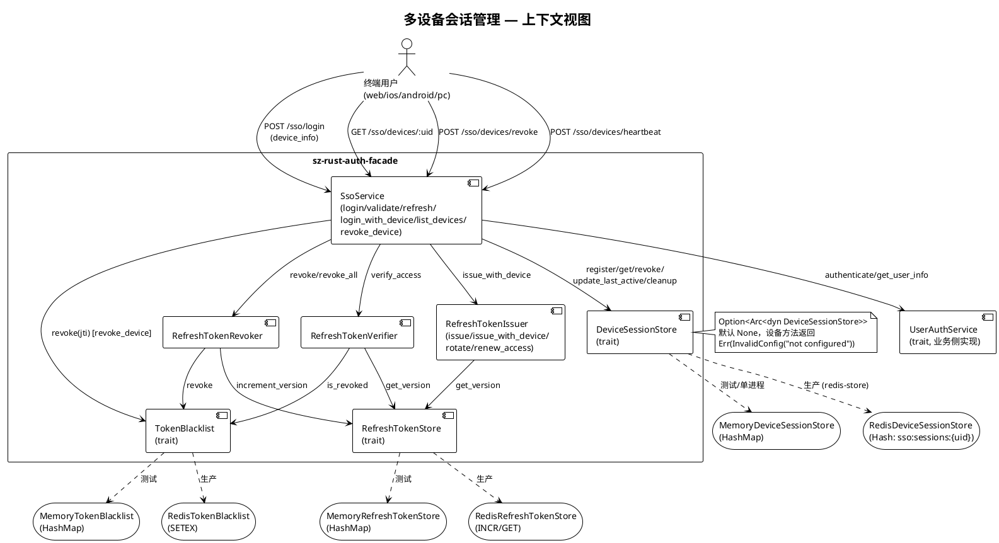
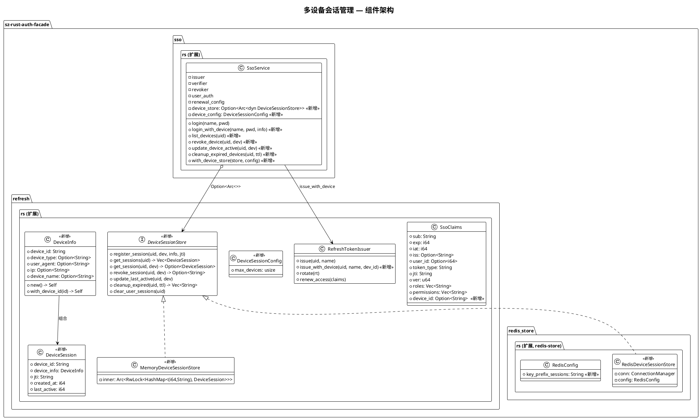
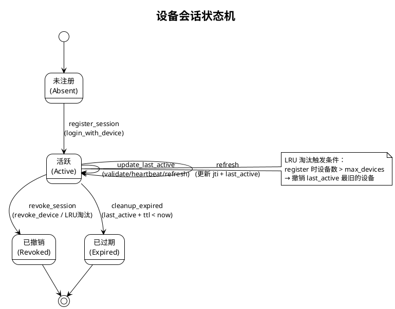
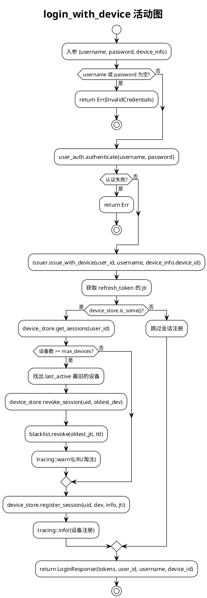
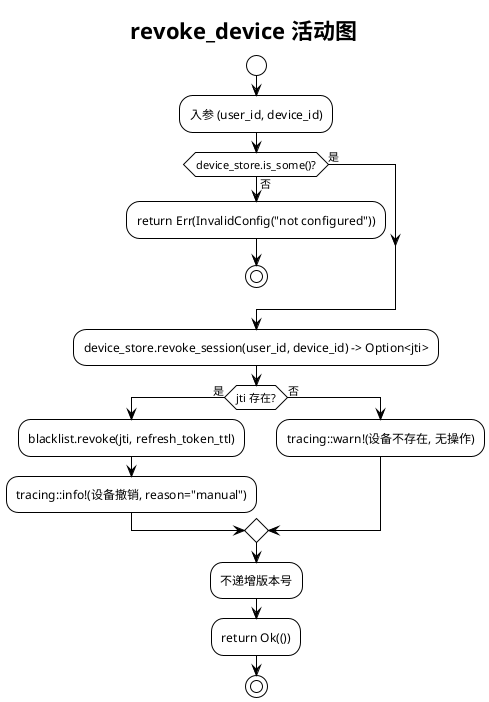

# 多设备会话管理（P1）技术设计文档

| 项目 | 值 |
|------|-----|
| 功能名称 | 多设备会话管理（Multi-Device Session Management） |
| 版本 | v0.6.5 → v0.6.6（semver 兼容） |
| 对齐需求 | `docs/spec/multi-device-session/spec.md`（REQ-001 ~ REQ-029，AC-001 ~ AC-018） |
| 代码基线 | `packages/sz-rust-auth-facade/src/{refresh.rs, sso.rs, redis_store.rs, lib.rs, Cargo.toml}` |
| 影响范围 | `sz-rust-auth-facade` 单 crate，不引入新依赖，不破坏 sz-pay 兼容性 |
| 关键约束 | 全部 `async fn` 必须 `Send + 'static`；禁止 `std::fs`；不引入新依赖；clippy 0 warning |

---

# 一、需求与存量功能关系分析

## 1.1 需求功能与存量功能对比

### 1.1.1 已实现功能（可直接复用，匹配度 100%）

| 需求功能 | 存量功能 | 代码位置 | 匹配度 |
|---------|---------|---------|--------|
| JWT HS256 编解码（含自定义 claim） | `SsoJwtCodec::encode/decode` | `refresh.rs:193-271` | 100% |
| 双 Token 签发（access + refresh） | `RefreshTokenIssuer::issue` | `refresh.rs:588-621` | 100% |
| Token 校验链（签名→过期→类型→黑名单→签发人→版本） | `RefreshTokenVerifier::verify` | `refresh.rs:517-555` | 100% |
| Token 轮换（旧 refresh → 新 pair，复用检测） | `RefreshTokenIssuer::rotate` | `refresh.rs:660-709` | 100% |
| 用户级撤销（递增版本号，O(1)） | `RefreshTokenRevoker::revoke_all` | `refresh.rs:756-759` | 100% |
| 单 Token 撤销（jti 加入黑名单） | `RefreshTokenRevoker::revoke` | `refresh.rs:738-753` | 100% |
| Token 黑名单抽象 + 内存实现 | `TokenBlacklist` / `MemoryTokenBlacklist` | `refresh.rs:433-477` | 100% |
| 版本号存储抽象 + 内存实现 | `RefreshTokenStore` / `MemoryRefreshTokenStore` | `refresh.rs:386-425` | 100% |
| 用户认证后端抽象 | `UserAuthService` trait | `sso.rs:47-57` | 100% |
| accessToken 自动续期 | `SsoService::validate_with_renewal` | `sso.rs:163-201` | 100% |
| axum 路由组装模式 | `axum_routes::sso_routes` | `sso.rs:228-235` | 100% |
| Redis 存储模式（ConnectionManager + timeout + key 前缀 + Debug 脱敏） | `RedisRefreshTokenStore` / `RedisTokenBlacklist` / `RedisConfig` | `redis_store.rs:106-215` / `redis_store.rs:24-98` | 100% |
| feature gate 模式（`redis-store` → `dep:redis, dep:tokio`） | `Cargo.toml [features]` | `Cargo.toml:50-60` | 100% |
| tracing 结构化日志（instrument + warn/info） | `RefreshTokenIssuer::issue/rotate` | `refresh.rs:587,659` | 100% |
| UUID v4 生成 | `uuid::Uuid::new_v4()` | `refresh.rs:597,602,635` | 100% |
| chrono 时间戳 | `chrono::Utc::now().timestamp()` | `refresh.rs:126,150` | 100% |

### 1.1.2 需要扩展的功能（部分匹配，需在现有基础上改造）

| 需求功能 | 存量功能 | 差异说明 | 扩展方向 |
|---------|---------|---------|---------|
| SsoClaims 携带 device_id | `SsoClaims`（11 字段，无 device_id）`refresh.rs:93-121` | 需新增 `device_id: Option<String>` 字段；serde 需 `#[serde(default, skip_serializing_if = "Option::is_none")]` 保证旧 Token 反序列化为 `None`；`SsoClaims::access/refresh` 构造器需补 `device_id: None` 默认；`renew_access` 复制 claims 时需复制 `device_id` | 在 `SsoClaims` 结构体追加 1 字段；`access()`/`refresh()`/`renew_access()` 三处构造补默认值；不改变现有字段顺序 |
| `RefreshTokenIssuer::issue` 签发带 device_id 的 Token | `issue(user_id, username)` `refresh.rs:588-621` | 现有 `issue` 无 device 参数，签发的 Token device_id 恒为 None；需新增 `issue_with_device(user_id, username, device_id)` 或在 `issue` 内部接受 `Option<&str>` | 新增 `issue_with_device` 方法（不修改 `issue` 签名，保持兼容）；内部复用 `issue` 逻辑，仅在构造 claims 后写入 `device_id` |
| `SsoService::validate` 校验通过后更新设备活跃 | `validate` `sso.rs:154-156` 仅返回 claims | 需在返回前判断 `claims.device_id.is_some() && self.device_store.is_some()`，调用 `update_last_active`；失败时仅 `tracing::warn!` 不中断 | 在 `validate` 末尾追加"best-effort 更新活跃"逻辑；`validate_with_renewal` 同理 |
| `SsoService::refresh` 轮换后更新会话 jti | `refresh` `sso.rs:136-138` 仅返回 TokenPair | 需在 `rotate` 成功后，若新 Token 含 device_id，调用 `DeviceSessionStore` 更新该设备会话的 jti 与 last_active | 在 `refresh` 末尾追加"best-effort 更新会话 jti"逻辑；需先解码新 refresh_token 提取 jti（或让 `rotate` 返回 claims） |
| `SsoService::revoke_all` 清空设备会话 | `revoke_all` `sso.rs:148-150` 仅递增版本号 | 需在递增版本号后，若持有 `DeviceSessionStore`，清空该用户所有设备会话 | 在 `revoke_all` 末尾追加"best-effort 清空设备会话"逻辑；新增 `DeviceSessionStore::clear_user_sessions` 或循环 `get_sessions` + `revoke_session` |
| axum `/sso/login` 端点支持 device_info | `LoginRequest { username, password }` `sso.rs:237-241` | 需新增可选 `device_info` 字段；存在时调用 `login_with_device`，否则调用 `login` | `LoginRequest` 增 `device_info: Option<DeviceInfo>`；`login` handler 分支调用 |
| axum 路由新增 devices 端点 | `sso_routes()` `sso.rs:228-235` | 需新增 3 条路由：`GET /sso/devices/:user_id`、`POST /sso/devices/revoke`、`POST /sso/devices/heartbeat` | 在 `sso_routes()` 链式追加 3 条 `.route()` |

### 1.1.3 需要新增的功能或接口（存量代码中完全无对应实现）

**模块 A：设备信息与设备会话领域模型（`refresh.rs` 新增）**

| 功能点 | 输入 | 输出 | 核心逻辑 | 依赖 |
|--------|------|------|---------|------|
| `DeviceInfo` 结构体 | device_id / device_type / user_agent / ip / device_name | JSON 可序列化对象 | 携带设备元数据；`new()` 自动生成 UUID v4 | uuid, serde |
| `DeviceInfo::new()` | 无 | `DeviceInfo`（device_id = UUID v4，其余 None） | 自动生成设备标识 | uuid |
| `DeviceInfo::with_device_id(id)` | device_id: String | `DeviceInfo` | 显式指定 device_id（客户端复用设备标识场景） | serde |
| `DeviceSession` 结构体 | device_id / device_info / jti / created_at / last_active | JSON 可序列化对象 | 描述一个设备会话的完整状态 | chrono, serde |

**模块 B：设备会话存储抽象与实现（`refresh.rs` trait + `MemoryDeviceSessionStore`；`redis_store.rs` Redis 实现）**

| 功能点 | 输入 | 输出 | 核心逻辑 | 依赖 |
|--------|------|------|---------|------|
| `DeviceSessionStore` trait | user_id, device_id, device_info, jti, ttl | `Result<T, RefreshTokenError>` | 设备会话 CRUD 抽象（6 方法） | async_trait |
| `MemoryDeviceSessionStore` | 无 | `Self` | `Arc<RwLock<HashMap<(i64, String), DeviceSession>>>` 内存实现 | parking_lot |
| `RedisDeviceSessionStore`（feature `redis-store`） | `RedisConfig` | `Self` | Redis Hash 存储：key=`sso:sessions:{user_id}`，field=`{device_id}`，value=JSON | redis, tokio |

**模块 C：SsoService 设备管理 API（`sso.rs` 新增方法）**

| 功能点 | 输入 | 输出 | 核心逻辑 | 依赖 |
|--------|------|------|---------|------|
| `SsoService::login_with_device` | username, password, DeviceInfo | `LoginResponse`（Token 含 device_id） | 认证 → `issue_with_device` → `register_session`（含 LRU 淘汰） | UserAuthService, RefreshTokenIssuer, DeviceSessionStore |
| `SsoService::list_devices` | user_id | `Vec<DeviceSession>` | 委托 `DeviceSessionStore::get_sessions` | DeviceSessionStore |
| `SsoService::revoke_device` | user_id, device_id | `()` | 查会话取 jti → 黑名单 → 删会话（不递增版本号） | DeviceSessionStore, TokenBlacklist |
| `SsoService::update_device_active` | user_id, device_id | `()` | 委托 `DeviceSessionStore::update_last_active` | DeviceSessionStore |
| `SsoService::cleanup_expired_devices` | user_id, ttl_secs | `usize` | 委托 `DeviceSessionStore::cleanup_expired` 并对返回 jti 批量加黑名单 | DeviceSessionStore, TokenBlacklist |

**模块 D：设备会话配置（`refresh.rs` 新增）**

| 功能点 | 输入 | 输出 | 核心逻辑 | 依赖 |
|--------|------|------|---------|------|
| `DeviceSessionConfig` | max_devices: usize（默认 10） | `Self` | 设备数量上限配置 | 无 |

**模块 E：axum 设备管理端点（`sso.rs axum_routes` 新增）**

| 功能点 | 输入 | 输出 | 核心逻辑 | 依赖 |
|--------|------|------|---------|------|
| `GET /sso/devices/:user_id` | Path(user_id) | JSON 设备列表 | 委托 `list_devices` | axum |
| `POST /sso/devices/revoke` | { user_id, device_id } | JSON { revoked: true } | 委托 `revoke_device` | axum |
| `POST /sso/devices/heartbeat` | { user_id, device_id } | JSON { updated: true } | 委托 `update_device_active` | axum |

## 1.2 存量功能详细分析

### 1.2.1 SsoClaims 契约分析（`refresh.rs:93-121`）

- **接口契约**：
  - 序列化字段：`sub`（必填）、`exp`（必填）、`iat`（必填）、`iss`（Option，None 时省略）、`user_id`（Option，None 时省略）、`token_type`（默认 `"access"`）、`jti`（默认空串）、`ver`（默认 0）、`roles`（空时省略）、`permissions`（空时省略）
  - 反序列化兼容：缺失字段使用 `#[serde(default)]`，旧 Token 可正常解码
  - 派生：`Debug, Clone, Serialize, Deserialize, PartialEq`
- **业务规则**：
  - `access()` 构造 accessToken（token_type="access"，jti 留空，由 issue 后续填充）
  - `refresh()` 构造 refreshToken（token_type="refresh"，jti 由调用方传入）
  - `is_access()` / `is_refresh()` 按 token_type 字符串判定
  - `is_expired()` 按 `chrono::Utc::now().timestamp() >= exp` 判定
- **扩展点**：结构体为 `pub` 字段，外部可自由构造；`renew_access` 通过整体复制 claims 实现续期
- **约束**：
  - `PartialEq` 派生要求所有字段可比较（新增 `device_id: Option<String>` 满足）
  - serde 字段顺序不敏感（JSON 对象无序），但 `#[serde(default)]` 必须保留以兼容旧 Token
  - **关键约束**：新增 `device_id` 必须使用 `#[serde(default, skip_serializing_if = "Option::is_none")]`，否则旧 Token（无 device_id 字段）反序列化会失败，破坏 sz-pay 兼容性

### 1.2.2 RefreshTokenIssuer::issue 契约分析（`refresh.rs:588-621`）

- **接口契约**：
  - 入参：`user_id: i64`, `username: &str`
  - 出参：`TokenPair { access_token, refresh_token, access_expires_at, refresh_expires_at }`
  - 副作用：读取 `store.get_version(user_id)`；不写入黑名单；不写入 DeviceSessionStore
  - 异常：`RefreshTokenError::Jwt`（编码失败）、`RefreshTokenError::Cache`（store 读取失败）
- **业务规则**：
  - access jti 与 refresh jti 独立生成（两个不同 UUID v4）
  - ver 来自 `store.get_version`，不递增
  - access/refresh 的 `iat` 均为当前时间
- **扩展点**：`issue` 为 `pub async fn`，可在 `SsoService` 层包装；`renew_access` 已演示"复制 claims 构造新 Token"模式
- **约束**：
  - `#[tracing::instrument(skip(self), fields(user_id = user_id))]` — 新增 `issue_with_device` 需保留 instrument 模式
  - 不调用 `store.increment_version`（签发不撤销）
  - **关键约束**：`issue` 签名不可变（sz-pay 直接调用），新增 device_id 必须通过新方法 `issue_with_device`

### 1.2.3 SsoService 契约分析（`sso.rs:79-208`）

- **接口契约**：
  - 持有 5 个字段：`issuer`, `verifier`, `revoker`, `user_auth: Arc<dyn UserAuthService>`, `renewal_config`
  - `login(username, password) -> LoginResponse` — 认证 + 签发，**无设备参数**
  - `refresh(refresh_token) -> TokenPair` — 委托 `issuer.rotate`
  - `revoke(token) -> ()` — 委托 `revoker.revoke`
  - `revoke_all(user_id) -> ()` — 委托 `revoker.revoke_all`（递增版本号）
  - `validate(access_token) -> SsoClaims` — 委托 `verifier.verify_access`
  - `validate_with_renewal(access_token) -> (SsoClaims, Option<RenewedToken>)` — 校验 + 自动续期
  - `me(user_id) -> UserInfo` — 委托 `user_auth.get_user_info`
- **业务规则**：
  - `login` 空串校验在方法内（`username.is_empty() || password.is_empty()`）
  - `validate_with_renewal` 续期不撤销旧 accessToken、不签发新 refreshToken、不递增版本号
- **扩展点**：
  - `with_renewal_config(&mut self, config) -> &mut Self` 链式配置模式 — 新增 `with_device_store` 应复用此模式
  - `new()` 构造器固定 4 参数 — 新增 `device_store` 应通过 `with_device_store` 注入，不改变 `new` 签名
- **约束**：
  - 全部方法为 `&self`（不可变借用），内部 `Arc` 共享可变状态
  - `#[tracing::instrument(skip(self, password))]` / `skip(self, access_token)` — 新增方法需保留 instrument 模式，敏感字段（password/token）必须 skip
  - **关键约束**：`login` 签名不可变；`new` 签名不可变；`device_store` 必须为 `Option<Arc<dyn DeviceSessionStore>>`，默认 `None` 时所有设备方法返回 `Err(RefreshTokenError::InvalidConfig("device session store not configured"))`

### 1.2.4 RefreshTokenStore / TokenBlacklist 契约分析（`refresh.rs:386-477`）

- **接口契约**：
  - `RefreshTokenStore: Send + Sync`，2 方法：`get_version(user_id) -> u64`、`increment_version(user_id) -> u64`
  - `TokenBlacklist: Send + Sync`，2 方法：`revoke(jti, ttl_secs) -> ()`、`is_revoked(jti) -> bool`
  - 均使用 `#[async_trait::async_trait]`
- **业务规则**：
  - `MemoryRefreshTokenStore` 使用 `Arc<parking_lot::RwLock<HashMap<i64, u64>>>`，`get_version` 不存在时返回 0
  - `MemoryTokenBlacklist` 使用 `Arc<parking_lot::RwLock<HashMap<String, i64>>>`（jti → expires_at），`is_revoked` 检查 `expires_at > now`
- **扩展点**：trait 为 `pub`，外部可实现自定义后端
- **约束**：
  - `Send + Sync` 强制 — `DeviceSessionStore` 必须遵循
  - `async_trait` 宏 — `DeviceSessionStore` 必须使用同一宏
  - **关键约束**：`DeviceSessionStore` trait 方法签名应与 `RefreshTokenStore` 风格一致（返回 `Result<T, RefreshTokenError>`，错误类型复用）

### 1.2.5 RedisConfig / Redis 存储模式分析（`redis_store.rs:24-235`）

- **接口契约**：
  - `RedisConfig { url, key_prefix_ver, key_prefix_bl, connection_timeout, command_timeout }`
  - `Debug` 实现脱敏 URL 密码（`redact_redis_url`）
  - `RedisRefreshTokenStore` / `RedisTokenBlacklist` 各自持有 `ConnectionManager` clone（内部 Arc 共享连接池）
  - `create_redis_stores(config) -> (Arc<dyn RefreshTokenStore>, Arc<dyn TokenBlacklist>)` 工厂
- **业务规则**：
  - key 格式：`{prefix}:{user_id}` / `{prefix}:{jti}`
  - 命令超时统一 `tokio::time::timeout(config.command_timeout, ...)`
  - 错误映射：超时 → `ServiceUnavailable`；Redis 错误 → `Cache(format!(...))`
- **扩展点**：`RedisConfig` 为 `pub` 且字段 `pub`，可外部构造
- **约束**：
  - feature gate `redis-store = ["dep:redis", "dep:tokio"]`
  - `lib.rs` 中 `#[cfg(feature = "redis-store")] pub mod redis_store;`
  - **关键约束**：`RedisDeviceSessionStore` 必须复用此模式：复用 `RedisConfig`（新增 `key_prefix_sessions` 字段）、复用 `ConnectionManager`、复用 timeout + 错误映射模式；新增 `create_redis_device_store` 工厂或在 `create_redis_stores` 扩展返回三元组

---

# 二、增量设计方案

## 2.1 实现模型

### 2.1.1 上下文视图



**通信协议与调用频率**：
- User → Sso：HTTP/1.1 + JSON，登录低频、validate 高频（每次请求）、heartbeat 中频（前端定时 5min）
- Sso → DevStore：进程内 trait 调用（Memory）或 Redis RESP2（redis-store），register 低频、update_last_active 高频、get_sessions 低频
- Sso → BL：进程内或 Redis，revoke 低频、is_revoked 高频（每次 validate）

### 2.1.2 服务/组件总体架构



**模块划分与职责**：
- `refresh.rs`：领域模型（DeviceInfo/DeviceSession/DeviceSessionConfig）+ 存储 trait + Memory 实现 + Issuer 扩展。无 HTTP 依赖，无业务逻辑。
- `sso.rs`：SsoService 设备管理 API（编排层，组合 Issuer/Verifier/Revoker/DeviceSessionStore）+ axum 端点。
- `redis_store.rs`：RedisDeviceSessionStore 实现（feature gate `redis-store`）。

**配置项及取值策略**：
- `DeviceSessionConfig.max_devices`：默认 10，取值范围 `[1, 100]`，超出时 clamp 到 100 并 warn
- `RedisConfig.key_prefix_sessions`：默认 `"sso:sessions"`，key 格式 `{prefix}:{user_id}`，field 为 `{device_id}`

### 2.1.3 实现设计文档

#### 设备会话状态机



#### login_with_device 流程图



#### revoke_device 流程图



## 2.2 数据结构设计

### 2.2.1 设计目标

- **支持的业务场景**：多设备同时登录、按设备查询/撤销/心跳、LRU 淘汰、过期清理、refresh 轮换更新会话 jti
- **性能目标**：Memory 实现 `list_devices` < 1μs、`revoke_device` < 5μs；Redis 实现 `list_devices` < 1ms
- **容量目标**：单用户设备数上限 `max_devices`（默认 10），防止 Token 泛滥
- **扩展性目标**：`DeviceSessionStore` 为 trait，支持自定义后端（如未来 DB 持久化）
- **兼容策略**：`SsoClaims.device_id` 为 `Option`，旧 Token 反序列化为 `None`；`SsoService` 不持有 `DeviceSessionStore` 时所有设备方法返回 `Err(InvalidConfig)`，但不影响 `login/validate/refresh/revoke` 现有行为

### 2.2.2 模型实现

#### DeviceInfo（设备元数据）

```rust
/// 设备信息（登录时由客户端提供或服务端从请求头提取）
#[derive(Debug, Clone, serde::Serialize, serde::Deserialize, PartialEq)]
pub struct DeviceInfo {
    /// 设备唯一标识（UUID v4，客户端可复用以实现"同一设备重新登录刷新会话"）
    pub device_id: String,
    /// 设备类型：web / ios / android / pc
    #[serde(default, skip_serializing_if = "Option::is_none")]
    pub device_type: Option<String>,
    /// 浏览器/客户端 User-Agent
    #[serde(default, skip_serializing_if = "Option::is_none")]
    pub user_agent: Option<String>,
    /// 登录 IP
    #[serde(default, skip_serializing_if = "Option::is_none")]
    pub ip: Option<String>,
    /// 设备名称（如 "iPhone 15 Pro"）
    #[serde(default, skip_serializing_if = "Option::is_none")]
    pub device_name: Option<String>,
}

impl DeviceInfo {
    /// 自动生成 UUID v4 作为 device_id，其余字段为 None
    pub fn new() -> Self { /* device_id = uuid::Uuid::new_v4().to_string() */ }

    /// 显式指定 device_id（客户端复用设备标识场景）
    pub fn with_device_id(device_id: impl Into<String>) -> Self { /* ... */ }
}

impl Default for DeviceInfo {
    fn default() -> Self { Self::new() }
}
```

**生命周期**：由 `login_with_device` 调用方构造；存入 `DeviceSession` 后不可变（如需更新 UA/IP，需重新登录）。

#### DeviceSession（设备会话状态）

```rust
/// 设备会话（一个用户在一个设备上的登录会话）
#[derive(Debug, Clone, serde::Serialize, serde::Deserialize, PartialEq)]
pub struct DeviceSession {
    /// 设备 ID（与 DeviceInfo.device_id 一致，冗余存储便于查询/序列化）
    pub device_id: String,
    /// 设备元数据
    pub device_info: DeviceInfo,
    /// 当前 refreshToken 的 jti（refresh 轮换时更新）
    pub jti: String,
    /// 会话创建时间（Unix 时间戳）
    pub created_at: i64,
    /// 最后活跃时间（Unix 时间戳，validate/heartbeat/refresh 时更新）
    pub last_active: i64,
}
```

**生命周期**：`register_session` 创建 → `update_last_active` / `refresh` 更新 → `revoke_session` / `cleanup_expired` / LRU 淘汰销毁。

#### DeviceSessionConfig（设备会话配置）

```rust
/// 设备会话配置
#[derive(Debug, Clone)]
pub struct DeviceSessionConfig {
    /// 单用户最大设备数（默认 10，超出时 LRU 淘汰最旧设备）
    pub max_devices: usize,
}

impl Default for DeviceSessionConfig {
    fn default() -> Self { Self { max_devices: 10 } }
}
```

#### SsoClaims 扩展（新增 1 字段）

```rust
pub struct SsoClaims {
    // ... 现有 11 字段不变 ...
    /// 设备 ID（多设备会话管理，None 表示 v0.6.5 之前签发的 Token）
    #[serde(default, skip_serializing_if = "Option::is_none")]
    pub device_id: Option<String>,
}
```

**构造器扩展**：
- `SsoClaims::access(...)` / `refresh(...)`：新增 `device_id: None` 默认值
- `RefreshTokenIssuer::renew_access(old_claims)`：复制 `device_id: old_claims.device_id.clone()`（续期保留设备绑定）

#### SsoService 扩展（新增 2 字段）

```rust
pub struct SsoService {
    // ... 现有 5 字段不变 ...
    /// 设备会话存储（可选，None 时设备方法返回 Err(InvalidConfig)）
    device_store: Option<Arc<dyn DeviceSessionStore>>,
    /// 设备会话配置
    device_config: DeviceSessionConfig,
}
```

**对象关系**：`SsoService` 聚合 `DeviceSessionStore`（0 或 1 个）；`DeviceSession` 组合 `DeviceInfo`（1:1）；`DeviceSessionStore` 不持有 `TokenBlacklist`（黑名单操作由 `SsoService` 编排，保持存储职责单一）。

**持久化策略**：
- `MemoryDeviceSessionStore`：进程内 `HashMap`，重启丢失（测试/单进程场景）
- `RedisDeviceSessionStore`：Redis Hash 持久化，key=`sso:sessions:{user_id}`，field=`{device_id}`，value=`serde_json(DeviceSession)`；不设 TTL（由 `cleanup_expired` 主动清理，避免 Redis TTL 过期但 jti 仍在黑名单的窗口期；如需自动过期可后续在 register 时 `EXPIRE` 整个 Hash）

## 2.3 接口设计

### 2.3.1 总体设计

**接口分类依据**：
- **存储层 trait**（`DeviceSessionStore`）：CRUD 抽象，无业务编排，由 `SsoService` 调用
- **签发层扩展**（`RefreshTokenIssuer::issue_with_device`）：在现有 `issue` 基础上增加 device_id 注入，不改变 `issue` 签名
- **服务层 API**（`SsoService` 新增 5 方法）：业务编排，组合 Issuer + DeviceSessionStore + TokenBlacklist
- **HTTP 端点**（axum_routes 新增 3 端点）：薄封装，委托 SsoService

**接口变更策略**：
- 所有新增接口为**纯增量**，不修改现有接口签名
- `SsoClaims` 新增字段为 `Option` + `#[serde(default)]`，serde 反序列化兼容
- `SsoService::new` 签名不变，`device_store` 通过 `with_device_store` 链式注入
- `RedisConfig` 新增 `key_prefix_sessions` 字段，使用 `#[serde(default)]` 兼容旧配置反序列化

**接口稳定性等级**：

| 接口 | 稳定性 | 说明 |
|------|--------|------|
| `DeviceInfo` / `DeviceSession` / `DeviceSessionConfig` | 稳定 | 领域模型，字段已对齐 spec |
| `DeviceSessionStore` trait | 稳定 | 6 方法 + 1 clear 方法，覆盖 spec REQ-004 + revoke_all 清空需求 |
| `MemoryDeviceSessionStore` | 稳定 | 测试/单进程实现 |
| `RedisDeviceSessionStore` | 稳定（feature gate） | 生产实现，依赖 redis-store feature |
| `SsoService::login_with_device` 等 5 方法 | 稳定 | 业务 API |
| `RefreshTokenIssuer::issue_with_device` | 稳定 | 签发扩展 |
| axum 3 端点 | 稳定（feature gate axum） | HTTP 接口 |

### 2.3.2 接口清单

#### 2.3.2.1 DeviceSessionStore trait（`refresh.rs` 新增）

```rust
/// 设备会话存储抽象
///
/// 职责：维护 `(user_id, device_id) → DeviceSession` 映射。
/// 实现者需保证线程安全（`Send + Sync`），所有 async fn 自动满足 `Send + 'static`
/// （async_trait 宏 + 无借用外部非 Send 资源）。
#[async_trait::async_trait]
pub trait DeviceSessionStore: Send + Sync {
    /// 注册设备会话（覆盖同 device_id 的旧会话）
    async fn register_session(
        &self,
        user_id: i64,
        device_id: &str,
        device_info: DeviceInfo,
        jti: &str,
    ) -> Result<(), RefreshTokenError>;

    /// 查询用户所有在线设备
    async fn get_sessions(
        &self,
        user_id: i64,
    ) -> Result<Vec<DeviceSession>, RefreshTokenError>;

    /// 查询特定设备会话
    async fn get_session(
        &self,
        user_id: i64,
        device_id: &str,
    ) -> Result<Option<DeviceSession>, RefreshTokenError>;

    /// 撤销设备会话，返回被撤销的 jti（用于加入黑名单）
    async fn revoke_session(
        &self,
        user_id: i64,
        device_id: &str,
    ) -> Result<Option<String>, RefreshTokenError>;

    /// 更新设备最后活跃时间
    async fn update_last_active(
        &self,
        user_id: i64,
        device_id: &str,
    ) -> Result<(), RefreshTokenError>;

    /// 清理过期会话（last_active + ttl_secs < now），返回被清理的 jti 列表
    async fn cleanup_expired(
        &self,
        user_id: i64,
        ttl_secs: u64,
    ) -> Result<Vec<String>, RefreshTokenError>;

    /// 清空用户所有设备会话（revoke_all 调用），返回被清空的 jti 列表
    async fn clear_user_sessions(
        &self,
        user_id: i64,
    ) -> Result<Vec<String>, RefreshTokenError>;
}
```

**业务说明**：`register_session` 为 upsert 语义（同 device_id 重复登录覆盖旧会话，更新 jti）；`revoke_session` 返回 `Option<jti>`，`None` 表示设备不存在；`clear_user_sessions` 为 `revoke_all` 的配套方法，一次性清空并返回所有 jti（避免 N 次 `revoke_session` 的 N+1 问题）。

**前置条件**：`device_id` 非空（由 `login_with_device` 保证，`DeviceInfo::new` 生成 UUID v4）。

**后置条件**：
- `register_session` 后 `get_session(uid, dev)` 返回 `Some`
- `revoke_session` 后 `get_session(uid, dev)` 返回 `None`
- `cleanup_expired` 后 `get_sessions(uid)` 中无 `last_active + ttl < now` 的会话

**异常映射**：存储错误统一映射为 `RefreshTokenError::Cache(String)`；超时映射为 `RefreshTokenError::ServiceUnavailable`（Redis 实现）。

#### 2.3.2.2 RefreshTokenIssuer 扩展（`refresh.rs` 新增方法）

```rust
impl RefreshTokenIssuer {
    /// 签发带 device_id 的双 Token
    ///
    /// 与 `issue` 唯一差异：access/refresh claims 的 `device_id` 字段设为 `Some(device_id.to_string())`
    #[tracing::instrument(skip(self), fields(user_id = user_id, device_id = device_id))]
    pub async fn issue_with_device(
        &self,
        user_id: i64,
        username: &str,
        device_id: &str,
    ) -> Result<TokenPair, RefreshTokenError> {
        // 复用 issue 逻辑，仅在构造 claims 后写入 device_id
        // 实现策略：调用 self.issue(...) 后解码 refresh_token 取 claims，
        // 重建带 device_id 的 claims 重新编码 —— 但这会双重编码。
        // 更优策略：重构 issue 内部为 issue_inner(user_id, username, device_id: Option<&str>)，
        // issue 委托 issue_inner(None)，issue_with_device 委托 issue_inner(Some(device_id))。
    }
}
```

**重构策略**（不破坏 `issue` 签名）：
- 提取私有方法 `issue_inner(user_id, username, device_id: Option<&str>) -> Result<TokenPair, RefreshTokenError>`
- `issue` 委托 `issue_inner(user_id, username, None)`
- `issue_with_device` 委托 `issue_inner(user_id, username, Some(device_id))`
- `issue_inner` 内部构造 claims 时：`device_id: device_id.map(|s| s.to_string())`

**调用示例**：
```rust
let pair = issuer.issue_with_device(1, "user1", "uuid-device-123").await?;
```

#### 2.3.2.3 SsoService 设备管理 API（`sso.rs` 新增 5 方法 + 1 配置方法）

```rust
impl SsoService {
    /// 注入设备会话存储与配置（链式调用，不改变 new 签名）
    pub fn with_device_store(
        &mut self,
        store: Arc<dyn DeviceSessionStore>,
        config: DeviceSessionConfig,
    ) -> &mut Self {
        self.device_store = Some(store);
        self.device_config = config;
        self
    }

    /// 登录并绑定设备（签发带 device_id 的 Token + 注册设备会话 + LRU 淘汰）
    #[tracing::instrument(skip(self, password), fields(username = username, device_id = device_info.device_id))]
    pub async fn login_with_device(
        &self,
        username: &str,
        password: &str,
        device_info: DeviceInfo,
    ) -> Result<LoginResponse, RefreshTokenError>;

    /// 查询用户所有在线设备
    #[tracing::instrument(skip(self), fields(user_id = user_id))]
    pub async fn list_devices(
        &self,
        user_id: i64,
    ) -> Result<Vec<DeviceSession>, RefreshTokenError>;

    /// 撤销指定设备会话（不递增版本号，不影响其他设备）
    #[tracing::instrument(skip(self), fields(user_id = user_id, device_id = device_id))]
    pub async fn revoke_device(
        &self,
        user_id: i64,
        device_id: &str,
    ) -> Result<(), RefreshTokenError>;

    /// 更新设备活跃时间（心跳）
    #[tracing::instrument(skip(self), fields(user_id = user_id, device_id = device_id))]
    pub async fn update_device_active(
        &self,
        user_id: i64,
        device_id: &str,
    ) -> Result<(), RefreshTokenError>;

    /// 清理过期设备会话（对返回的 jti 批量加黑名单），返回清理数量
    #[tracing::instrument(skip(self), fields(user_id = user_id))]
    pub async fn cleanup_expired_devices(
        &self,
        user_id: i64,
        ttl_secs: u64,
    ) -> Result<usize, RefreshTokenError>;
}
```

**前置条件**：`login_with_device` 要求 `username` / `password` 非空、`device_info.device_id` 非空；其余 4 方法要求 `device_store.is_some()`，否则返回 `Err(RefreshTokenError::InvalidConfig("device session store not configured"))`。

**后置条件**：
- `login_with_device` 成功后 `list_devices(user_id)` 包含该设备
- `revoke_device` 成功后 `list_devices(user_id)` 不含该设备，且该设备 refresh_token 的 jti 在黑名单中
- `cleanup_expired_devices` 成功后 `list_devices(user_id)` 中无过期会话

**异常映射**：
- `device_store` 为 None → `RefreshTokenError::InvalidConfig("device session store not configured")`
- 存储错误 → 透传 `RefreshTokenError::Cache` / `ServiceUnavailable`
- `update_last_active` 失败（validate 内 best-effort 调用）→ 仅 `tracing::warn!`，不返回 Err

**调用示例**：
```rust
let mut sso = SsoService::new(issuer, verifier, revoker, user_auth);
let store: Arc<dyn DeviceSessionStore> = Arc::new(MemoryDeviceSessionStore::new());
sso.with_device_store(store, DeviceSessionConfig::default());

let device = DeviceInfo::with_device_id("iphone-15-pro-uuid").to_builder()
    .device_type("ios").ip("1.2.3.4").build();
let resp = sso.login_with_device("user1", "pass1", device).await?;

let devices = sso.list_devices(1).await?;
sso.revoke_device(1, &devices[0].device_id).await?;
```

#### 2.3.2.4 SsoService 现有方法扩展（行为增强，签名不变）

| 方法 | 签名 | 行为增强 |
|------|------|---------|
| `validate` | `(access_token) -> SsoClaims`（不变） | 校验通过后，若 `claims.device_id.is_some() && self.device_store.is_some()`，best-effort 调用 `update_last_active`（失败仅 warn） |
| `validate_with_renewal` | `(access_token) -> (SsoClaims, Option<RenewedToken>)`（不变） | 同 `validate`；续期签发的新 Token 复制 `device_id` |
| `refresh` | `(refresh_token) -> TokenPair`（不变） | 轮换成功后，若新 Token 含 device_id，best-effort 更新该设备会话的 jti 与 last_active（需解码新 refresh_token 取 jti + device_id） |
| `revoke_all` | `(user_id) -> ()`（不变） | 递增版本号后，若 `device_store.is_some()`，best-effort 调用 `clear_user_sessions` 并对返回 jti 批量加黑名单 |
| `login` | `(username, password) -> LoginResponse`（不变） | **行为完全不变**，签发的 Token `device_id = None`，不注册设备会话 |

## 2.4 算法设计

### 2.4.1 login_with_device 算法

```
输入: username, password, device_info
输出: LoginResponse 或 Err

1. if username.is_empty() || password.is_empty():
       return Err(InvalidCredentials)
2. user_info = user_auth.authenticate(username, password)   // 可能 Err
3. tokens = issuer.issue_with_device(user_info.user_id, user_info.username, device_info.device_id)
4. // 提取 refresh_token 的 jti（解码 refresh_token 取 claims.jti）
   refresh_claims = codec.decode(tokens.refresh_token)
   jti = refresh_claims.jti
5. if let Some(store) = &self.device_store:
       a. sessions = store.get_sessions(user_info.user_id)
       b. // 同设备重复登录：先撤销旧会话（覆盖语义）
          if sessions.iter().any(|s| s.device_id == device_info.device_id):
              store.revoke_session(uid, device_info.device_id)  // 旧 jti 由覆盖丢弃，不加黑名单（旧 refresh 仍可用直到自然过期或被新会话覆盖）
       c. // LRU 淘汰：注册后设备数可能超限，先淘汰
          // 注意：先撤销同设备旧会话后，sessions 已不含本设备
          while sessions.len() >= self.device_config.max_devices:
              oldest = sessions 中 last_active 最小者
              old_jti = store.revoke_session(uid, oldest.device_id)?
              if let Some(j) = old_jti:
                  blacklist.revoke(j, refresh_token_ttl)
              tracing::warn!(LRU淘汰, user_id, device_id=oldest.device_id)
              sessions.remove(oldest)
       d. store.register_session(uid, device_info.device_id, device_info, jti)
       e. tracing::info!(设备注册, user_id, device_id, device_type, ip)
6. return LoginResponse { tokens, user_id, username }
```

**关键决策**：
- **同设备重复登录覆盖**：不撤销旧 refresh_token（旧 Token 仍可用直到自然过期），仅覆盖会话记录。理由：客户端重新登录场景常见，撤销旧 Token 会导致其他标签页被踢出，体验差。如需"同设备互踢"语义，可在 `register_session` 前显式 `revoke_session` + 黑名单。
- **LRU 淘汰时机**：在 `register_session` 之前淘汰，保证注册后设备数 ≤ max_devices。使用 `while` 而非 `if`，防御 `max_devices` 被调小后存量超限场景。
- **jti 提取**：`issue_with_device` 内部已知 jti，可优化为返回 `(TokenPair, jti)` 避免二次解码。**优化决策**：新增内部方法 `issue_with_device_and_jti` 返回 `(TokenPair, String)`，`issue_with_device` 丢弃 jti 仅返回 TokenPair，`login_with_device` 调用 `issue_with_device_and_jti`。

### 2.4.2 LRU 淘汰算法

```
输入: user_id, sessions: Vec<DeviceSession>, max_devices, blacklist, refresh_ttl
输出: 淘汰后的 sessions

1. if sessions.len() < max_devices:
       return sessions  // 无需淘汰
2. // 按 last_active 升序排序（最旧在前）
   sessions.sort_by_key(|s| s.last_active)
3. evict_count = sessions.len() - max_devices + 1  // +1 因为还要注册新设备
4. for i in 0..evict_count:
       victim = sessions[i]
       old_jti = store.revoke_session(user_id, victim.device_id)?
       if let Some(j) = old_jti:
           blacklist.revoke(j, refresh_ttl)
       tracing::warn!(LRU淘汰, user_id, device_id=victim.device_id, jti=j)
5. return sessions[evict_count..]  // 保留较新的
```

**复杂度**：`sort_by_key` O(n log n)，n ≤ max_devices（通常 ≤ 10），实际 O(1) 级别。

**边界用例**：
- `max_devices = 1`：每次新设备登录淘汰所有旧设备
- `sessions` 为空：不淘汰
- `last_active` 相同：按 `device_id` 字典序稳定排序（避免非确定性）

### 2.4.3 revoke_device 算法

```
输入: user_id, device_id
输出: () 或 Err

1. let store = self.device_store.as_ref()
       .ok_or(InvalidConfig("device session store not configured"))?
2. old_jti = store.revoke_session(user_id, device_id)?  // Option<String>
3. if let Some(jti) = old_jti:
       // 将 jti 加入黑名单，TTL = refresh_token_ttl（从 issuer.config 获取）
       blacklist.revoke(jti, self.issuer.config.refresh_token_ttl.num_seconds() as u64)?
       tracing::info!(设备撤销, user_id, device_id, reason="manual", jti)
   else:
       tracing::warn!(设备不存在, user_id, device_id)
4. // 不递增版本号（仅撤销该设备，不影响其他设备）
5. return Ok(())
```

**关键决策**：
- **不递增版本号**：版本号递增会撤销该用户所有 Token（所有设备），与"按设备撤销"语义冲突。仅靠 jti 黑名单精确撤销该设备 refresh_token。
- **黑名单 TTL**：使用 `refresh_token_ttl`（默认 7 天），与 Token 自然过期一致，避免黑名单无限增长。
- **设备不存在**：返回 `Ok(())` 而非 `Err`，幂等语义（重复撤销不报错）。

### 2.4.4 validate 更新设备活跃算法（best-effort）

```
输入: access_token
输出: SsoClaims 或 Err

1. claims = self.verifier.verify_access(access_token)?  // 现有逻辑
2. // best-effort 更新设备活跃（不中断校验）
   if let (Some(device_id), Some(store)) = (&claims.device_id, &self.device_store):
       if let Some(user_id) = claims.user_id:
           match store.update_last_active(user_id, device_id).await {
               Ok(()) => {}
               Err(e) => tracing::warn!(更新设备活跃失败, user_id, device_id, error=?e)
           }
3. return Ok(claims)
```

**关键决策**：
- **best-effort**：`update_last_active` 失败不影响校验结果（设备活跃仅用于 LRU 淘汰与过期清理，非安全关键路径）。
- **无 device_id 不更新**：v0.6.5 之前 Token `device_id = None`，跳过更新，行为与旧版完全一致。
- **无 device_store 不更新**：未配置设备存储时跳过，零开销。

### 2.4.5 refresh 更新会话 jti 算法（best-effort）

```
输入: refresh_token
输出: TokenPair 或 Err

1. new_pair = self.issuer.rotate(refresh_token)?  // 现有逻辑
2. // best-effort 更新会话 jti
   if let Some(store) = &self.device_store:
       a. new_claims = codec.decode(new_pair.refresh_token)  // 仅解码不验签（刚签发）
       b. if let (Some(device_id), Some(user_id)) = (&new_claims.device_id, new_claims.user_id):
              match store.update_session_jti(user_id, device_id, &new_claims.jti).await {
                  Ok(()) => {}
                  Err(e) => tracing::warn!(更新会话jti失败, user_id, device_id, error=?e)
              }
          // 注：update_session_jti 隐含更新 last_active
3. return Ok(new_pair)
```

**关键决策**：
- **新增 trait 方法 `update_session_jti`**：`DeviceSessionStore` 需新增 `update_session_jti(user_id, device_id, new_jti) -> Result<()>`，原子更新 jti + last_active。理由：`register_session` 是 upsert 会覆盖 device_info，而 refresh 仅需更新 jti，不应重置 created_at。
- **best-effort**：更新失败不中断 refresh（Token 已签发，客户端已持有新 Token）。
- **无 device_id 不更新**：旧 Token 跳过。

**trait 方法补充**（更新 2.3.2.1 清单）：
```rust
async fn update_session_jti(
    &self,
    user_id: i64,
    device_id: &str,
    new_jti: &str,
) -> Result<(), RefreshTokenError>;
```

### 2.4.6 cleanup_expired 算法

```
输入: user_id, ttl_secs
输出: usize（清理数量）或 Err

1. let store = self.device_store.as_ref()
       .ok_or(InvalidConfig("device session store not configured"))?
2. expired_jtis = store.cleanup_expired(user_id, ttl_secs)?  // Vec<String>
3. // 对返回的 jti 批量加黑名单
   for jti in &expired_jtis:
       // TTL = ttl_secs（与清理阈值一致，过期会话的 jti 黑名单保留同样时长后自动失效）
       match blacklist.revoke(jti, ttl_secs).await {
           Ok(()) => {}
           Err(e) => tracing::warn!(黑名单写入失败, jti, error=?e)
       }
4. tracing::info!(清理过期设备, user_id, count=expired_jtis.len())
5. return Ok(expired_jtis.len())
```

**关键决策**：
- **黑名单 TTL = ttl_secs**：过期会话的 refresh_token 可能仍被客户端持有（未自然过期），加入黑名单防止复用。黑名单 TTL 设为 `ttl_secs`（与清理阈值一致），超过此时间黑名单条目自动失效，控制黑名单容量。
- **黑名单写入失败不中断**：best-effort，已清理的会话不会恢复。

### 2.4.7 revoke_all 清空设备会话算法（best-effort）

```
输入: user_id
输出: () 或 Err

1. self.revoker.revoke_all(user_id)?  // 现有逻辑：递增版本号
2. // best-effort 清空设备会话
   if let Some(store) = &self.device_store:
       match store.clear_user_sessions(user_id).await {
           Ok(jtis) => {
               for jti in &jtis:
                   let _ = blacklist.revoke(jti, refresh_token_ttl).await  // best-effort
               tracing::info!(清空设备会话, user_id, count=jtis.len())
           }
           Err(e) => tracing::warn!(清空设备会话失败, user_id, error=?e)
       }
3. return Ok(())
```

**关键决策**：
- **版本号递增已使所有旧 Token 失效**：黑名单写入是冗余保护（防止版本号被回退的极端情况），best-effort 即可。
- **`clear_user_sessions` 一次性返回所有 jti**：避免 N 次 `revoke_session` 的 N+1 问题（AGENTS.md N+1 检测铁律）。

## 2.5 存储实现设计

### 2.5.1 MemoryDeviceSessionStore（`refresh.rs` 新增，无 feature gate）

```rust
/// 内存设备会话存储（单进程，测试用）
pub struct MemoryDeviceSessionStore {
    inner: Arc<parking_lot::RwLock<std::collections::HashMap<(i64, String), DeviceSession>>>,
}

impl MemoryDeviceSessionStore {
    pub fn new() -> Self {
        Self {
            inner: Arc::new(parking_lot::RwLock::new(std::collections::HashMap::new())),
        }
    }
}

impl Default for MemoryDeviceSessionStore {
    fn default() -> Self { Self::new() }
}

#[async_trait::async_trait]
impl DeviceSessionStore for MemoryDeviceSessionStore {
    async fn register_session(&self, user_id, device_id, device_info, jti) -> Result<()> {
        let now = chrono::Utc::now().timestamp();
        let session = DeviceSession {
            device_id: device_id.to_string(),
            device_info,
            jti: jti.to_string(),
            created_at: now,
            last_active: now,
        };
        self.inner.write().insert((user_id, device_id.to_string()), session);
        Ok(())
    }

    async fn get_sessions(&self, user_id) -> Result<Vec<DeviceSession>> {
        Ok(self.inner.read().iter()
            .filter(|((uid, _), _)| *uid == user_id)
            .map(|(_, s)| s.clone())
            .collect())
    }

    async fn get_session(&self, user_id, device_id) -> Result<Option<DeviceSession>> {
        Ok(self.inner.read().get(&(user_id, device_id.to_string())).cloned())
    }

    async fn revoke_session(&self, user_id, device_id) -> Result<Option<String>> {
        Ok(self.inner.write().remove(&(user_id, device_id.to_string())).map(|s| s.jti))
    }

    async fn update_last_active(&self, user_id, device_id) -> Result<()> {
        let now = chrono::Utc::now().timestamp();
        if let Some(s) = self.inner.write().get_mut(&(user_id, device_id.to_string())) {
            s.last_active = now;
        }
        Ok(())
    }

    async fn update_session_jti(&self, user_id, device_id, new_jti) -> Result<()> {
        let now = chrono::Utc::now().timestamp();
        if let Some(s) = self.inner.write().get_mut(&(user_id, device_id.to_string())) {
            s.jti = new_jti.to_string();
            s.last_active = now;
        }
        Ok(())
    }

    async fn cleanup_expired(&self, user_id, ttl_secs) -> Result<Vec<String>> {
        let now = chrono::Utc::now().timestamp();
        let threshold = now - ttl_secs as i64;
        let mut guard = self.inner.write();
        let to_remove: Vec<(i64, String)> = guard.iter()
            .filter(|((uid, _), s)| *uid == user_id && s.last_active < threshold)
            .map(|(k, _)| k.clone())
            .collect();
        let jtis = to_remove.iter().filter_map(|k| guard.remove(k).map(|s| s.jti)).collect();
        Ok(jtis)
    }

    async fn clear_user_sessions(&self, user_id) -> Result<Vec<String>> {
        let mut guard = self.inner.write();
        let keys: Vec<(i64, String)> = guard.keys().filter(|(uid, _)| *uid == user_id).cloned().collect();
        let jtis = keys.iter().filter_map(|k| guard.remove(k).map(|s| s.jti)).collect();
        Ok(jtis)
    }
}
```

**性能**：`get_sessions` O(n)（n = 用户设备数 ≤ max_devices）；`register_session` / `revoke_session` / `update_last_active` O(1)（HashMap 操作）；`cleanup_expired` / `clear_user_sessions` O(n)。

**线程安全**：`parking_lot::RwLock` 保证并发读多写少场景性能；`Arc` 允许跨 await 共享（`Send + Sync`）。

**async fn Send + 'static**：所有方法仅借用 `&self`（`Arc` 内 `RwLock`），无非 Send 资源，async_trait 自动满足。

### 2.5.2 RedisDeviceSessionStore（`redis_store.rs` 新增，feature gate `redis-store`）

```rust
/// Redis 设备会话存储
///
/// key 格式：`{key_prefix_sessions}:{user_id}`（Redis Hash）
/// field：`{device_id}`
/// value：`serde_json(DeviceSession)`
pub struct RedisDeviceSessionStore {
    conn: ConnectionManager,
    config: RedisConfig,
}

impl RedisDeviceSessionStore {
    pub async fn new(config: RedisConfig) -> Result<Self, RefreshTokenError> {
        // 复用 RedisRefreshTokenStore::new 的连接建立逻辑
    }

    fn sessions_key(&self, user_id: i64) -> String {
        format!("{}:{}", self.config.key_prefix_sessions, user_id)
    }
}

#[async_trait::async_trait]
impl DeviceSessionStore for RedisDeviceSessionStore {
    async fn register_session(&self, user_id, device_id, device_info, jti) -> Result<()> {
        // HSET key field JSON(DeviceSession)
        // 使用 conn.hset::<&str, &str, &str, ()>(key, field, json)
    }

    async fn get_sessions(&self, user_id) -> Result<Vec<DeviceSession>> {
        // HGETALL key → Vec<(field, value)> → 反序列化每个 value
    }

    async fn get_session(&self, user_id, device_id) -> Result<Option<DeviceSession>> {
        // HGET key field → Option<String> → 反序列化
    }

    async fn revoke_session(&self, user_id, device_id) -> Result<Option<String>> {
        // HGET key field 取 jti → HDEL key field
    }

    async fn update_last_active(&self, user_id, device_id) -> Result<()> {
        // HGET key field → 更新 last_active → HSET key field new_json
        // 注：Redis 无原子更新 JSON 字段，需读-改-写。可接受（设备活跃更新非高频热路径）
    }

    async fn update_session_jti(&self, user_id, device_id, new_jti) -> Result<()> {
        // 同 update_last_active，读-改-写
    }

    async fn cleanup_expired(&self, user_id, ttl_secs) -> Result<Vec<String>> {
        // HGETALL → 过滤 last_active < now - ttl → HDEL 批量 → 返回 jti 列表
        // 使用 pipeline 批量 HDEL 减少往返
    }

    async fn clear_user_sessions(&self, user_id) -> Result<Vec<String>> {
        // HGETALL key 取所有 jti → DEL key
        // 一次性 DEL 整个 Hash，O(1) 删除所有 field
    }
}
```

**Redis 命令映射**：

| trait 方法 | Redis 命令 | 说明 |
|-----------|-----------|------|
| `register_session` | `HSET` | 写入/覆盖单个 field |
| `get_sessions` | `HGETALL` | 一次性取所有设备 |
| `get_session` | `HGET` | 取单个 field |
| `revoke_session` | `HGET` + `HDEL` | 先取 jti 再删 |
| `update_last_active` | `HGET` + `HSET` | 读-改-写 |
| `update_session_jti` | `HGET` + `HSET` | 读-改-写 |
| `cleanup_expired` | `HGETALL` + `HDEL`(pipeline) | 批量删 |
| `clear_user_sessions` | `HGETALL` + `DEL` | 删整个 Hash |

**错误映射**（复用 `redis_store.rs` 现有模式）：
- 超时 → `RefreshTokenError::ServiceUnavailable`
- Redis 错误 → `RefreshTokenError::Cache(format!("redis {cmd} failed: {e}"))`
- JSON 反序列化失败 → `RefreshTokenError::Cache(format!("device session deserialize failed: {e}"))`

**timeout 模式**：所有命令统一 `tokio::time::timeout(self.config.command_timeout, ...)`，与 `RedisRefreshTokenStore` 一致。

**RedisConfig 扩展**：
```rust
pub struct RedisConfig {
    // ... 现有字段 ...
    /// 设备会话 Hash key 前缀（默认 "sso:sessions"）
    #[serde(default = "default_key_prefix_sessions")]
    pub key_prefix_sessions: String,
}

fn default_key_prefix_sessions() -> String { "sso:sessions".to_string() }
```

**工厂扩展**：
```rust
/// 一次创建 Redis Store + Blacklist + DeviceSessionStore，共享 ConnectionManager
pub async fn create_redis_stores_with_devices(
    config: RedisConfig,
) -> Result<(
    Arc<dyn RefreshTokenStore>,
    Arc<dyn TokenBlacklist>,
    Arc<dyn DeviceSessionStore>,
), RefreshTokenError> {
    // 复用 create_redis_stores 逻辑 + 新增 RedisDeviceSessionStore::new
}
```

**不破坏现有 `create_redis_stores`**：保留原 2 元组工厂，新增 3 元组工厂。

## 2.6 axum 端点设计

### 2.6.1 端点清单

| 方法 | 路径 | 请求体 | 响应体 | 对齐 REQ |
|------|------|--------|--------|---------|
| POST | `/sso/login` | `{ username, password, device_info?: DeviceInfo }` | `LoginResponse`（含 device_id） | REQ-021 |
| GET | `/sso/devices/:user_id` | 无 | `Vec<DeviceSession>` | REQ-022 |
| POST | `/sso/devices/revoke` | `{ user_id: i64, device_id: String }` | `{ revoked: true }` | REQ-023 |
| POST | `/sso/devices/heartbeat` | `{ user_id: i64, device_id: String }` | `{ updated: true }` | REQ-024 |

**路由组装**（`sso_routes()` 扩展）：
```rust
pub fn sso_routes() -> Router<SsoState> {
    Router::new()
        .route("/sso/login", post(login))
        .route("/sso/refresh", post(refresh))
        .route("/sso/revoke", post(revoke))
        .route("/sso/validate", get(validate))
        .route("/sso/me/:user_id", get(me))
        // 新增设备管理端点
        .route("/sso/devices/:user_id", get(list_devices))
        .route("/sso/devices/revoke", post(revoke_device))
        .route("/sso/devices/heartbeat", post(heartbeat))
}
```

### 2.6.2 请求/响应模型

```rust
// login 端点请求扩展（向后兼容）
#[derive(Deserialize)]
struct LoginRequest {
    username: String,
    password: String,
    /// 设备信息（可选，存在时调用 login_with_device）
    #[serde(default)]
    device_info: Option<DeviceInfo>,
}

// 设备管理请求
#[derive(Deserialize)]
struct DeviceRevokeRequest {
    user_id: i64,
    device_id: String,
}

#[derive(Deserialize)]
struct DeviceHeartbeatRequest {
    user_id: i64,
    device_id: String,
}

// 设备管理响应
#[derive(serde::Serialize)]
struct DeviceListResponse {
    devices: Vec<DeviceSession>,
    count: usize,
}

#[derive(serde::Serialize)]
struct DeviceRevokeResponse {
    revoked: bool,
}

#[derive(serde::Serialize)]
struct DeviceHeartbeatResponse {
    updated: bool,
}
```

### 2.6.3 端点实现

```rust
/// POST /sso/login（扩展：支持 device_info）
async fn login(State(sso): State<SsoState>, Json(req): Json<LoginRequest>) -> Response {
    let result = match req.device_info {
        Some(device_info) => sso.login_with_device(&req.username, &req.password, device_info).await,
        None => sso.login(&req.username, &req.password).await,
    };
    match result {
        Ok(resp) => success_response(resp),
        Err(err) => error_response(err),
    }
}

/// GET /sso/devices/:user_id
async fn list_devices(State(sso): State<SsoState>, Path(user_id): Path<i64>) -> Response {
    match sso.list_devices(user_id).await {
        Ok(devices) => {
            let count = devices.len();
            success_response(DeviceListResponse { devices, count })
        }
        Err(err) => error_response(err),
    }
}

/// POST /sso/devices/revoke
async fn revoke_device(
    State(sso): State<SsoState>,
    Json(req): Json<DeviceRevokeRequest>,
) -> Response {
    match sso.revoke_device(req.user_id, &req.device_id).await {
        Ok(()) => success_response(DeviceRevokeResponse { revoked: true }),
        Err(err) => error_response(err),
    }
}

/// POST /sso/devices/heartbeat
async fn heartbeat(
    State(sso): State<SsoState>,
    Json(req): Json<DeviceHeartbeatRequest>,
) -> Response {
    match sso.update_device_active(req.user_id, &req.device_id).await {
        Ok(()) => success_response(DeviceHeartbeatResponse { updated: true }),
        Err(err) => error_response(err),
    }
}
```

**HTTP 状态码映射**（复用现有 `error_response`）：
- `InvalidConfig`（device_store 未配置）→ `INTERNAL_SERVER_ERROR`（500）
- `InvalidCredentials` → `UNAUTHORIZED`（401）
- `Cache` / `ServiceUnavailable` → `INTERNAL_SERVER_ERROR`（500）
- 所有响应头保留 `Cache-Control: no-store` + `Pragma: no-cache`（与现有端点一致）

**安全约束**：
- `/sso/devices/:user_id` 端点无鉴权（与现有 `/sso/me/:user_id` 一致），由上游网关/中间件负责鉴权。生产部署应通过 sz-rust-auth-guard 中间件保护，确保仅用户本人或管理员可查询。
- `/sso/devices/revoke` 与 `/sso/devices/heartbeat` 同理，需上游鉴权中间件验证 `user_id` 与当前 Token 的 `sub` 一致。

## 2.7 安全分析

### 2.7.1 威胁模型与对策

| 威胁 | 对策 | 对齐 REQ |
|------|------|---------|
| device_id 伪造（攻击者构造他人 device_id 撤销其会话） | `revoke_device` 需上游鉴权中间件验证 `user_id` 与当前 Token `sub` 一致；device_id 仅用于会话管理，不用于校验（REQ-025） | REQ-025 |
| Token 泛滥（攻击者无限登录制造大量 Token） | `max_devices` 限制（默认 10）+ LRU 淘汰 | REQ-027 |
| 旧 refresh_token 复用（撤销设备后旧 Token 仍可用） | `revoke_device` 将 jti 加入黑名单，`validate`/`refresh` 校验黑名单 | REQ-014 |
| 设备会话存储故障导致校验中断 | `update_last_active` / `update_session_jti` 为 best-effort，失败仅 warn 不中断校验/刷新 | REQ-018 |
| Redis 故障导致设备管理不可用 | `DeviceSessionStore` 错误透传为 `RefreshTokenError::Cache` / `ServiceUnavailable`，HTTP 返回 500；`login`/`validate` 现有路径不受影响（device_store 为 Option） | REQ-019 |
| 并发 register_session 竞态（同设备同时登录） | `MemoryDeviceSessionStore` 使用 `RwLock` 写锁互斥；`RedisDeviceSessionStore` `HSET` 原子覆盖 | — |
| LRU 淘汰竞态（并发登录同时触发淘汰） | `login_with_device` 内 `get_sessions` + 淘汰 + `register_session` 非原子，极端并发下可能短暂超限。可接受（max_devices 是软限制，非安全关键） | REQ-027 |

### 2.7.2 device_id 安全属性

- **不可预测**：`DeviceInfo::new()` 使用 UUID v4（122 位随机），不可枚举
- **不参与校验**：`validate` 校验链不检查 `device_id` 与 `DeviceSessionStore` 的一致性（REQ-025），device_id 仅用于会话管理（查询/撤销/心跳）
- **可选绑定**：`device_id` 为 `Option<String>`，旧 Token 无 device_id 仍可校验，渐进式迁移

### 2.7.3 撤销语义保证

| 操作 | 影响范围 | 版本号 | 黑名单 |
|------|---------|--------|--------|
| `revoke_device(uid, dev)` | 仅该设备 refresh_token | 不递增 | jti 加入黑名单 |
| `revoke_all(uid)` | 该用户所有设备所有 Token | 递增 | clear_user_sessions 返回的 jti 批量加黑名单（冗余保护） |
| `cleanup_expired_devices(uid, ttl)` | last_active + ttl < now 的设备 | 不递增 | 被清理的 jti 批量加黑名单 |
| LRU 淘汰 | 最旧设备 | 不递增 | 被淘汰的 jti 加入黑名单 |

**关键保证**：`revoke_device` 不影响其他设备（REQ-026），通过"不递增版本号 + 仅 jti 黑名单"实现。

## 2.8 兼容性分析

### 2.8.1 API 兼容性

| API | v0.6.5 | v0.6.6 | 兼容性 |
|-----|--------|--------|--------|
| `SsoService::login(username, password)` | 存在 | 签名不变，行为不变（device_id=None，不注册会话） | ✅ 完全兼容 |
| `SsoService::new(issuer, verifier, revoker, user_auth)` | 4 参数 | 签名不变，内部 device_store=None | ✅ 完全兼容 |
| `SsoService::validate / refresh / revoke / revoke_all / me` | 存在 | 签名不变，行为增强（best-effort 设备活跃更新，失败不中断） | ✅ 行为兼容（无 device_store 时零开销） |
| `SsoClaims` | 11 字段 | 12 字段（新增 device_id: Option） | ✅ serde 兼容（`#[serde(default)]`） |
| `RefreshTokenIssuer::issue(uid, name)` | 存在 | 签名不变 | ✅ 完全兼容 |
| `RefreshTokenConfig` | 存在 | 不变 | ✅ 完全兼容 |
| `RedisConfig` | 4 字段 | 5 字段（新增 key_prefix_sessions，`#[serde(default)]`） | ✅ serde 兼容 |
| `create_redis_stores(config)` | 返回 2 元组 | 签名不变 | ✅ 完全兼容 |
| `sso_routes()` | 5 路由 | 8 路由（新增 3 设备路由） | ✅ 纯增量 |

### 2.8.2 Token 兼容性

- **v0.6.5 签发的 Token**（无 device_id 字段）：v0.6.6 `SsoClaims` 反序列化时 `device_id = None`（`#[serde(default)]`），`validate` 跳过 `update_last_active`，行为与 v0.6.5 完全一致
- **v0.6.6 签发的 Token**（含 device_id）：v0.6.5 代码反序列化时忽略未知字段（serde 默认行为），可正常校验（但无法使用设备管理功能）

### 2.8.3 sz-pay 兼容性

- sz-pay 直接调用 `SsoService::login` / `validate` / `refresh` / `revoke` / `revoke_all` / `me`，签名均不变
- sz-pay 不调用 `login_with_device` 等新方法（除非主动升级）
- sz-pay 不持有 `DeviceSessionStore`（默认 None），所有设备方法返回 `Err(InvalidConfig)` 但 sz-pay 不调用
- **结论**：sz-pay 无需任何代码改动即可升级到 v0.6.6

### 2.8.4 feature gate 兼容性

| feature | v0.6.5 | v0.6.6 | 兼容性 |
|---------|--------|--------|--------|
| 默认（无 feature） | refresh + sso（Memory） | + DeviceInfo/DeviceSession/DeviceSessionStore/MemoryDeviceSessionStore | ✅ 纯增量 |
| `axum` | sso_routes 5 路由 | sso_routes 8 路由 | ✅ 纯增量 |
| `redis-store` | RedisRefreshTokenStore + RedisTokenBlacklist | + RedisDeviceSessionStore + create_redis_stores_with_devices | ✅ 纯增量 |
| `redis-cluster` | 隐含 redis-store | 同上 | ✅ |

### 2.8.5 依赖兼容性

- **不引入新依赖**：复用现有 uuid（DeviceInfo::new）、chrono（时间戳）、serde/serde_json（序列化）、parking_lot（MemoryDeviceSessionStore）、async_trait（DeviceSessionStore trait）、tracing（日志）、redis（RedisDeviceSessionStore，feature gate）、tokio（timeout，feature gate）
- **不升级现有依赖**：所有依赖版本不变

## 2.9 可观测性设计

### 2.9.1 日志规范

| 事件 | 级别 | 字段 | 对齐 REQ |
|------|------|------|---------|
| 设备注册 | `info!` | user_id, device_id, device_type, ip | REQ-028 |
| 设备撤销（manual） | `info!` | user_id, device_id, reason="manual", jti | REQ-029 |
| 设备撤销（expired） | `info!` | user_id, count | REQ-029 |
| 设备撤销（lru） | `warn!` | user_id, device_id, jti | REQ-027/029 |
| 清空设备会话（revoke_all） | `info!` | user_id, count | — |
| 更新设备活跃失败 | `warn!` | user_id, device_id, error | REQ-018 |
| 更新会话 jti 失败 | `warn!` | user_id, device_id, error | REQ-020 |
| 清空设备会话失败 | `warn!` | user_id, error | — |
| 设备不存在（revoke_device） | `warn!` | user_id, device_id | — |

### 2.9.2 tracing::instrument 规范

- 所有新增 `SsoService` 方法使用 `#[tracing::instrument(skip(self), fields(user_id = user_id, ...))]`
- `login_with_device` skip password（敏感字段），保留 username + device_id
- 与现有 `login` / `validate` / `refresh` instrument 模式一致

## 2.10 测试策略

### 2.10.1 单元测试（MemoryDeviceSessionStore，无外部依赖）

| 测试用例 | 验证点 | 对齐 AC |
|---------|--------|---------|
| `test_device_info_new_generates_uuid` | `DeviceInfo::new()` 生成 UUID v4 格式 device_id | AC-001 |
| `test_device_info_with_device_id` | 显式 device_id 正确设置 | — |
| `test_device_info_serde_skip_none` | Option 字段 None 时 JSON 不输出 | REQ-002 |
| `test_sso_claims_device_id_default_none` | 旧 Token JSON（无 device_id）反序列化 device_id=None | AC-011 |
| `test_sso_claims_device_id_roundtrip` | 含 device_id 的 Token 编解码 roundtrip | — |
| `test_login_with_device_token_has_device_id` | `login_with_device` 签发的 Token claims.device_id = Some | AC-002 |
| `test_login_token_no_device_id` | `login` 签发的 Token claims.device_id = None | AC-003/015 |
| `test_list_devices_returns_all` | 多设备登录后 `list_devices` 返回全部 | AC-004 |
| `test_revoke_device_only_affects_target` | 撤销设备 A，设备 B Token 仍有效 | AC-005 |
| `test_revoke_device_no_version_increment` | `revoke_device` 后版本号不变 | REQ-026 |
| `test_revoke_all_clears_device_sessions` | `revoke_all` 后 `list_devices` 为空 | AC-006 |
| `test_update_device_active_updates_last_active` | `update_device_active` 后 last_active 变化 | AC-007 |
| `test_cleanup_expired_devices` | 过期会话被清理，返回数量正确 | AC-008 |
| `test_lru_eviction_on_max_devices` | 设备数超 max_devices 时最旧被淘汰 | AC-009 |
| `test_lru_eviction_max_devices_1` | max_devices=1 边界用例 | REQ-027 |
| `test_validate_updates_device_active` | `validate` 通过后 last_active 更新 | AC-010 |
| `test_validate_no_device_id_no_update` | 旧 Token validate 不调用 update_last_active | AC-011 |
| `test_refresh_updates_session_jti` | refresh 后会话 jti 更新为新 refresh jti | AC-012 |
| `test_same_device_relogin_overwrites_session` | 同设备重复登录覆盖会话 | — |
| `test_device_methods_without_store_return_err` | 未配置 device_store 时设备方法返回 Err(InvalidConfig) | REQ-022/兼容性 |
| `test_memory_store_register_get_revoke` | MemoryDeviceSessionStore CRUD 基本功能 | — |
| `test_memory_store_cleanup_expired` | MemoryDeviceSessionStore 过期清理 | — |
| `test_memory_store_clear_user_sessions` | MemoryDeviceSessionStore 清空用户 | — |

### 2.10.2 axum 端点测试（feature `axum`）

| 测试用例 | 验证点 | 对齐 AC |
|---------|--------|---------|
| `test_login_endpoint_with_device_info` | POST /sso/login 带 device_info 返回含 device_id 的 Token | AC-002/013 |
| `test_login_endpoint_without_device_info_backward_compat` | POST /sso/login 不带 device_info 行为不变 | AC-015 |
| `test_devices_endpoint_returns_list` | GET /sso/devices/:uid 返回设备列表 | AC-013 |
| `test_devices_revoke_endpoint` | POST /sso/devices/revoke 撤销设备 | AC-014 |
| `test_devices_heartbeat_endpoint` | POST /sso/devices/heartbeat 更新活跃 | — |

### 2.10.3 Redis 集成测试（feature `redis-store`，需 Redis 实例）

| 测试用例 | 验证点 |
|---------|--------|
| `test_redis_device_store_register_get` | Redis HSET/HGET roundtrip |
| `test_redis_device_store_get_sessions` | Redis HGETALL 返回所有设备 |
| `test_redis_device_store_revoke` | Redis HGET+HDEL 返回 jti |
| `test_redis_device_store_cleanup_expired` | Redis HGETALL+HDEL pipeline |
| `test_redis_device_store_clear_user` | Redis DEL 整个 Hash |

**Redis 测试策略**：使用 `#[cfg(test)]` + 环境变量 `REDIS_URL` 跳过（无 Redis 时 `#[ignore]`），CI 中启用 Redis 容器运行。

### 2.10.4 边界与极端用例

| 用例 | 预期行为 |
|------|---------|
| `max_devices = 0` | clamp 到 1（至少允许 1 设备），warn |
| `max_devices = 1000` | clamp 到 100，warn |
| `device_id` 为空串 | `login_with_device` 返回 Err(InvalidConfig)（前置校验） |
| `username` / `password` 为空 | `login_with_device` 返回 Err(InvalidCredentials) |
| 同设备并发登录 | 后者覆盖前者（RwLock/HSET 原子） |
| `revoke_device` 不存在的设备 | 返回 Ok(())，warn 日志 |
| `list_devices` 用户无任何设备 | 返回 Ok(Vec::new()) |
| `cleanup_expired_devices` ttl=0 | 清理所有 last_active < now 的会话 |
| Token 过期后 validate | 返回 Err(Expired)，不更新设备活跃 |

### 2.10.5 性能基准（criterion bench，复用现有 `sso_bench`）

| 基准 | 目标 |
|------|------|
| `list_devices` (Memory, 10 devices) | < 1μs |
| `revoke_device` (Memory) | < 5μs |
| `login_with_device` (Memory) | 与 `login` 差异 < 5μs（额外 register_session 开销） |
| `validate` 无 device_store | 与 v0.6.5 一致（零开销） |

### 2.10.6 全 workspace 验证

- `cargo test --workspace` 全通过（AC-016）
- `cargo test --workspace --features axum` 全通过
- `cargo test --workspace --features redis-store` 全通过（需 Redis）
- `cargo clippy --workspace --all-features -- -D warnings` 0 warning（AC-018）
- sz-pay 测试通过（AC-017）

## 2.11 任务分解（T0-Tn）

> 任务分解供 spec-task-agent 后续生成 tasks.md 参考，本设计文档不展开实现细节。

| 任务 ID | 任务名称 | 范围 | 依赖 | 对齐 REQ/AC |
|---------|---------|------|------|------------|
| T0 | 领域模型定义 | `refresh.rs` 新增 `DeviceInfo` / `DeviceSession` / `DeviceSessionConfig` 结构体 + `new`/`with_device_id`/`Default` | 无 | REQ-001~003, 005 |
| T1 | SsoClaims 扩展 | `refresh.rs` SsoClaims 新增 `device_id: Option<String>` + serde 属性 + `access()`/`refresh()`/`renew_access()` 构造器补默认 | T0 | REQ-008, 009, AC-011 |
| T2 | DeviceSessionStore trait 定义 | `refresh.rs` 新增 trait（7 方法：register/get_sessions/get_session/revoke_session/update_last_active/update_session_jti/cleanup_expired/clear_user_sessions） | T0 | REQ-004 |
| T3 | MemoryDeviceSessionStore 实现 | `refresh.rs` 新增内存实现 + 全 trait 方法 | T2 | REQ-006 |
| T4 | RefreshTokenIssuer 扩展 | `refresh.rs` 新增 `issue_with_device` + 内部 `issue_inner` 重构 + `issue_with_device_and_jti` | T1 | REQ-010 |
| T5 | SsoService 设备字段 + 配置方法 | `sso.rs` SsoService 新增 `device_store` / `device_config` 字段 + `with_device_store` + `new` 默认值 | T2, T0 | — |
| T6 | SsoService::login_with_device | `sso.rs` 新增方法（认证 + issue_with_device + LRU 淘汰 + register_session + 日志） | T5, T4, T3 | REQ-010, 012, 027, 028, AC-002, 009 |
| T7 | SsoService::list_devices / revoke_device / update_device_active / cleanup_expired_devices | `sso.rs` 新增 4 方法 | T5 | REQ-013~017, AC-004~008 |
| T8 | SsoService::validate / validate_with_renewal / refresh / revoke_all 行为增强 | `sso.rs` 现有方法追加 best-effort 设备活跃/jti/清空逻辑 | T5 | REQ-018~020, 015, AC-010, 012 |
| T9 | RedisConfig 扩展 | `redis_store.rs` RedisConfig 新增 `key_prefix_sessions` + default + Debug | 无 | REQ-007 |
| T10 | RedisDeviceSessionStore 实现 | `redis_store.rs` 新增 Redis 实现 + 全 trait 方法 + timeout/错误映射 | T2, T9 | REQ-007 |
| T11 | create_redis_stores_with_devices 工厂 | `redis_store.rs` 新增 3 元组工厂 | T10 | — |
| T12 | lib.rs 模块导出 | 确认 `refresh` / `sso` / `redis_store` 模块导出新类型（无需新增 mod，类型在现有 mod 内） | T0~T11 | — |
| T13 | axum 端点扩展 | `sso.rs axum_routes` 新增 LoginRequest.device_info + 3 设备端点 + 路由组装 | T6, T7 | REQ-021~024, AC-013, 014 |
| T14 | 单元测试 - 领域模型 + MemoryStore | `refresh.rs` tests 新增 ~15 用例 | T0~T4 | AC-001~003, 011 |
| T15 | 单元测试 - SsoService 设备 API | `sso.rs` tests 新增 ~15 用例（含 LRU、revoke_device 隔离、refresh jti 更新） | T6~T8 | AC-002~012 |
| T16 | axum 端点测试 | `sso.rs` tests 新增 5 端点用例（feature axum） | T13 | AC-013, 014, 015 |
| T17 | Redis 集成测试 | `redis_store.rs` tests 新增 5 用例（feature redis-store，#[ignore] 无 Redis 时跳过） | T10, T11 | — |
| T18 | 性能基准 | `benches/sso_bench.rs` 新增 list_devices/revoke_device/login_with_device 基准 | T3, T6, T7 | 性能目标 |
| T19 | 全 workspace 验证 | `cargo test --workspace --all-features` + `cargo clippy --workspace --all-features -- -D warnings` + sz-pay 测试 | T0~T18 | AC-016, 017, 018 |

**任务依赖图**：
```
T0 ──┬──> T1 ──> T4 ──┐
     ├──> T2 ──┬──> T3 ──┐
     │         ├──> T5 ──┼──> T6 ──┐
     │         │         ├──> T7 ──┤
     │         │         ├──> T8 ──┤
     │         └──> T10 ─┤         ├──> T13 ──> T16
     └──> T9 ──> T10     │         │
                         │         ├──> T14
                         ├──> T11 ─┤
                         │         ├──> T15
                         │         ├──> T17
                         │         ├──> T18
                         └──> T12 ─┴──> T19
```

**关键路径**：T0 → T2 → T5 → T6 → T13 → T16 → T19（领域模型 → trait → SsoService 字段 → login_with_device → axum 端点 → 端点测试 → 全 workspace 验证）

**预估工作量**：T0~T4 领域层 0.5d；T5~T8 服务层 1d；T9~T11 Redis 层 0.5d；T12~T13 集成层 0.5d；T14~T18 测试 1.5d；T19 验证 0.5d。合计 ~4.5 人日。

---

## 附录：设计决策记录

### ADR-001：device_store 为 Option 而非必选
- **决策**：`SsoService.device_store: Option<Arc<dyn DeviceSessionStore>>`，默认 None
- **理由**：保持 `SsoService::new` 签名不变（sz-pay 兼容）；设备管理为可选增强功能，未配置时零开销
- **代价**：设备方法需 `ok_or(InvalidConfig)` 检查，少量样板代码

### ADR-002：同设备重复登录覆盖而非互踢
- **决策**：`register_session` 为 upsert，不撤销旧 refresh_token
- **理由**：客户端重新登录场景常见（如页面刷新），互踢会导致其他标签页被踢出
- **替代方案**：如需互踢语义，可在 `login_with_device` 前显式 `revoke_session` + 黑名单（由调用方选择）

### ADR-003：revoke_device 不递增版本号
- **决策**：仅靠 jti 黑名单撤销该设备 refresh_token，不递增版本号
- **理由**：版本号递增会撤销该用户所有设备所有 Token，与"按设备撤销"语义冲突
- **代价**：access_token 不通过黑名单撤销（access_token 短期自然过期，可接受）

### ADR-004：新增 update_session_jti 而非复用 register_session
- **决策**：`DeviceSessionStore` 新增 `update_session_jti` 方法
- **理由**：`register_session` 是 upsert 会重置 created_at，refresh 仅需更新 jti + last_active，不应重置创建时间
- **代价**：trait 多 1 方法，但语义清晰

### ADR-005：Redis 设备会话不设 TTL，由 cleanup_expired 主动清理
- **决策**：`RedisDeviceSessionStore` register 时不 `EXPIRE`
- **理由**：Redis TTL 过期后 jti 仍在黑名单的窗口期可能导致会话记录与黑名单不一致；主动清理可同步加黑名单
- **代价**：需定期调用 `cleanup_expired_devices`（可由定时任务或登录时触发）

### ADR-006：issue_with_device 内部重构为 issue_inner 而非二次编解码
- **决策**：提取私有 `issue_inner(user_id, username, device_id: Option<&str>)`，`issue` / `issue_with_device` 委托
- **理由**：避免二次编解码的性能开销与代码重复
- **代价**：`issue` 内部实现需重构（但签名不变，外部无感知）

### ADR-007：clear_user_sessions 一次性返回所有 jti
- **决策**：新增 `clear_user_sessions` 而非循环 `revoke_session`
- **理由**：避免 N+1 问题（AGENTS.md 铁律），Redis `DEL` 整个 Hash O(1)
- **代价**：trait 多 1 方法

