# 服务器真实数据全链路验证 — 技术设计文档

> **任务编号**：P0-1
> **基线版本**：sz-rust v0.6.7
> **设计日期**：2026-08-08
> **设计依据**：`docs/spec/production-validation/spec.md`
> **目标服务器**：122.51.216.76（宝塔面板，SSH 22，root 用户）

---

# 一、需求与存量功能关系分析

## 1.1 需求功能与存量功能对比

### 1.1.1 已实现功能

| 需求功能 | 存量功能 | 代码位置 | 匹配度 |
|---------|---------|---------|--------|
| MySQL 双层连接池初始化（SQLx max=20 + sz-orm Pool max_size=20, min_idle=10） | `init_pool` 已实现双层池，参数与 spec 4.1.3 完全对齐 | `packages/sz-rust-sz300/src/db.rs:8-32` | 100% |
| PostgreSQL 连接池初始化（max_size=10, min_idle=5） | `init_pg_pool` 已实现，50% 预热策略 | `packages/sz-rust-sz300/src/db.rs:35-49` | 100% |
| 环境变量配置加载（SZ300_DB_PASSWORD / SZ300_PG_PASSWORD 必填） | `load_config` / `pg_config` 已实现，密码缺失即 panic | `packages/sz-rust-sz300/src/config.rs:61-110` | 100% |
| 应用启动流程（配置→DB池→JWT→MQTT→路由→HTTP→优雅关闭） | `main` 已实现完整启动序列，含 MQTT 优雅退出 | `packages/sz-rust-sz300/src/main.rs:12-205` | 100% |
| 健康检查端点（liveness/readiness/startup/metrics） | `check`/`readiness`/`startup`/`metrics` 已实现，readiness 探活 DB | `packages/sz-rust-sz300/src/controllers/health.rs:10-112` | 100% |
| DB 探活服务层（SELECT 1） | `ping_db` 已下沉至 service 层，错误不外泄 | `packages/sz-rust-sz300/src/services/health_service.rs:24-38` | 100% |
| 路由表 + CORS/CSRF/JWT 中间件链 | `create_router` 已注册全部业务路由 + 三层中间件 | `packages/sz-rust-sz300/src/router.rs:44-101` | 100% |
| MQTT Topic 定义 + 消息分发器 | `SzMqttTopics` / `MqttDispatcher` 已实现 6 类 topic + 3 种 action 分发 | `packages/sz-rust-sz300/src/services/mqtt_service.rs:10-30` / `mqtt_listener.rs:11-61` | 75% |
| SSH 部署脚本（ssh2 + 隔离验证 + 上传 + fuser -k + 健康检查 + 回滚） | `deploy.js` 已实现完整部署生命周期 | `E:\vue\test\sz-pay\deploy.js:1-236` | 75% |
| SSH 远程编译脚本 | `deploy-remote-build.js` 已实现后台编译 + 状态轮询 | `E:\vue\test\sz-pay\deploy-remote-build.js:1-68` | 75% |
| SSH 部署收尾脚本（复制产物 + 启动 + 健康检查） | `deploy-final.js` 已实现 | `E:\vue\test\sz-pay\deploy-final.js:1-61` | 75% |
| sz-pay MySQL 连接池（sz-orm-sqlx + 密码 URL 编码） | `init_pool` 已实现，含 Bug 定位提示 | `E:\vue\test\sz-pay\server\sz-rust\src\db.rs:49-60` | 100% |
| sz-pay 依赖对齐（sz-rust-core 0.6.7 / sz-orm 2.3.0 / sqlx 0.9 / redis 0.27） | Cargo.toml 已锁定版本 | `E:\vue\test\sz-pay\server\sz-rust\Cargo.toml:23-33,64,83` | 100% |
| ssh2 包已安装 | package.json 已声明 ssh2 ^1.17.0 | `E:\vue\test\sz-pay\package.json:6` | 100% |
| 真实 DB 集成测试（MySQL/PG 连接池 + CRUD + 事务 + SQL 注入防护） | `db_integration_test.rs` 已实现 5 个 #[ignore] 集成测试 | `packages/sz-rust-sz300/tests/db_integration_test.rs:99-455` | 50% |
| 应用共享状态（db_pool + pg_pool + metrics_registry） | `AppState` 已定义 | `packages/sz-rust-sz300/src/state.rs:7-14` | 100% |

### 1.1.2 需要扩展的功能

| 需求功能 | 存量功能 | 差异说明 | 扩展方向 |
|---------|---------|---------|---------|
| MQTT 真实 Broker 连接验证 | `mqtt_listener.rs:66-89` 当前为模拟模式（注释明确写 "模拟模式, 无真实broker连接"） | 缺少 sz-orm-mqtt RealMqttClient 的真实连接验证；当前 `start_consumer` 仅监听 shutdown 信号 + 30s 心跳 | 在验证脚本中通过独立 MQTT 客户端（如 mosquitto_pub/sub）验证 Broker 连通性，不修改 sz-rust-sz300 源码 |
| 部署脚本双应用支持 | `deploy.js` 仅部署 sz-pay-server 单一二进制 | spec 5.5.1 要求同时部署 sz-pay-server 与 sz-rust-sz300 两个二进制 | 扩展部署脚本为双产物上传 + 双端口管理（sz-pay 8788 + sz300 8300） |
| 部署目标路径对齐 | `deploy.js:42` 使用 `/opt/sz-pay`，spec 6.2.8 要求 `/www/wwwroot/default` | 路径不一致，宝塔面板默认站点在 `/www/wwwroot/default` | 部署脚本增加 `REMOTE_DIR` 可配置项，验证环境使用 `/www/wwwroot/default` |
| 真实 DB 集成测试环境切换 | `db_integration_test.rs:21-28` 硬编码本地 `127.0.0.1:3306` + `root/test123` + `sz_orm_test` | spec 6.2 要求连接生产服务器 `122.51.216.76:8802` + test/shop/njszjt 库 | 集成测试不直接连生产；改为通过 SSH 在服务器执行验证 SQL，避免测试代码直连生产 DB |
| Redis 集成验证 | sz-pay 已依赖 redis 0.27（`Cargo.toml:83`），但无独立验证脚本 | 缺少 SET/GET/DEL/EXPIRE/TTL/分布式锁的端到端验证 | 新增 Redis 验证模块，通过 SSH 在服务器执行 redis-cli 验证脚本 |
| 验证产物清理 | 现有部署脚本无清理逻辑 | spec 5.7 要求清理上传脚本、临时文件、测试进程、测试数据 | 新增统一清理模块，在验证流程末尾强制执行 |
| 验证报告生成 | 现有部署脚本仅 console.log 输出 | spec 6.1 要求结构化报告含 file:line 证据 | 新增报告生成模块，输出 Markdown 格式验证报告 |

### 1.1.3 需要新增的功能或接口

按业务模块分组：

**1. 验证系统主入口（orchestrator）**
- 输入：验证配置（服务器地址、SSH 密钥路径、数据库连接信息、应用端口）
- 输出：整体验证结论（通过/失败）+ 验证报告文件路径
- 核心逻辑：串联 7 大验证模块，按依赖顺序执行，汇总结果
- 依赖：所有验证模块 + 报告生成模块 + 清理模块

**2. MySQL 验证模块**
- 输入：SSH 连接 + MySQL 连接信息（host:8802, test/shop/njszjt 库, 密码）
- 输出：MySQL 验证结论 + file:line 证据
- 核心逻辑：通过 SSH 在服务器执行参数化 SQL 验证脚本（建表→INSERT→SELECT→UPDATE→DELETE→事务提交→事务回滚→清理）
- 依赖：SSH 操作模块

**3. PostgreSQL 验证模块**
- 输入：SSH 连接 + PG 连接信息（lewuli 库, 密码）
- 输出：PG 验证结论 + file:line 证据
- 核心逻辑：通过 SSH 在服务器执行 psql 验证脚本（CRUD + 数据一致性校验）
- 依赖：SSH 操作模块

**4. Redis 验证模块**
- 输入：SSH 连接 + Redis 连接信息
- 输出：Redis 验证结论 + file:line 证据
- 核心逻辑：通过 SSH 执行 redis-cli 脚本（PING→SET→GET→DEL→EXPIRE→TTL→分布式锁互斥性验证）
- 依赖：SSH 操作模块

**5. MQTT 验证模块**
- 输入：SSH 连接 + MQTT Broker 地址
- 输出：MQTT 验证结论 + file:line 证据
- 核心逻辑：通过 SSH 使用 mosquitto_pub/sub 验证发布订阅（SUBSCRIBE→PUBLISH→消息接收校验→QoS 1 验证）
- 依赖：SSH 操作模块

**6. 部署验证模块**
- 输入：SSH 连接 + 本地编译产物路径 + 服务器目标路径 + 应用端口
- 输出：部署结论 + 进程 PID + 端口监听状态
- 核心逻辑：复用 deploy.js 模式，扩展为双应用部署（sz-pay + sz300），含隔离验证→上传→备份→fuser -k→启动→健康检查→版本确认
- 依赖：SSH 操作模块 + 编译模块

**7. 全链路端到端验证模块**
- 输入：sz-pay 与 sz300 的 HTTP 端点
- 输出：全链路结论 + 每跳 file:line 证据
- 核心逻辑：HTTP 请求触发控制器→服务层→ORM→DB/缓存/MQ 完整路径，验证响应码 + 响应体 + 日志证据
- 依赖：部署验证模块（进程须先启动）

**8. 清理模块**
- 输入：验证期间产生的所有产物清单
- 输出：清理确认记录
- 核心逻辑：删除服务器测试脚本→删除测试数据→删除本地临时文件→终止测试进程
- 依赖：SSH 操作模块

**9. 报告生成模块**
- 输入：所有验证模块的结论 + file:line 证据
- 输出：`docs/spec/production-validation/validation-report.md`
- 核心逻辑：按 spec 6.1 结构组装报告（版本/时间/服务器/7 大类结论/证据/错误详情）
- 依赖：无

**10. SSH 操作模块（基础设施）**
- 输入：服务器地址 + SSH 密钥路径
- 输出：SSH Client 连接 + exec/sftp 能力
- 核心逻辑：封装 ssh2 包，提供 execCommand / uploadFile / downloadFile 三个原语
- 依赖：ssh2 npm 包

## 1.2 存量功能详细分析

### 1.2.1 sz-rust-sz300 DB 连接池（`db.rs`）

**接口契约**：
- `init_pool(config: &AppConfig) -> anyhow::Result<Pool>`：入参为应用配置，出参为 sz-orm Pool，失败返回 sqlx 连接错误
- `init_pg_pool(config: &PgDatabaseConfig) -> anyhow::Result<Pool>`：入参为 PG 配置，出参为 Pool

**业务规则**：
- MySQL 采用双层池：SQLx 原生池（max_connections=20, acquire_timeout=30s）+ sz-orm Pool（max_size=20, min_idle=10, connection_timeout=10s）
- 两层容量严格对齐（db.rs:18-19 注释说明：修复 SQLx 默认 10 < max_size 20 导致第 11 个并发 acquire 超时的缺陷）
- PostgreSQL 单层池：max_size=10, min_idle=5（50% 预热，db.rs:44 注释 P3-7）

**约束**：
- 密码从环境变量读取，不硬编码（config.rs:62-64 缺失即返回 anyhow 错误）
- 连接串通过 format! 拼接，密码未 URL 编码（sz-pay 的 db.rs 做了 URL 编码，sz300 未做 — 若密码含特殊字符需注意）

### 1.2.2 sz-rust-sz300 启动流程（`main.rs`）

**接口契约**：`main() -> anyhow::Result<()>`，进程退出码 0 表示成功

**业务规则**：
1. 日志初始化：EnvFilter + JSON 格式（main.rs:15-17）
2. JWT 配置校验：`validate_jwt_config` 未设置密钥即 panic（main.rs:26）
3. 配置加载：`config::load_config` 从环境变量读取（main.rs:29）
4. 框架统一 AppConfig：可选加载 config/ 目录 YAML（main.rs:33-45，失败非致命）
5. Addon 热加载：条件编译 hot-reload feature（main.rs:50-98）
6. OTLP 追踪：条件编译 otlp feature（main.rs:102-113）
7. Prometheus 指标：注册 3 个指标（main.rs:116-124）
8. DB 池初始化：MySQL 必须成功，PG 失败非致命（main.rs:127-143）
9. JWT 认证初始化：SZ300_JWT_SECRET 必须存在（main.rs:152-154）
10. MQTT 消费者：tokio::spawn 后台任务，watch channel 控制优雅退出（main.rs:157-161）
11. HTTP 服务器：axum::serve + 优雅关闭（Ctrl+C/SIGTERM → 通知 MQTT 退出 → 等待 5s）

**扩展点**：
- Addon 热加载（hot-reload feature）
- OTLP 分布式追踪（otlp feature）
- MQTT 消费者可替换为真实 broker 实现

**约束**：
- `#![forbid(unsafe_code)]`（main.rs:3）
- PG 连接失败为非致命（warn 级别日志），MySQL 失败为致命（? 传播）

### 1.2.3 sz-pay 部署脚本（`deploy.js`）

**接口契约**：
- 环境变量入参：DEPLOY_HOST / DEPLOY_PORT / DEPLOY_USER / DEPLOY_KEY_PATH / DEPLOY_SERVER_PORT / DEPLOY_MAX_BACKUPS / DEPLOY_ROLLBACK
- 退出码：0 成功，1 失败

**业务规则**：
1. SSH 连接：ssh2 包加载私钥认证（deploy.js:32-39）
2. 隔离验证：`fuser ${PORT}/tcp` 检查端口占用（deploy.js:76-94）
3. 上传二进制：sftp.fastPut（deploy.js:116）
4. 备份策略：带时间戳多版本备份 + .bak 软链接（deploy.js:120-126）
5. 进程精准终止：`fuser -k ${PORT}/tcp`（deploy.js:128）
6. 端口释放验证：终止后再次 fuser 检查（deploy.js:131）
7. 启动服务：nohup 后台启动（deploy.js:173）
8. 健康检查：curl /health 端点，失败自动回滚（deploy.js:179-207）
9. 回滚：恢复 .bak 备份 + 重启（deploy.js:210-236）

**约束**：
- 本地二进制路径硬编码为 musl 交叉编译产物（deploy.js:41）
- 远程目录硬编码 `/opt/sz-pay`（deploy.js:42）
- 仅支持单应用部署

### 1.2.4 sz-rust-sz300 真实 DB 集成测试（`db_integration_test.rs`）

**接口契约**：`#[ignore]` 标注的 `#[tokio::test]` 函数，手动运行 `cargo test -- --ignored`

**业务规则**：
- `ensure_mysql_available` / `ensure_pg_available`：预检数据库可达性，不可达返回 None（测试跳过）
- `test_mysql_pool_init_and_query`：验证池配置 max_size=20, min_idle=10 + SELECT 1
- `test_pg_pool_init_and_query`：验证 PG 池配置 max_size=10, min_idle=5 + SELECT 1
- `test_mysql_create_table_and_crud`：建表→INSERT→SELECT→数据一致性→DROP 清理
- `test_mysql_sql_injection_protection`：4 个注入向量（OR 1=1 / '; -- / UNION SELECT / 反斜杠）参数化阻断验证
- `test_mysql_product_service_like_injection_protection`：LIKE 参数化 + 分页参数化
- `test_mysql_transaction_commit_rollback`：事务 commit 持久可见 + rollback 回滚 + 会话内可见性

**约束**：
- 硬编码本地数据库配置（127.0.0.1:3306, root/test123, sz_orm_test）
- 所有测试 `#[ignore]`，需手动运行
- 每个测试自行清理（DROP TABLE + close_all）

### 1.2.5 MQTT 消息处理（`mqtt_service.rs` / `mqtt_listener.rs`）

**接口契约**：
- `MqttMessageHandler::handle_device_status/order/log(state, device_sn, payload) -> Result<(), String>`
- `MqttDispatcher::dispatch(state, topic, payload)`：无返回值，错误仅日志
- `MqttDispatcher::start_consumer(state, shutdown_rx)`：后台任务，watch channel 控制退出

**业务规则**：
- Topic 格式：`/sz/device/{device_sn}/{action}`，action ∈ {status, order, log}
- 所有 SQL 参数化（`?` 占位符 + `query_with_params` / `execute_with_params`）
- 设备状态上报：UPDATE device SET status, signal_strength, fw_version, last_online_at
- 设备订单上报：SELECT device → INSERT order
- 设备日志上报：SELECT device_id → INSERT operate_log

**约束**：
- `start_consumer` 当前为模拟模式（mqtt_listener.rs:67 注释 "模拟模式, 无真实broker连接"）
- 真实 broker 连接需启用 sz-orm-mqtt 的 real-broker feature
- MQTT 配置硬编码 `mqtts://iot.鲜视达.cn:8883`（mqtt_service.rs:234）

---

# 二、增量设计方案

## 2.1 实现模型

### 2.1.1 上下文视图

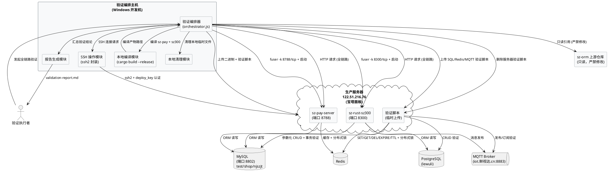

**通信协议与调用频率**：
- 验证编排主机 → 生产服务器：SSH（TCP 22），验证期间持续连接，约 50+ 次 exec 调用
- 验证编排主机 → sz-pay-server：HTTP（TCP 8788），全链路验证阶段约 10-20 次请求
- 验证编排主机 → sz-rust-sz300：HTTP（TCP 8300），全链路验证阶段约 10-20 次请求
- 验证脚本 → MySQL：TCP 8802，验证期间约 30-50 次 SQL 执行
- 验证脚本 → Redis：TCP 6379（默认），验证期间约 20 次 redis-cli 调用
- 验证脚本 → MQTT：TLS 8883，验证期间约 5-10 次发布/订阅

### 2.1.2 服务/组件总体架构

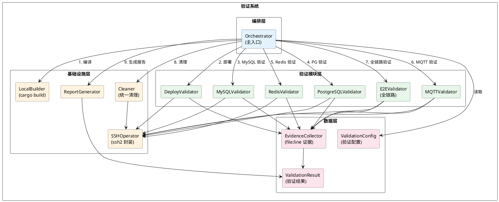

**模块划分及职责**：

| 模块 | 职责 | 技术实现 |
|------|------|---------|
| Orchestrator | 验证流程编排，按依赖顺序调用各模块，汇总结果 | Node.js 主脚本 |
| SSHOperator | 封装 ssh2 包，提供 execCommand / uploadFile / downloadFile 原语 | ssh2 npm 包 |
| LocalBuilder | 本地编译 sz-pay-server 与 sz-rust-sz300 的 release 产物 | cargo build --release --target x86_64-unknown-linux-musl |
| MySQLValidator | 通过 SSH 在服务器执行 MySQL 验证 SQL 脚本 | SSH + mysql-cli |
| PostgreSQLValidator | 通过 SSH 在服务器执行 PG 验证脚本 | SSH + psql |
| RedisValidator | 通过 SSH 执行 Redis 验证脚本 | SSH + redis-cli |
| MQTTValidator | 通过 SSH 执行 MQTT 发布/订阅验证 | SSH + mosquitto_pub/sub |
| DeployValidator | 双应用部署（sz-pay + sz300），含隔离/备份/启动/健康检查 | 复用 deploy.js 模式 |
| E2EValidator | HTTP 端到端验证，触发全链路调用路径 | HTTP 客户端 |
| Cleaner | 清理服务器测试脚本 + 本地临时文件 + 测试进程 + 测试数据 | SSH + fs |
| ReportGenerator | 生成结构化验证报告（Markdown） | 模板组装 |
| ValidationConfig | 验证配置（服务器地址/密钥/数据库/端口） | JSON 配置 |
| ValidationResult | 验证结果收集（每项通过/失败 + 证据） | 内存数据结构 |
| EvidenceCollector | file:line 证据收集与校验 | 文件读取 + 行号验证 |

**配置项及取值策略**：

| 配置项 | 取值 | 来源 |
|--------|------|------|
| 服务器 IP | 122.51.216.76 | spec 6.2.1 |
| SSH 端口 | 22 | spec 6.2.2 |
| SSH 用户 | root | spec 6.2.3 |
| SSH 密钥路径 | `E:\vue\test\鲜视达\rust\sz-rust\deploy_key` | spec 6.2.4 |
| MySQL 端口 | 8802 | spec 6.2.5 |
| MySQL 数据库 | test / shop / njszjt | spec 6.2.6 |
| PostgreSQL 数据库 | lewuli | spec 6.2.7 |
| 网站路径 | /www/wwwroot/default | spec 6.2.8 |
| sz-pay 端口 | 8788 | deploy.js:46 默认值 |
| sz300 端口 | 8300 | config.rs:71 默认值 |
| sz-rust 版本 | 0.6.7 | spec 6.2.9 |
| sz-orm 版本 | 2.3.0 | spec 6.2.10 |
| 编译目标 | x86_64-unknown-linux-musl | deploy.js:41 |
| CARGO_INCREMENTAL | 0 | Windows 环境约束 |

### 2.1.3 实现设计文档

#### 2.1.3.1 验证流程状态机

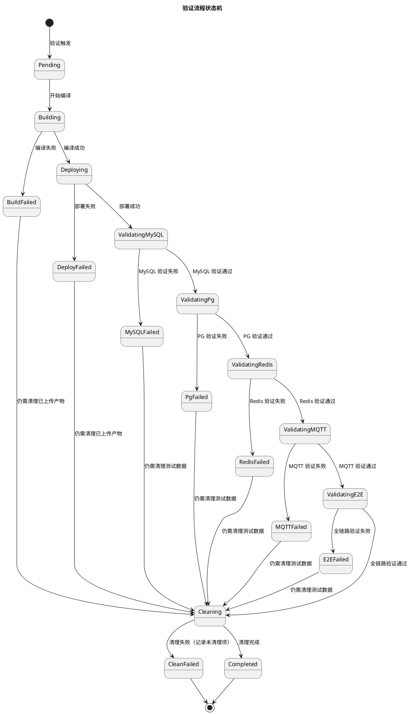

**状态说明**：
- **Pending**：验证已触发，等待开始
- **Building**：本地编译 sz-pay-server 与 sz-rust-sz300 release 产物
- **Deploying**：通过 SSH 部署双应用到服务器
- **ValidatingMySQL/Pg/Redis/MQTT**：依次执行各中间件验证
- **ValidatingE2E**：HTTP 端到端全链路验证
- **Cleaning**：清理所有验证产物（无论成功/失败均执行）
- **Completed**：验证完成，报告已生成
- **\*Failed**：对应步骤失败，转入 Cleaning（确保不残留产物）

**关键策略**：任何阶段失败均不立即终止，而是转入 Cleaning 阶段确保产物清理，最终报告标注失败项。

#### 2.1.3.2 部署与进程管理流程

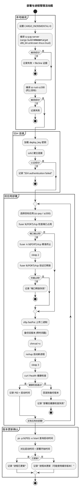

**关键决策**：
- **进程精准终止**：使用 `fuser -k ${PORT}/tcp` 而非 `killall`，确保不误杀其他 webman 项目进程（依据 spec 5.5.1.4）
- **端口释放验证**：终止后必须再次 `fuser` 检查端口已释放，未释放则报错终止
- **健康检查失败自动回滚**：复用 deploy.js:200-207 回滚逻辑
- **版本更新确认**：通过进程启动时间戳确认运行的是新版本二进制

#### 2.1.3.3 MySQL 验证流程

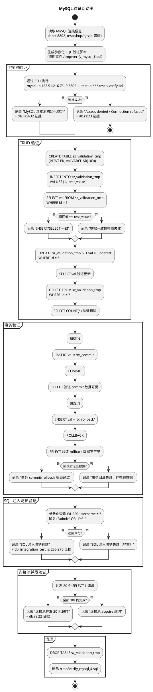

**关键策略**：
- 所有 SQL 通过参数化绑定（`?` 占位符），禁止字符串拼接
- 禁止 `SELECT *`，使用显式列投影（如 `SELECT val FROM ...`）
- 验证数据使用独立临时表 `sz_validation_tmp`，不污染生产数据
- 每条验证结论附 file:line 证据（引用 db.rs / db_integration_test.rs 对应行号）

#### 2.1.3.4 Redis 验证流程

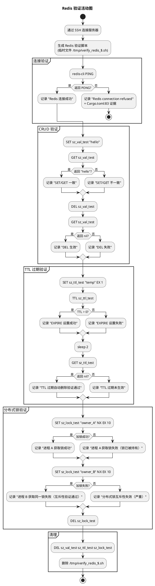

**关键策略**：
- 使用 `SET key value NX EX seconds` 原子操作实现分布式锁，对齐 sz-pay 的 Redis 分布式锁用法（Cargo.toml:83 redis 0.27 connection-manager）
- 验证 key 统一使用 `sz_*_test` 前缀，避免与生产 key 冲突
- 密码通过 `-a` 参数传递，但验证报告中密码字段以 `***` 脱敏呈现（依据 spec 4.3.1）

#### 2.1.3.5 MQTT 验证流程

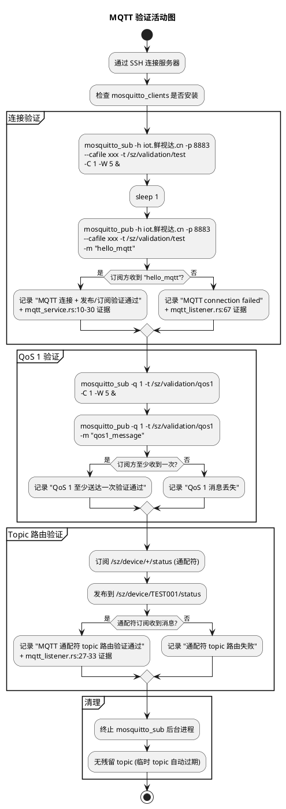

**关键策略**：
- 验证 topic 使用 `/sz/validation/*` 前缀，与生产 topic `/sz/device/*` 隔离，不影响生产消息流（依据 spec 5.4.1.4）
- 使用 `mosquitto_sub -C 1` 限制只接收 1 条消息后退出，避免进程残留
- 使用 `-W 5` 设置 5 秒超时，避免无限等待
- sz-rust-sz300 的 mqtt_listener 当前为模拟模式，此验证独立验证 Broker 连通性，不依赖应用进程

#### 2.1.3.6 全链路端到端验证流程

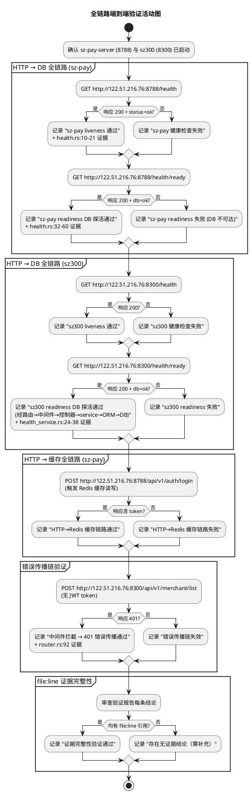

**关键策略**：
- 全链路验证通过 HTTP 端点触发，验证完整调用路径：路由→中间件→控制器→服务层→ORM→DB/缓存/MQ
- 健康检查端点 `/health/ready` 内部执行 `SELECT 1` 探活 DB，覆盖 HTTP→DB 全链路（health_service.rs:26）
- 错误传播验证：无 JWT token 请求应被 auth_middleware 拦截返回 401（router.rs:92）
- 每跳证据引用对应源码文件行号，确保可追溯

#### 2.1.3.7 清理流程

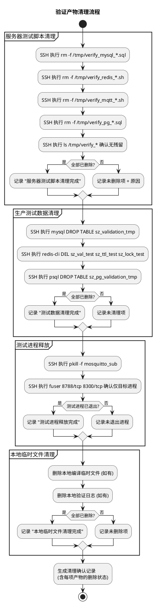

**关键策略**：
- 清理流程在验证流程末尾**强制执行**，无论验证成功或失败（依据 spec 5.7.1.5）
- 清理确认记录包含每项产物的删除状态（已删除/未删除 + 原因）
- 未清理项需标注原因（如权限不足），提示人工介入（依据 spec 5.7.3.1）
- **严禁误杀其他 webman 进程**：仅 pkill mosquitto_sub（验证专用进程），不使用 killall webman 等

## 2.2 接口设计

### 2.2.1 总体设计

**接口分类依据**：按调用层次分为三层 — 基础设施接口（SSH 操作）、验证模块接口（7 大验证器）、编排接口（主入口）。

| 接口分类 | 接口名 | 稳定性等级 | 调用方 |
|---------|--------|-----------|--------|
| 基础设施 | SSHOperator | 稳定 | 所有验证模块 |
| 基础设施 | LocalBuilder | 稳定 | Orchestrator |
| 验证模块 | MySQLValidator | 稳定 | Orchestrator |
| 验证模块 | PostgreSQLValidator | 稳定 | Orchestrator |
| 验证模块 | RedisValidator | 稳定 | Orchestrator |
| 验证模块 | MQTTValidator | 稳定 | Orchestrator |
| 验证模块 | DeployValidator | 稳定 | Orchestrator |
| 验证模块 | E2EValidator | 稳定 | Orchestrator |
| 验证模块 | Cleaner | 稳定 | Orchestrator |
| 编排 | Orchestrator | 稳定 | 验证执行者 |
| 报告 | ReportGenerator | 稳定 | Orchestrator |

**接口变更策略**：验证系统为一次性验证工具，接口无需版本管理。配置通过环境变量 + JSON 配置文件注入，避免硬编码。

### 2.2.2 接口清单

#### SSHOperator（SSH 操作模块）

**接口签名**：
```
class SSHOperator {
  constructor(config: SSHConfig): SSHOperator
  async execCommand(command: string, options?: ExecOptions): Promise<ExecResult>
  async uploadFile(localPath: string, remotePath: string): Promise<void>
  async downloadFile(remotePath: string, localPath: string): Promise<void>
  async close(): Promise<void>
}

interface SSHConfig {
  host: string           // 服务器 IP，如 "122.51.216.76"
  port: number           // SSH 端口，如 22
  username: string       // 用户名，如 "root"
  privateKeyPath: string // 密钥文件路径
}

interface ExecResult {
  stdout: string
  stderr: string
  exitCode: number
}
```

**业务说明**：封装 ssh2 包，提供 SSH 命令执行与文件传输能力。所有验证模块通过此模块与服务器交互。

**前置条件**：密钥文件存在且与服务器 authorized_keys 匹配。

**后置条件**：SSH 连接建立，可执行多次 exec/upload。

**异常映射**：
- 认证失败 → `SSH_AUTH_FAILED`（密钥不匹配）
- 连接超时 → `SSH_CONNECTION_TIMEOUT`（网络不通）
- 命令执行失败 → `EXEC_NONZERO_EXIT`（exitCode !== 0）

**调用示例**：
```
const ssh = new SSHOperator({
  host: '122.51.216.76',
  port: 22,
  username: 'root',
  privateKeyPath: 'E:/vue/test/鲜视达/rust/sz-rust/deploy_key'
});
const result = await ssh.execCommand('fuser 8788/tcp');
```

#### MySQLValidator（MySQL 验证模块）

**接口签名**：
```
async function validateMySQL(ssh: SSHOperator, config: MySQLConfig): Promise<ValidationResult>

interface MySQLConfig {
  host: string
  port: number           // 8802
  databases: DatabaseCredential[]  // test/shop/njszjt
}

interface DatabaseCredential {
  name: string           // 数据库名
  username: string       // 用户名
  password: string       // 密码（不写入报告）
}

interface ValidationResult {
  passed: boolean
  evidence: Evidence[]   // file:line 证据
  errors: string[]       // 失败详情
  duration: number       // 耗时(ms)
}

interface Evidence {
  conclusion: string     // 结论描述
  file: string           // 源码文件路径
  line: string           // 行号范围
  verified: boolean      // 是否已校验该行存在
}
```

**业务说明**：通过 SSH 在服务器执行参数化 SQL 验证脚本，验证 MySQL 连接池、CRUD、事务、SQL 注入防护、连接池并发。

**前置条件**：SSH 连接已建立；MySQL 服务运行在 122.51.216.76:8802。

**后置条件**：验证临时表 `sz_validation_tmp` 已删除；验证脚本已删除。

**异常映射**：
- 连接失败 → `MYSQL_CONNECTION_FAILED`（Access denied / Connection refused）
- 数据不一致 → `MYSQL_DATA_INCONSISTENT`
- 事务回滚失败 → `MYSQL_TX_ROLLBACK_FAILED`
- SQL 注入防护失效 → `MYSQL_INJECTION_BYPASS`（严重，阻断验证）

#### PostgreSQLValidator / RedisValidator / MQTTValidator

接口签名与 MySQLValidator 同构，仅 config 类型不同：
- PostgreSQLConfig：host/port/database/username/password（lewuli 库）
- RedisConfig：host/port/password（如有）
- MQTTConfig：brokerHost/brokerPort/caFilePath/topicPrefix

#### DeployValidator（部署验证模块）

**接口签名**：
```
async function validateDeploy(
  ssh: SSHOperator,
  config: DeployConfig
): Promise<DeployResult>

interface DeployConfig {
  applications: AppDeploySpec[]  // 双应用
  remoteDir: string              // /www/wwwroot/default
  maxBackups: number             // 5
}

interface AppDeploySpec {
  name: string                   // "sz-pay-server" | "sz-rust-sz300"
  localBinaryPath: string        // 本地编译产物路径
  remoteBinaryName: string       // 服务器二进制名
  port: number                   // 8788 | 8300
  healthEndpoint: string         // /health
}

interface DeployResult {
  passed: boolean
  processes: ProcessInfo[]       // 每个应用的 PID/端口/启动时间
  evidence: Evidence[]
  errors: string[]
}

interface ProcessInfo {
  name: string
  pid: number
  port: number
  startedAt: string              // ISO8601
  rssBytes: number               // 空载内存
}
```

**业务说明**：部署双应用（sz-pay-server + sz-rust-sz300）到服务器，含隔离验证→上传→备份→fuser -k→启动→健康检查→版本确认→内存验证（RSS ≤ 30MB）。

**前置条件**：本地编译产物存在；SSH 连接已建立。

**后置条件**：两个进程均运行，各自监听目标端口，PID 已记录。

**异常映射**：
- 端口被占用且 fuser -k 后未释放 → `PORT_OCCUPIED`
- 健康检查失败 → `HEALTH_CHECK_FAILED`（自动回滚）
- 内存超限 → `RSS_EXCEED_30MB`（依据 project_rules.md 第 9 条）

#### E2EValidator（全链路端到端验证模块）

**接口签名**：
```
async function validateE2E(config: E2EConfig): Promise<ValidationResult>

interface E2EConfig {
  szPayEndpoint: string    // http://122.51.216.76:8788
  sz300Endpoint: string    // http://122.51.216.76:8300
  timeout: number          // 5000 (ms)
}
```

**业务说明**：通过 HTTP 请求触发 sz-pay 与 sz300 的完整调用路径，验证 HTTP→DB、HTTP→缓存、HTTP→MQ 全链路，以及错误传播链。

**前置条件**：sz-pay-server 与 sz-rust-sz300 进程已启动并监听端口。

**后置条件**：验证报告包含每跳 file:line 证据。

**异常映射**：
- 响应非 200 → `HTTP_NON_200`
- 响应超时 → `HTTP_TIMEOUT`（5s，依据 project_rules.md 第 5 条）
- 证据缺失 → `EVIDENCE_MISSING`

#### Cleaner（清理模块）

**接口签名**：
```
async function cleanAll(
  ssh: SSHOperator,
  artifacts: ArtifactInventory
): Promise<CleanResult>

interface ArtifactInventory {
  remoteScripts: string[]      // 服务器测试脚本路径
  testTables: TableRef[]       // 测试表 (数据库 + 表名)
  testRedisKeys: string[]      // 测试 Redis key
  localTempFiles: string[]     // 本地临时文件
  testProcessPatterns: string[] // 测试进程匹配模式
}

interface CleanResult {
  cleaned: CleanedItem[]
  failed: FailedItem[]
}
```

**业务说明**：统一清理所有验证产物，确保服务器与本地无残留。

**前置条件**：验证流程已执行（无论成功/失败）。

**后置条件**：所有产物状态为"已清理"或标注未清理原因。

**异常映射**：
- 权限不足 → `CLEAN_PERMISSION_DENIED`（记录需人工介入）

#### Orchestrator（编排主入口）

**接口签名**：
```
async function runValidation(configPath: string): Promise<FinalReport>

interface FinalReport {
  overallPassed: boolean
  moduleResults: { [moduleName: string]: ValidationResult }
  reportPath: string           // validation-report.md 路径
  cleanResult: CleanResult
  startedAt: string
  finishedAt: string
}
```

**业务说明**：验证流程主入口，按状态机顺序编排所有模块，最终生成报告并清理。

**前置条件**：配置文件存在且格式正确；deploy_key 密钥文件存在。

**后置条件**：验证报告已生成；所有产物已清理（或标注未清理原因）。

**调用示例**：
```
node orchestrator.js --config validation-config.json
```

## 2.3 数据模型

### 2.3.1 设计目标

**需要支持的业务场景**：
1. 验证配置注入（服务器地址、数据库凭证、应用端口、编译产物路径）
2. 验证结果收集（每项通过/失败、file:line 证据、错误详情、耗时）
3. 验证报告生成（结构化 Markdown，含 7 大类结论）
4. 清理产物追踪（服务器脚本、测试数据、本地文件、测试进程）
5. 进程状态记录（PID、端口、启动时间、内存占用）

**性能、容量、扩展性目标**：
- 验证全程耗时 ≤ 10 分钟（编译 ~5min + 部署 ~1min + 验证 ~3min + 清理 ~1min）
- 验证报告文件 ≤ 100KB
- 内存占用 ≤ 100MB（Node.js 编排进程）

**与存量数据的兼容策略**：
- 验证数据使用独立临时表/key/topic，不与生产数据冲突
- 验证完成后全部清理，生产数据不受影响
- 不修改任何 sz-rust / sz-orm 源码

### 2.3.2 模型实现

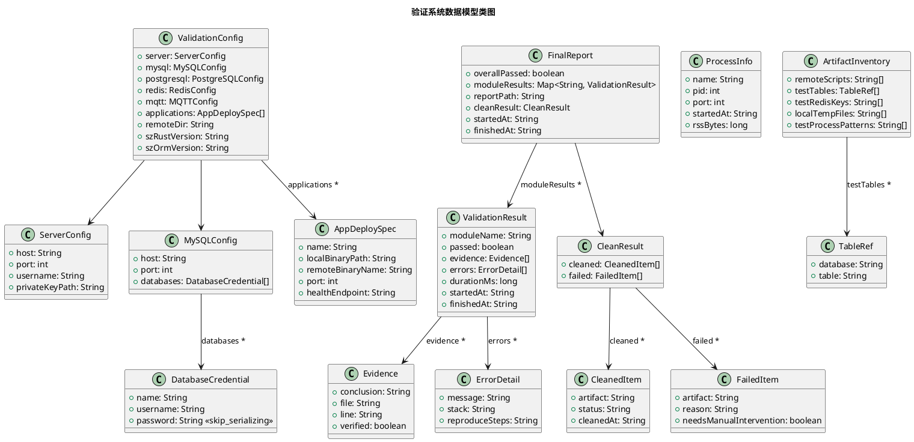

**对象之间的关系**：
- `ValidationConfig` 聚合所有验证配置（ServerConfig + MySQLConfig + ... + AppDeploySpec[]）
- `FinalReport` 聚合所有验证结果（Map<String, ValidationResult>）+ 清理结果（CleanResult）
- `ValidationResult` 包含多个 `Evidence`（file:line 证据）和 `ErrorDetail`（错误详情）
- `ArtifactInventory` 聚合所有需清理的产物，`CleanResult` 记录清理结果

**对象创建和销毁策略**：
- `ValidationConfig`：验证开始时从 JSON 配置文件加载，验证结束后销毁
- `ValidationResult`：每个验证模块执行时创建，汇总至 `FinalReport`
- `ProcessInfo`：部署验证时创建，用于后续健康检查与版本确认
- `ArtifactInventory`：验证过程中持续追加（每产生一个产物即记录），清理时消费
- `Evidence`：每条验证结论创建，`verified` 字段在生成报告时校验文件行是否真实存在

**持久化策略**：
- `FinalReport` 持久化为 `docs/spec/production-validation/validation-report.md`（Markdown 格式）
- 验证配置持久化为 `docs/spec/production-validation/validation-config.json`（JSON 格式）
- 不持久化中间结果（内存中传递），仅在最终报告落盘

**敏感字段脱敏策略**：
- `DatabaseCredential.password` 标注 `<<skip_serializing>>`，报告中以 `***` 呈现（依据 spec 4.3.1）
- `ServerConfig.privateKeyPath` 报告中仅显示路径，不读取密钥内容
- Redis 密码、MQTT 凭证同理脱敏

---

## 2.4 错误处理设计

### 2.4.1 异常场景处理策略

| 异常场景 | 触发条件 | 处理策略 | 证据要求 |
|---------|---------|---------|---------|
| SSH 认证失败 | deploy_key 与 authorized_keys 不匹配 | 终止验证，报告标注 `SSH_AUTH_FAILED` + deploy_key 路径 | deploy.js:68-71 |
| 编译失败 | cargo build 返回非零 | 终止验证，报告附编译错误输出 | Cargo.toml:23 |
| 端口被占用且无法释放 | fuser -k 后端口仍被占用 | 终止部署，报告标注端口冲突 | deploy.js:131 |
| MySQL 密码错误 | SZ300_DB_PASSWORD 不匹配 | 记录 `Access denied`，MySQL 验证标记失败，继续其他模块 | config.rs:62-64 |
| MySQL 不可达 | 端口 8802 未监听 | 记录 `Connection refused`，10s 超时 | db.rs:28 |
| 连接池耗尽 | 并发 > 20 且连接未释放 | 记录 `pool acquire timeout`，30s 超时 | db.rs:22 |
| 事务回滚失败 | rollback 后仍有脏数据 | 记录脏数据详情，MySQL 验证标记失败 | db_integration_test.rs:421 |
| SQL 注入防护失效 | 参数化查询返回非预期行数 | 标记严重违规，阻断验证，立即报告 | db_integration_test.rs:256-270 |
| Redis 不可达 | Redis 实例未启动 | 记录 `Redis connection refused`，Redis 验证标记失败 | Cargo.toml:83 |
| Redis OOM | SET 触发 OOM | 记录 `OOM command not allowed` | spec 5.3.3.2 |
| 分布式锁互斥失效 | 进程 B 获取到进程 A 持有的锁 | 标记严重违规，阻断验证 | spec 5.3.1.4 |
| MQTT Broker 不可达 | iot.鲜视达.cn:8883 不通 | 记录 `MQTT connection failed`，MQTT 验证标记失败 | mqtt_listener.rs:67 |
| 健康检查失败 | curl /health 非 200 | 自动回滚到备份版本，记录回滚 | deploy.js:200-207 |
| 误杀其他 webman 进程 | 使用 killall 等粗粒度命令 | **严禁发生** — 仅允许 fuser -k 按端口杀 | spec 5.5.1.4 |
| 内存超限 | 空载 RSS > 30MB | 记录 `RSS_EXCEED_30MB`，部署验证标记失败 | project_rules.md:29 |
| 清理失败 | 权限不足无法删除 | 记录未清理项 + 原因，标注需人工介入 | spec 5.7.3.1 |

### 2.4.2 错误传播原则

1. **不立即终止**：除 SQL 注入防护失效、分布式锁互斥失效等严重违规外，单个模块失败不终止整体验证，继续执行后续模块以收集完整结论
2. **强制清理**：任何失败路径均转入 Cleaning 阶段，确保产物不残留
3. **证据完整**：每条错误结论必须附 file:line 证据，禁止仅说"失败"（依据 project_rules.md 第 13 条）
4. **密码脱敏**：错误日志中数据库/Redis 密码以 `***` 呈现，不明文暴露（依据 spec 4.3.1）

## 2.5 部署架构

### 2.5.1 服务器进程部署拓扑

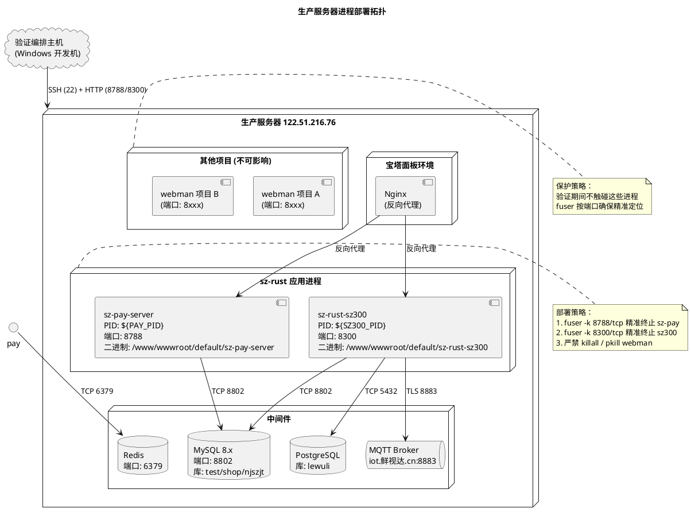

### 2.5.2 部署目录结构

```
/www/wwwroot/default/                    # 宝塔默认站点目录（spec 6.2.8）
├── sz-pay-server                        # sz-pay 二进制
├── sz-rust-sz300                        # sz300 二进制
├── backup/                              # 备份目录
│   ├── sz-pay-server.bak                # 最近一次备份
│   ├── sz-pay-server.bak.2026-08-08T... # 带时间戳历史备份
│   ├── sz-rust-sz300.bak
│   └── sz-rust-sz300.bak.2026-08-08T...
├── sz-pay.log                           # sz-pay 运行日志
└── sz300.log                            # sz300 运行日志

/tmp/                                    # 验证脚本临时目录（验证后清理）
├── verify_mysql_$.sql                   # MySQL 验证脚本（清理）
├── verify_pg_$.sql                      # PG 验证脚本（清理）
├── verify_redis_$.sh                    # Redis 验证脚本（清理）
└── verify_mqtt_$.sh                     # MQTT 验证脚本（清理）
```

## 2.6 验证脚本设计

### 2.6.1 脚本目录结构

```
docs/spec/production-validation/
├── spec.md                              # 需求规格（已存在）
├── design.md                            # 技术设计（本文档）
├── validation-config.json               # 验证配置（JSON）
├── validation-report.md                 # 验证报告（输出产物）
└── scripts/                             # 验证脚本目录
    ├── orchestrator.js                  # 主入口编排脚本
    ├── lib/
    │   ├── ssh-operator.js              # SSH 操作封装（ssh2）
    │   ├── local-builder.js             # 本地编译模块
    │   ├── report-generator.js          # 报告生成模块
    │   ├── evidence-collector.js        # file:line 证据收集
    │   └── cleaner.js                   # 清理模块
    ├── validators/
    │   ├── mysql-validator.js           # MySQL 验证模块
    │   ├── postgresql-validator.js      # PostgreSQL 验证模块
    │   ├── redis-validator.js           # Redis 验证模块
    │   ├── mqtt-validator.js            # MQTT 验证模块
    │   ├── deploy-validator.js          # 部署验证模块
    │   └── e2e-validator.js             # 全链路端到端验证模块
    └── sql/
        ├── verify-mysql.sql             # MySQL 验证 SQL 模板
        └── verify-postgres.sql          # PG 验证 SQL 模板
```

### 2.6.2 执行流程

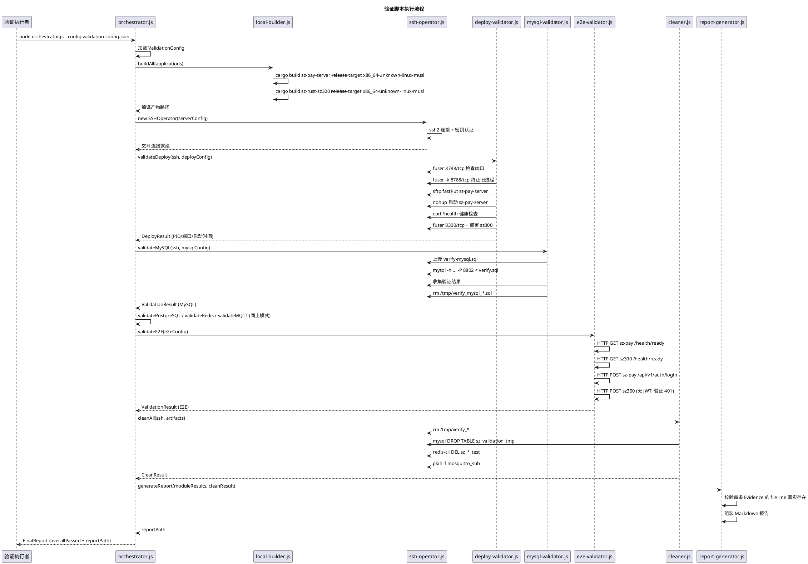

### 2.6.3 关键实现约束

| 约束项 | 要求 | 依据 |
|--------|------|------|
| SSH 连接方式 | 必须使用 ssh2 包加载 deploy_key 密钥 | spec 5.5.1.1 / session-rules |
| 禁止 sshpass | 不得出现 sshpass 命令 | session-rules 部署方式 |
| 禁止 PowerShell 替换 | 不得使用 PowerShell 进行文件替换（破坏 UTF-8） | spec 5.5.1.6 |
| 进程精准终止 | 仅使用 `fuser -k ${PORT}/tcp`，禁止 killall | spec 5.5.1.4 |
| 参数化查询 | 所有 SQL 使用 `?` 占位符，禁止字符串拼接 | AGENTS.md 关键约束 |
| 禁止 SELECT * | 使用显式列投影 | AGENTS.md 关键约束 |
| 密码脱敏 | 报告中密码字段以 `***` 呈现 | spec 4.3.1 / project_rules.md 第 7 条 |
| 上游仓库只读 | 严禁修改 `../sz-orm/` 任何文件 | spec 4.3.5 / AGENTS.md |
| 产物清理 | 验证完成后删除所有上传脚本/临时文件/测试进程 | spec 5.7.1.5 |
| CARGO_INCREMENTAL | Windows 环境设为 0 | 关键约束 |
| file:line 证据 | 每条结论附源码文件路径与行号，且该行真实存在 | project_rules.md 第 13 条 |
| 不误杀 webman | fuser 按端口精准定位，不影响其他项目 | spec 5.5.1.4 / session-rules |

---

## 2.7 技术选型

### 2.7.1 SSH 连接方案

**选型**：Node.js `ssh2` 包（^1.17.0，已安装在 `E:\vue\test\sz-pay\node_modules\ssh2`）

**选择理由**：
1. 已有存量代码验证可行（deploy.js / deploy-remote-build.js / deploy-final.js 均使用 ssh2）
2. 支持 ED25519 密钥认证（deploy_key 为 ED25519 格式，服务器信息.md:14-21）
3. 支持 exec + sftp 双通道，满足命令执行与文件上传需求
4. 纯 Node.js 实现，无外部依赖，跨平台兼容 Windows

**替代方案排除**：
- ❌ sshpass：session-rules 明确禁止
- ❌ PowerShell 重定向：session-rules 明确禁止（破坏 UTF-8 编码）
- ❌ Python paramiko：引入额外运行时，与项目 Node.js 技术栈不一致

### 2.7.2 编译方案

**选型**：`cargo build --release --target x86_64-unknown-linux-musl`

**选择理由**：
1. musl 静态链接，产物无动态库依赖，部署到服务器无需安装额外库
2. release profile 已配置 lto=fat + codegen-units=1 + strip=true（Cargo.toml:155-159），产物体积小
3. 存量代码已使用此目标（deploy.js:41）

**编译对象**：
- sz-pay-server：`E:\vue\test\sz-pay\server\sz-rust` 目录
- sz-rust-sz300：`E:\vue\test\鲜视达\rust\sz-rust\packages\sz-rust-sz300` 目录

**环境变量**：`CARGO_INCREMENTAL=0`（Windows 环境约束）

### 2.7.3 部署方案

**选型**：复用并扩展 `deploy.js` 模式

**选择理由**：
1. deploy.js 已实现完整部署生命周期（隔离→上传→备份→fuser -k→启动→健康检查→回滚）
2. 扩展点明确：双应用支持 + 目标路径可配置 + 版本更新确认

**部署目标路径**：`/www/wwwroot/default`（spec 6.2.8，宝塔面板默认站点）

### 2.7.4 验证脚本方案

**选型**：Node.js 脚本 + SSH 远程执行

**选择理由**：
1. 与 ssh2 包同语言，复用 SSH 连接
2. 通过 SSH 在服务器执行 mysql-cli / psql / redis-cli / mosquitto_pub/sub，无需在服务器安装额外运行时
3. 验证脚本上传到 /tmp/，执行后删除，不污染服务器

**服务器侧依赖**：
- mysql-cli（宝塔面板环境通常已安装）
- psql（PostgreSQL 客户端）
- redis-cli（Redis 客户端）
- mosquitto-clients（MQTT 客户端，若未安装则通过 apt 安装到 /tmp 临时目录）

### 2.7.5 报告格式方案

**选型**：Markdown 格式（`validation-report.md`）

**选择理由**：
1. 与 spec.md / design.md 格式一致，便于人工阅读
2. 支持表格/代码块/链接，适合呈现 file:line 证据
3. Git 友好，可版本追踪

---

> 本设计文档基于 sz-rust v0.6.7 代码库分析生成，所有存量功能引用均附 file:line 证据。