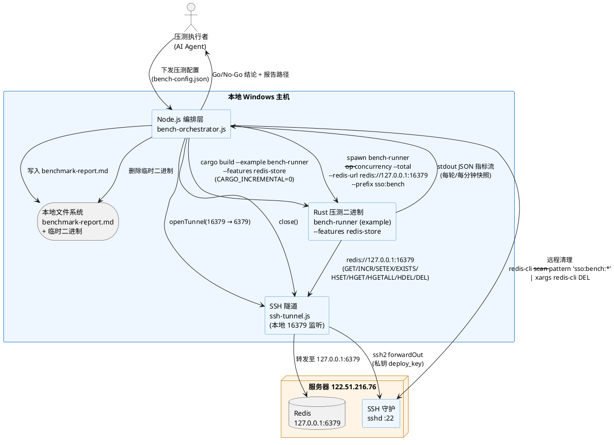
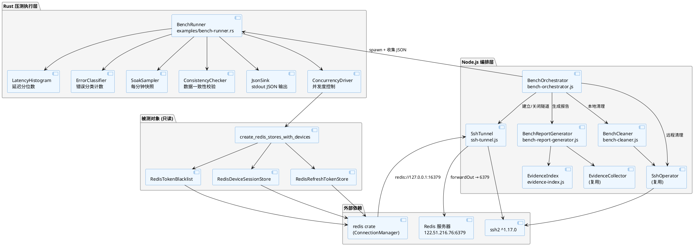
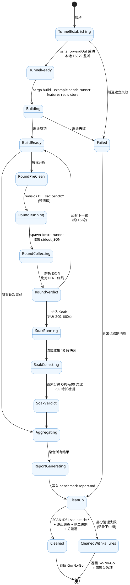
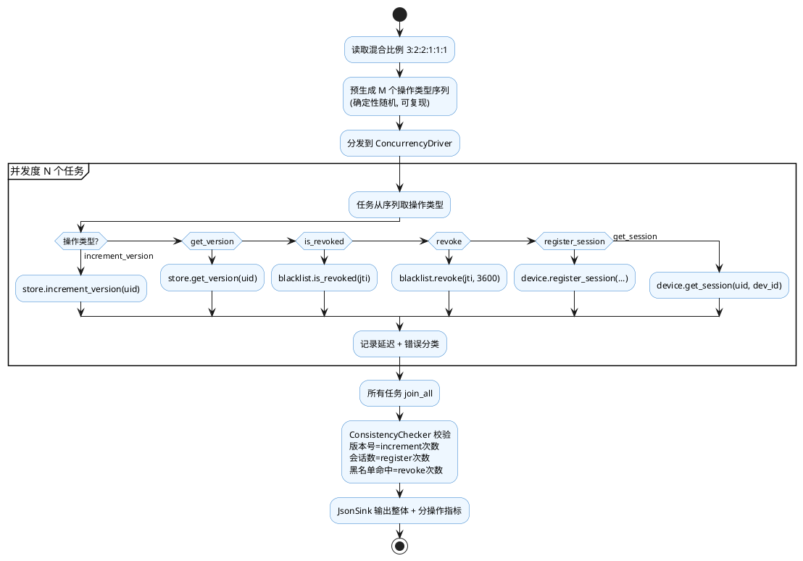
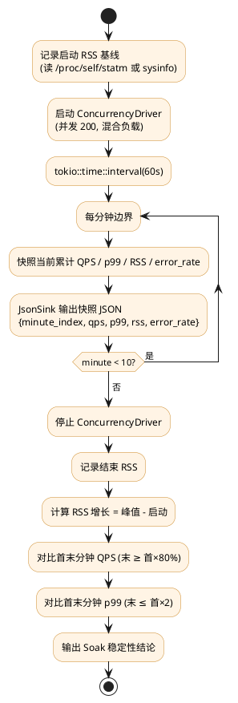
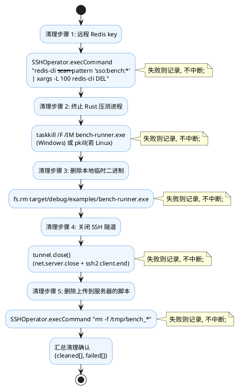
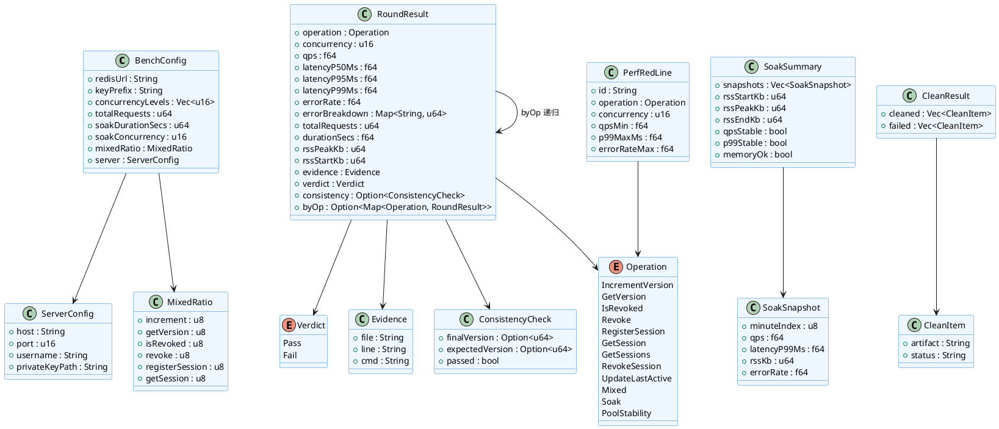

# Redis 存储后端压测技术设计文档

> **任务编号**: P0-2
> **基线版本**: sz-rust v0.6.7
> **被测模块**: `packages/sz-rust-auth-facade/src/redis_store.rs`（646 行）
> **目标服务器**: 122.51.216.76（Redis 127.0.0.1:6379，无密码，经 SSH 隧道本地 16379 访问）
> **生成日期**: 2026-08-08
> **文档类型**: 技术设计（design.md）
> **上游规格**: `docs/spec/redis-store-benchmark/spec.md`

---

# 一、需求与存量功能关系分析

## 1.1 需求功能与存量功能对比

本节将 spec.md 的 7 个核心能力（§5.1~§5.7）与代码库现有实现逐项对比，明确已实现、需扩展、需新增的边界，为增量设计提供基础。所有代码位置均精确到文件:行号，匹配度四档判定依据如下：

- **100%**：存量代码完全覆盖需求，可直接复用，无需任何修改。
- **75%**：存量代码覆盖核心路径，但缺少压测所需的并发度控制 / 指标采集 / 分位数统计等增强，需在现有基础上扩展。
- **50%**：存量代码覆盖部分路径（如功能正确性），但压测所需的吞吐量测量 / 长时稳定性 / 资源监控等完全缺失。
- **25%**：存量代码仅提供底层原语（如 SSH 连接、Redis 命令），压测编排逻辑完全缺失。

### 1.1.1 已实现功能

| 需求功能 | 存量功能 | 代码位置 | 匹配度 |
|---------|---------|---------|--------|
| 被测对象 `RedisRefreshTokenStore`（get_version / increment_version） | 完整实现 RefreshTokenStore trait，GET/INCR 命令包裹 `tokio::time::timeout` | `packages/sz-rust-auth-facade/src/redis_store.rs:142-168` | 100% |
| 被测对象 `RedisTokenBlacklist`（revoke / is_revoked） | 完整实现 TokenBlacklist trait，SETEX/EXISTS，TTL=0 短路 no-op | `packages/sz-rust-auth-facade/src/redis_store.rs:199-226` | 100% |
| 被测对象 `RedisDeviceSessionStore`（register/get/revoke/update/cleanup/clear） | 完整实现 DeviceSessionStore trait，HSET/HGET/HGETALL/HDEL/DEL + serde_json 序列化 | `packages/sz-rust-auth-facade/src/redis_store.rs:263-527` | 100% |
| 共享 ConnectionManager 工厂 | `create_redis_stores` / `create_redis_stores_with_devices` 返回 Arc<dyn Trait>，内部 Arc 共享连接池 | `packages/sz-rust-auth-facade/src/redis_store.rs:536-572` | 100% |
| RedisConfig Debug 脱敏 | `redact_redis_url` 自动遮蔽密码，单元测试覆盖 | `packages/sz-rust-auth-facade/src/redis_store.rs:81-110` | 100% |
| SSH 连接原语（connect/exec/upload/download/close） | `SSHOperator` 类基于 ssh2，私钥从文件读取，已用于 P0-1 验证 | `docs/spec/production-validation/scripts/lib/ssh-operator.js:5-148` | 100% |
| file:line 证据收集与校验 | `EvidenceCollector.createEvidence` + `verifyEvidence`（校验文件存在 + 行号范围 + 行非空） | `docs/spec/production-validation/scripts/lib/evidence-collector.js:4-87` | 100% |
| 报告生成框架（结论/证据表/错误详情/清理确认/阻断项） | `generateReport` 已产出 P0-1 验证报告，章节结构与本规格 §5.7 高度一致 | `docs/spec/production-validation/scripts/lib/report-generator.js:5-125` | 75% |
| 清理框架（服务器脚本 + Redis key + 进程） | `cleanAll` 已实现 rm + redis-cli DEL + pkill 模式 | `docs/spec/production-validation/scripts/lib/cleaner.js:1-67` | 75% |
| 并发无丢失更新功能验证 | 集成测试 `redis_concurrent_increment_no_lost_update` 并发 10 次，断言最终值=10 且返回值集合={1..10} | `packages/sz-rust-auth-facade/tests/redis_integration.rs:148-174` | 100% |
| Redis 连接 / TTL / 跨用户隔离功能验证 | 16 个集成测试覆盖 PING/SET/GET/DEL/TTL/LOCK/多用户/多设备/共享连接 | `packages/sz-rust-auth-facade/tests/redis_integration.rs:1-347` | 100% |
| 服务器配置（host/port/username/privateKeyPath/redis） | `validation-config.json` 已含 122.51.216.76 + deploy_key + redis 127.0.0.1:6379 无密码 | `docs/spec/production-validation/validation-config.json:4-43` | 100% |
| ssh2 依赖安装 | `scripts/package.json` 已声明 ssh2 ^1.17.0，node_modules 已落地 | `docs/spec/production-validation/scripts/package.json:9-11` | 100% |

### 1.1.2 需要扩展的功能

| 需求功能 | 存量功能 | 差异说明 | 扩展方向 |
|---------|---------|---------|---------|
| 压测报告章节（指标汇总表 / 分并发度详细表 / Soak 10 段快照 / 资源占用曲线 / PERF 红线对照） | `report-generator.js` 仅产出模块结论表 + 证据表 + 错误详情 + 清理确认 + 进程状态 | 缺少：①11 条 PERF 红线对照表；②分并发度 QPS/p50/p95/p99/error_rate 详细表；③Soak 每分钟快照时序表；④RSS 内存增长曲线；⑤Go/No-Go 判定逻辑（当前仅 `every(r => r.passed)`，无红线阈值比对） | 新建 `bench-report-generator.js`，复用 EvidenceCollector，新增 `renderPerfTable` / `renderConcurrencyTable` / `renderSoakSnapshots` / `renderResourceCurve` / `judgeGoNoGo` 渲染函数；红线阈值常量集中定义 |
| 清理逻辑（SCAN + DEL sso:bench:* 前缀 + 终止压测进程 + 关闭 SSH 隧道 + 删除本地临时二进制） | `cleaner.js` 清理 `sz_*_test` 固定 key + mosquitto 进程，无前缀扫描、无隧道关闭、无本地二进制删除 | ①存量用固定 key DEL，本规格需 SCAN sso:bench:* 模式（key 数量动态）；②存量无 SSH 隧道句柄关闭；③存量无本地 target 产物删除 | 新建 `bench-cleaner.js`，复用 SSHOperator.execCommand 执行 `redis-cli --scan --pattern 'sso:bench:*' | xargs redis-cli DEL`，新增隧道关闭 + 本地二进制 rm + Rust 进程 taskkill |
| SSH 隧道建立（本地 16379 → 服务器 127.0.0.1:6379） | `SSHOperator` 仅提供 exec/upload/download，无端口转发 API 封装 | ssh2 包支持 `client.forwardOut` 原语，但存量未封装；需本地 `net.createServer` 监听 16379，每连接通过 forwardOut 转发 | 在 `ssh-operator.js` 新增 `openTunnel(localPort, remoteHost, remotePort)` 方法，返回隧道句柄（含 close）；或新建独立 `ssh-tunnel.js` 模块 |
| 证据索引（被测方法 file:line 映射表） | `EvidenceCollector` 校验单条证据，但无被测方法→行号的预定义映射 | spec.md 附录已给出 19 个被测方法的行号表，需在压测脚本中固化为常量供报告引用 | 新建 `evidence-index.js` 导出 `REDIS_STORE_EVIDENCE` Map（方法名→{file,line,cmd}），报告生成时查表引用 |

### 1.1.3 需要新增的功能或接口

按业务模块分组，以下功能在存量代码中完全没有对应实现，需新增。

#### 模块 A：Rust 压测执行二进制（`bench-runner`）

spec.md §4.1.5 明确"仅对 Store trait 方法做直接调用压测"，§5.3.1 规则 6 要求量化 JSON 序列化开销占比。`redis-benchmark`（Redis 自带）只能测纯 Redis 命令，绕过 Rust Store trait 的 serde_json 序列化 / `tokio::time::timeout` / ConnectionManager 路径；Node.js ioredis 同理。因此必须新增 Rust 二进制直接调用 Store trait。

| 功能点 | 输入 | 输出 | 核心逻辑 | 依赖 |
|--------|------|------|---------|------|
| 并发度控制 | concurrency: u16, total: u64 | N 个 tokio 任务句柄 | 用 `tokio::sync::Semaphore` 或 `Vec<JoinHandle>` 控制在途任务数，Arc<dyn Store> clone 共享 | tokio, 被测 Store |
| 单请求延迟采集 | 每次调用起止 Instant | 延迟样本 Vec<Duration> | `Instant::now()` 包裹 Store 方法调用，记录 elapsed | std::time |
| 分位数统计 | 延迟样本 Vec | p50/p95/p99: f64 | 排序后取分位索引，或用 hdrhistogram crate 流式统计 | 无新增依赖（手写排序）或 hdrhistogram |
| QPS 计算 | total: u64, duration: Duration | qps: f64 | total / duration_secs | 无 |
| 错误分类计数 | Result<T, RefreshTokenError> | Map<错误变体名, u64> | match 错误变体，HashMap 计数 | 无 |
| 数据一致性校验 | increment 次数 / register 次数 / revoke 次数 | 断言结果 | 压测后调用 get_version / get_sessions / is_revoked 比对 | 被测 Store |
| JSON 序列化开销量化 | register_session 总耗时 + 纯 HSET 基准耗时 | 占比百分比 | 对比同并发度下 register_session（含 serde_json）与纯 redis HSET（绕过 Store）的耗时差 | redis crate 直连 |
| Soak 分段快照 | 每分钟边界 | 10 段 {minute, qps, p99, rss, error_rate} | tokio::time::interval(60s) 触发快照，读取 /proc/self/statm 或 sysinfo RSS | sysinfo crate（可选）或手读 /proc |
| 指标 JSON 输出 | 一轮或一段结果 | stdout JSON 行 | serde_json::to_string 写 stdout，Node.js 解析 | serde_json |
| 命令行参数解析 | --op / --concurrency / --total / --soak-secs / --redis-url / --prefix | 参数结构 | clap 或手写 env::args 解析 | clap（可选）或手写 |

#### 模块 B：Node.js 编排层（`bench-orchestrator`）

| 功能点 | 输入 | 输出 | 核心逻辑 | 依赖 |
|--------|------|------|---------|------|
| SSH 隧道建立 | config.server + redis 127.0.0.1:6379 | 本地 16379 监听句柄 | ssh2 forwardOut + net.createServer | ssh2, net |
| Rust 二进制编译触发 | crate 路径 + feature redis-store | 编译产物路径 | child_process.exec `cargo build --example bench-runner --features redis-store`（CARGO_INCREMENTAL=0） | child_process |
| 压测轮次编排 | 11 条 PERF 红线参数表 | 每轮 JSON 结果数组 | 按红线表遍历，spawn 二进制 + 收集 stdout JSON | child_process |
| 混合负载比例控制 | 比例 3:2:2:1:1:1 | 操作类型序列 | 预生成 M 个操作类型的随机序列，传给二进制 | 无 |
| Soak 编排 | duration=600s, concurrency=200 | 10 段快照 | spawn 二进制 --soak-secs 600，流式收集每分钟 JSON | child_process |
| 指标聚合与红线判定 | 各轮结果 + PERF 红线表 | Go/No-Go + 阻断项 | 逐条比对 qps/p99/error_rate 与红线阈值 | evidence-index |
| 远程 Redis 清理 | sso:bench:* 前缀 | 删除 key 数 | SSHOperator.execCommand `redis-cli --scan --pattern 'sso:bench:*' \| xargs redis-cli DEL` | SSHOperator |
| 本地产物清理 | 二进制路径 + 隧道句柄 | 清理确认 | fs.rm 二进制 + tunnel.close + taskkill Rust 进程 | fs |
| 报告生成 | 聚合结果 + 证据索引 | benchmark-report.md | 调用 bench-report-generator | bench-report-generator |

#### 模块 C：连接池稳定性压测（spec §5.5）

| 功能点 | 输入 | 输出 | 核心逻辑 |
|--------|------|------|---------|
| 5 分钟持续施压 | concurrency=1000, duration=300s | ServiceUnavailable 占比 | 三 Store 并发 spawn，统计错误变体占比 |
| SSH 隧道中断恢复验证 | 中断 5s 后恢复 | 恢复后 10s 内成功率 | Node.js 侧关闭隧道 5s 后重建，二进制持续施压记录成功率时序 |
| 三 Store 共享连接无死锁 | 各 10000 次 | 完成时间 < 30s | 三 Store 并发各 10000 次，join_all 超时 30s |

#### 模块 D：Soak 测试（spec §5.6）

| 功能点 | 输入 | 输出 | 核心逻辑 |
|--------|------|------|---------|
| 10 分钟混合负载 | concurrency=200, duration=600s | 10 段快照 | 二进制内部 interval(60s) 输出快照 JSON |
| 首末分钟 QPS/p99 对比 | 10 段快照 | 稳定性结论 | 末分钟 QPS ≥ 首分钟×80%，末分钟 p99 ≤ 首分钟×2 |
| RSS 内存增长检测 | 启动基线 + 每分钟 RSS + 结束 RSS | 增长结论 | 峰值-启动 ≤ 50MB，结束-启动 ≤ 30MB |

## 1.2 存量功能详细分析

### 1.2.1 RedisRefreshTokenStore（redis_store.rs:118-168）

**接口契约**：
- `get_version(user_id: i64) -> Result<u64, RefreshTokenError>`：key 不存在返回 0（与 Memory 行为一致），超时返回 `ServiceUnavailable`，Redis 错误返回 `Cache(format!)`。
- `increment_version(user_id: i64) -> Result<u64, RefreshTokenError>`：返回 INCR 后的新版本号，Redis INCR 原子保证无丢失更新。

**业务规则**：
- key 格式 `{key_prefix_ver}:{user_id}`，由 `RedisConfig::ver_key`（redis_store.rs:65-67）生成。
- 每次调用 `self.conn.clone()`（ConnectionManager 内部 Arc，clone 廉价），不持有长连接。
- 命令包裹 `tokio::time::timeout(self.config.command_timeout, ...)`，默认 2s。

**扩展点**：无钩子，trait 方法直接实现。压测通过 `Arc<dyn RefreshTokenStore>` 调用，无需修改。

**约束**：
- `async fn` 满足 `Send + 'static`（符合 AGENTS.md 统一约束）。
- 超时后连接不主动关闭，由 ConnectionManager 自动重连。
- 并发安全：ConnectionManager 内部连接池线程安全，Arc 共享无锁。

### 1.2.2 RedisTokenBlacklist（redis_store.rs:177-226）

**接口契约**：
- `revoke(jti: &str, ttl_secs: u64) -> Result<(), RefreshTokenError>`：TTL=0 短路返回 Ok(())（no-op，不写 Redis）；否则 SETEX key "1" ttl。
- `is_revoked(jti: &str) -> Result<bool, RefreshTokenError>`：EXISTS 返回 bool。

**业务规则**：
- key 格式 `{key_prefix_bl}:{jti}`，由 `RedisConfig::bl_key`（redis_store.rs:70-72）生成。
- 禁止零 TTL 写入（spec §5.2.1 规则 4）已在 redis_store.rs:200-202 实现。

**约束**：同 1.2.1。SETEX 大量写入会导致 Redis used_memory 上升，压测需监控（spec §5.2.3 异常 1）。

### 1.2.3 RedisDeviceSessionStore（redis_store.rs:236-527）

**接口契约**：
- `register_session`：构造 DeviceSession（含 created_at/last_active），serde_json 序列化，HSET key device_id json。
- `get_sessions`：HGETALL 返回 HashMap<device_id, json>，逐个 serde_json 反序列化为 Vec<DeviceSession>。
- `get_session`：HGET 单 field，Option 反序列化。
- `revoke_session`：HGET → 反序列化取 (jti, access_jti) → HDEL，返回 Option<(jti, access_jti)>。
- `update_last_active`：HGET → 反序列化 → 修改 last_active → 序列化 → HSET（非原子，spec §5.3.3 异常 3 已认可）。
- `update_session_jti`：同 update_last_active 模式，修改 jti + last_active。
- `cleanup_expired`：HGETALL → 逐个反序列化判断 last_active + ttl < now → **循环 HDEL**（redis_store.rs:480-488，非 pipeline，spec §5.3.3 异常 2 已标注）。
- `clear_user_sessions`：HGETALL → 反序列化取 jti_list → DEL 整个 key。

**业务规则**：
- key 格式 `{key_prefix_sessions}:{user_id}`，field 为 device_id，value 为 serde_json(DeviceSession)。
- JSON 序列化/反序列化开销是本模块性能关键（spec §5.3.1 规则 6 要求量化占比）。

**约束**：
- `cleanup_expired` 循环 HDEL 在 E=1000 时总耗时可能超 2s（spec §5.3.3 异常 2），压测仅记录不修复。
- `update_last_active` / `update_session_jti` 非原子（HGET→改→HSET），并发后写覆盖前写，语义可接受。
- HGETALL 大 Hash（D≥100）反序列化延迟线性增长（spec §5.3.3 异常 1）。

### 1.2.4 ConnectionManager 与工厂（redis_store.rs:536-572）

**接口契约**：
- `create_redis_stores(config) -> (Arc<dyn RefreshTokenStore>, Arc<dyn TokenBlacklist>)`：两者各自 clone ConnectionManager，内部 Arc 共享连接池。
- `create_redis_stores_with_devices(config) -> (Arc, Arc, Arc<dyn DeviceSessionStore>)`：三元组共享。

**业务规则**：每次 `new` 都 `redis::Client::open` + `get_connection_manager`，三个 Store 的 ConnectionManager 是独立 clone 但共享底层 Arc 连接池。

**约束**：
- 连接建立包裹 `tokio::time::timeout(connection_timeout=3s)`。
- ConnectionManager 自动重连，重连期间请求返回 `Cache` 或 `ServiceUnavailable`（spec §5.1.3 异常 2）。
- 共享连接池在高并发下可能成为瓶颈（spec §5.4.3 异常 1），压测需对比单操作 QPS 之和与混合 QPS。

### 1.2.5 现有 bench（sso_bench.rs:1-139）

**接口契约**：criterion 框架，`bench_verify_access` / `bench_encode` / `bench_rotate` / `bench_should_renew` / `bench_renew_access`，全部基于 **Memory** 后端。

**与本次需求差异**：
- 不涉及 Redis 后端（需新增 Redis 压测二进制）。
- criterion 测微基准（μs 级），本次需求测毫秒级 + 吞吐量（需自定义并发度控制 + QPS 统计）。
- 不涉及 SSH 隧道、不涉及并发度级别 [10,100,500,1000]、不涉及 Soak、不涉及报告生成。

**约束**：`[[bench]] name = "sso_bench" harness = false` 已在 Cargo.toml:65-67 声明，新增压测二进制建议用 `[[example]]` 而非新 bench（避免污染 criterion 基准）。

### 1.2.6 SSHOperator（ssh-operator.js:5-148）

**接口契约**：
- `connect()`：读私钥文件，ssh2 Client 连接，readyTimeout 30s。
- `execCommand(command, {timeout, expectNonZero})`：返回 {stdout, stderr, exitCode}，默认非零退出抛 `ExecNonZeroExitError`。
- `uploadFile(localPath, remotePath)` / `downloadFile`：SFTP fastPut/fastGet。
- `close()`：关闭 sftp + client。

**约束**：
- 私钥从文件读取（符合 spec §4.3.4 禁止硬编码）。
- 无端口转发 API（需扩展 openTunnel）。
- execCommand 超时默认 30s，压测长命令需显式传 timeout。

### 1.2.7 EvidenceCollector（evidence-collector.js:4-87）

**接口契约**：
- `createEvidence(conclusion, file, line)`：line 支持 "N" 或 "N-M" 格式。
- `verifyEvidence`：校验文件存在 + 行号范围有效 + 行非空。
- `verifyAll`：批量校验返回 {total, passed, failed}。

**约束**：line 为字符串，支持 "156-168" 范围格式，与 spec.md 附录行号表格式一致。可直接复用。

### 1.2.8 report-generator.js（5-125）

**接口契约**：`generateReport(moduleResults, cleanResult, config, projectRoot, reportPath)`，产出 7 章节：整体结论 / 验证项结论 / file:line 证据 / 错误详情 / 清理确认 / 阻断项清单 / 进程状态。

**与本次需求差异**：
- 无 PERF 红线对照表、无分并发度详细表、无 Soak 快照、无资源曲线、无 Go/No-Go 阈值判定。
- 整体结论仅 `every(r => r.passed)`，无阈值比对逻辑。

**约束**：章节渲染函数内联，难以直接扩展，建议新建 bench-report-generator.js 复用 EvidenceCollector 但重写渲染。

---

# 二、增量设计方案

## 2.1 实现模型

### 2.1.1 上下文视图



**通信协议与调用频率**：
- Executor → Orch：单次下发配置。
- Orch → Tunnel：单次建立，压测全程保持。
- Orch → Bin：每轮 PERF 红线 spawn 一次（11 轮 + 混合 + Soak + 连接池稳定性，约 15 次 spawn）。
- Bin → Tunnel：高频（每轮 M 次，M=100000~500000），经 redis crate ConnectionManager 复用连接。
- Bin → Orch：每轮结束输出 1 个 JSON，Soak 模式每分钟输出 1 个 JSON（流式）。
- Orch → SSHD（清理）：压测结束 1 次。

### 2.1.2 服务/组件总体架构



**模块划分与职责**：

| 层 | 模块 | 职责 | 新增/复用 |
|----|------|------|----------|
| 编排层 | BenchOrchestrator | 读取配置 → 建隧道 → 编译 → 编排 15 轮压测 → 聚合 → 生成报告 → 清理 | 新增 |
| 编排层 | SshTunnel | ssh2 forwardOut 封装，本地 16379 监听转发 | 新增（扩展 SshOperator 或独立模块） |
| 编排层 | BenchReportGenerator | 渲染 8 章节报告 + Go/No-Go 判定 | 新增（复用 EvidenceCollector） |
| 编排层 | BenchCleaner | SCAN+DEL sso:bench:* + 终止进程 + 删二进制 + 关隧道 | 新增（复用 SshOperator） |
| 编排层 | EvidenceIndex | 19 个被测方法 file:line 常量映射 | 新增 |
| 编排层 | SshOperator / EvidenceCollector | SSH 操作 / 证据校验 | 复用 |
| 执行层 | BenchRunner | 命令行入口，解析参数，分发到各 Driver | 新增（example bin） |
| 执行层 | ConcurrencyDriver | Semaphore/JoinHandle 控制并发度，执行 M 次操作 | 新增 |
| 执行层 | LatencyHistogram | 采集每请求延迟，计算 p50/p95/p99 | 新增 |
| 执行层 | ErrorClassifier | match RefreshTokenError 变体，HashMap 计数 | 新增 |
| 执行层 | SoakSampler | interval(60s) 触发快照，读取 RSS | 新增 |
| 执行层 | ConsistencyChecker | 压测后校验版本号/会话数/黑名单命中 | 新增 |
| 执行层 | JsonSink | serde_json::to_string 写 stdout | 新增 |
| 被测层 | RedisRefreshTokenStore / RedisTokenBlacklist / RedisDeviceSessionStore | Store trait 实现 | 只读不修改 |

**配置项及取值策略**：

| 配置项 | 取值 | 来源 |
|--------|------|------|
| `redis_url` | `redis://127.0.0.1:16379` | SSH 隧道本地端口 |
| `key_prefix_ver/bl/sessions` | `sso:bench:ver` / `sso:bench:bl` / `sso:bench:sessions` | spec §4.3.1 隔离要求 |
| `concurrency_levels` | [10, 100, 500, 1000] | spec §6.1.1 |
| `total_requests_per_round` | 100000（单操作）/ 50000（revoke/register）/ 10000（get_sessions D=10） | spec §5.1~§5.3 验收条件 |
| `soak_duration_secs` | 600 | spec §6.1.4 |
| `soak_concurrency` | 200 | spec §6.1.5 |
| `command_timeout` | 2s | RedisConfig 默认（redis_store.rs:50） |
| `connection_timeout` | 3s | RedisConfig 默认（redis_store.rs:49） |
| `CARGO_INCREMENTAL` | 0 | Windows 环境约束 |
| `feature` | `redis-store` | Cargo.toml:58 |

### 2.1.3 实现设计文档

#### 2.1.3.1 压测轮次状态机



**触发条件与处理策略**：
- `TunnelEstablishing` 失败：终止整个压测，不进入编译。
- `Building` 失败：终止，报告编译错误，执行清理。
- `RoundRunning` 中二进制崩溃：记录该轮 fail，继续下一轮（不中断整体）。
- `Cleanup` 任一步失败：记录失败项，继续后续清理步骤（spec §5.7.3 异常 1）。

#### 2.1.3.2 混合负载操作分发流程



#### 2.1.3.3 Soak 测试分段采样流程



#### 2.1.3.4 强制清理事务设计

清理必须保证幂等且不中断后续步骤（spec §4.3.2 + §5.7.3 异常 1）。



## 2.2 接口设计

### 2.2.1 总体设计

**接口分类依据**：按调用方向分为三类：
1. **编排层内部接口**（Node.js 模块间 ESM import）。
2. **编排层 → 执行层接口**（spawn 命令行 + stdout JSON 协议）。
3. **执行层 → 被测层接口**（Rust trait 方法调用，已有，只读）。

**接口变更策略**：
- 编排层内部接口为新增，无兼容性负担。
- 执行层命令行接口为新增 example bin，不影响现有 `[[bench]] sso_bench`。
- 被测层 trait 接口零修改（spec §4.5.1）。

| 接口名 | 分类 | 稳定性 | 调用方 → 被调方 |
|--------|------|--------|----------------|
| `openTunnel` | 编排内部 | 稳定 | Orchestrator → SshTunnel |
| `runBenchRound` | 编排内部 | 稳定 | Orchestrator → spawn BenchRunner |
| `generateBenchReport` | 编排内部 | 稳定 | Orchestrator → BenchReportGenerator |
| `cleanBench` | 编排内部 | 稳定 | Orchestrator → BenchCleaner |
| `bench-runner CLI` | 编排→执行 | 稳定 | Orchestrator spawn → BenchRunner |
| `stdout JSON 协议` | 编排→执行 | 稳定 | BenchRunner stdout → Orchestrator 解析 |
| Store trait 方法 | 执行→被测 | 稳定（已有） | BenchRunner → RedisStore（只读） |

### 2.2.2 接口清单

#### 2.2.2.1 SshTunnel — openTunnel

**接口签名**（Node.js ESM）：
```js
// ssh-tunnel.js
export async function openTunnel({ sshClient, localPort, remoteHost, remotePort })
// returns: { server: net.Server, close: () => Promise<void> }
```

**业务说明**：在本地 `localPort` 起 TCP 服务器，每个新连接通过 ssh2 `sshClient.forwardOut` 转发到服务器 `remoteHost:remotePort`。用于将本地 16379 映射到服务器 127.0.0.1:6379。

**前置条件**：`sshClient` 已连接（SSHOperator.connect 成功）。`localPort` 未被占用。

**后置条件**：本地 `localPort` 监听中，Redis 客户端连 `redis://127.0.0.1:{localPort}` 等价于连服务器 Redis。

**异常映射**：
- 本地端口占用 → `EADDRINUSE`，Orchestrator 捕获后终止。
- forwardOut 失败（服务器侧 Redis 不可达）→ 连接被拒，Rust 侧 ConnectionManager 重连。

**调用示例**：
```js
const ssh = new SSHOperator(config.server);
await ssh.connect();
const tunnel = await openTunnel({
    sshClient: ssh.client,
    localPort: 16379,
    remoteHost: '127.0.0.1',
    remotePort: 6379,
});
// 压测完成后
await tunnel.close();
```

#### 2.2.2.2 BenchRunner — 命令行接口

**接口签名**（Rust example bin）：
```rust
// examples/bench-runner.rs
// cargo run --example bench-runner --features redis-store -- <args>
```

**参数清单**（类型安全，显式枚举）：

| 参数 | 类型 | 必填 | 取值范围 | 说明 |
|------|------|------|---------|------|
| `--op` | enum | 是 | `increment_version` \| `get_version` \| `is_revoked` \| `revoke` \| `register_session` \| `get_session` \| `get_sessions` \| `revoke_session` \| `update_last_active` \| `mixed` \| `soak` \| `pool_stability` | 操作类型 |
| `--concurrency` | u16 | 是 | 1..=2000 | 并发度 |
| `--total` | u64 | 否 | ≥ 1 | 单轮总请求数（soak 模式忽略） |
| `--redis-url` | String | 是 | `redis://...` | Redis 连接 URL（隧道本地端口） |
| `--prefix` | String | 是 | `sso:bench` | key 前缀根 |
| `--soak-secs` | u64 | 否 | ≥ 60 | Soak 持续时长（仅 soak 模式） |
| `--mixed-ratio` | String | 否 | `3:2:2:1:1:1` | 混合操作比例（仅 mixed/soak） |
| `--devices-per-user` | u16 | 否 | 默认 10 | get_sessions 单用户设备数 |

**业务说明**：单次执行一轮压测，结果以 JSON 写 stdout。Soak 模式流式输出每分钟快照 JSON（每行一个 JSON 对象）。

**前置条件**：`--redis-url` 可达（SSH 隧道已建立）。`--prefix` 为 `sso:bench`（禁止生产前缀）。

**后置条件**：stdout 输出完整 JSON 指标。Redis 中残留 `sso:bench:*` key（由编排层清理，二进制不自行清理以保证指标可校验）。

**异常映射**：
- 参数解析失败 → 退出码 2，stderr 错误信息。
- Redis 连接失败 → 退出码 3，stdout JSON `{"error": "connect_failed", ...}`。
- 压测中错误 → 计入 error_rate，不退出；仅当全部失败时退出码 4。

**调用示例**（Orchestrator 侧）：
```js
const { stdout } = await execFile(
    'target/debug/examples/bench-runner.exe',
    [
        '--op', 'increment_version',
        '--concurrency', '1000',
        '--total', '100000',
        '--redis-url', 'redis://127.0.0.1:16379',
        '--prefix', 'sso:bench',
    ],
    { maxBuffer: 64 * 1024 * 1024, env: { ...process.env, CARGO_INCREMENTAL: '0' } }
);
const result = JSON.parse(stdout);
```

#### 2.2.2.3 stdout JSON 协议 — 单轮结果

**接口签名**（JSON Schema，对齐 spec §6.2）：

```json
{
  "operation": "increment_version",
  "concurrency": 1000,
  "qps": 32150.5,
  "latency_p50_ms": 0.8,
  "latency_p95_ms": 3.2,
  "latency_p99_ms": 12.5,
  "error_rate": 0.0002,
  "error_breakdown": { "ServiceUnavailable": 12, "Cache": 8 },
  "total_requests": 100000,
  "duration_secs": 3.11,
  "rss_peak_kb": 45678,
  "rss_start_kb": 12345,
  "evidence_file": "packages/sz-rust-auth-facade/src/redis_store.rs",
  "evidence_line": "156-168",
  "verdict": "pass",
  "consistency_check": { "final_version": 100000, "expected": 100000, "passed": true }
}
```

**字段约束**（类型安全）：
- `latency_p50_ms ≤ latency_p95_ms ≤ latency_p99_ms`（spec §6.2.4）。
- `error_breakdown` 各值之和 / `total_requests` = `error_rate`（spec §6.2.6）。
- `evidence_line` 为 "N" 或 "N-M" 格式，对应 redis_store.rs 真实行号。
- `verdict` ∈ {"pass", "fail"}，由 PERF 红线判定。

**混合负载扩展字段**：`operation = "mixed"` 时增加 `by_op: { increment_version: {...}, get_version: {...}, ... }`，每个子操作含独立 qps/p99/error_rate。

#### 2.2.2.4 stdout JSON 协议 — Soak 快照

**接口签名**（每行一个 JSON，对齐 spec §6.3）：

```json
{ "type": "soak_snapshot", "minute_index": 1, "qps": 12500.3, "latency_p99_ms": 8.5, "rss_kb": 23456, "error_rate": 0.0001 }
```

结束时输出汇总行：
```json
{ "type": "soak_summary", "snapshots": [...10个...], "rss_start_kb": 12345, "rss_peak_kb": 45678, "rss_end_kb": 13500, "qps_stable": true, "p99_stable": true, "memory_ok": true }
```

**约束**：
- `minute_index` ∈ 1..=10。
- `qps_stable` = (snapshots[9].qps ≥ snapshots[0].qps × 0.8)。
- `p99_stable` = (snapshots[9].p99 ≤ snapshots[0].p99 × 2)。
- `memory_ok` = (rss_peak - rss_start ≤ 51200) ∧ (rss_end - rss_start ≤ 30720)。

#### 2.2.2.5 generateBenchReport — 报告生成

**接口签名**（Node.js ESM）：
```js
// bench-report-generator.js
export async function generateBenchReport({
    roundResults,    // Array<单轮JSON>
    soakResult,      // Soak 汇总JSON
    poolResult,      // 连接池稳定性JSON
    cleanResult,     // 清理确认
    config,          // bench-config
    projectRoot,
    reportPath,      // 输出路径
})
// returns: { reportPath, overallPassed, blockers: [], evidenceVerifyResult }
```

**业务说明**：渲染 8 章节报告（spec §5.7.1 规则 1）：整体结论 / 指标汇总表（11 条 PERF 红线对照）/ 分并发度详细表 / file:line 证据表 / 资源占用曲线 / Soak 10 段快照 / 清理确认 / 阻断项清单。

**前置条件**：`roundResults` 覆盖 11 条 PERF 红线 + 混合负载。

**后置条件**：`reportPath` 文件写入成功；若失败则报告内容输出 stdout 兜底（spec §5.7.3 异常 2）。

**Go/No-Go 判定逻辑**：
- `overallPassed` = 所有轮次 `verdict === "pass"` ∧ soak `qps_stable && p99_stable && memory_ok` ∧ 连接池 `service_unavailable_rate ≤ 0.001` ∧ 清理 `failed.length === 0`。
- `blockers` 收集所有 fail 轮次的 {operation, concurrency, 红线编号, 实测值, 阈值}。

#### 2.2.2.6 cleanBench — 强制清理

**接口签名**（Node.js ESM）：
```js
// bench-cleaner.js
export async function cleanBench({ ssh, tunnel, binaryPath, redisKeyPattern })
// returns: { cleaned: [{artifact, status}], failed: [{artifact, reason}] }
```

**业务说明**：执行 5 步清理（§2.1.3.4），每步独立 try-catch，失败记录不中断。

**前置条件**：`ssh` 已连接（或可重连）。

**后置条件**：Redis 无 `sso:bench:*` key；无残留 bench-runner 进程；本地临时二进制已删；SSH 隧道已关；服务器临时脚本已删。

#### 2.2.2.7 EvidenceIndex — 证据索引常量

**接口签名**（Node.js ESM）：
```js
// evidence-index.js
export const REDIS_STORE_EVIDENCE = {
    get_version:           { file: 'packages/sz-rust-auth-facade/src/redis_store.rs', line: '142-154', cmd: 'GET' },
    increment_version:     { file: '...', line: '156-168', cmd: 'INCR' },
    revoke:                { line: '199-214', cmd: 'SETEX' },
    is_revoked:            { line: '216-226', cmd: 'EXISTS' },
    register_session:      { line: '263-292', cmd: 'HSET' },
    get_sessions:          { line: '294-312', cmd: 'HGETALL' },
    get_session:           { line: '314-338', cmd: 'HGET' },
    revoke_session:        { line: '340-372', cmd: 'HGET+HDEL' },
    update_last_active:    { line: '374-409', cmd: 'HGET+HSET' },
    update_session_jti:    { line: '411-448', cmd: 'HGET+HSET' },
    cleanup_expired:       { line: '450-497', cmd: 'HGETALL+HDEL(loop)' },
    clear_user_sessions:   { line: '499-527', cmd: 'HGETALL+DEL' },
    create_redis_stores:   { line: '536-548', cmd: 'factory' },
    create_redis_stores_with_devices: { line: '554-572', cmd: 'factory(shared)' },
};
```

**业务说明**：报告生成时查表为每条结论附 file:line，行号源自 spec.md 附录（已与 redis_store.rs 实际行号核对一致）。

**约束**：常量在编译期固定，若 redis_store.rs 行号变更需同步更新（由 EvidenceCollector.verifyEvidence 校验行号有效性兜底）。

## 2.3 数据模型

### 2.3.1 设计目标

**需支持的业务场景**：
1. 11 条 PERF 红线单操作压测（并发度 100/500/1000）。
2. 混合负载压测（6 种操作按 3:2:2:1:1:1 比例）。
3. 连接池稳定性压测（并发 1000，5 分钟）。
4. Soak 测试（并发 200，10 分钟，10 段快照）。
5. 数据一致性校验（版本号/会话数/黑名单命中）。
6. Go/No-Go 判定与阻断项清单。

**性能、容量、扩展性目标**：
- 单轮 100000 请求延迟样本内存占用 ≤ 10MB（Duration 存 u64 纳秒，8 字节 × 100000 = 0.8MB）。
- Soak 600s 并发 200，总请求约 7.2M（200 × 12000qps × 600s），延迟样本用 hdrhistogram 流式统计避免存全量（或分段采样）。
- 报告 JSON 块可被 CI/Grafana 解析（spec §1.3.2）。

**与存量数据兼容策略**：
- 压测 key 前缀 `sso:bench:*` 与生产 `sso:ver` / `sso:bl` / `sso:sessions` 隔离（spec §4.3.1）。
- 不修改 RedisConfig 默认前缀，通过 `RedisConfig::from_url` + 手动设置 `key_prefix_*` 字段构造压测配置。

### 2.3.2 模型实现



**对象之间的关系**：
- `BenchConfig` 组合 `ServerConfig` 与 `MixedRatio`，是编排层入口配置。
- `RoundResult` 是每轮压测的核心产物，`byOp` 字段在混合负载时递归持有各子操作的 `RoundResult`（聚合关系）。
- `SoakSummary` 聚合 10 个 `SoakSnapshot`（组合关系，快照随时间生成）。
- `PerfRedLine` 是常量表（11 条），与 `RoundResult` 通过 `operation + concurrency` 关联判定 `verdict`。
- `CleanResult` 聚合 `CleanItem` 列表。

**对象创建和销毁策略**：
- `BenchConfig`：编排层启动时从 `bench-config.json` 反序列化创建，全程共享。
- `RoundResult`：Rust 二进制每轮创建，序列化为 JSON 经 stdout 传递，编排层反序列化后聚合，报告生成后销毁。
- `SoakSnapshot`：Rust 二进制每分钟创建并立即输出，不累积在内存（流式）。
- `LatencyHistogram`：Rust 二进制内部，单轮结束计算分位数后销毁；Soak 模式每分钟重置避免内存增长。
- `ConnectionManager`：Rust 二进制启动时创建，退出时自动销毁；编排层不持有。

**持久化策略**：
- `RoundResult` / `SoakSummary` 持久化为 `benchmark-report.md` 内嵌 JSON 块（spec §1.3.2，供 CI/Grafana 解析）。
- 不引入数据库持久化，压测数据为一次性产物。
- `bench-config.json` 为配置文件持久化，版本管理随仓库。

**类型安全约束**（对齐 AGENTS.md）：
- Rust 侧所有字段强类型，`Operation` / `Verdict` 为 enum（禁止字符串 Map）。
- `qps` / `latency` / `errorRate` 为 `f64`，构造时断言 `p50 ≤ p95 ≤ p99`、`errorRate ∈ [0,1]`。
- `concurrency` 为 `u16`（上限 65535 远超 2000 需求），`totalRequests` 为 `u64`。
- Node.js 侧用 JSDoc 标注类型，JSON 解析后显式校验字段存在与类型。
- 公共接口（stdout JSON 协议）文档化字段契约，跨 Rust/Node.js 边界类型安全。

---

> 本技术设计文档由 spec-design-agent 基于 `docs/spec/redis-store-benchmark/spec.md` 与 v0.6.7 代码库生成。被测代码 `packages/sz-rust-auth-facade/src/redis_store.rs`（646 行）只读不修改，上游 `../sz-orm/` 严禁触碰。后续 tasks.md（任务分解）由 spec-task-agent 生成。