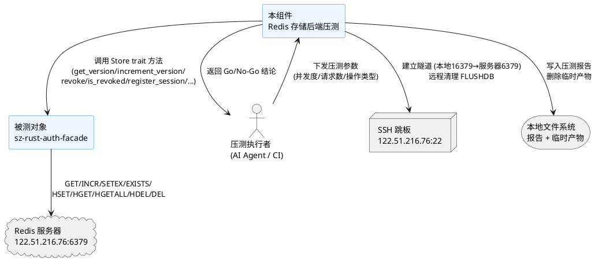
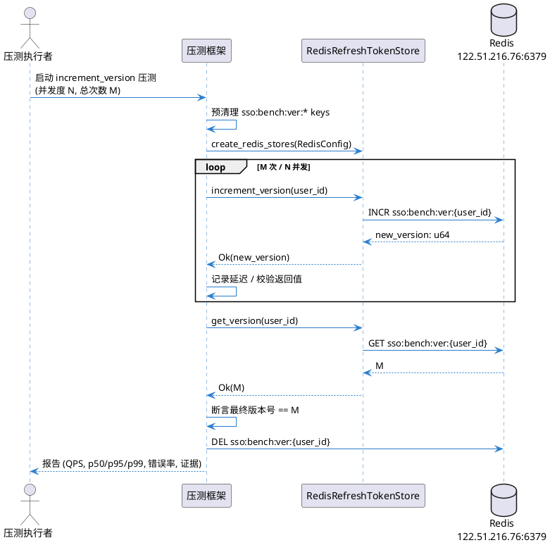
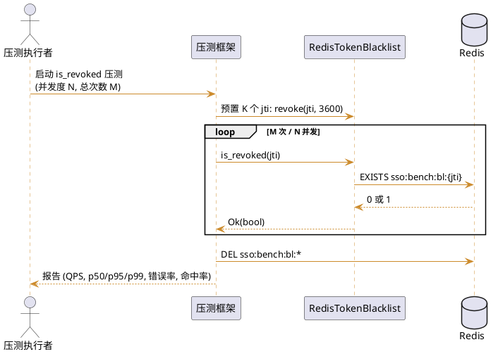
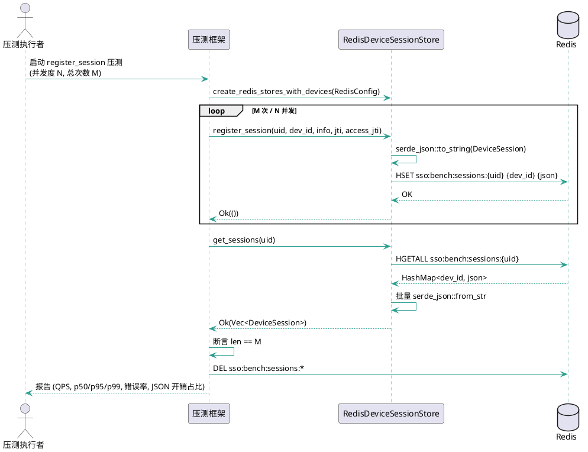
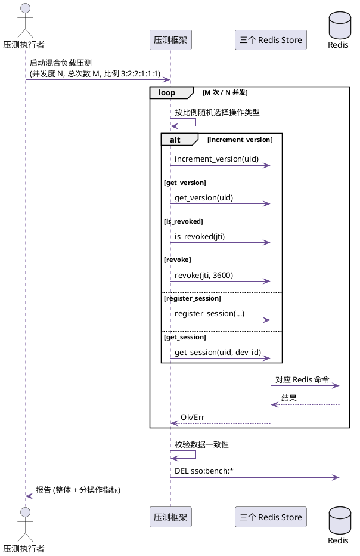
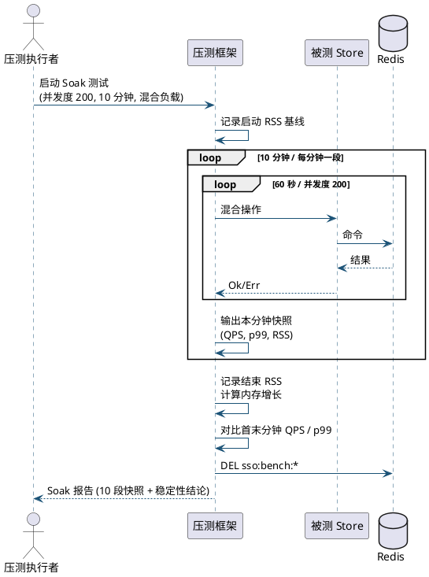

# Redis 存储后端压测需求规格

> **任务编号**: P0-2
> **基线版本**: sz-rust v0.6.7
> **被测模块**: `packages/sz-rust-auth-facade/src/redis_store.rs`
> **目标服务器**: 122.51.216.76（Redis 127.0.0.1:6379，无密码）
> **生成日期**: 2026-08-08
> **文档类型**: 需求规格（spec.md）

---

# **1. 组件定位**

## **1.1 核心职责**
本组件负责对 RedisDeviceSessionStore、RedisRefreshTokenStore、RedisTokenBlacklist 三个 Redis 存储后端实现进行高并发性能压测，量化吞吐量、延迟分位数、错误率与资源占用，验证其在生产负载下的可用性。

## **1.2 核心输入**
1. **压测参数**：来源为压测执行者配置，内容包括并发度级别（10/100/500/1000）、单轮总请求数、操作类型（读/写/混合）、Soak 持续时长。
2. **Redis 连接配置**：来源为 `RedisConfig`，内容包括 Redis URL（经 SSH 隧道 `redis://127.0.0.1:16379`）、key 前缀、连接超时（3s）、命令超时（2s）。
3. **SSH 隧道凭证**：来源为本地 `deploy_key` 文件，内容为服务器 122.51.216.76 的 SSH 私钥，用于建立到服务器 Redis 6379 端口的隧道。
4. **被测对象实例**：来源为 `create_redis_stores` / `create_redis_stores_with_devices` 工厂函数，内容为共享同一 ConnectionManager 的三个 Store 的 Arc<dyn Trait> 句柄。

## **1.3 核心输出**
1. **压测报告文件**：目标为 `docs/spec/redis-store-benchmark/benchmark-report.md`，内容为各操作在各并发度下的 QPS、p50/p95/p99 延迟、错误率、资源占用峰值，每条结论附 file:line 证据。
2. **结构化指标数据**：目标为压测报告内嵌 JSON 块，内容为可被后续 CI/CD 或 Grafana 解析的时序指标。
3. **服务器清理确认**：目标为压测报告"清理确认"章节，内容为已删除的 Redis key 前缀清单、已终止的压测进程 PID、已关闭的 SSH 隧道。
4. **Go/No-Go 结论**：目标为压测报告"整体结论"章节，内容为基于预设红线的通过/阻断判定及阻断项清单。

## **1.4 职责边界**
1. **不负责功能正确性验证**：功能正确性已由 `tests/redis_integration.rs` 的 17 个集成测试覆盖（含并发 10 次无丢失更新），本压测仅关注性能与稳定性边界。
2. **不负责与其他存储后端对比**：不与 MemoryRefreshTokenStore / MemoryTokenBlacklist 做横向对比，该对比属于 P2"性能压测"范畴。
3. **不负责修改 Redis 存储实现代码**：被测代码为 `redis_store.rs` 现状（646 行），压测过程只读不写源码；若发现性能缺陷，仅记录于报告，不在此任务内修复。
4. **不负责修改上游 sz-orm 仓库**：严禁触碰 `../sz-orm/` 任何文件。
5. **不负责网络层压测**：不对 axum HTTP 端点做 wrk/k6 压测，仅对 Store trait 方法做直接调用压测。

---

# **2. 领域术语**

**压测（Benchmark / Load Test）**
: 对系统在指定并发度下施加持续请求负载，测量吞吐量、延迟、错误率等性能指标的过程。

**QPS（Queries Per Second）**
: 单位时间内成功完成的请求数，单位为次/秒。

**延迟分位数（Latency Percentile）**
: 将所有请求的响应时间按升序排列后，第 p% 个请求的响应时间；本规格关注 p50（中位数）、p95、p99。

**错误率（Error Rate）**
: 压测期间返回 `Err(RefreshTokenError)` 的请求数占总请求数的比例。

**并发度（Concurrency Level）**
: 同时在途（in-flight）的请求数，通过 `tokio::spawn` 并发任务数控制。

**ConnectionManager**
: redis crate 提供的异步连接管理器，内部基于 Arc 共享连接池，支持自动重连，是三个 Redis Store 共享的底层连接设施。

**RedisRefreshTokenStore**
: 实现 `RefreshTokenStore` trait 的 Redis 版本号存储，使用 GET/INCR 命令，key 格式 `sso:ver:{user_id}`。

**RedisTokenBlacklist**
: 实现 `TokenBlacklist` trait 的 Redis Token 黑名单，使用 EXISTS/SETEX 命令，key 格式 `sso:bl:{jti}`。

**RedisDeviceSessionStore**
: 实现 `DeviceSessionStore` trait 的 Redis 设备会话存储，使用 Hash 命令（HSET/HGET/HGETALL/HDEL/DEL），key 格式 `sso:sessions:{user_id}`，field 为 device_id，value 为 serde_json 序列化的 DeviceSession。

**Soak 测试**
: 在固定中等并发度下长时间（≥ 10 分钟）持续施压，检测内存泄漏、连接泄漏、延迟漂移等时间相关缺陷。

**丢失更新（Lost Update）**
: 并发 INCR 操作因缺乏原子性导致最终值小于并发次数；Redis INCR 本身原子，但需验证 ConnectionManager 路径下无丢失。

**SSH 隧道**
: 通过 SSH 端口转发将本地 16379 端口映射到服务器 122.51.216.76 的 127.0.0.1:6379，使本地压测进程可访问服务器 Redis。

---

# **3. 角色与边界**

## **3.1 核心角色**
- **压测执行者**：AI Agent 或 CI 流水线，负责配置压测参数、启动压测、收集结果、生成报告、执行清理。

## **3.2 外部系统**
- **Redis 服务器**：运行于 122.51.216.76:6379（仅监听 127.0.0.1），提供被测存储后端的底层 KV 服务。
- **SSH 跳板**：服务器 122.51.216.76:22，使用 `deploy_key` 私钥认证，用于建立 Redis 隧道及远程清理。
- **本地文件系统**：存放压测报告、临时 SSH 隧道脚本、临时压测二进制产物。

## **3.3 交互上下文**



---

# **4. DFX约束**

## **4.1 性能**

| 约束编号 | 被测操作 | 并发度 | QPS 下限 | p99 延迟上限 | 错误率上限 |
|---------|---------|--------|---------|------------|-----------|
| PERF-1 | `increment_version`（INCR） | 100 | ≥ 8,000 | ≤ 5ms | ≤ 0.01% |
| PERF-2 | `increment_version`（INCR） | 500 | ≥ 20,000 | ≤ 15ms | ≤ 0.05% |
| PERF-3 | `increment_version`（INCR） | 1000 | ≥ 30,000 | ≤ 30ms | ≤ 0.1% |
| PERF-4 | `get_version`（GET） | 1000 | ≥ 40,000 | ≤ 10ms | ≤ 0.01% |
| PERF-5 | `is_revoked`（EXISTS） | 1000 | ≥ 40,000 | ≤ 10ms | ≤ 0.01% |
| PERF-6 | `revoke`（SETEX） | 500 | ≥ 15,000 | ≤ 15ms | ≤ 0.05% |
| PERF-7 | `register_session`（HSET + JSON 序列化） | 500 | ≥ 10,000 | ≤ 20ms | ≤ 0.05% |
| PERF-8 | `get_session`（HGET + JSON 反序列化） | 1000 | ≥ 20,000 | ≤ 15ms | ≤ 0.05% |
| PERF-9 | `get_sessions`（HGETALL + 批量反序列化，单用户 10 设备） | 500 | ≥ 5,000 | ≤ 30ms | ≤ 0.05% |
| PERF-10 | `revoke_session`（HGET + HDEL） | 500 | ≥ 8,000 | ≤ 20ms | ≤ 0.05% |
| PERF-11 | `update_last_active`（HGET + HSET） | 500 | ≥ 8,000 | ≤ 20ms | ≤ 0.05% |

> **说明**：以上指标基于单实例 Redis（非集群）、SSH 隧道网络开销已计入。若实测环境网络 RTT 较高，p99 上限可放宽 1.5 倍，但 QPS 下限不得下调。

## **4.2 可靠性**

1. **数据一致性**：WHEN 并发 1000 次 `increment_version` 同一 user_id THEN THE SYSTEM SHALL 最终版本号精确等于 1000，无丢失更新，无重复值。
2. **错误率红线**：WHEN 任一压测轮次错误率超过对应 PERF 红线 THEN THE SYSTEM SHALL 在报告中标记该轮次为"阻断"。
3. **连接池稳定**：WHEN 压测全程 THEN THE SYSTEM SHALL 不出现 `RefreshTokenError::ServiceUnavailable`（超时）占比超过 0.1% 的情况；连接池不得发生死锁或耗尽。
4. **Soak 稳定性**：WHEN 在并发度 200 下持续施压 10 分钟 THEN THE SYSTEM SHALL QPS 不下降超过初始值的 20%，p99 延迟不上升超过初始值的 200%，RSS 内存不增长超过 50MB。
5. **无内存泄漏**：WHEN Soak 测试结束 THEN THE SYSTEM SHALL 压测进程 RSS 回落至启动基线 +30MB 以内（允许 GC/缓存残留）。

## **4.3 安全性**

1. **测试数据隔离**：压测所有 Redis key 必须使用独立前缀 `sso:bench:*`，禁止使用生产前缀 `sso:ver` / `sso:bl` / `sso:sessions` 直接压测，防止污染生产数据。
2. **压测后强制清理**：WHEN 压测结束（无论成功或失败） THEN THE SYSTEM SHALL 删除所有 `sso:bench:*` 前缀的 key、终止压测进程、关闭 SSH 隧道。
3. **敏感信息脱敏**：压测报告中不得出现 Redis URL 中的密码明文（本环境无密码，但报告模板须遵循 `RedisConfig` 的 Debug 脱敏规范）。
4. **SSH 凭证安全**：SSH 私钥仅从本地 `deploy_key` 文件读取，禁止写入报告或日志；隧道建立使用 Node.js ssh2 包，禁止 sshpass 或 PowerShell 重定向。

## **4.4 可维护性**

1. **压测可复现**：WHEN 使用相同压测参数重复执行 THEN THE SYSTEM SHALL 产出结构一致的报告（相同章节、相同指标字段），允许数值波动但须附置信区间。
2. **报告格式规范**：压测报告必须包含：整体结论、指标汇总表、分并发度详细表、file:line 证据、资源占用曲线、清理确认、阻断项清单。
3. **file:line 证据强制**：每条性能结论必须附被测代码的 file:line 证据（如 `redis_store.rs:156` 对应 `increment_version`），禁止仅写"已通过"。
4. **产物及时释放**：本地临时压测二进制、临时 SSH 隧道脚本、上传到服务器的测试脚本，在压测完成后必须及时删除。

## **4.5 兼容性**

1. **不修改被测源码**：压测不得修改 `packages/sz-rust-auth-facade/src/redis_store.rs` 及任何上游 `../sz-orm/` 文件。
2. **环境兼容**：压测须在 Windows（CARGO_INCREMENTAL=0）本地通过 SSH 隧道执行，报告须记录执行环境（OS、Rust 版本、redis crate 版本）。
3. **feature flag**：压测须启用 `redis-store` feature（`cargo test --features redis-store`），报告须记录启用的 feature 组合。

---

# **5. 核心能力**

## **5.1 版本号存储压测**

### **5.1.1 业务规则**

1. **规则 increment_version 吞吐量测量**：WHEN 对同一 user_id 以指定并发度 N 持续调用 `increment_version` 共 M 次 THEN THE SYSTEM SHALL 记录该轮次的 QPS（M/耗时）、p50/p95/p99 延迟、错误率，并验证最终版本号等于 M。
   a. 验收条件：[并发度 100，M=100000] → [QPS ≥ 8000，p99 ≤ 5ms，错误率 ≤ 0.01%，最终版本号 = 100000]
   b. 验收条件：[并发度 1000，M=100000] → [QPS ≥ 30000，p99 ≤ 30ms，错误率 ≤ 0.1%，最终版本号 = 100000]

2. **规则 get_version 吞吐量测量**：WHEN 预置 user_id 版本号为 V，以指定并发度 N 持续调用 `get_version` 共 M 次 THEN THE SYSTEM SHALL 记录 QPS、延迟分位数、错误率，且每次返回值均为 V。
   a. 验收条件：[并发度 1000，M=100000，V=42] → [QPS ≥ 40000，p99 ≤ 10ms，错误率 ≤ 0.01%，所有返回值 = 42]

3. **规则 并发无丢失更新**：WHEN 并发 1000 个任务各调用 `increment_version` 一次 THEN THE SYSTEM SHALL 最终版本号精确为 1000，且 1000 个返回值集合等于 {1, 2, ..., 1000}。
   a. 验收条件：[1000 并发 increment] → [最终版本号 = 1000，返回值集合 = {1..1000}，无重复无丢失]

4. **禁止项 禁止跨用户干扰**：禁止不同 user_id 的版本号操作相互影响。
   a. 验收条件：[user_id=1 和 user_id=2 各并发 100 次 increment] → [user_id=1 版本号=100，user_id=2 版本号=100，互不影响]

### **5.1.2 交互流程**



### **5.1.3 异常场景**

1. **命令超时**
   a. 触发条件：Redis 响应时间超过 `command_timeout`（默认 2s），由 `tokio::time::timeout` 触发。
   b. 系统行为：返回 `RefreshTokenError::ServiceUnavailable`，压测框架计入错误率。
   c. 用户感知：报告中该轮次错误率列标注超时次数及占比。

2. **连接断开恢复**
   a. 触发条件：SSH 隧道中断或 Redis 重启导致 ConnectionManager 底层连接断开。
   b. 系统行为：ConnectionManager 自动重连，重连期间的请求返回 `RefreshTokenError::Cache` 或 `ServiceUnavailable`。
   c. 用户感知：报告中标注"连接恢复"事件及重连耗时，若重连失败则标记阻断。

3. **并发竞争冲突**
   a. 触发条件：极高并发下 ConnectionManager 内部连接池争用。
   b. 系统行为：请求排队等待可用连接，延迟上升但不报错。
   c. 用户感知：p99 延迟显著高于 p50，报告中标注"连接池争用"。

---

## **5.2 Token 黑名单压测**

### **5.2.1 业务规则**

1. **规则 is_revoked 吞吐量测量**：WHEN 预置 K 个 jti 入黑名单，以指定并发度 N 持续调用 `is_revoked` 共 M 次（命中与非命中各 50%） THEN THE SYSTEM SHALL 记录 QPS、延迟分位数、错误率。
   a. 验收条件：[并发度 1000，M=100000，K=1000] → [QPS ≥ 40000，p99 ≤ 10ms，错误率 ≤ 0.01%]

2. **规则 revoke 吞吐量测量**：WHEN 以指定并发度 N 持续调用 `revoke(jti, ttl_secs=3600)` 共 M 次（每次 jti 唯一） THEN THE SYSTEM SHALL 记录 QPS、延迟分位数、错误率，且压测后 `is_revoked` 对所有 jti 返回 true。
   a. 验收条件：[并发度 500，M=50000] → [QPS ≥ 15000，p99 ≤ 15ms，错误率 ≤ 0.05%，事后全部命中]

3. **规则 TTL 过期验证**：WHEN 调用 `revoke(jti, 1)` 后等待 2 秒 THEN THE SYSTEM SHALL `is_revoked(jti)` 返回 false。
   a. 验收条件：[revoke ttl=1, sleep 2s] → [is_revoked = false]

4. **禁止项 禁止零 TTL 写入**：WHEN 调用 `revoke(jti, 0)` THEN THE SYSTEM SHALL 不写入 Redis（no-op），`is_revoked` 返回 false。
   a. 验收条件：[revoke ttl=0] → [Redis 无对应 key，is_revoked = false]

### **5.2.2 交互流程**



### **5.2.3 异常场景**

1. **SETEX 大量写入导致 Redis 内存增长**
   a. 触发条件：`revoke` 压测 M=50000，每个 key 有 3600s TTL，短时间内写入大量 key。
   b. 系统行为：Redis used_memory 上升，压测框架记录 Redis INFO memory 指标。
   c. 用户感知：报告中附 Redis 内存增长曲线，若增长超过 100MB 则标注告警。

2. **EXISTS 对不存在 key 的性能偏差**
   a. 触发条件：`is_revoked` 对未命中 key（EXISTS 返回 0）的延迟可能略高于命中 key。
   b. 系统行为：压测框架分别统计命中与未命中两组延迟。
   c. 用户感知：报告中分两组列示 p50/p95/p99。

---

## **5.3 设备会话存储压测**

### **5.3.1 业务规则**

1. **规则 register_session 吞吐量测量**：WHEN 以指定并发度 N 持续调用 `register_session(user_id, device_id, info, jti, access_jti)` 共 M 次（每次 device_id 唯一） THEN THE SYSTEM SHALL 记录 QPS、延迟分位数、错误率，且事后 `get_sessions(user_id)` 返回 M 条记录。
   a. 验收条件：[并发度 500，M=50000，单 user_id] → [QPS ≥ 10000，p99 ≤ 20ms，错误率 ≤ 0.05%，事后记录数 = 50000]

2. **规则 get_session 吞吐量测量**：WHEN 预置 K 个设备会话，以指定并发度 N 持续调用 `get_session(user_id, device_id)` 共 M 次（命中与非命中各 50%） THEN THE SYSTEM SHALL 记录 QPS、延迟分位数、错误率。
   a. 验收条件：[并发度 1000，M=100000，K=1000] → [QPS ≥ 20000，p99 ≤ 15ms，错误率 ≤ 0.05%]

3. **规则 get_sessions 批量读取测量**：WHEN 预置单 user_id 下 D 个设备会话，以指定并发度 N 持续调用 `get_sessions(user_id)` 共 M 次 THEN THE SYSTEM SHALL 记录 QPS、延迟分位数，且每次返回 D 条记录。
   a. 验收条件：[并发度 500，M=10000，D=10] → [QPS ≥ 5000，p99 ≤ 30ms，每次返回 10 条]
   b. 验收条件：[并发度 100，M=1000，D=100] → [p99 ≤ 100ms，每次返回 100 条（验证大批量反序列化）]

4. **规则 revoke_session 吞吐量测量**：WHEN 预置 K 个设备会话，以指定并发度 N 持续调用 `revoke_session` 共 K 次（每次 device_id 唯一） THEN THE SYSTEM SHALL 记录 QPS、延迟分位数，且事后 `get_sessions` 返回空。
   a. 验收条件：[并发度 500，K=10000] → [QPS ≥ 8000，p99 ≤ 20ms，事后记录数 = 0]

5. **规则 update_last_active 吞吐量测量**：WHEN 预置 K 个设备会话，以指定并发度 N 对同一 user_id 的不同 device_id 持续调用 `update_last_active` 共 M 次 THEN THE SYSTEM SHALL 记录 QPS、延迟分位数，且事后 last_active 时间戳已更新。
   a. 验收条件：[并发度 500，M=50000，K=100] → [QPS ≥ 8000，p99 ≤ 20ms，事后 last_active > 压测开始时间]

6. **规则 JSON 序列化开销量化**：WHEN 压测 `register_session` / `get_session` THEN THE SYSTEM SHALL 在报告中单独标注 serde_json 序列化/反序列化耗时占比（通过对比纯 HSET/HGET 基准推算）。
   a. 验收条件：[register_session 压测] → [报告中标注"JSON 序列化预估占比 X%"]

7. **禁止项 禁止跨用户会话干扰**：禁止不同 user_id 的设备会话 Hash 相互影响。
   a. 验收条件：[user_id=1 和 user_id=2 各注册 100 设备] → [get_sessions(1) 返回 100 条，get_sessions(2) 返回 100 条，互不影响]

### **5.3.2 交互流程**



### **5.3.3 异常场景**

1. **HGETALL 大 Hash 反序列化延迟**
   a. 触发条件：单 user_id 下设备数 D ≥ 100，`get_sessions` 需反序列化 100 个 JSON 字符串。
   b. 系统行为：延迟随 D 线性增长，CPU 占用上升。
   c. 用户感知：报告中标注 D=100 时 p99，若超过 100ms 则标记告警。

2. **cleanup_expired 循环 HDEL 性能**
   a. 触发条件：`cleanup_expired` 对过期会话逐个 HDEL（redis_store.rs:480-488 为循环调用，非 pipeline）。
   b. 系统行为：过期会话数 E 较大时，E 次 HDEL 的总耗时 = E × 单次 HDEL 延迟。
   c. 用户感知：报告中标注 cleanup_expired 在 E=1000 时的总耗时及等效 QPS，若超过 2s 则标记"建议改用 pipeline"优化建议（仅记录，不修复）。

3. **并发 update_last_active 竞争**
   a. 触发条件：多任务并发对同一 (user_id, device_id) 调用 `update_last_active`，内部为 HGET→修改→HSET 非原子序列。
   b. 系统行为：可能存在后写覆盖前写（last_active 取最后值，语义可接受）。
   c. 用户感知：报告中标注"并发 update 非原子，last_active 取最终值"，验证最终 last_active 为压测期间某时刻，不报错。

---

## **5.4 混合负载压测**

### **5.4.1 业务规则**

1. **规则 混合操作比例**：WHEN 以并发度 N 持续执行混合操作（30% increment_version + 20% get_version + 20% is_revoked + 10% revoke + 10% register_session + 10% get_session）共 M 次 THEN THE SYSTEM SHALL 记录整体 QPS、延迟分位数、错误率，并按操作类型分别统计。
   a. 验收条件：[并发度 500，M=100000] → [整体 QPS ≥ 12000，整体 p99 ≤ 30ms，错误率 ≤ 0.05%，各子类指标分列]

2. **规则 混合负载下数据一致**：WHEN 混合负载压测结束 THEN THE SYSTEM SHALL 校验 increment 总次数等于最终版本号、register 总次数等于最终设备会话数、revoke 的 jti 事后全部命中黑名单。
   a. 验收条件：[混合压测结束] → [版本号 = increment 次数，会话数 = register 次数，黑名单命中 = revoke 次数]

### **5.4.2 交互流程**



### **5.4.3 异常场景**

1. **混合负载下连接池争用加剧**
   a. 触发条件：不同操作共享同一 ConnectionManager，高并发下连接池成为瓶颈。
   b. 系统行为：各操作延迟普遍上升，QPS 低于单操作压测之和。
   c. 用户感知：报告中对比"单操作 QPS 之和"与"混合 QPS"，标注连接池争用损耗比例。

---

## **5.5 连接池稳定性压测**

### **5.5.1 业务规则**

1. **规则 连接池无耗尽**：WHEN 在并发度 1000 下持续 5 分钟施压 THEN THE SYSTEM SHALL 不出现因连接池耗尽导致的 `ServiceUnavailable` 错误占比超过 0.1%。
   a. 验收条件：[1000 并发，5 分钟] → [ServiceUnavailable 占比 ≤ 0.1%]

2. **规则 连接自动重连**：WHEN 压测期间手动中断 SSH 隧道 5 秒后恢复 THEN THE SYSTEM SHALL 隧道恢复后压测请求成功率回升至 99% 以上，ConnectionManager 自动重连无需重启压测进程。
   a. 验收条件：[中断 5s 后恢复] → [恢复后 10 秒内成功率 ≥ 99%]

3. **规则 连接池共享无死锁**：WHEN 三个 Store 共享同一 ConnectionManager（经 `create_redis_stores_with_devices` 创建）并发调用 THEN THE SYSTEM SHALL 不发生死锁或永久阻塞。
   a. 验收条件：[三 Store 并发 500 各 10000 次] → [全部在 30s 内完成，无死锁]

### **5.5.2 交互流程**

```plantuml
@startuml
!pragma teoz true
skinparam sequence {
    ArrowColor #C44536
    LifeLineBorderColor #C44536
}

actor "压测执行者" as Runner
participant "压测框架" as Bench
participant "ConnectionManager" as Pool
database "Redis" as Redis

Runner -> Bench : 启动连接池稳定性压测\n(并发度 1000, 5 分钟)
Bench -> Pool : create_redis_stores_with_devices\n(共享 ConnectionManager)

loop 5 分钟
    par 三 Store 并发
        Bench -> Pool : increment_version
        Pool -> Redis : INCR
    and
        Bench -> Pool : is_revoked
        Pool -> Redis : EXISTS
    and
        Bench -> Pool : register_session
        Pool -> Redis : HSET
    end
    Redis --> Pool : 结果
    Pool --> Bench : Ok/Err
end

Bench -> Bench : 统计 ServiceUnavailable 占比
Bench --> Runner : 报告 (连接池稳定性指标)

@enduml
```

### **5.5.3 异常场景**

1. **SSH 隧道中断**
   a. 触发条件：网络抖动或手动 kill 隧道进程导致本地 16379 端口失联。
   b. 系统行为：在途请求超时返回 `ServiceUnavailable`，ConnectionManager 标记连接不可用并触发重连。
   c. 用户感知：报告中标注中断时间窗、错误峰值、恢复耗时。

2. **Redis max-clients 限制**
   a. 触发条件：并发度过高导致 Redis 客户端连接数超过 max-clients 配置（默认 10000）。
   b. 系统行为：新连接被 Redis 拒绝，返回连接错误。
   c. 用户感知：报告中标注 Redis INFO connected_clients 峰值，若接近 max-clients 则标记告警。

---

## **5.6 长时间 Soak 测试**

### **5.6.1 业务规则**

1. **规则 Soak QPS 稳定**：WHEN 在并发度 200 下持续施压 10 分钟（混合负载） THEN THE SYSTEM SHALL 首分钟 QPS 与末分钟 QPS 之差不超过首分钟的 20%。
   a. 验收条件：[10 分钟 Soak] → [末分钟 QPS ≥ 首分钟 QPS × 80%]

2. **规则 Soak 延迟无漂移**：WHEN Soak 测试 THEN THE SYSTEM SHALL 末分钟 p99 延迟不超过首分钟 p99 的 200%。
   a. 验收条件：[10 分钟 Soak] → [末分钟 p99 ≤ 首分钟 p99 × 2]

3. **规则 Soak 内存无泄漏**：WHEN Soak 测试 THEN THE SYSTEM SHALL 压测进程 RSS 内存增长不超过 50MB，且结束后 RSS 回落至启动基线 +30MB 以内。
   a. 验收条件：[10 分钟 Soak] → [RSS 峰值 - 启动 RSS ≤ 50MB，结束后 RSS - 启动 RSS ≤ 30MB]

4. **规则 Soak 分段报告**：WHEN Soak 测试 THEN THE SYSTEM SHALL 每分钟输出一段指标快照（QPS/p99/RSS），最终汇总为 10 段时序数据。
   a. 验收条件：[10 分钟 Soak] → [报告含 10 段每分钟快照表]

### **5.6.2 交互流程**



### **5.6.3 异常场景**

1. **内存持续增长**
   a. 触发条件：压测框架内部 Vec 或 Map 未清理导致 RSS 持续上升。
   b. 系统行为：每分钟 RSS 快照呈上升趋势。
   c. 用户感知：报告中标注 RSS 增长曲线，若超过 50MB 则标记"疑似内存泄漏"阻断。

2. **延迟逐渐漂移**
   a. 触发条件：Redis 内部数据结构膨胀或连接池老化导致延迟逐渐上升。
   b. 系统行为：p99 延迟逐分钟上升。
   c. 用户感知：报告中标注 p99 趋势，若末分钟超过首分钟 200% 则标记"延迟漂移"告警。

---

## **5.7 压测报告生成与清理**

### **5.7.1 业务规则**

1. **规则 报告完整性**：WHEN 所有压测轮次执行完毕 THEN THE SYSTEM SHALL 生成 `benchmark-report.md`，包含：整体结论、指标汇总表（11 条 PERF 红线对照）、分并发度详细表、file:line 证据表、资源占用曲线、Soak 10 段快照、清理确认、阻断项清单。
   a. 验收条件：[压测结束] → [报告含上述 8 个章节，每条结论附 file:line]

2. **规则 Go/No-Go 判定**：WHEN 所有 PERF 红线和可靠性红线均满足 THEN THE SYSTEM SHALL 整体结论为"✅ 可上生产"；WHEN 任一红线不满足 THEN THE SYSTEM SHALL 整体结论为"❌ 阻断"并列出阻断项。
   a. 验收条件：[全部红线满足] → [结论 = ✅ 可上生产]
   b. 验收条件：[任一红线不满足] → [结论 = ❌ 阻断，阻断项清单非空]

3. **规则 强制清理**：WHEN 压测结束（无论成功、失败、中断） THEN THE SYSTEM SHALL 执行清理：删除 `sso:bench:*` 前缀所有 key、终止压测进程、关闭 SSH 隧道、删除本地临时脚本、删除上传到服务器的测试脚本。
   a. 验收条件：[压测结束] → [Redis 中无 sso:bench:* key，无残留压测进程，SSH 隧道已关闭，临时文件已删除]

4. **规则 file:line 证据强制**：WHEN 报告中记录任一性能结论 THEN THE SYSTEM SHALL 附被测代码的 file:line 证据，证据文件行必须真实存在。
   a. 验收条件：[报告每条结论] → [附 file:line，如 `redis_store.rs:156` 对应 increment_version，且该行真实存在]

### **5.7.2 交互流程**

```plantuml
@startuml
!pragma teoz true
skinparam sequence {
    ArrowColor #117A65
    LifeLineBorderColor #117A65
}

actor "压测执行者" as Runner
participant "压测框架" as Bench
database "Redis" as Redis
storage "本地文件系统" as FS

Runner -> Bench : 汇总所有轮次结果
Bench -> Bench : 生成指标汇总表 / 详细表
Bench -> Bench : 附 file:line 证据\n(redis_store.rs 各方法行号)
Bench -> Bench : Go/No-Go 判定

alt 全部红线满足
    Bench -> Bench : 结论 = ✅ 可上生产
else 任一红线不满足
    Bench -> Bench : 结论 = ❌ 阻断\n列出阻断项
end

Bench -> FS : 写入 benchmark-report.md

Bench -> Redis : SCAN + DEL sso:bench:*
Bench -> Bench : 终止压测进程 / 关闭 SSH 隧道
Bench -> FS : 删除临时脚本 / 二进制
Bench -> Bench : 记录清理确认

Bench --> Runner : 报告路径 + Go/No-Go 结论

@enduml
```

### **5.7.3 异常场景**

1. **清理失败**
   a. 触发条件：Redis FLUSHDB 或 DEL 失败、SSH 隧道关闭失败、临时文件删除失败。
   b. 系统行为：压测框架记录清理失败项，不中断后续清理步骤。
   c. 用户感知：报告"清理确认"章节标注失败项，要求人工介入。

2. **报告写入失败**
   a. 触发条件：磁盘空间不足或权限不足导致 benchmark-report.md 写入失败。
   b. 系统行为：压测框架将报告内容输出到 stdout 作为兜底。
   c. 用户感知：控制台打印报告全文，标注"文件写入失败"。

---

# **6. 数据约束**

## **6.1 压测参数对象**

1. **concurrency_levels**：并发度级别列表，必须为正整数数组，本规格要求至少包含 [10, 100, 500, 1000]。
2. **total_requests_per_round**：单轮总请求数，必须为正整数，建议 ≥ 100000 以保证统计显著性。
3. **operation_type**：操作类型枚举，取值范围为 {increment_version, get_version, is_revoked, revoke, register_session, get_session, get_sessions, revoke_session, update_last_active, mixed}。
4. **soak_duration_secs**：Soak 测试持续时长（秒），必须为正整数，本规格要求 ≥ 600（10 分钟）。
5. **soak_concurrency**：Soak 测试并发度，必须为正整数，本规格要求 = 200。
6. **redis_url**：Redis 连接 URL，必须为 `redis://` 或 `rediss://` 前缀，本环境为 `redis://127.0.0.1:16379`（SSH 隧道）。
7. **key_prefix**：压测 key 前缀，必须为 `sso:bench`，禁止使用生产前缀 `sso:ver` / `sso:bl` / `sso:sessions`。

## **6.2 压测结果对象**

1. **operation**：操作类型，与压测参数 operation_type 对应。
2. **concurrency**：该轮次并发度，正整数。
3. **qps**：吞吐量，正浮点数，单位次/秒。
4. **latency_p50 / latency_p95 / latency_p99**：延迟分位数，正浮点数，单位毫秒，必须满足 p50 ≤ p95 ≤ p99。
5. **error_rate**：错误率，浮点数，范围 [0.0, 1.0]。
6. **error_breakdown**：错误分类计数，Map<RefreshTokenError 变体, 计数>，各值之和 / total = error_rate。
7. **total_requests**：总请求数，正整数，等于成功 + 失败。
8. **duration_secs**：该轮次实际耗时，正浮点数。
9. **rss_peak_kb**：压测进程 RSS 峰值，正整数，单位 KB。
10. **rss_start_kb**：压测进程启动 RSS，正整数，单位 KB。
11. **evidence_file**：证据文件路径，必须为 `redis_store.rs` 的相对路径。
12. **evidence_line**：证据行号，正整数，该行必须真实存在且对应被测方法。
13. **verdict**：该轮次判定，枚举 {pass, fail}，依据 PERF 红线判定。

## **6.3 Soak 快照对象**

1. **minute_index**：分钟序号，1 到 10。
2. **qps**：该分钟 QPS。
3. **latency_p99**：该分钟 p99 延迟。
4. **rss_kb**：该分钟末 RSS。
5. **error_rate**：该分钟错误率。
6. **must satisfy**：minute_index=1 的 qps 与 minute_index=10 的 qps 之差 ≤ minute_index=1 的 qps × 20%。

---

# **附录：被测代码 file:line 证据索引**

> 以下为 `packages/sz-rust-auth-facade/src/redis_store.rs` 中各被测方法的行号定位，压测报告每条结论须引用对应行号。

| 被测方法 | file:line | Redis 命令 |
|---------|-----------|-----------|
| `RedisConfig::default` | redis_store.rs:42-53 | — |
| `RedisConfig::ver_key` | redis_store.rs:65-67 | — |
| `RedisConfig::bl_key` | redis_store.rs:70-72 | — |
| `RedisConfig::sessions_key` | redis_store.rs:75-77 | — |
| `RedisRefreshTokenStore::new` | redis_store.rs:127-137 | 连接建立 |
| `RedisRefreshTokenStore::get_version` | redis_store.rs:142-154 | GET |
| `RedisRefreshTokenStore::increment_version` | redis_store.rs:156-168 | INCR |
| `RedisTokenBlacklist::revoke` | redis_store.rs:199-214 | SETEX |
| `RedisTokenBlacklist::is_revoked` | redis_store.rs:216-226 | EXISTS |
| `RedisDeviceSessionStore::register_session` | redis_store.rs:263-292 | HSET |
| `RedisDeviceSessionStore::get_sessions` | redis_store.rs:294-312 | HGETALL |
| `RedisDeviceSessionStore::get_session` | redis_store.rs:314-338 | HGET |
| `RedisDeviceSessionStore::revoke_session` | redis_store.rs:340-372 | HGET + HDEL |
| `RedisDeviceSessionStore::update_last_active` | redis_store.rs:374-409 | HGET + HSET |
| `RedisDeviceSessionStore::update_session_jti` | redis_store.rs:411-448 | HGET + HSET |
| `RedisDeviceSessionStore::cleanup_expired` | redis_store.rs:450-497 | HGETALL + HDEL (循环) |
| `RedisDeviceSessionStore::clear_user_sessions` | redis_store.rs:499-527 | HGETALL + DEL |
| `create_redis_stores` | redis_store.rs:536-548 | 工厂 |
| `create_redis_stores_with_devices` | redis_store.rs:554-572 | 工厂（共享连接） |

---

> 本需求规格由 spec-requirements-agent 基于 v0.6.7 代码库生成，被测代码为 `packages/sz-rust-auth-facade/src/redis_store.rs`（646 行）。后续 design.md（技术设计）与 tasks.md（任务分解）由对应 agent 分别生成。