# design.md — Redis 存储后端（RedisRefreshTokenStore + RedisTokenBlacklist）

> **项目**：sz-rust（对标 ThinkPHP 8 的 Rust Web 框架，axum 0.8 + SZ-ORM）
> **版本**：v0.6.2 → v0.6.3（semver 兼容，仅新增 API + 可选 feature）
> **设计版本**：design-v1.0
> **创建日期**：2026-08-08
> **基于规格**：[spec.md](./spec.md)（spec-v1.0）
> **目标 crate**：`sz-rust-auth-facade`（新增 `redis_store.rs`，feature gate `redis-store` / `redis-cluster`）
> **不修改**：上游 `sz-orm` 仓库、`sz-orm-auth` crate、现有 `RefreshTokenStore` / `TokenBlacklist` trait 签名、现有 `MemoryRefreshTokenStore` / `MemoryTokenBlacklist` 实现、`RefreshTokenIssuer` / `Verifier` / `Revoker`

---

## 0. 设计决策摘要（关键发现 → 决策）

### 0.1 关键发现：上层已通过 `Arc<dyn Trait>` 注入存储，Redis 实现零侵入

读取 `sz-rust-auth-facade/src/refresh.rs` 发现上层 SSO 组件已完全解耦存储后端：

- `RefreshTokenIssuer`（`refresh.rs:499`）持有 `store: Arc<dyn RefreshTokenStore>` + `blacklist: Arc<dyn TokenBlacklist>`
- `RefreshTokenVerifier`（`refresh.rs:420`）同上
- `RefreshTokenRevoker`（`refresh.rs:622`）同上

**结论**：新增 Redis 实现仅需满足现有 trait 契约，通过依赖注入替换 `MemoryRefreshTokenStore` / `MemoryTokenBlacklist`，上层 `issue` / `rotate` / `revoke` / `verify_access` / `verify_refresh` 逻辑无需任何代码变更（开闭原则）。

### 0.2 关键发现：workspace `redis` 依赖与 auth-facade optional 声明已就绪

- workspace `Cargo.toml:144`：`redis = { version = "0.27", features = ["aio", "tokio-comp", "connection-manager"] }`（含 `ConnectionManager`）
- `sz-rust-auth-facade/Cargo.toml:22`：`redis = { workspace = true, optional = true }`（当前用于 `redis-gateway` feature）
- `lib.rs:43`：已有 `#[cfg(feature = "redis-gateway")] pub mod redis_gateway;` 的 feature gate 模式可复用

**结论**：新增 `redis-store` feature 复用已有 optional 依赖声明（`redis-store = ["dep:redis"]`），不新增重复依赖，不破坏现有 `redis-gateway` feature（二者正交，Cargo feature unification 自动处理）。

### 0.3 决策矩阵

| 决策点 | 选择 | 理由 |
|--------|------|------|
| 连接管理 | `redis::aio::ConnectionManager` | 内置自动重连 + 连接池复用，`Send + Sync + Clone`，满足 C-1（`Send + 'static`）；workspace 已启用 `connection-manager` feature |
| 并发原语 | `INCR` 原子命令 | Redis 单命令天然原子，无需 `GET+1+SET` 非原子序列（C-14），无需应用层锁 |
| 黑名单存储 | `SETEX` + `EXISTS` | TTL 由 Redis 自动过期清理（NFR-4.3），无需应用层定时扫描；占位值 `"1"` 无语义，仅判存在性 |
| 错误映射 | 统一 `RefreshTokenError::ServiceUnavailable` | fail-closed 策略（NFR-4.1），不泄漏 `redis::RedisError` 内部细节（C-13） |
| feature 隔离 | `#[cfg(feature = "redis-store")]` | 默认零 Redis 依赖（C-9），与 `redis-gateway` 正交（FR-5.5） |
| 密码脱敏 | 手动实现 `Debug` | 复用 `SsoJwtCodec` 脱敏模式（`refresh.rs:270-276`），对齐 C-3 |
| 集群支持 | `redis-cluster` feature 隐含 `redis-store` | 集群建立在存储后端之上（FR-6.3），`ClusterClient` 自动路由分片 |
| 序列化 | 版本号用 Redis 字符串原生存储 | `INCR` 要求 key 为整数字符串，无需 JSON 序列化；黑名单占位值 `"1"` 同理 |

---

# 一、需求与存量功能关系分析

## 1.1 需求功能与存量功能对比

### 1.1.1 已实现功能

**写作指导**：已实现功能是指需求与存量代码完全匹配或高度相似的部分。

| 需求功能 | 存量功能 | 代码位置 | 匹配度 |
|---------|---------|---------|--------|
| `RefreshTokenStore` trait 契约（`get_version` + `increment_version`） | trait 已定义，`async fn` + `Send + Sync` bound | `sz-rust-auth-facade/src/refresh.rs:322-328` | 100% |
| `TokenBlacklist` trait 契约（`revoke` + `is_revoked`） | trait 已定义，`async fn` + `Send + Sync` bound | `sz-rust-auth-facade/src/refresh.rs:369-375` | 100% |
| `RefreshTokenError::ServiceUnavailable` 错误变体 | 已存在，`#[error("service unavailable")]` | `sz-rust-auth-facade/src/refresh.rs:67` | 100% |
| `RefreshTokenError::Cache(String)` 错误变体 | 已存在，用于缓存层错误 | `sz-rust-auth-facade/src/refresh.rs:70` | 100% |
| 上层通过 `Arc<dyn Trait>` 注入存储 | `Issuer` / `Verifier` / `Revoker` 构造函数均接受 `Arc<dyn RefreshTokenStore>` + `Arc<dyn TokenBlacklist>` | `refresh.rs:506-520` / `427-441` / `628-640` | 100% |
| workspace `redis` 依赖（含 `connection-manager` feature） | 已配置 `redis = { version = "0.27", features = ["aio", "tokio-comp", "connection-manager"] }` | `Cargo.toml:144` | 100% |
| auth-facade `redis` optional 依赖声明 | 已声明 `redis = { workspace = true, optional = true }` | `sz-rust-auth-facade/Cargo.toml:22` | 100% |
| feature gate 模块声明模式 | `#[cfg(feature = "redis-gateway")] pub mod redis_gateway;` 可复用 | `sz-rust-auth-facade/src/lib.rs:43` | 100% |
| `Debug` 脱敏模式（secret → `[REDACTED]`） | `SsoJwtCodec` 手动实现 `Debug`，`finish_non_exhaustive()` | `sz-rust-auth-facade/src/refresh.rs:270-276` | 100% |
| `tracing::instrument(skip(self))` 日志模式 | `Issuer::issue` / `rotate` 已使用 | `refresh.rs:523` / `564` | 100% |
| `MemoryRefreshTokenStore` 行为基线（`get_version` 不存在返回 0，`increment_version` 首次返回 1） | 已实现，`HashMap` + `RwLock` | `refresh.rs:351-361` | 100% |
| `MemoryTokenBlacklist` 行为基线（`revoke` 幂等，`ttl=0` 写入但立即过期） | 已实现 | `refresh.rs:397-413` | 100% |

### 1.1.2 需要扩展的功能

**写作指导**：需要扩展的功能是指需求与存量代码部分匹配，需要在现有基础上改造的部分。

| 需求功能 | 存量功能 | 差异说明 | 扩展方向 |
|---------|---------|---------|---------|
| auth-facade feature 列表新增 `redis-store` / `redis-cluster` | 现有 features：`redis-gateway` / `axum` / `remote-validate`（`Cargo.toml:45-51`） | 需新增 2 个 feature 定义；`redis-store` 复用已有 `dep:redis` optional 依赖，不新增依赖声明 | 在 `[features]` 段追加 `redis-store = ["dep:redis"]` 与 `redis-cluster = ["redis-store", "redis/cluster"]`；与 `redis-gateway` 正交 |
| `lib.rs` 模块声明新增 `redis_store` | 现有 `pub mod refresh;`（`lib.rs:35`）无 feature gate | `redis_store` 需 `#[cfg(feature = "redis-store")]` 门控，默认不编译 | 在 `lib.rs` 追加 `#[cfg(feature = "redis-store")] pub mod redis_store;`，对齐 `redis_gateway` 模式 |
| `RefreshTokenError` 复用（不新增变体） | 现有 `ServiceUnavailable` / `Cache(String)` 已覆盖 Redis 故障场景 | Redis 连接失败 / 命令超时 / 反序列化失败均映射到现有变体，无需新增 | 无代码变更，仅在 `redis_store.rs` 内部做错误转换映射 |

### 1.1.3 需要新增的功能或接口

**写作指导**：需要新增的功能是指需求在存量代码中完全没有对应实现的部分。

#### 模块：`sz-rust-auth-facade/src/redis_store.rs`（全新文件，`#[cfg(feature = "redis-store")]` 门控）

| 功能点 | 输入 | 输出 | 核心逻辑 | 依赖关系 |
|--------|------|------|----------|----------|
| `RedisConfig` 结构体 | `url` / `key_prefix_ver` / `key_prefix_bl` / `connection_timeout` / `command_timeout` | 配置载体 | 持有连接参数；`Debug` 脱敏 URL 密码 | 被 `RedisRefreshTokenStore::new` / `RedisTokenBlacklist::new` / `create_redis_stores` 消费 |
| `RedisConfig::default()` | 无 | `RedisConfig` | 返回默认值（`redis://127.0.0.1:6379`，前缀 `sso:ver` / `sso:bl`，超时 3s / 2s） | — |
| `RedisConfig::from_url(url)` | URL 字符串 | `RedisConfig` | 便捷构造，其余字段默认 | — |
| `RedisConfig::connect()` | `&self` | `Result<ConnectionManager, RefreshTokenError>` | 解析 URL 创建 `ConnectionManager`，连接超时由 `connection_timeout` 控制 | 依赖 `redis::Client::get_async_connection_manager` |
| `RedisRefreshTokenStore` 结构体 | `ConnectionManager` + `key_prefix_ver` + `command_timeout` | 存储实例 | 持有 `ConnectionManager`（`Clone` 共享连接池） | 实现 `RefreshTokenStore` trait |
| `RedisRefreshTokenStore::new(config)` | `&RedisConfig` | `Result<Self, RefreshTokenError>` | 调用 `config.connect()` 获取 `ConnectionManager`，组装实例 | — |
| `RedisRefreshTokenStore::with_conn(...)` | `ConnectionManager` + 前缀 + 超时 | `Self` | 复用已有 `ConnectionManager`（多 store 共享连接池） | — |
| `RedisRefreshTokenStore::get_version` | `user_id: i64` | `Result<u64, RefreshTokenError>` | `GET sso:ver:{user_id}`，不存在返回 0 | 实现 trait 契约 |
| `RedisRefreshTokenStore::increment_version` | `user_id: i64` | `Result<u64, RefreshTokenError>` | `INCR sso:ver:{user_id}`，原子递增返回新值 | 实现 trait 契约 |
| `RedisTokenBlacklist` 结构体 | `ConnectionManager` + `key_prefix_bl` + `command_timeout` | 黑名单实例 | 持有 `ConnectionManager` | 实现 `TokenBlacklist` trait |
| `RedisTokenBlacklist::new(config)` | `&RedisConfig` | `Result<Self, RefreshTokenError>` | 调用 `config.connect()` 获取 `ConnectionManager` | — |
| `RedisTokenBlacklist::with_conn(...)` | `ConnectionManager` + 前缀 + 超时 | `Self` | 复用已有 `ConnectionManager` | — |
| `RedisTokenBlacklist::revoke` | `jti: &str` + `ttl_secs: u64` | `Result<(), RefreshTokenError>` | `ttl=0` 跳过；否则 `SETEX sso:bl:{jti} {ttl} 1` | 实现 trait 契约 |
| `RedisTokenBlacklist::is_revoked` | `jti: &str` | `Result<bool, RefreshTokenError>` | `EXISTS sso:bl:{jti}`，存在返回 true | 实现 trait 契约 |
| `create_redis_stores(config)` | `&RedisConfig` | `Result<(RedisRefreshTokenStore, RedisTokenBlacklist), RefreshTokenError>` | 创建共享同一 `ConnectionManager` 的 store + blacklist 对 | 便捷构造，避免双连接池 |

#### 模块：`sz-rust-auth-facade/Cargo.toml`（新增 feature 定义）

| 功能点 | 变更 | 依赖关系 |
|--------|------|----------|
| `redis-store` feature | `redis-store = ["dep:redis"]` | 复用 `Cargo.toml:22` 的 optional `redis` 声明 |
| `redis-cluster` feature | `redis-cluster = ["redis-store", "redis/cluster"]` | 隐含 `redis-store`，启用 `redis` crate 的 `cluster` feature |

## 1.2 存量功能详细分析

**写作指导**：存量功能详细分析是对上节"已实现功能"的深入解读。

### 1.2.1 `RefreshTokenStore` trait 契约

- **接口契约**：
  - 入参：`user_id: i64`（用户 ID，可为任意 `i64` 值）
  - 出参：`get_version` → `Result<u64, RefreshTokenError>`；`increment_version` → `Result<u64, RefreshTokenError>`（返回递增后的新版本号）
  - 异常：`RefreshTokenError` 全变体（`ServiceUnavailable` / `Cache` 等）
  - 副作用：`increment_version` 修改存储状态（版本号 +1）
- **业务规则**：
  - `get_version` 对不存在的 `user_id` 返回 `0`（`refresh.rs:353`，`unwrap_or(0)`）
  - `increment_version` 首次调用对不存在的 `user_id` 返回 `1`（`refresh.rs:358`，`or_insert(1)`）
  - 版本号单调递增，不回退
- **扩展点**：trait 本身即扩展点，任何满足 `Send + Sync` 的实现者可注入上层
- **约束**：
  - `async_trait::async_trait` 标注，所有 `async fn` 隐式 `Send + 'static`（C-1）
  - 实现者须 `Send + Sync`（trait bound 显式要求）
  - `increment_version` 须保证并发安全（无丢失更新）

### 1.2.2 `TokenBlacklist` trait 契约

- **接口契约**：
  - 入参：`revoke(jti: &str, ttl_secs: u64)`；`is_revoked(jti: &str)`
  - 出参：`revoke` → `Result<(), RefreshTokenError>`；`is_revoked` → `Result<bool, RefreshTokenError>`
  - 异常：`RefreshTokenError` 全变体
  - 副作用：`revoke` 写入黑名单条目（带 TTL）
- **业务规则**：
  - `revoke` 幂等：对同一 `jti` 多次调用返回相同 `Ok(())`（`refresh.rs:399-403`，`HashMap::insert` 覆盖写入）
  - `is_revoked` 对过期条目返回 `false`（`refresh.rs:408-411`，`expires_at > now` 判断）
  - `ttl_secs` 由调用方传入（Token 剩余有效期），存储实现不自行计算
- **扩展点**：trait 本身即扩展点
- **约束**：
  - `Send + Sync` bound
  - `jti` 为 JWT ID（UUID v4），非空字符串；空 `jti` 由上层过滤（`refresh.rs:467` / `578`，`!claims.jti.is_empty()` 守卫）

### 1.2.3 `MemoryRefreshTokenStore` 实现分析（行为基线，Redis 实现须对齐）

- **接口契约**：基于 `Arc<parking_lot::RwLock<HashMap<i64, u64>>>`（`refresh.rs:332`）
- **业务规则**：
  - `get_version`：读锁获取，`HashMap::get` + `copied` + `unwrap_or(0)`（`refresh.rs:352-353`）
  - `increment_version`：写锁获取，`entry(user_id).and_modify(|v| *v += 1).or_insert(1)`（`refresh.rs:356-359`）
- **约束**：
  - 单进程有效（`HashMap` 不跨进程共享）
  - `parking_lot::RwLock` 保证线程安全，但无持久化（进程重启状态丢失）
  - **Redis 实现须对齐**：`get_version` 不存在返回 0、`increment_version` 首次返回 1、并发无丢失更新（NFR-3.5）

### 1.2.4 `MemoryTokenBlacklist` 实现分析（行为基线）

- **接口契约**：基于 `Arc<parking_lot::RwLock<HashMap<String, i64>>>`（`refresh.rs:379`），value 为 `expires_at` 时间戳
- **业务规则**：
  - `revoke`：`expires_at = now + ttl_secs`，`insert` 覆盖写入（`refresh.rs:399-402`）
  - `is_revoked`：`get(jti)` → `Some(&expires_at) if expires_at > now` 返回 true，否则 false（`refresh.rs:405-412`）
  - **注意**：`ttl_secs = 0` 时 `expires_at = now`，`is_revoked` 判断 `expires_at > now` 为 false（立即过期）
- **约束**：
  - 单进程有效，无持久化
  - **Redis 实现须对齐**：`revoke` 幂等、`ttl=0` 跳过写入（FR-2.4，与 Memory 的「写入但立即过期」略有差异，spec 明确 Redis 采用跳过策略以节省存储）、TTL 自动过期（NFR-4.3）

### 1.2.5 `RefreshTokenError` 错误体系

- **接口契约**：`#[derive(Debug, thiserror::Error)]` 枚举（`refresh.rs:24-77`）
- **与 Redis 实现相关的变体**：
  - `ServiceUnavailable`（`refresh.rs:67`）：Redis 连接失败 / 命令超时 / 网络分区 → fail-closed
  - `Cache(String)`（`refresh.rs:70`）：Redis 反序列化失败 / 数据格式异常
- **约束**：
  - 不新增错误变体（NFR-3.1 semver 兼容）
  - Redis 原始错误（`redis::RedisError`）不直接暴露给上层（C-13），须转换为 `ServiceUnavailable` 或 `Cache`

### 1.2.6 现有 `redis-gateway` feature 与 `redis_gateway.rs` 模式参考

- **接口契约**：`redis_gateway.rs` 使用同步 `redis::blocking::Connection` + `parking_lot::Mutex` 保护（`redis_gateway.rs:63`）
- **与本设计的差异**：
  - `redis_gateway` 同步连接（因 `GatewayTransport` trait 为同步接口）
  - 本设计使用异步 `ConnectionManager`（因 `RefreshTokenStore` / `TokenBlacklist` 为 `async trait`）
  - 二者共享 `redis` optional 依赖，但连接管理方式不同，互不影响
- **约束**：feature unification 下 `redis-gateway` + `redis-store` 同时启用时，`redis` crate 仅编译一次，features 合并

---

# 二、增量设计方案

## 2.1 实现模型

### 2.1.1 上下文视图

**写作指导**：上下文视图展示本模块与外部的交互关系。

本模块（`redis_store.rs`）作为 SSO 存储后端的 Redis 实现，上游被 `RefreshTokenIssuer` / `Verifier` / `Revoker` 通过 `Arc<dyn Trait>` 注入消费，下游依赖 Redis 服务（单节点 / Sentinel 代理 / Cluster）。

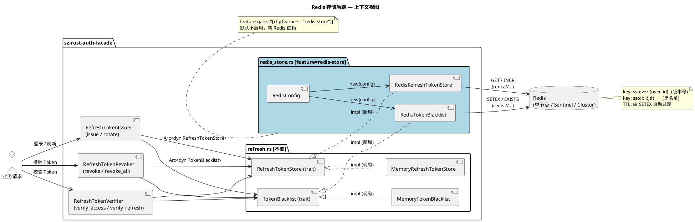

**通信协议与调用频率**：

| 调用路径 | 协议 | 频率 | 说明 |
|----------|------|------|------|
| `Issuer` / `Verifier` / `Revoker` → `RedisRefreshTokenStore` | 进程内 `Arc<dyn Trait>` 虚调用 | 每次 Token 签发 / 校验 / 撤销 | 零序列化，trait object 动态分发 |
| `RedisRefreshTokenStore` → Redis | RESP3 over TCP（`redis` crate） | 每次 `get_version` / `increment_version` | `ConnectionManager` 复用连接池 |
| `RedisTokenBlacklist` → Redis | RESP3 over TCP | 每次 `is_revoked` / `revoke` | 同上 |
| `RedisConfig::connect()` → Redis | TCP 建连 + AUTH | 进程启动 1 次 | `ConnectionManager` 创建后自动重连 |

### 2.1.2 服务/组件总体架构

**写作指导**：总体架构展示模块内部的组成结构。

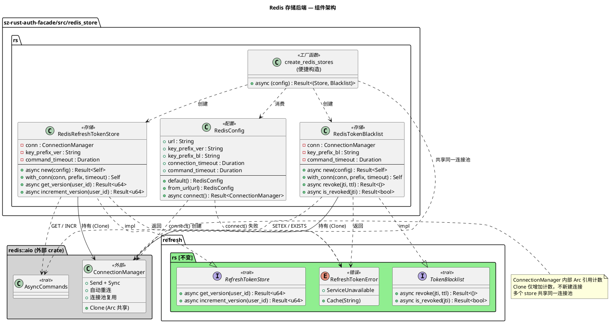

**模块划分与职责**：

| 组件 | 职责 | 配置项 |
|------|------|--------|
| `RedisConfig` | 连接配置载体 + `ConnectionManager` 工厂 | `url` / `key_prefix_ver` / `key_prefix_bl` / `connection_timeout` / `command_timeout` |
| `RedisRefreshTokenStore` | 维护 `user_id → token_version`，`INCR` 原子递增 | `key_prefix_ver` / `command_timeout` |
| `RedisTokenBlacklist` | 维护 `jti → 黑名单条目`，`SETEX` 带 TTL 写入 | `key_prefix_bl` / `command_timeout` |
| `create_redis_stores` | 便捷工厂，创建共享连接池的 store + blacklist 对 | 消费 `RedisConfig` |

**配置项取值策略**：

| 配置项 | 默认值 | 取值范围 | 策略 |
|--------|--------|----------|------|
| `url` | `redis://127.0.0.1:6379` | `redis://[ :password@]host[:port][/db]` | 环境变量 / 配置文件注入（NFR-2.5），禁止硬编码 |
| `key_prefix_ver` | `"sso:ver"` | 任意非空字符串 | 多实例隔离：不同实例用不同前缀（如 `app1:sso:ver`） |
| `key_prefix_bl` | `"sso:bl"` | 任意非空字符串 | 同上 |
| `connection_timeout` | 3s | `Duration > 0` | 局域网 3s，跨机房建议 5-10s |
| `command_timeout` | 2s | `Duration > 0` | 局域网 2s，慢查询场景调大；超时触发 fail-closed |

### 2.1.3 实现设计文档

**写作指导**：实现设计文档是对核心逻辑的设计说明。

#### 2.1.3.1 `get_version` 流程设计

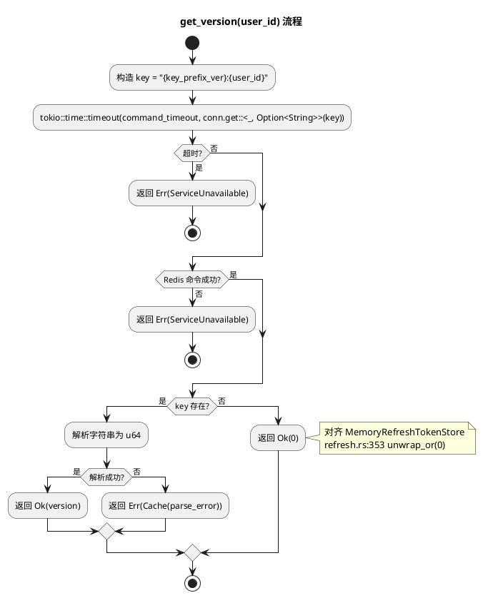

#### 2.1.3.2 `increment_version` 流程设计

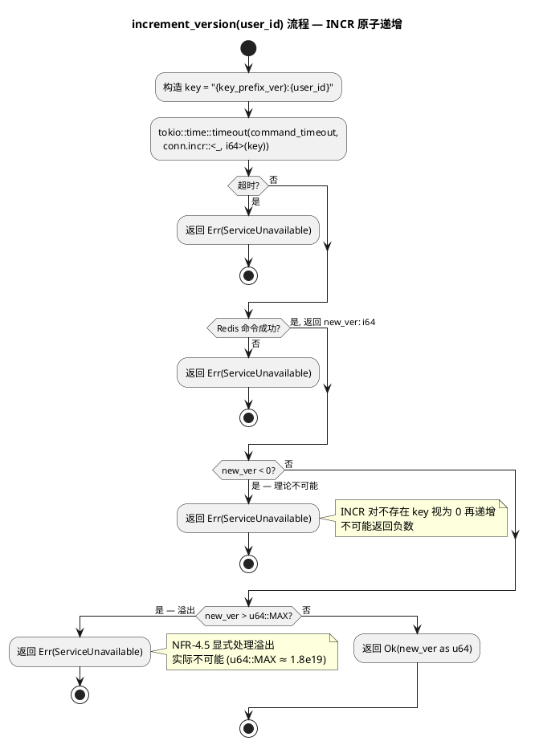

**关键设计点**：
- **原子性**：`INCR` 是 Redis 单命令，天然原子，无需 `GET + 1 + SET` 非原子序列（C-14），并发 100 个调用无丢失更新（NFR-1.3）
- **首次调用语义**：Redis `INCR` 对不存在的 key 视为 `0` 再递增，返回 `1`，与 `MemoryRefreshTokenStore` 行为一致（FR-1.7，`refresh.rs:358`）
- **类型转换**：`redis` crate `INCR` 返回 `i64`，需转换为 `u64`；负数 / 溢出显式处理防止 panic（NFR-4.5）

#### 2.1.3.3 `revoke` 流程设计（含 TTL 分支）

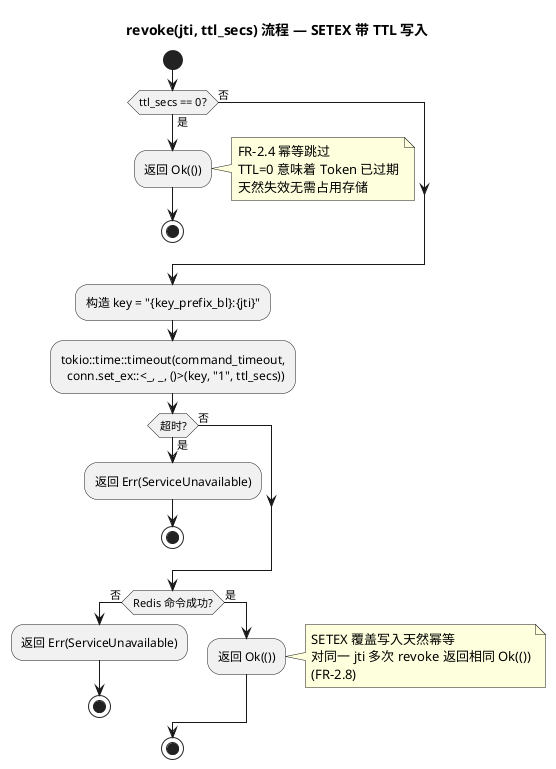

#### 2.1.3.4 `is_revoked` 流程设计

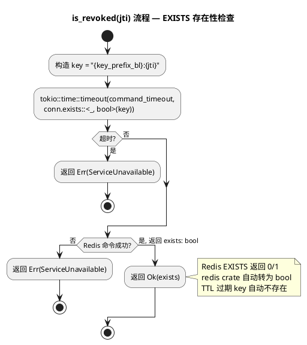

#### 2.1.3.5 `RedisConfig::connect()` 连接建立流程

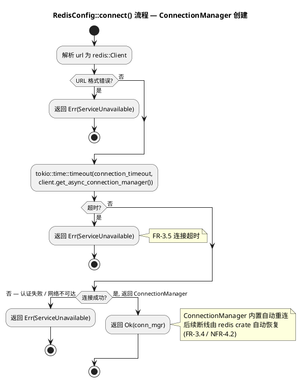

#### 2.1.3.6 fail-closed 错误处理状态机

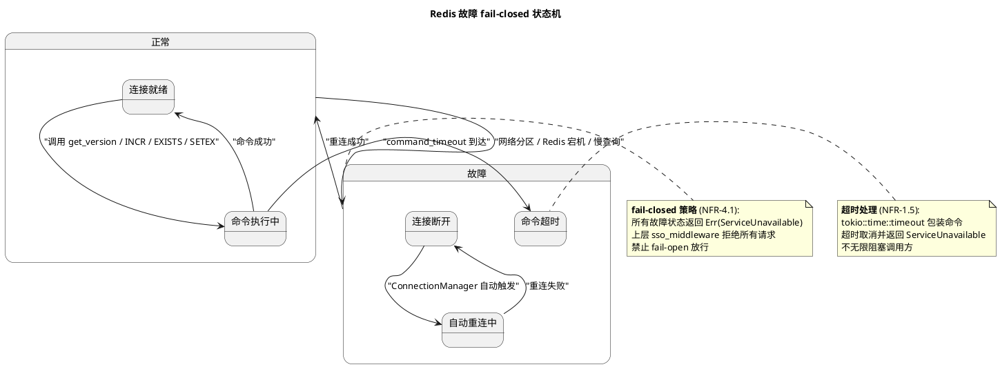

**扩展点设计**：
- **存储后端可替换**：`RefreshTokenStore` / `TokenBlacklist` trait 即扩展点，`Memory` / `Redis` 为两种实现，未来可新增 `Postgres` / `MySQL` 实现无需改动上层
- **`with_conn` 复用连接池**：多个 store 实例可共享同一 `ConnectionManager`，避免多连接池（`create_redis_stores` 便捷构造即利用此扩展点）
- **key 前缀可配置**：`key_prefix_ver` / `key_prefix_bl` 支持多实例隔离（不同业务 / 不同环境用不同前缀）

**事务设计**：
- **无需事务**：`INCR` / `SETEX` / `EXISTS` 均为 Redis 单命令，天然原子，无需 `MULTI` / `EXEC` 事务包装
- **无跨 key 操作**：版本号与黑名单独立 key，无跨 key 一致性需求
- **集群兼容**：Redis Cluster 对同一 key 的单命令自动路由到对应分片（hash slot），原子性保证不变（FR-6.1）

---

## 2.2 接口设计

**写作指导**：接口设计是连接上下游的契约，必须严谨、稳定。

### 2.2.1 总体设计

**接口分类依据**：按职责划分为「配置」「存储」「黑名单」「工厂」四类，对齐 trait 契约与便捷构造。

| 接口分类 | 接口名 | 稳定性等级 | 变更策略 |
|----------|--------|------------|----------|
| 配置 | `RedisConfig`（结构体 + `default` / `from_url` / `connect`） | 稳定 | 字段新增须保持 `Default` 兼容；`connect` 签名不变 |
| 存储 | `RedisRefreshTokenStore`（`new` / `with_conn` + `RefreshTokenStore` trait impl） | 稳定 | trait impl 签名由 `refresh.rs` 锁定，不可变；`new` / `with_conn` 签名不变 |
| 黑名单 | `RedisTokenBlacklist`（`new` / `with_conn` + `TokenBlacklist` trait impl） | 稳定 | 同上 |
| 工厂 | `create_redis_stores`（便捷构造） | 稳定 | 返回类型 `(RedisRefreshTokenStore, RedisTokenBlacklist)` 不变 |

**接口继承体系**：
- `RedisRefreshTokenStore` impl `RefreshTokenStore`（trait 定义在 `refresh.rs:322`，不修改）
- `RedisTokenBlacklist` impl `TokenBlacklist`（trait 定义在 `refresh.rs:369`，不修改）
- 无新增 trait，无继承链变更

**接口变更策略**：
- semver minor 升级（0.6.2 → 0.6.3），仅新增 API + 可选 feature（NFR-3.1）
- 不修改现有 trait 签名（NFR-3.2）
- 不修改现有 `Memory` 实现（NFR-3.3）
- `cargo-semver-checks check-release` 须通过（AC-2.7）

### 2.2.2 接口清单

**写作指导**：接口清单是所有接口的详细说明。

#### 2.2.2.1 `RedisConfig`

**接口签名**：
```rust
pub struct RedisConfig {
    pub url: String,
    pub key_prefix_ver: String,
    pub key_prefix_bl: String,
    pub connection_timeout: Duration,
    pub command_timeout: Duration,
}

impl RedisConfig {
    pub fn default() -> Self;
    pub fn from_url(url: impl Into<String>) -> Self;
    pub async fn connect(&self) -> Result<ConnectionManager, RefreshTokenError>;
}

impl std::fmt::Debug for RedisConfig { /* 密码脱敏 */ }
impl Clone for RedisConfig; // 派生
```

**业务说明**：Redis 连接配置载体，持有连接 URL、key 前缀、超时参数。`connect()` 创建 `ConnectionManager`，供 `RedisRefreshTokenStore::new` / `RedisTokenBlacklist::new` / `create_redis_stores` 使用。

**前置条件**：
- `url` 须为合法 Redis URL（`redis://[ :password@]host[:port][/db]`）
- `connection_timeout` / `command_timeout` > 0
- `key_prefix_ver` / `key_prefix_bl` 非空

**后置条件**：
- `default()` 返回：`url = "redis://127.0.0.1:6379"`、`key_prefix_ver = "sso:ver"`、`key_prefix_bl = "sso:bl"`、`connection_timeout = 3s`、`command_timeout = 2s`（AC-1.10）
- `from_url(url)` 仅设置 `url`，其余字段默认
- `connect()` 成功返回 `ConnectionManager`（内置自动重连）；失败返回 `Err(ServiceUnavailable)`（FR-3.5）
- `Debug` 输出不含 URL 中的密码，显示为 `[REDACTED]`（AC-1.11）

**异常映射**：
- URL 格式错误 → `ServiceUnavailable`
- 连接超时 → `ServiceUnavailable`
- 认证失败 / 网络不可达 → `ServiceUnavailable`

**调用示例**：
```rust
use sz_rust_auth_facade::redis_store::RedisConfig;

let config = RedisConfig::from_url("redis://:secret@redis-prod:6379/0")
    .with_key_prefix_ver("myapp:sso:ver")  // 假设链式构造（或字段赋值）
    .with_key_prefix_bl("myapp:sso:bl");

let conn = config.connect().await?;  // ConnectionManager
```

#### 2.2.2.2 `RedisRefreshTokenStore`

**接口签名**：
```rust
pub struct RedisRefreshTokenStore {
    conn: ConnectionManager,
    key_prefix_ver: String,
    command_timeout: Duration,
}

impl RedisRefreshTokenStore {
    pub async fn new(config: &RedisConfig) -> Result<Self, RefreshTokenError>;
    pub fn with_conn(
        conn: ConnectionManager,
        key_prefix_ver: impl Into<String>,
        command_timeout: Duration,
    ) -> Self;
}

#[async_trait::async_trait]
impl RefreshTokenStore for RedisRefreshTokenStore {
    async fn get_version(&self, user_id: i64) -> Result<u64, RefreshTokenError>;
    async fn increment_version(&self, user_id: i64) -> Result<u64, RefreshTokenError>;
}
```

**业务说明**：基于 Redis 的 `RefreshTokenStore` 实现，维护 `user_id → token_version` 映射。`get_version` 查询当前版本号，`increment_version` 原子递增版本号（撤销该用户所有 Token）。

**前置条件**：
- `new(config)`：`config.url` 须可达（或 `ConnectionManager` 自动重连后可达）
- `with_conn(conn, ...)`：`conn` 须为已建立的 `ConnectionManager`
- `key_prefix_ver` 非空

**后置条件**：
- `new(config)` 内部调用 `config.connect()`，持有返回的 `ConnectionManager`
- `with_conn(...)` 直接持有传入的 `ConnectionManager`，多 store 实例共享同一连接池
- `get_version(user_id)` 对不存在的 key 返回 `Ok(0)`（AC-1.1，对齐 `MemoryRefreshTokenStore` `refresh.rs:353`）
- `increment_version(user_id)` 首次调用返回 `Ok(1)`（AC-1.2，Redis `INCR` 对不存在 key 视为 0 再递增）
- 连续 `increment_version` 三次返回 `Ok(1)` / `Ok(2)` / `Ok(3)`（AC-1.2）
- 不同 `user_id` 版本号独立（AC-1.3）
- Redis 中 key 格式为 `{key_prefix_ver}:{user_id}`（AC-1.4，默认 `sso:ver:42`）

**异常映射**：
- Redis 连接断开 → `ServiceUnavailable`（fail-closed，AC-2.3）
- 命令超时 → `ServiceUnavailable`（NFR-1.5）
- `INCR` 返回值溢出 `u64::MAX` → `ServiceUnavailable`（NFR-4.5）
- 版本号字符串解析失败 → `Cache(String)`

**调用示例**：
```rust
use sz_rust_auth_facade::redis_store::{RedisConfig, RedisRefreshTokenStore};
use std::sync::Arc;
use sz_rust_auth_facade::refresh::RefreshTokenStore;

let config = RedisConfig::default();
let store = Arc::new(RedisRefreshTokenStore::new(&config).await?);

// 注入上层 Issuer（零侵入）
let issuer = RefreshTokenIssuer::new(codec, blacklist, store, token_config);
```

#### 2.2.2.3 `RedisTokenBlacklist`

**接口签名**：
```rust
pub struct RedisTokenBlacklist {
    conn: ConnectionManager,
    key_prefix_bl: String,
    command_timeout: Duration,
}

impl RedisTokenBlacklist {
    pub async fn new(config: &RedisConfig) -> Result<Self, RefreshTokenError>;
    pub fn with_conn(
        conn: ConnectionManager,
        key_prefix_bl: impl Into<String>,
        command_timeout: Duration,
    ) -> Self;
}

#[async_trait::async_trait]
impl TokenBlacklist for RedisTokenBlacklist {
    async fn revoke(&self, jti: &str, ttl_secs: u64) -> Result<(), RefreshTokenError>;
    async fn is_revoked(&self, jti: &str) -> Result<bool, RefreshTokenError>;
}
```

**业务说明**：基于 Redis 的 `TokenBlacklist` 实现，存储已撤销 Token 的 `jti`。`revoke` 用 `SETEX` 写入带 TTL 的黑名单条目，`is_revoked` 用 `EXISTS` 查询存在性。

**前置条件**：
- `new(config)`：`config.url` 须可达
- `with_conn(conn, ...)`：`conn` 须为已建立的 `ConnectionManager`
- `key_prefix_bl` 非空

**后置条件**：
- `revoke(jti, ttl)` 当 `ttl > 0`：Redis 中存在 key `{key_prefix_bl}:{jti}`，TTL = `ttl` 秒（AC-1.5 / AC-1.9）
- `revoke(jti, 0)`：直接返回 `Ok(())`，不写入 Redis（AC-1.7，FR-2.4 幂等跳过）
- `revoke` 幂等：对同一 `jti` 多次调用返回相同 `Ok(())`（AC-1.8，`SETEX` 覆盖写入）
- `is_revoked(jti)`：key 存在返回 `Ok(true)`，不存在返回 `Ok(false)`（AC-1.5）
- TTL 过期后 `is_revoked` 返回 `Ok(false)`（AC-1.6，Redis 自动删除）
- TTL 由调用方传入（Token 剩余有效期 `exp - now`），Redis 实现不自行计算（FR-2.7，C-15）

**异常映射**：
- Redis 连接断开 → `ServiceUnavailable`（fail-closed）
- 命令超时 → `ServiceUnavailable`

**调用示例**：
```rust
use sz_rust_auth_facade::redis_store::{RedisConfig, RedisTokenBlacklist};
use std::sync::Arc;
use sz_rust_auth_facade::refresh::TokenBlacklist;

let config = RedisConfig::default();
let blacklist = Arc::new(RedisTokenBlacklist::new(&config).await?);

blacklist.revoke("jti-abc-123", 3600).await?;  // SETEX sso:bl:jti-abc-123 3600 1
assert!(blacklist.is_revoked("jti-abc-123").await?);  // EXISTS → true
```

#### 2.2.2.4 `create_redis_stores`（便捷工厂）

**接口签名**：
```rust
pub async fn create_redis_stores(
    config: &RedisConfig,
) -> Result<(RedisRefreshTokenStore, RedisTokenBlacklist), RefreshTokenError>;
```

**业务说明**：一次性创建 `RedisRefreshTokenStore` + `RedisTokenBlacklist`，二者共享同一 `ConnectionManager`（同一连接池），避免双连接池开销。

**前置条件**：`config.url` 须可达

**后置条件**：
- 返回的 store 与 blacklist 持有同一 `ConnectionManager`（`Clone` 共享，非新建连接）
- 连接失败返回 `Err(ServiceUnavailable)`

**调用示例**：
```rust
use sz_rust_auth_facade::redis_store::{RedisConfig, create_redis_stores};

let config = RedisConfig::from_url("redis://redis-prod:6379");
let (store, blacklist) = create_redis_stores(&config).await?;
// store 与 blacklist 共享同一 ConnectionManager
```

---

## 2.3 数据模型

**写作指导**：数据模型设计必须与领域概念对齐，避免数据库思维。

### 2.3.1 设计目标

**写作指导**：设计目标阐述数据模型需要解决的问题。

**需支持的业务场景**：
1. **用户级 Token 撤销**：`increment_version(user_id)` 使该用户所有旧 Token 立即失效（O(1)），校验时比较 Token 中的 `ver` claim 与 Redis 中的当前版本号
2. **单 Token 撤销**：`revoke(jti, ttl)` 将单个 Token 的 `jti` 加入黑名单，`is_revoked(jti)` 查询是否已撤销
3. **黑名单自动清理**：黑名单条目带 TTL，Token 过期后 Redis 自动删除，无需应用层定时扫描（NFR-4.3）
4. **多实例隔离**：不同业务 / 不同环境通过 key 前缀隔离，避免 key 冲突
5. **集群部署**：多进程共享同一 Redis，版本号 / 黑名单全局一致（解决 `Memory` 实现单进程限制）

**性能、容量、扩展性目标**：
- **性能**：`get_version` / `increment_version` / `is_revoked` / `revoke` p99 < 5ms（局域网，NFR-1.1 / NFR-1.2）
- **容量**：版本号 key 数量 = 活跃用户数（每个用户 1 个 key，`String` 类型，~50 bytes）；黑名单 key 数量 = 未过期已撤销 Token 数（受 TTL 自动控制，不会无限增长）
- **扩展性**：key 前缀可配置支持多实例隔离；`ConnectionManager` 连接池复用支持高并发；Redis Cluster 支持水平扩展（FR-6）

**与存量数据的兼容策略**：
- **无存量 Redis 数据**：本设计为全新模块，无历史数据迁移问题
- **与 `Memory` 实现行为对齐**：`get_version` 不存在返回 0、`increment_version` 首次返回 1、`revoke` 幂等（NFR-3.5，通过泛型契约测试 `test_store_contract<S>()` 验证，AC-3.6）
- **`ttl=0` 行为差异**：`Memory` 写入但立即过期（`expires_at = now`，`is_revoked` 判断 `> now` 为 false）；Redis 跳过写入（FR-2.4）。二者对上层表现一致（`is_revoked` 均返回 false），但 Redis 节省存储

### 2.3.2 模型实现

**写作指导**：模型实现是具体的数据结构设计。

#### 2.3.2.1 领域对象类图

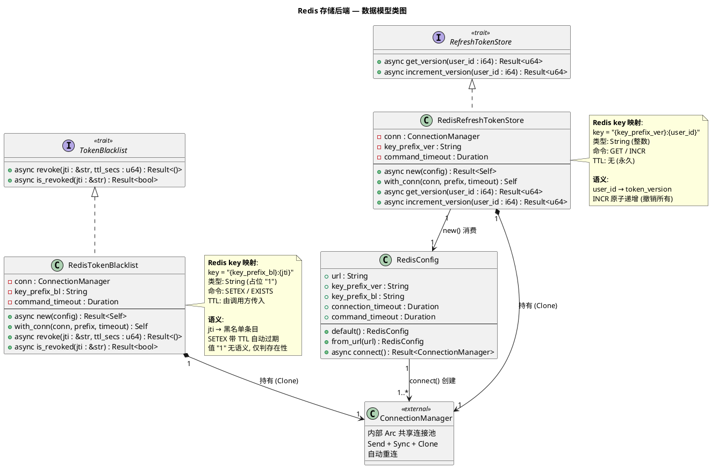

#### 2.3.2.2 Redis Key 设计

| 用途 | key 格式 | Redis 类型 | 值 | TTL | 命令 | 说明 |
|------|----------|------------|-----|-----|------|------|
| 用户 Token 版本号 | `{key_prefix_ver}:{user_id}` | String | 整数字符串（如 `"3"`） | 无（永久） | `GET` / `INCR` | `INCR` 要求值为整数；首次 `INCR` 对不存在 key 视为 0 再递增返回 1 |
| 黑名单条目 | `{key_prefix_bl}:{jti}` | String | `"1"`（占位符） | 由 `revoke` 的 `ttl_secs` 参数指定 | `SETEX` / `EXISTS` | 值无语义，仅用 `EXISTS` 判断存在性；TTL 过期 Redis 自动删除 |

**默认 key 命名空间**（可通过 `RedisConfig` 覆盖）：

| 场景 | `key_prefix_ver` | `key_prefix_bl` | 示例 key |
|------|------------------|----------------|----------|
| 默认（单实例） | `sso:ver` | `sso:bl` | `sso:ver:42` / `sso:bl:jti-abc` |
| 多实例隔离 | `app1:sso:ver` | `app1:sso:bl` | `app1:sso:ver:42` / `app1:sso:bl:jti-abc` |
| 多环境隔离 | `prod:sso:ver` | `prod:sso:bl` | `prod:sso:ver:42` / `prod:sso:bl:jti-abc` |

**key 设计原则**：
1. **命名空间隔离**：`sso:` 前缀避免与其他业务 key 冲突
2. **可配置前缀**：支持多实例 / 多环境隔离（AC-1.12）
3. **禁止裸 ID**：禁止用裸 `user_id` / `jti` 作为 key（FR-1.4 / FR-2.5），避免 key 冲突与可读性差
4. **冒号分隔**：遵循 Redis key 命名惯例（`namespace:subspace:identifier`）

#### 2.3.2.3 对象生命周期与状态流转

| 对象 | 创建 | 销毁 | 状态流转 |
|------|------|------|----------|
| `RedisConfig` | `default()` / `from_url()` / 字面量构造 | 随所有者离开作用域 | 不可变，无状态流转 |
| `ConnectionManager` | `RedisConfig::connect()` 创建 | 随最后持有者离开作用域（`Arc` 引用计数归零） | 就绪 → 断开 → 自动重连 → 就绪（由 `redis` crate 管理） |
| `RedisRefreshTokenStore` | `new(config)` / `with_conn(...)` | 随所有者离开作用域 | 不可变（`conn` / `key_prefix_ver` / `command_timeout` 均不变），无状态流转 |
| `RedisTokenBlacklist` | 同上 | 同上 | 同上 |
| Redis key `sso:ver:{user_id}` | 首次 `INCR` 创建 | 不主动销毁（永久 key） | 不存在(0) → 存在(1) → 递增(2,3,...) |
| Redis key `sso:bl:{jti}` | `SETEX` 创建 | TTL 过期 Redis 自动删除 | 不存在 → 存在(带 TTL) → TTL 过期自动删除 |

#### 2.3.2.4 持久化策略

| 数据 | 持久化方式 | 说明 |
|------|------------|------|
| 版本号 key（`sso:ver:*`） | Redis RDB / AOF（运维配置） | 版本号须持久化，进程重启 / Redis 重启后不丢失；运维层面配置 RDB 快照或 AOF 追加 |
| 黑名单 key（`sso:bl:*`） | Redis RDB / AOF（可选） | 黑名单条目带 TTL，即使丢失也仅影响安全性（丢失后 `is_revoked` 返回 false，可能放行已撤销 Token）；Token 本身有 `exp` 过期，黑名单丢失的影响窗口有限 |

**不包含表结构设计**：本设计使用 Redis kv 存储，无关系型表结构。Redis key 格式见 §2.3.2.2。

---

## 3. 并发设计

### 3.1 线程安全保证

| 组件 | 线程安全机制 | 证据 |
|------|--------------|------|
| `ConnectionManager` | `redis` crate 保证 `Send + Sync + Clone`，内部 `Arc` 共享连接池 | workspace `redis` feature `connection-manager`（`Cargo.toml:144`） |
| `RedisRefreshTokenStore` | 持有 `ConnectionManager`（`Send + Sync`），`key_prefix_ver` / `command_timeout` 为 `String` / `Duration`（`Send + Sync`），整体 `Send + Sync` | 字段均为 `Send + Sync` |
| `RedisTokenBlacklist` | 同上 | 同上 |
| `Arc<RedisRefreshTokenStore>` | `Arc` 提供 `Clone`，多线程共享 | 上层 `Issuer` / `Verifier` / `Revoker` 持有 `Arc<dyn RefreshTokenStore>` |
| `INCR` 原子性 | Redis 单命令原子执行，无需应用层锁 | C-14，NFR-1.3 |
| `SETEX` / `EXISTS` 原子性 | Redis 单命令原子执行 | — |

### 3.2 `async fn` Send + 'static 保证

- 所有 `async fn`（`new` / `get_version` / `increment_version` / `revoke` / `is_revoked` / `connect`）返回 `Future` 须 `Send + 'static`（C-1）
- `ConnectionManager` 的异步方法返回 `Send` Future（`redis` crate 保证）
- `tokio::time::timeout` 包装返回 `Send` Future
- 无 `!Send` 类型（如 `Rc` / `RefCell`）出现在 `async fn` 跨 `.await` 边界
- `#[async_trait::async_trait]` 宏自动添加 `Send` bound（对齐 `refresh.rs:322` / `369` 现有 trait）

### 3.3 并发场景分析

| 场景 | 并发数 | 安全保证 | 验证方式 |
|------|--------|----------|----------|
| 多任务并发 `increment_version(同一 user_id)` | 100 | `INCR` 原子，最终版本号 = 初始 + 100，无丢失更新 | AC-2.2 并发测试 |
| 多任务并发 `revoke(同一 jti, ttl)` | 100 | `SETEX` 覆盖写入幂等，最终 key 存在，TTL 为最后一次写入值 | AC-3.5 边界测试 (h) |
| 多任务并发 `get_version(同一 user_id)` | 100 | `GET` 只读，无竞争 | — |
| 多任务并发 `is_revoked(同一 jti)` | 100 | `EXISTS` 只读，无竞争 | — |
| `increment_version` 与 `get_version` 并发 | — | `INCR` 与 `GET` 均为 Redis 原子命令，Redis 单线程模型保证命令串行执行 | — |

---

## 4. 错误处理设计

### 4.1 错误映射表

| Redis 错误场景 | 映射到 `RefreshTokenError` | 理由 |
|----------------|---------------------------|------|
| 连接建立失败（URL 错误 / 认证失败 / 网络不可达） | `ServiceUnavailable` | FR-3.5，fail-closed |
| 连接断开（运行中网络分区 / Redis 宕机） | `ServiceUnavailable` | NFR-4.1，fail-closed；`ConnectionManager` 自动重连，重连成功后恢复 |
| 命令超时（`command_timeout` 到达） | `ServiceUnavailable` | NFR-1.5，不无限阻塞 |
| `INCR` 返回值溢出 `u64::MAX` | `ServiceUnavailable` | NFR-4.5，显式处理防止 panic |
| `GET` 返回值非整数字符串 | `Cache(String)` | 数据格式异常（理论不应发生，`INCR` 写入的必为整数） |
| Redis 协议错误 / IO 错误 | `ServiceUnavailable` | 统一映射，不泄漏 `redis::RedisError` 内部细节（C-13） |

### 4.2 fail-closed 策略

**设计原则**：Redis 故障时拒绝所有 Token 校验请求，安全优先（NFR-4.1）。

**理由**：
- fail-open（放行）会导致已撤销 Token 继续有效，安全风险高
- fail-closed（拒绝）仅影响可用性，不影响安全性
- SSO 场景下，可用性损失可接受（用户重新登录），安全性损失不可接受

**实现方式**：
- 所有 Redis 操作失败统一返回 `Err(ServiceUnavailable)`
- 上层 `RefreshTokenVerifier::verify` 收到 `ServiceUnavailable` 后传播给 `sso_middleware`
- `sso_middleware` 将 `ServiceUnavailable` 映射为 HTTP 503（对齐 sso spec NFR-4.1）

### 4.3 不泄漏内部错误

- `redis::RedisError` 不直接返回给上层（C-13）
- `tracing` 日志仅记录 `user_id` / `jti` / 操作类型 / 错误类型（`ServiceUnavailable` / `Cache`），不记录 Redis 原始错误详情 / 连接 URL（NFR-2.2）
- `Debug` 输出脱敏 URL 密码（NFR-2.1，AC-1.11）

---

## 5. 与现有代码的集成设计

### 5.1 零侵入集成路径

**写作指导**：本节说明 Redis 实现如何与现有 SSO 代码集成，强调零修改现有文件。

| 现有组件 | 集成方式 | 修改量 |
|----------|----------|--------|
| `RefreshTokenStore` trait（`refresh.rs:322`） | Redis 实现该 trait，不修改 trait 定义 | 0 行 |
| `TokenBlacklist` trait（`refresh.rs:369`） | 同上 | 0 行 |
| `MemoryRefreshTokenStore`（`refresh.rs:331`） | 保持不变，与 Redis 实现并存 | 0 行 |
| `MemoryTokenBlacklist`（`refresh.rs:378`） | 同上 | 0 行 |
| `RefreshTokenIssuer`（`refresh.rs:499`） | 通过 `Arc<dyn RefreshTokenStore>` 注入 Redis 实现，不修改代码 | 0 行 |
| `RefreshTokenVerifier`（`refresh.rs:420`） | 同上 | 0 行 |
| `RefreshTokenRevoker`（`refresh.rs:622`） | 同上 | 0 行 |
| `RefreshTokenError`（`refresh.rs:24`） | 复用现有 `ServiceUnavailable` / `Cache` 变体，不新增变体 | 0 行 |
| `SsoJwtCodec`（`refresh.rs:190`） | 不涉及（JWT 编解码与存储后端无关） | 0 行 |
| `lib.rs` | 新增 `#[cfg(feature = "redis-store")] pub mod redis_store;` | +1 行 |
| `Cargo.toml` | 新增 `redis-store` / `redis-cluster` feature 定义 | +2 行 |
| `redis_store.rs` | **新增文件** | 新文件 |

**结论**：仅新增 1 个文件（`redis_store.rs`）+ 3 行配置变更（`lib.rs` 1 行 + `Cargo.toml` 2 行），不修改任何现有逻辑代码，符合开闭原则。

### 5.2 存储后端切换示例

**测试场景**（使用 `Memory` 实现，零 Redis 依赖）：
```rust
let store: Arc<dyn RefreshTokenStore> = Arc::new(MemoryRefreshTokenStore::new());
let blacklist: Arc<dyn TokenBlacklist> = Arc::new(MemoryTokenBlacklist::new());
let issuer = RefreshTokenIssuer::new(codec, blacklist, store, config);
```

**生产场景**（使用 Redis 实现，需启用 `redis-store` feature）：
```rust
let config = RedisConfig::from_url("redis://redis-prod:6379");
let (store, blacklist) = create_redis_stores(&config).await?;
let store: Arc<dyn RefreshTokenStore> = Arc::new(store);
let blacklist: Arc<dyn TokenBlacklist> = Arc::new(blacklist);
let issuer = RefreshTokenIssuer::new(codec, blacklist, store, config);
```

**关键点**：上层 `RefreshTokenIssuer::new` 签名完全相同，仅 `store` / `blacklist` 实现不同，业务代码零修改（AC-1.14）。

### 5.3 feature gate 隔离设计

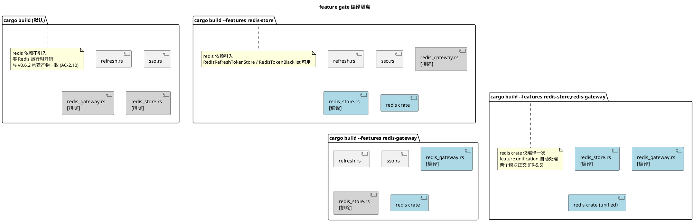

**feature 定义**（`Cargo.toml` `[features]` 段）：

| feature | 定义 | 依赖 | 说明 |
|---------|------|------|------|
| `redis-store` | `["dep:redis"]` | 复用 `Cargo.toml:22` 的 `redis = { workspace = true, optional = true }` | Redis 存储后端（FR-5） |
| `redis-cluster` | `["redis-store", "redis/cluster"]` | 隐含 `redis-store` + 启用 `redis` crate 的 `cluster` feature | Redis 集群支持（FR-6） |

**与现有 feature 的关系**：

| feature 组合 | `redis` crate features | 编译模块 |
|--------------|----------------------|----------|
| （无） | 不引入 | `refresh` / `sso`（不含 `redis_gateway` / `redis_store`） |
| `redis-gateway` | `aio` / `tokio-comp` / `connection-manager` | + `redis_gateway` |
| `redis-store` | 同上 | + `redis_store` |
| `redis-gateway` + `redis-store` | 同上（unification，不重复） | + `redis_gateway` + `redis_store` |
| `redis-cluster` | `aio` / `tokio-comp` / `connection-manager` / `cluster` | + `redis_store`（集群模式） |

---

## 6. 测试设计

### 6.1 测试分层

```plantuml
@startuml test_strategy
title Redis 存储后端 — 测试分层

package "单元测试 (mock Redis)" as UnitTests {
  component "RedisConfig\n构造 / Debug 脱敏" as TC1
  component "key 构造逻辑\n前缀拼接" as TC2
  component "错误映射逻辑\nRedisError → RefreshTokenError" as TC3
  component "ttl=0 跳过逻辑" as TC4
  note bottom of UnitTests
    不依赖真实 Redis
    使用 mock / embedded-redis
    覆盖率 ≥ 90% (AC-3.1)
  end note
}

package "集成测试 (真实 Redis)" as IntegrationTests {
  component "get_version / increment_version\n端到端" as TI1
  component "revoke / is_revoked\n端到端" as TI2
  component "TTL 过期自动删除" as TI3
  component "并发 100 INCR\n原子性" as TI4
  component "fail-closed\nRedis 断连" as TI5
  component "ConnectionManager\n自动重连" as TI6
  note bottom of IntegrationTests
    依赖真实 Redis 实例
    REDIS_URL 环境变量门控
    未设置时 #[ignore] 跳过 (AC-3.2)
  end note
}

package "契约测试 (泛型)" as ContractTests {
  component "test_store_contract<S: RefreshTokenStore>()" as TContract1
  component "test_blacklist_contract<B: TokenBlacklist>()" as TContract2
  note bottom of ContractTests
    对 Memory 与 Redis 执行同一套断言
    验证行为完全一致 (AC-3.6 / NFR-3.5)
  end note
}

package "基准测试 (criterion)" as BenchTests {
  component "get_version / increment_version\np99 < 5ms" as TB1
  component "revoke / is_revoked\np99 < 5ms" as TB2
  note bottom of BenchTests
    benches/redis_store_bench.rs
    局域网环境验证 (AC-2.1)
  end note
}

@enduml
```

### 6.2 单元测试清单（mock Redis，不依赖真实实例）

| 测试用例 | 验证点 | 对齐 spec |
|----------|--------|-----------|
| `test_redis_config_default` | `default()` 返回正确默认值 | AC-1.10 |
| `test_redis_config_from_url` | `from_url` 仅设置 url，其余默认 | FR-4.5 |
| `test_redis_config_debug_redacts_password` | `Debug` 输出不含密码，含 `[REDACTED]` | AC-1.11 / NFR-2.1 |
| `test_redis_config_debug_no_password` | 无密码 URL 的 `Debug` 正常输出 | NFR-2.1 边界 |
| `test_key_construction_ver` | key = `{prefix}:{user_id}` 拼接正确 | AC-1.4 / FR-1.4 |
| `test_key_construction_bl` | key = `{prefix}:{jti}` 拼接正确 | AC-1.9 / FR-2.5 |
| `test_key_construction_custom_prefix` | 自定义前缀生效 | AC-1.12 |
| `test_error_mapping_connection_failed` | 连接失败 → `ServiceUnavailable` | FR-3.5 / AC-2.3 |
| `test_error_mapping_command_timeout` | 命令超时 → `ServiceUnavailable` | NFR-1.5 / AC-2.5 |
| `test_revoke_ttl_zero_skipped` | `ttl=0` 直接返回 `Ok(())`，不调用 Redis | AC-1.7 / FR-2.4 |

### 6.3 集成测试清单（真实 Redis，`REDIS_URL` 环境变量门控）

| 测试用例 | 验证点 | 对齐 spec |
|----------|--------|-----------|
| `test_get_version_default` | 不存在 key 返回 `Ok(0)` | AC-1.1 |
| `test_increment_version_atomic` | 连续三次返回 1/2/3，`get_version` 返回 3 | AC-1.2 |
| `test_different_users_isolated` | 不同 `user_id` 版本号独立 | AC-1.3 |
| `test_revoke_and_is_revoked` | `revoke` 后 `is_revoked` 返回 true | AC-1.5 |
| `test_blacklist_ttl_expiry` | `revoke(ttl=1)` + sleep 2s → `is_revoked` 返回 false | AC-1.6 |
| `test_revoke_idempotent` | 同一 `jti` 多次 `revoke` 均返回 `Ok(())` | AC-1.8 |
| `test_key_format_ver` | `redis-cli EXISTS sso:ver:42` 返回 1 | AC-1.4 |
| `test_key_format_bl` | `redis-cli EXISTS sso:bl:jti-789` 返回 1 | AC-1.9 |
| `test_custom_key_prefix` | 自定义前缀 key 存在 | AC-1.12 |
| `test_concurrent_incr_atomicity` | 100 并发 `increment_version`，最终 = 初始 + 100 | AC-2.2 / NFR-1.3 |
| `test_concurrent_revoke_same_jti` | 100 并发 `revoke` 同一 jti，不报错 | AC-3.5 (h) |
| `test_fail_closed_redis_down` | Redis 停止后所有操作返回 `ServiceUnavailable` | AC-2.3 / NFR-4.1 |
| `test_auto_reconnect` | Redis 停止后重启，`ConnectionManager` 自动恢复 | AC-2.4 / NFR-4.2 |
| `test_command_timeout` | 慢查询 / 网络分区超时返回 `ServiceUnavailable` | AC-2.5 |

### 6.4 契约测试（泛型，对齐 Memory 与 Redis 行为）

```rust
// 对 Memory 与 Redis 执行同一套断言（AC-3.6 / NFR-3.5）
async fn test_store_contract<S: RefreshTokenStore>(store: S) {
    // AC-1.1: 不存在返回 0
    assert_eq!(store.get_version(1).await.unwrap(), 0);
    // AC-1.2: 连续递增
    assert_eq!(store.increment_version(1).await.unwrap(), 1);
    assert_eq!(store.increment_version(1).await.unwrap(), 2);
    assert_eq!(store.get_version(1).await.unwrap(), 2);
    // AC-1.3: 不同用户隔离
    assert_eq!(store.get_version(2).await.unwrap(), 0);
}

async fn test_blacklist_contract<B: TokenBlacklist>(bl: B) {
    // AC-1.5: revoke + is_revoked
    assert!(!bl.is_revoked("jti-1").await.unwrap());
    bl.revoke("jti-1", 3600).await.unwrap();
    assert!(bl.is_revoked("jti-1").await.unwrap());
    // AC-1.8: 幂等
    bl.revoke("jti-1", 3600).await.unwrap();
}
```

**执行方式**：
- `test_store_contract(MemoryRefreshTokenStore::new())` — 内存实现
- `test_store_contract(RedisRefreshTokenStore::new(&config).await.unwrap())` — Redis 实现（集成测试门控）

### 6.5 边界测试清单（AC-3.5）

| 边界用例 | 验证点 |
|----------|--------|
| `user_id = 0` | `get_version(0)` / `increment_version(0)` 正常工作（key `sso:ver:0`） |
| `user_id = i64::MIN` / `i64::MAX` | 负数 / 大数 user_id 正常工作（key 含负数 / 大数） |
| 空 `jti` 字符串 | `revoke("", ttl)` / `is_revoked("")` 行为定义（上层已过滤空 jti，但实现须不 panic） |
| 超长 `jti`（UUID v4 正常长度 36 字符） | 正常工作 |
| `ttl_secs = 0` | 跳过写入（FR-2.4） |
| `ttl_secs = u64::MAX` | Redis TTL 上限处理（Redis SETEX TTL 为 i64，超限须处理） |
| `key_prefix` 含特殊字符（`:` / `/`） | key 拼接正确，不破坏 Redis key 解析 |
| Redis 连接断开中途操作 | 返回 `ServiceUnavailable`，不 panic |
| 并发 100 `increment_version` 同一用户 | 最终 = 初始 + 100（AC-2.2） |
| 并发 100 `revoke` 同一 jti | 均返回 `Ok(())`，不报错 |

### 6.6 代码质量验收

| 验收项 | 命令 | 对齐 spec |
|--------|------|-----------|
| 单元测试覆盖率 ≥ 90% | `cargo tarpaulin --features redis-store` | AC-3.1 |
| Clippy 零警告 | `cargo clippy --all-features -- -D warnings` | AC-3.3 |
| rustdoc 零警告 | `cargo doc --all-features --no-deps` | AC-3.4 |
| 无 unsafe | `cargo build --features redis-store`（workspace `forbid` 生效） | AC-2.6 / C-4 |
| semver 兼容 | `cargo semver-checks check-release` | AC-2.7 / C-5 |
| 默认构建零影响 | `cargo build --no-default-features` 与 v0.6.2 一致 | AC-2.10 / NFR-3.6 |
| feature 隔离 | `cargo tree --no-default-features` 无 `redis` 节点 | AC-1.13 |

---

## 7. 风险与缓解（对齐 spec §9）

| 风险 | 等级 | 缓解措施 | 验证方式 |
|------|------|----------|----------|
| Redis 单点故障导致 SSO 不可用 | 高 | fail-closed 返回 503；运维部署 Sentinel / Cluster 高可用 | AC-2.3 |
| Redis 网络延迟拖慢 Token 校验 | 中 | `command_timeout` 超时降级；本地验签路径不依赖 Redis | AC-2.1 / NFR-1.1 |
| Redis 连接池耗尽 | 中 | `ConnectionManager` 内置连接池管理；`Clone` 仅 `Arc` 引用计数 | NFR-1.4 |
| `INCR` 版本号溢出 `u64::MAX` | 极低 | 显式处理溢出返回 `ServiceUnavailable` | NFR-4.5 |
| 黑名单 TTL 与 Token 实际过期不一致 | 中 | TTL 由调用方传入 `exp - now`，Redis 实现不自行计算 | FR-2.7 / C-15 |
| Redis 密码在日志 / Debug 泄漏 | 高 | `Debug` 脱敏；`tracing` 不记录 URL | AC-1.11 / NFR-2.1 / NFR-2.2 |
| feature unification 意外启用 `redis` | 低 | `#[cfg(feature = "redis-store")]` 编译期隔离 | AC-1.13 / AC-2.10 |
| semver 破坏 | 中 | `cargo-semver-checks` 验证；仅新增 API + 可选 feature | AC-2.7 |
| 集群模式 `INCR` 跨分片 | 中 | Redis Cluster 自动路由到对应分片，原子性不变 | FR-6.1 |

---

## 8. 变更记录

| 日期 | 版本 | 变更 | 作者 |
|------|------|------|------|
| 2026-08-08 | design-v1.0 | 初稿，基于 redis-store spec-v1.0 与现有 `refresh.rs` 代码证据生成 | spec-design-agent |
