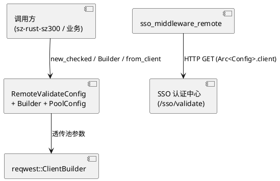
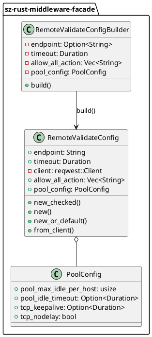
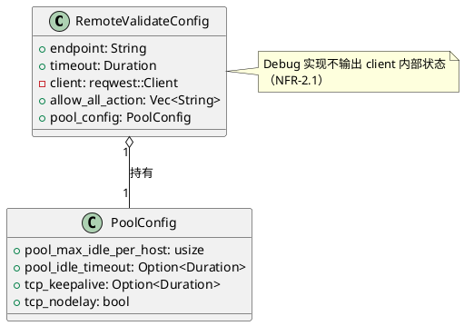

# design.md — 远程校验连接池优化（RemoteValidateConfig）

> **项目**：sz-rust · **版本**：v0.6.3 → v0.6.4（semver 兼容）
> **目标 crate**：`sz-rust-middleware-facade`（`src/sso_middleware.rs`，feature `remote-validate`）
> **创建日期**：2026-08-08 · **基于规格**：[spec.md](./spec.md)

---

# 一、需求与存量功能关系分析

## 1.1 需求功能与存量功能对比

### 1.1.1 已实现功能

| 需求功能 | 存量功能 | 代码位置 | 匹配度 |
|---------|---------|---------|--------|
| `RemoteValidateConfig` 结构体（endpoint/timeout/client/allow_all_action） | 已有四字段定义 | `sso_middleware.rs:170-179` | 100% |
| `new()` 构造函数（基本签名） | 已有，但内部 `.expect()` 会 panic | `sso_middleware.rs:184-200` | 50% |
| `pool_max_idle_per_host` 硬编码 32 | 已硬编码，不可配置 | `sso_middleware.rs:191` | 25% |
| feature gate `remote-validate` | 已定义于 Cargo.toml | `Cargo.toml:46` | 100% |
| `sso_middleware_remote` 中间件 | 已稳定，消费 `Arc<RemoteValidateConfig>` | `sso_middleware.rs:218-261` | 100% |

### 1.1.2 需要扩展的功能

| 需求功能 | 存量功能 | 差异说明 | 扩展方向 |
|---------|---------|---------|---------|
| `new_checked` 失败安全构造 | 无 | 现有 `new` 返回 `Self`，无法表达失败 | 新增返回 `Result<Self, RefreshTokenError>` 的构造入口 |
| `new_or_default` 回退构造 | 无 | 现有失败即 panic | 新增失败时回退 `reqwest::Client::new()` 并 `tracing::warn!` |
| `Builder` 链式配置 | 无 | 现有字段一次性传入 | 新增 `RemoteValidateConfigBuilder`，`.build()` 返回 `Result` |
| 连接池参数可配置 | 仅 `pool_max_idle_per_host=32` 硬编码 | 缺 `pool_idle_timeout`/`tcp_keepalive`/`tcp_nodelay` | 新增 `PoolConfig` 结构体，透传至 `ClientBuilder` |
| `from_client` 外部注入 | 无 | 无法注入预配置 Client | 新增方法直接持有外部 `reqwest::Client` |

### 1.1.3 需要新增的功能或接口

| 功能点 | 输入 | 输出 | 依赖 |
|--------|------|------|------|
| `RefreshTokenError::InvalidConfig` 变体 | `String`（原因） | `RefreshTokenError` | `sz-rust-auth-facade::refresh` |
| `PoolConfig` 结构体 | 四项连接池参数 | `PoolConfig` | `std::time::Duration` |
| `RemoteValidateConfigBuilder` | 链式 setter | `Result<RemoteValidateConfig, RefreshTokenError>` | `reqwest` |

## 1.2 存量功能详细分析

**`RemoteValidateConfig::new`（`sso_middleware.rs:184-200`）**
- **接口契约**：入参 `(impl Into<String>, Duration, Vec<String>)`，出参 `Self`，副作用：构造 `reqwest::Client`（panic 风险）。
- **业务规则**：固定 `pool_max_idle_per_host(32)`，未设置 `pool_idle_timeout` / `tcp_keepalive` / `tcp_nodelay`。
- **约束**：仅在 `#[cfg(feature = "remote-validate")]` 下编译；`client` 字段私有，外部不可直接访问。

**`sso_middleware_remote`（`sso_middleware.rs:218-261`）**
- **接口契约**：消费 `State<Arc<RemoteValidateConfig>>`，对中间件透明，不感知构造方式。
- **约束**：`async fn` 需满足 `Send + 'static`（项目铁律）。

**`RefreshTokenError`（`refresh.rs:25-77`）**
- 现有变体：`InvalidCredentials` / `InvalidSignature` / `Expired` / `WrongTokenType` / `Revoked` / `IssuerMismatch` / `VersionMismatch` / `ReuseDetected` / `ServiceUnavailable` / `Cache` / `Jwt` / `UserNotFound`。
- **约束**：`#[derive(Debug, thiserror::Error)]`，新增 `InvalidConfig` 需保持该派生。

---

# 二、增量设计方案

## 2.1 实现模型

### 2.1.1 上下文视图



### 2.1.2 服务/组件总体架构



### 2.1.3 实现设计文档

**构造流程分支**（PlantUML 活动图省略，文字描述）：
1. `new_checked`：校验 `endpoint` 非空 → 空：`Err(InvalidConfig)`；非空：调用 `ClientBuilder` 透传池参数 → `build()` 失败：`Err(ServiceUnavailable)`；成功：`Ok(Self)`。
2. `new`：直接 `new_checked(...).expect("failed to build reqwest client")`，保持 v0.6.3 行为。
3. `new_or_default`：`new_checked` 失败时 `tracing::warn!`（含原因，不含敏感字段）+ 回退 `reqwest::Client::new()`。
4. `from_client`：跳过 `ClientBuilder`，直接组装字段（`Arc` 复用外部 Client）。
5. `Builder::build`：`endpoint` 未设 → `Err(InvalidConfig)`；否则委托 `new_checked` 逻辑。

**`PoolConfig` 默认值**（spec §2）：`pool_max_idle_per_host=32`、`pool_idle_timeout=Some(90s)`、`tcp_keepalive=None`、`tcp_nodelay=true`。

**`ClientBuilder` 透传策略**（FR-5.2 / FR-5.3）：`pool_idle_timeout=None` 时不调用对应方法（使用 reqwest 内置 90s）；`tcp_keepalive=None` 时不调用（使用系统默认）。

## 2.2 接口设计

### 2.2.1 总体设计

| 接口 | 稳定性 | 备注 |
|------|--------|------|
| `RemoteValidateConfig::new` | 稳定（向后兼容） | 保留 v0.6.3 签名 |
| `RemoteValidateConfig::new_checked` | 新增（稳定） | 失败安全 |
| `RemoteValidateConfig::new_or_default` | 新增（稳定） | 回退默认 Client |
| `RemoteValidateConfig::from_client` | 新增（稳定） | 外部注入 |
| `RemoteValidateConfigBuilder` | 新增（稳定） | 链式 builder |
| `PoolConfig` | 新增（稳定） | 连接池参数载体 |
| `RefreshTokenError::InvalidConfig` | 新增（稳定） | 配置校验失败 |

### 2.2.2 接口清单

**`PoolConfig`**
```rust
#[derive(Debug, Clone)]
pub struct PoolConfig {
    pub pool_max_idle_per_host: usize,
    pub pool_idle_timeout: Option<Duration>,
    pub tcp_keepalive: Option<Duration>,
    pub tcp_nodelay: bool,
}
impl Default for PoolConfig { /* 32 / Some(90s) / None / true */ }
```

**`RemoteValidateConfig::new_checked`**
- 签名：`pub fn new_checked(endpoint: impl Into<String>, timeout: Duration, allow_all_action: Vec<String>) -> Result<Self, RefreshTokenError>`
- 前置：`endpoint` 非空。
- 后置：成功返回持有 `reqwest::Client` 的 `Self`；失败返回 `Err`。
- 异常映射：空 endpoint → `InvalidConfig`；`ClientBuilder::build` 失败 → `ServiceUnavailable`。

**`RemoteValidateConfig::new`**（向后兼容）
- 签名：`pub fn new(endpoint: impl Into<String>, timeout: Duration, allow_all_action: Vec<String>) -> Self`
- 实现：`Self::new_checked(...).expect("failed to build reqwest client")`

**`RemoteValidateConfig::new_or_default`**
- 签名：`pub fn new_or_default(endpoint: impl Into<String>, timeout: Duration, allow_all_action: Vec<String>) -> Self`
- 实现：`new_checked` 失败时 `tracing::warn!` + 回退 `reqwest::Client::new()`。

**`RemoteValidateConfig::from_client`**
- 签名：`pub fn from_client(endpoint: impl Into<String>, timeout: Duration, allow_all_action: Vec<String>, client: reqwest::Client) -> Self`
- 后置：直接持有传入 Client，不覆盖其配置。

**`RemoteValidateConfigBuilder`**
- 链式方法：`endpoint()` / `timeout()` / `allow_all_action()` / `pool_max_idle_per_host()` / `pool_idle_timeout()` / `tcp_keepalive()` / `tcp_nodelay()`
- `.build()` 签名：`pub fn build(self) -> Result<RemoteValidateConfig, RefreshTokenError>`
- 前置：`endpoint` 必填；未设 → `Err(InvalidConfig)`。

**`RefreshTokenError::InvalidConfig`**
- 定义：`#[error("invalid config: {0}")] InvalidConfig(String)`，新增于 `refresh.rs:25` 枚举末尾。

## 2.3 数据模型

### 2.3.1 设计目标

- 支持 FR-1 ~ FR-6 全部构造场景。
- semver 兼容：`RemoteValidateConfig` 现有 `pub` 字段不变，新增 `pub pool_config: PoolConfig` 字段（minor 升级）。
- feature `remote-validate` 关闭时零代码、零依赖（NFR-3.2）。

### 2.3.2 模型实现



- **生命周期**：`RemoteValidateConfig` 由调用方持有并 `Arc` 共享给中间件；`PoolConfig` 随 `RemoteValidateConfig` 一同生命周期。
- **持久化**：无（运行时配置对象）。
- **`Debug` 实现**：自定义 `Debug`，仅输出 `endpoint / timeout / allow_all_action / pool_config`，不输出 `client`（NFR-2.1）。

---

## 2.4 测试设计（单元测试清单）

| 测试名 | 验证点 | 对应 AC |
|--------|--------|---------|
| `test_new_checked_empty_endpoint` | 空 endpoint 返回 `Err(InvalidConfig)` | AC-1 / AC-5 |
| `test_new_checked_valid` | 合法参数返回 `Ok(Self)`，`pool_config` 为默认值 | AC-1 |
| `test_new_backward_compat` | `new()` 返回 `Self`，行为同 v0.6.3 | AC-2 |
| `test_new_or_default_fallback` | 失败时回退默认 Client 并记录 warn | AC-3 |
| `test_builder_missing_endpoint` | builder 未设 endpoint → `Err(InvalidConfig)` | AC-5 |
| `test_builder_full_config` | builder 设置全部池参数 → `Ok`，参数透传 | AC-4 |
| `test_builder_default_pool_config` | builder 仅设 endpoint → `Ok`，池参数为默认值 | AC-4 |
| `test_from_client_holds_external` | 传入 Client 被直接持有，不触发内部 Builder | AC-6 |
| `test_pool_config_default` | `PoolConfig::default()` 符合 spec §2 默认值 | AC-4 |
| `test_debug_no_client_leak` | `Debug` 输出不含 `client` 字段 | NFR-2.1 |
| `test_feature_gate_compiles` | `cargo build --no-default-features` 编译通过 | AC-7 |
| `test_async_send_static` | `cargo clippy` 验证 `async fn` 满足 `Send + 'static` | AC-8 |

---

## 2.5 向后兼容与版本策略

- **semver**：v0.6.3 → v0.6.4（minor），仅新增 API + 新增 `pub pool_config` 字段，不修改现有签名。
- **feature gate**：`remote-validate` 定义不变，所有新增代码在 `#[cfg(feature = "remote-validate")]` 下。
- **`new()` 行为**：保留 `.expect()` panic 语义（NFR-1.2），调用方零改动。
- **中间件透明**：`sso_middleware_remote` 不感知构造方式（NFR-1.3）。