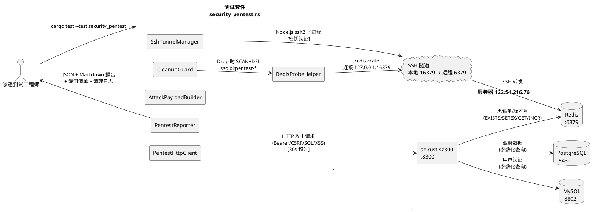
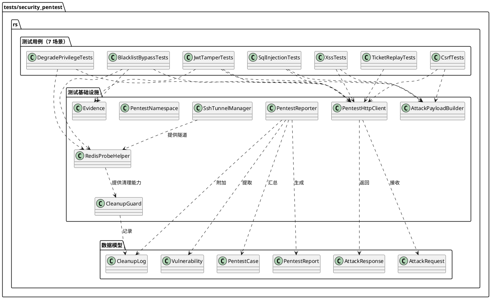
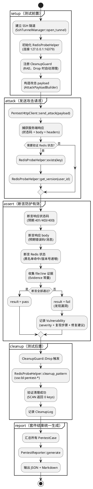
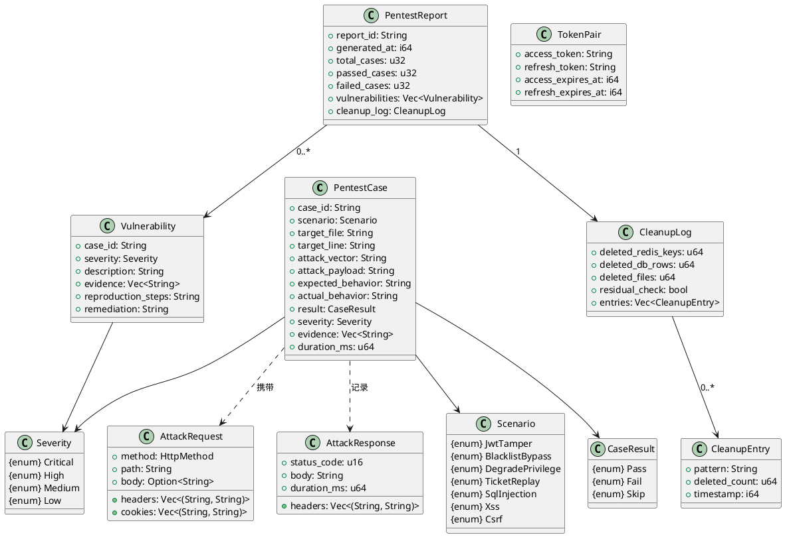

# sz-rust P0-3 白盒渗透测试技术设计

> 版本：1.0
> 日期：2026-08-09
> 对应需求：`docs/spec/security-pentest/spec.md`（v1.0，653 行）
> 测试类型：白盒渗透测试（源代码分析 + 实际 HTTP 请求验证）
> 被测目标：`packages/sz-rust-auth-facade` + `packages/sz-rust-middleware-facade` + `packages/sz-rust-sz300`
> 测试代码落点：`packages/sz-rust-auth-facade/tests/security_pentest.rs`
> 编译命令：`cargo test --test security_pentest --features redis-store -p sz-rust-auth-facade -- --test-threads=1`

---

# 一、需求与存量功能关系分析

## 1.1 需求功能与存量功能对比

### 1.1.1 已实现功能

> **关键判断**：spec.md 定义的 7 个渗透测试场景，其**防护逻辑**已全部存在于被测源码中（这是白盒测试可行性的前提）。下表所列"存量功能"均为**被测防护代码**，而非测试代码。匹配度 100% 表示防护逻辑与需求规则完全对齐，已通过源码行号核实。

| 需求功能 | 存量功能（被测防护逻辑） | 代码位置 | 匹配度 |
|---------|---------|---------|--------|
| JWT 签名篡改防护（ct_eq + alg 白名单 + 过期） | `SsoJwtCodec::decode`：3 段分割 → `ct_eq` 验签 → `alg=="HS256"` → 过期检查 | `packages/sz-rust-auth-facade/src/refresh.rs:232-275`（ct_eq 在 :247，alg 校验在 :258） | 100% |
| 黑名单绕过防护（jti 黑名单 + 版本号） | `RefreshTokenVerifier::verify`：decode → token_type → `blacklist.is_revoked` → issuer → 版本号 | `packages/sz-rust-auth-facade/src/refresh.rs:837-875`（黑名单在 :851，版本校验在 :864-872） | 100% |
| Refresh Token 复用检测 + 全量撤销 | `RefreshTokenIssuer::rotate`：复用检测（jti 在黑名单 → `increment_version` + `ReuseDetected`） | `packages/sz-rust-auth-facade/src/refresh.rs:1465-1475` | 100% |
| Memory 黑名单后端 | `MemoryTokenBlacklist::is_revoked`：读锁 + 过期判定 | `packages/sz-rust-auth-facade/src/refresh.rs:789-796` | 100% |
| Redis 黑名单后端（EXISTS/SETEX） | `RedisTokenBlacklist::is_revoked`：`conn.exists` + 命令超时 | `packages/sz-rust-auth-facade/src/redis_store.rs:216-226` | 100% |
| 降级提权防护（retain 子集 + 设备级优先 + 过期） | `SsoService::apply_degradation`：设备级优先 → 用户级回退 → `retain` 子集过滤 | `packages/sz-rust-auth-facade/src/sso.rs:593-630`（retain 在 :627-628，优先级在 :601-624） | 100% |
| 降级存储 trait + 过期检查 | `DegradationStore` trait + `MemoryDegradationStore::get_user_degradation`（`expires_at > now`） | `packages/sz-rust-auth-facade/src/refresh.rs:896-937`（trait），`:977-983`（过期） | 100% |
| Ticket 重放防护（一次性消费 + TTL 30s + UUID v4） | `SsoService::exchange_ticket` + `MemoryTicketStore::take`（`remove` + 过期检查） | `packages/sz-rust-auth-facade/src/sso.rs:442-467`（exchange），`refresh.rs:1104-1113`（take） | 100% |
| Ticket 生成（UUID v4 + TTL 30s） | `generate_ticket`：`uuid::Uuid::new_v4()` + `expires_at = now + 30` | `packages/sz-rust-auth-facade/src/sso.rs:418`（UUID），`:427`（TTL） | 100% |
| Ticket peek 不删除 | `MemoryTicketStore::peek`：读锁 + 过期判定，不 remove | `packages/sz-rust-auth-facade/src/refresh.rs:1115-1122` | 100% |
| SQL 注入防护（? 占位符参数化） | `authenticate_async`：`SELECT ... WHERE username = ?` + `Value::String` 绑定 | `packages/sz-rust-sz300/src/services/auth_service.rs:94-96` | 100% |
| XSS 防护（html_escape 5 字符转义） | `html_escape`：`&` `<` `>` `"` `'` 五字符转义 | `packages/sz-rust-infra-facade/src/debug_page.rs:515-528` | 100% |
| CSRF 防护（双提交 + 常量时间 + 精确匹配） | `csrf_middleware`：安全方法放行 → 公开路径精确匹配 → `constant_time_eq` 双提交比较 | `packages/sz-rust-middleware-facade/src/csrf.rs:99-138`（常量时间在 :125，精确匹配在 :67-69） | 100% |
| CSRF Token 生成（OsRng 32 字节） | `generate_token`：`OsRng.fill_bytes` + Base64 URL-safe | `packages/sz-rust-middleware-facade/src/csrf.rs:75-80` | 100% |
| CSRF 中间件挂载 | `router.rs` 层叠 `csrf_middleware`（外层）+ `auth_middleware`（内层） | `packages/sz-rust-sz300/src/router.rs:95`（CSRF），`:92`（auth） | 100% |
| JWT 鉴权中间件（公开路径精确匹配） | `auth_middleware`：`is_public_path` 精确匹配 + Bearer 校验 | `packages/sz-rust-sz300/src/middleware/auth_middleware.rs:19-42` | 100% |

### 1.1.2 需要扩展的功能

> **关键差异**：现有测试基础设施（`tests/sso_integration.rs` 617 行 + `tests/redis_integration.rs`）采用**单元/集成测试范式**——直接构造 `SsoService` 并调用其方法，使用 `Memory*Store`，不走 HTTP，不连远程服务器。渗透测试需要**端到端 HTTP 攻击验证范式**——向 `122.51.216.76:8300` 发送真实攻击请求，通过 SSH 隧道访问远程 Redis 验证状态，测试后清理远程数据。因此测试基础设施需要整体扩展，而非复用。

| 需求功能 | 存量功能 | 差异说明 | 扩展方向 |
|---------|---------|---------|---------|
| HTTP 攻击请求发送 | 无（现有测试直接调用 `SsoService` 方法） | 需向 `122.51.216.76:8300` 发送真实 HTTP 请求，携带攻击 payload（篡改 JWT / SQL 注入串 / XSS / CSRF），并解析响应状态码与 JSON body | 新增 `PentestHttpClient`（基于 `reqwest`，30s 超时，连接池复用） |
| SSH 隧道管理 | 无（现有 `redis_integration.rs` 直连本地 Redis） | 需通过 Node.js `ssh2` 包建立 SSH 隧道：本地 `16379` → 远程 `6379`（Redis），用于黑名单/版本号状态验证与清理。禁止 `sshpass` / PowerShell 重定向 | 新增 `SshTunnelManager`（`tokio::process::Child` 管理 Node.js 子进程，RAII 销毁） |
| Redis 状态验证与清理 | 无（现有测试用 `MemoryTokenBlacklist`，无需清理） | 需通过隧道（本地 `16379`）查询/清理远程 Redis 中测试产生的 keys：`sso:bl:pentest-*`、`sso:ver:pentest-*`、`sso:sessions:pentest-*` | 新增 `RedisProbeHelper`（`redis` crate 连接 `127.0.0.1:16379`，SCAN + DEL 清理） |
| 攻击 payload 构造 | 无 | 需构造 4 类篡改 JWT（错误密钥签名 / alg=none / alg=RS256 / 篡改 exp 延长过期）、5 类 SQL 注入串、4 类 XSS payload、4 类 CSRF 攻击请求 | 新增 `AttackPayloadBuilder`（纯函数模块，无副作用） |
| file:line 证据收集 | 无 | 每个用例必须附被测代码 file:line 证据（spec.md §4.4.1）。证据在编译期确定（被测代码位置不变），需与运行期断言结果关联 | 新增 `Evidence` 常量表 + `PentestCase` 结构体携带 evidence 字段 |
| 测试报告生成（JSON + Markdown） | 无 | spec.md §7.3 要求双格式输出。JSON 便于机器解析，Markdown 便于人工阅读。含漏洞清单 + 清理日志 | 新增 `PentestReporter`（`tokio::fs` 写文件，测试结束统一生成） |
| 测试数据清理（RAII） | 无（Memory 存储随测试结束自动释放） | 远程 Redis/MySQL 残载的测试数据不会自动清理，需显式 DEL/DELETE。spec.md §4.2.3 要求清理成功率 100% | 新增 `CleanupGuard`（`Drop` trait，RAII 自动清理）+ `CleanupLog` 记录 |
| 测试数据隔离 | 无（现有测试无命名空间隔离） | 需测试专用 JWT 密钥 `pentest-secret-2026`、用户名前缀 `pentest-*`、Redis key 前缀 `sso:bl:pentest-*`，避免污染生产数据 | 新增 `PentestNamespace` 常量模块 |

### 1.1.3 需要新增的功能或接口

> 按**测试基础设施模块**分组。所有新增代码仅位于 `tests/security_pentest.rs`（单文件集成测试），不修改任何被测源码，不修改上游 `../sz-orm/`。

**A. 测试套件主体（7 场景 × ≥3 子用例 = ≥21 个 `#[tokio::test]` 函数）**

| 模块 | 功能点 | 输入 | 输出 | 依赖 |
|------|--------|------|------|------|
| JWT 签名篡改 | PT-01-01~04：错误密钥/alg=none/alg=RS256/篡改exp | 篡改 Token + HTTP 请求 `/api/v1/auth/me` | 断言 401 + InvalidSignature + 证据 `refresh.rs:247,258` | PentestHttpClient, AttackPayloadBuilder |
| 黑名单绕过 | PT-02-01~04：撤销重放/revoke_all重放/refresh复用/跨设备重放 | TokenPair + revoke + HTTP 重放 | 断言 401 + Revoked/VersionMismatch/ReuseDetected + 证据 `refresh.rs:851,864-872,1465-1475` | PentestHttpClient, RedisProbeHelper |
| 降级提权 | PT-03-01~04：降级后访问高权限/篡改claims.roles/降级过期恢复/设备级优先 | degrade_user + HTTP 高权限接口 | 断言 403/200 + claims 子集 + 证据 `sso.rs:627-628` | PentestHttpClient, RedisProbeHelper |
| Ticket 重放 | PT-04-01~04：二次exchange/30s过期/并发exchange/peek后exchange | generate_ticket + exchange_ticket ×2 | 断言 400 + ticket not found + 证据 `refresh.rs:1104-1113` | PentestHttpClient |
| SQL 注入 | PT-05-01~05：OR注入/DROP TABLE/UNION SELECT/admin--/xp_cmdshell | 注入 payload + HTTP `/api/v1/auth/login` | 断言 401 + 无表被删除 + 证据 `auth_service.rs:94-96` | PentestHttpClient, AttackPayloadBuilder |
| XSS | PT-06-01~04：script标签/img onerror/属性注入/JSONP回调名 | XSS payload + HTTP Debug/JSONP 端点 | 断言响应中无可执行 `<script>` + 证据 `debug_page.rs:515-528` | PentestHttpClient, AttackPayloadBuilder |
| CSRF | PT-07-01~04：无Token的POST/Cookie与Header不一致/前缀绕过/正常放行 | CSRF 攻击请求 + HTTP `/api/v1/merchant/create` | 断言 403/200 + 证据 `csrf.rs:125,67-69` | PentestHttpClient, AttackPayloadBuilder |

**B. 测试基础设施模块（`tests/security_pentest.rs` 内 mod 声明）**

| 模块 | 职责 | 关键接口 | 依赖 crate |
|------|------|---------|-----------|
| `PentestHttpClient` | HTTP 攻击请求发送 + 响应解析 | `async fn send_attack(req: AttackRequest) -> AttackResponse` | `reqwest`（已存在于 workspace） |
| `SshTunnelManager` | Node.js ssh2 子进程管理，建立/销毁 SSH 隧道 | `async fn open_tunnel() -> TunnelHandle` / `Drop` 销毁 | `tokio::process`（禁止 `std::process`） |
| `RedisProbeHelper` | 通过隧道查询/清理远程 Redis | `async fn exists(key) -> bool` / `async fn cleanup_pattern(pattern) -> u64` | `redis`（通过 `redis-store` feature） |
| `AttackPayloadBuilder` | 构造篡改 JWT / SQL 注入 / XSS / CSRF payload | 纯函数，无 async | `hmac`, `sha2`, `base64`, `serde_json` |
| `Evidence` | file:line 证据常量表 | `const EVIDENCE_JWT_CT_EQ: &str = "refresh.rs:247"` | 无 |
| `PentestCase` | 单个测试用例数据模型 | 结构体，携带 case_id/scenario/payload/result/evidence | `serde` |
| `PentestReporter` | JSON + Markdown 报告生成 | `async fn generate(cases: &[PentestCase]) -> ReportPath` | `tokio::fs`, `serde_json` |
| `CleanupGuard` | RAII 自动清理远程测试数据 | `Drop` trait 触发 `RedisProbeHelper::cleanup_pattern` | `tokio`（Drop 中用 `block_on`） |
| `PentestNamespace` | 测试数据命名空间常量 | `const JWT_SECRET`, `const USER_PREFIX`, `const REDIS_KEY_PREFIX` | 无 |

## 1.2 存量功能详细分析

> 以下对 §1.1.1 中匹配度 100% 的防护逻辑进行深入解读，提取其**接口契约、业务规则、扩展点、约束**，为 §二 的测试用例设计提供精确依据。严禁逐行解读代码，仅提取测试设计所需的关键信息。

### 1.2.1 JWT 编解码（`SsoJwtCodec`）

| 维度 | 内容 |
|------|------|
| **接口契约** | `decode(token: &str) -> Result<SsoClaims, RefreshTokenError>`；入参：JWT 字符串；出参：成功返回 `SsoClaims`，失败返回 `InvalidSignature` / `Expired` / `Jwt`；副作用：无（纯解码） |
| **业务规则** | ① 3 段分割（`split('.')`，长度 != 3 → `InvalidSignature`）→ ② `ct_eq` 常量时间验签（`subtle::ConstantTimeEq`）→ ③ alg 校验（`header.alg == "HS256"`）→ ④ payload 反序列化 → ⑤ 过期检查（`claims.is_expired()`） |
| **扩展点** | 无运行期扩展点；密钥在构造时注入（`SsoJwtCodec::new(secret)`），测试可通过构造不同密钥的 codec 签发篡改 Token |
| **约束** | ① `ct_eq` 防时序攻击（`refresh.rs:247`）——测试不可测量到时间差；② alg 白名单仅 `HS256`（`refresh.rs:258`）——`none`/`RS256` 必须被拒；③ 验签先于 payload 解析——篡改 payload 但签名不匹配时，不会到达 payload 解析步骤 |

### 1.2.2 Token 校验器（`RefreshTokenVerifier`）

| 维度 | 内容 |
|------|------|
| **接口契约** | `verify_access(token) / verify_refresh(token) -> Result<SsoClaims, RefreshTokenError>`；入参：JWT；出参：成功返回 claims，失败返回 `InvalidSignature`/`Expired`/`WrongTokenType`/`Revoked`/`IssuerMismatch`/`VersionMismatch`；副作用：读 blacklist + 读 store |
| **业务规则** | decode → token_type 校验（access/refresh）→ jti 黑名单检查（`!jti.is_empty() && blacklist.is_revoked(jti)`）→ issuer 校验 → 版本号校验（`claims.ver == store.get_version(user_id)`） |
| **扩展点** | `blacklist: Arc<dyn TokenBlacklist>` + `store: Arc<dyn RefreshTokenStore>` 通过构造注入，可在 Memory / Redis 间切换 |
| **约束** | ① jti 为空跳过黑名单（兼容旧版无 jti Token，`refresh.rs:851`）——测试需覆盖 jti 为空场景；② 版本号不匹配返回 `VersionMismatch { token_ver, current_ver }`——测试可断言结构体字段；③ 黑名单检查先于版本号检查——撤销的 Token 不会到达版本号检查 |

### 1.2.3 Refresh Token 轮换与复用检测（`RefreshTokenIssuer::rotate`）

| 维度 | 内容 |
|------|------|
| **接口契约** | `rotate(old_refresh_token) -> Result<TokenPair, RefreshTokenError>`；入参：旧 refreshToken；出参：成功返回新 TokenPair，失败返回 `ReuseDetected`/其他；副作用：写 blacklist（旧 jti 入黑名单）+ 写 store（复用时 `increment_version`） |
| **业务规则** | decode → token_type=refresh 校验 → **复用检测**（jti 在黑名单 → `increment_version` + `ReuseDetected`）→ 正常校验（过期/签发人/版本）→ 旧 jti 入黑名单（TTL = 剩余有效期）→ 签发新 pair |
| **扩展点** | 无 |
| **约束** | ① 复用检测**优先于**正常校验（`refresh.rs:1465-1475`）——已轮换的 refreshToken 即使过期也会先触发 ReuseDetected；② `increment_version` 撤销该用户**所有** Token——后续所有旧 Token 的版本号均不匹配；③ 旧 jti 入黑名单 TTL = 剩余有效期——黑名单不会无限膨胀 |

### 1.2.4 降级机制（`SsoService::apply_degradation`）

| 维度 | 内容 |
|------|------|
| **接口契约** | `apply_degradation(&mut claims) -> ()`（私有方法，由 `validate` 调用）；入参：可变 claims；出参：原地修改 claims.roles / claims.permissions；副作用：读 degradation_store |
| **业务规则** | ① 无 degradation_store 或无 user_id → 直接返回 ② 有 device_id → 先查设备级降级，None 则回退用户级 ③ 无 device_id → 直接查用户级 ④ 有降级条目 → `claims.roles.retain(|r| entry.roles.contains(r))` + `claims.permissions.retain(|p| entry.permissions.contains(p))` |
| **扩展点** | `degradation_store: Option<Arc<dyn DegradationStore>>` 注入；`DegradationStore` trait 含 user 级 + device 级方法 |
| **约束** | ① best-effort（store 查询失败仅 `warn` 不阻断，`sso.rs:606-614`）——测试需覆盖 store 故障场景；② 过期条目返回 None（`refresh.rs:977-983`，`expires_at > now`）——降级过期后 claims 保持原始角色；③ `retain` 保证子集——降级后权限**不可能超出**原始权限（`sso.rs:627-628`） |

### 1.2.5 Ticket 交换与一次性消费（`SsoService::exchange_ticket` + `MemoryTicketStore::take`）

| 维度 | 内容 |
|------|------|
| **接口契约** | `exchange_ticket(ticket) -> Result<TokenPair, RefreshTokenError>`；入参：ticket 字符串；出参：成功返回 TokenPair，失败返回 `InvalidConfig("ticket not found or expired")`；副作用：**原子删除** ticket + 签发新 TokenPair |
| **业务规则** | `store.take(ticket)` → None 则返回 `InvalidConfig` → Some 则 `issue_with_roles` 签发新 pair。`take` 实现：`inner.write()` 取写锁 → `remove(ticket)` → 检查 `expires_at <= now` 则返回 None |
| **扩展点** | `ticket_store: Option<Arc<dyn TicketStore>>` 注入；`TicketStore` trait 含 `save` / `take` / `peek` |
| **约束** | ① `take` 原子删除（`parking_lot::RwLock` 写锁，`refresh.rs:1104-1113`）——并发重放仅一个成功；② TTL 30s（`sso.rs:427`，`expires_at = now + 30`）；③ UUID v4 生成（`sso.rs:418`）——不可预测；④ `peek` 不删除（`refresh.rs:1115-1122`）——peek 后 take 仍成功，第二次 take 失败 |

### 1.2.6 SQL 参数化查询（`auth_service::authenticate_async`）

| 维度 | 内容 |
|------|------|
| **接口契约** | `authenticate_async(username, password) -> Result<String, String>`；入参：用户名 + 密码；出参：成功返回 user_id 字符串，失败返回错误消息；副作用：读 MySQL |
| **业务规则** | 空值校验 → `pool.acquire()` → `query_with_params(sql, params)`（`sql = "SELECT ... WHERE username = ?"`，`params = [Value::String(username)]`）→ bcrypt 验证（`spawn_blocking`） |
| **扩展点** | 无（`get_pool()` 全局池） |
| **约束** | ① `?` 占位符参数化（`auth_service.rs:94-96`）——用户输入作为**绑定参数**而非 SQL 文本拼接；② 5s 超时（`spawn::with_timeout`）——慢查询返回"服务暂时不可用"；③ DB 错误不返回客户端（仅 `tracing::error`）——不泄露 SQL 结构；④ bcrypt 在 `spawn_blocking` 执行——不阻塞 tokio worker |

### 1.2.7 XSS 转义（`html_escape`）

| 维度 | 内容 |
|------|------|
| **接口契约** | `html_escape(s: &str) -> String`；入参：原始字符串；出参：转义后字符串；副作用：无 |
| **业务规则** | 逐字符匹配：`&`→`&amp;`、`<`→`&lt;`、`>`→`&gt;`、`"`→`&quot;`、`'`→`&#39;`，其余原样保留 |
| **扩展点** | 无 |
| **约束** | ① 5 字符全覆盖（`debug_page.rs:515-528`）——覆盖 HTML 注入所需的所有特殊字符；② Debug 页面所有用户输入（title/file/method/uri/header key/value）均经 `html_escape`——无遗漏拼接点；③ JSON API 响应由 `serde_json` 序列化——自动转义特殊字符，无需额外处理 |

### 1.2.8 CSRF 中间件（`csrf_middleware`）

| 维度 | 内容 |
|------|------|
| **接口契约** | `csrf_middleware(req, next) -> Response`；入参：HTTP 请求 + Next；出参：放行则 `next.run(req)`，拒绝则 `(403, "CSRF token 校验失败")`；副作用：无 |
| **业务规则** | ① `is_safe_method`（GET/HEAD/OPTIONS）放行 → ② `is_public_path`（精确匹配 `DEFAULT_PUBLIC_PATHS`）放行 → ③ 提取 Cookie `csrf_token` + Header `X-CSRF-TOKEN` → ④ `constant_time_eq` 比较两者 → ⑤ 不一致或缺失返回 403 |
| **扩展点** | `DEFAULT_PUBLIC_PATHS` 常量（`/health`、`/metrics`、`/api/v1/auth/login`、`/api/v1/auth/refresh`） |
| **约束** | ① `constant_time_eq` 防时序攻击（`csrf.rs:161-170`，调用在 :125）——长度不同直接返回 false，长度相同逐字节 XOR；② **精确匹配**防前缀绕过（`csrf.rs:67-69`，`public_paths.contains(&path)`）——`/health_evil` 不匹配 `/health`；③ `OsRng` 32 字节生成（`csrf.rs:75-80`）——密码学安全 RNG，不可预测；④ 中间件挂载在 `router.rs:95`（外层），`auth_middleware` 在 `:92`（内层）——CSRF 校验先于鉴权 |

---

# 二、增量设计方案

## 2.1 实现模型

### 2.1.1 上下文视图

> 展示测试套件与外部系统的交互关系。测试套件通过 HTTP 攻击被测服务，通过 SSH 隧道访问远程 Redis 验证状态与清理数据。



**通信协议与调用频率**

| 交互 | 协议 | 频率 | 说明 |
|------|------|------|------|
| 测试套件 → sz-rust-sz300 | HTTP/1.1 | 每用例 1-3 次 | 攻击请求 + 状态验证请求，30s 超时 |
| SshTunnelManager → SSH 服务器 | SSH（密钥认证） | 每套件 1 次 | 套件启动建立，套件结束销毁 |
| RedisProbeHelper → Redis | RESP（TCP） | 每用例 0-5 次 | 黑名单/版本号状态查询 + 清理 |
| PentestReporter → 本地磁盘 | 文件 I/O（`tokio::fs`） | 每套件 1 次 | 报告生成 |

### 2.1.2 服务/组件总体架构

> 展示测试套件内部模块划分与依赖关系。所有模块位于 `tests/security_pentest.rs` 单文件内，通过 `mod` 声明组织。



**模块职责与配置项**

| 模块 | 职责 | 关键配置项 | 取值策略 |
|------|------|-----------|---------|
| `PentestHttpClient` | HTTP 攻击请求发送 | `target_url` / `timeout` | `http://122.51.216.76:8300` / 30s |
| `SshTunnelManager` | SSH 隧道生命周期 | `ssh_host` / `local_port` / `remote_port` | `122.51.216.76` / `16379` / `6379` |
| `RedisProbeHelper` | Redis 状态查询与清理 | `redis_url` / `key_prefix` | `redis://127.0.0.1:16379` / `sso:bl:pentest-*` |
| `AttackPayloadBuilder` | 攻击 payload 构造 | 无（纯函数） | — |
| `PentestReporter` | 报告生成 | `output_dir` / `formats` | `tests/pentest-reports/` / `[JSON, Markdown]` |
| `CleanupGuard` | RAII 自动清理 | 无（依赖 `RedisProbeHelper`） | `Drop` trait 触发 |
| `PentestNamespace` | 命名空间常量 | `JWT_SECRET` / `USER_PREFIX` / `REDIS_KEY_PREFIX` | `pentest-secret-2026` / `pentest-` / `sso:bl:pentest-` |
| `Evidence` | file:line 证据常量 | 7 场景 × 多证据点 | 编译期 `const &str` |

### 2.1.3 实现设计文档

> 测试用例执行流程（setup → attack → assert → cleanup → report）。每个 `#[tokio::test]` 函数遵循此流程，确保可重复、可清理、有证据。



**关键设计决策**

| 决策点 | 选择 | 理由 |
|--------|------|------|
| 测试执行模式 | `--test-threads=1` 串行 | 避免并发攻击请求相互干扰（如黑名单测试中 Token 撤销顺序）；避免 Redis 清理竞争 |
| SSH 隧道管理 | Node.js `ssh2` 子进程 | 遵循项目约束（禁止 `sshpass` / PowerShell 重定向）；`ssh2` 已在 `package.json` 安装 |
| Redis 访问方式 | SSH 隧道本地 16379 | 远程 Redis 仅监听 127.0.0.1，需通过 SSH 转发；避免暴露 Redis 到公网 |
| 测试数据清理 | RAII `CleanupGuard` + `Drop` | 保证异常路径也清理；spec.md §4.2.3 要求清理成功率 100% |
| 证据收集 | 编译期 `const &str` 常量 | 被测代码位置在编译期确定；避免运行期反射开销；类型安全 |
| 报告格式 | JSON + Markdown 双输出 | spec.md §7.3 要求；JSON 机器解析，Markdown 人工阅读 |
| 攻击 payload 构造 | 纯函数 `AttackPayloadBuilder` | 无副作用，可独立单元测试；不依赖网络/IO |
| HTTP 客户端 | `reqwest`（workspace 已有） | 支持 async、连接池、超时；`Send + 'static` 满足约束 |

## 2.2 接口设计

### 2.2.1 总体设计

> 接口按**测试基础设施**与**数据模型**两类划分。所有接口均为 `async fn` 且 `Send + 'static`（满足项目统一约束）。接口稳定性等级：**稳定**（测试套件内部，不对外暴露）。

| 接口分类 | 接口名 | 职责 | 稳定性 |
|---------|--------|------|--------|
| HTTP 客户端 | `PentestHttpClient` | 发送 HTTP 攻击请求，解析响应 | 稳定 |
| SSH 隧道 | `SshTunnelManager` | 建立/销毁 SSH 隧道 | 稳定 |
| Redis 探针 | `RedisProbeHelper` | 查询/清理远程 Redis | 稳定 |
| Payload 构造 | `AttackPayloadBuilder` | 构造各类攻击 payload（纯函数） | 稳定 |
| 报告生成 | `PentestReporter` | 生成 JSON + Markdown 报告 | 稳定 |
| 清理守卫 | `CleanupGuard` | RAII 自动清理 | 稳定 |
| 数据模型 | `PentestCase` / `PentestReport` / `Vulnerability` / `CleanupLog` | 测试用例与报告数据结构 | 稳定 |
| 请求/响应 | `AttackRequest` / `AttackResponse` | HTTP 攻击请求/响应封装 | 稳定 |

**接口变更策略**：测试套件内部接口，随测试需求演进，不对外发布，无版本兼容约束。

### 2.2.2 接口清单

#### PentestHttpClient

```rust
pub struct PentestHttpClient { /* reqwest::Client + base_url */ }

impl PentestHttpClient {
    pub fn new(base_url: &str, timeout: Duration) -> Self;
    pub async fn send_attack(&self, req: &AttackRequest) -> Result<AttackResponse, PentestError>;
    pub async fn login(&self, username: &str, password: &str) -> Result<TokenPair, PentestError>;
    pub async fn get_csrf_token(&self) -> Result<String, PentestError>;
}
```

| 项目 | 内容 |
|------|------|
| **业务说明** | 向被测服务发送 HTTP 攻击请求，解析响应状态码/body/headers。`login` 辅助方法用于获取合法 TokenPair（攻击前置）。`get_csrf_token` 用于获取合法 CSRF Token（CSRF 正向放行用例） |
| **前置条件** | 被测服务 `122.51.216.76:8300` 可达 |
| **后置条件** | 返回 `AttackResponse`，含 `status_code` / `body` / `headers`；不修改服务端状态（仅 login 会签发 Token） |
| **异常映射** | 连接超时 → `PentestError::Timeout`；连接拒绝 → `PentestError::ConnectionRefused`；HTTP 5xx → `PentestError::ServerError` |
| **类型安全** | `base_url: &str` 构造期校验 URL 合法性；`timeout: Duration` 强类型；`AttackRequest` / `AttackResponse` 强类型，不使用 `HashMap<String, String>` |

#### SshTunnelManager

```rust
pub struct SshTunnelManager { /* tokio::process::Child */ }

impl SshTunnelManager {
    pub async fn open_tunnel(
        ssh_host: &str,
        local_port: u16,
        remote_port: u16,
    ) -> Result<Self, PentestError>;
    pub async fn is_alive(&self) -> bool;
}

impl Drop for SshTunnelManager {
    fn drop(&mut self); // kill 子进程，释放隧道
}
```

| 项目 | 内容 |
|------|------|
| **业务说明** | 通过 Node.js `ssh2` 包建立 SSH 隧道（本地 `local_port` → 远程 `remote_port`）。子进程执行预置 JS 脚本（`tests/pentest-ssh-tunnel.js`），脚本读取环境变量获取密钥路径。`Drop` 时 kill 子进程 |
| **前置条件** | Node.js + `ssh2` 包已安装；SSH 密钥可读；远程 SSH 服务可达 |
| **后置条件** | 本地 `local_port` 监听可用；`Drop` 后子进程终止、端口释放 |
| **异常映射** | 子进程启动失败 → `PentestError::TunnelSetup`；隧道建立超时（10s）→ `PentestError::TunnelTimeout` |
| **约束** | 使用 `tokio::process::Child`（非 `std::process`）；`async fn` + `Send + 'static`；密钥路径通过环境变量传入，不硬编码 |

#### RedisProbeHelper

```rust
pub struct RedisProbeHelper { /* redis::aio::ConnectionManager */ }

impl RedisProbeHelper {
    pub async fn connect(url: &str) -> Result<Self, PentestError>;
    pub async fn exists(&self, key: &str) -> Result<bool, PentestError>;
    pub async fn get_version(&self, user_id: i64) -> Result<i64, PentestError>;
    pub async fn cleanup_pattern(&self, pattern: &str) -> Result<u64, PentestError>;
    pub async fn verify_no_residual(&self, pattern: &str) -> Result<(), PentestError>;
}
```

| 项目 | 内容 |
|------|------|
| **业务说明** | 通过 SSH 隧道（本地 16379）查询远程 Redis 状态。`exists` 验证黑名单命中；`get_version` 验证版本号递增；`cleanup_pattern` 用 SCAN + DEL 清理匹配 keys；`verify_no_residual` 断言无残留（spec.md §7.2 验收） |
| **前置条件** | SSH 隧道已建立；本地 16379 可达 |
| **后置条件** | `cleanup_pattern` 后匹配 keys 数为 0；`verify_no_residual` 通过 |
| **异常映射** | Redis 连接失败 → `PentestError::RedisConnection`；命令超时（2s）→ `PentestError::RedisTimeout`；清理后仍有残留 → `PentestError::CleanupIncomplete` |
| **约束** | 使用 `redis::aio::ConnectionManager`（async）；SCAN 而非 KEYS（避免阻塞 Redis）；`async fn` + `Send + 'static` |

#### AttackPayloadBuilder

```rust
pub struct AttackPayloadBuilder;

impl AttackPayloadBuilder {
    // JWT 篡改
    pub fn jwt_with_wrong_secret(claims: &SsoClaims, wrong_secret: &str) -> String;
    pub fn jwt_with_alg_none(claims: &SsoClaims) -> String;
    pub fn jwt_with_alg_rs256(claims: &SsoClaims) -> String;
    pub fn jwt_with_extended_exp(claims: &SsoClaims, extend_secs: i64) -> String;

    // SQL 注入
    pub fn sql_or_injection() -> &'static str;
    pub fn sql_drop_table() -> &'static str;
    pub fn sql_union_select() -> &'static str;
    pub fn sql_comment_trick() -> &'static str;
    pub fn sql_xp_cmdshell() -> &'static str;

    // XSS
    pub fn xss_script_tag() -> &'static str;
    pub fn xss_img_onerror() -> &'static str;
    pub fn xss_attribute_injection() -> &'static str;
    pub fn xss_jsonp_callback() -> &'static str;

    // CSRF
    pub fn csrf_no_token() -> AttackRequest;
    pub fn csrf_mismatched(cookie: &str, header: &str) -> AttackRequest;
    pub fn csrf_prefix_bypass() -> AttackRequest;
    pub fn csrf_valid(token: &str) -> AttackRequest;
}
```

| 项目 | 内容 |
|------|------|
| **业务说明** | 纯函数模块，构造各类攻击 payload。JWT 篡改使用 `hmac`+`sha2`+`base64` 手工签发；SQL/XSS 返回静态注入串；CSRF 构造 `AttackRequest` |
| **前置条件** | 无（纯函数，无 IO） |
| **后置条件** | 返回的 payload 可直接用于 HTTP 请求 |
| **异常映射** | 无（纯函数，不返回 `Result`；JWT 篡改内部 `unwrap` 仅在不可能失败的编码步骤） |
| **类型安全** | `SsoClaims` 强类型入参；返回 `String` / `&'static str` / `AttackRequest` 明确类型；不使用 `serde_json::Value` 通用类型 |

#### PentestReporter

```rust
pub struct PentestReporter { /* output_dir: PathBuf */ }

impl PentestReporter {
    pub fn new(output_dir: &Path) -> Self;
    pub async fn generate(&self, cases: &[PentestCase]) -> Result<ReportPath, PentestError>;
}
```

| 项目 | 内容 |
|------|------|
| **业务说明** | 汇总所有 `PentestCase`，生成 JSON + Markdown 双格式报告。JSON 含完整用例数据（机器解析）；Markdown 含汇总表 + 漏洞清单 + 清理日志（人工阅读） |
| **前置条件** | `output_dir` 可写（`tokio::fs::create_dir_all`） |
| **后置条件** | 生成 `pentest-report.json` + `pentest-report.md` 两个文件 |
| **异常映射** | 目录创建失败 → `PentestError::IoError`；序列化失败 → `PentestError::SerializeError` |
| **约束** | 使用 `tokio::fs`（禁止 `std::fs`）；`async fn` + `Send + 'static`；敏感字段（密钥/真实 Token）脱敏后写入 |

#### CleanupGuard

```rust
pub struct CleanupGuard {
    probe: Arc<RedisProbeHelper>,
    patterns: Vec<String>,
    log: Arc<Mutex<CleanupLog>>,
}

impl CleanupGuard {
    pub fn new(probe: Arc<RedisProbeHelper>, patterns: Vec<String>) -> Self;
    pub async fn register(&self, pattern: &str);
}

impl Drop for CleanupGuard {
    fn drop(&mut self); // block_on 执行 cleanup_pattern + verify_no_residual
}
```

| 项目 | 内容 |
|------|------|
| **业务说明** | RAII 守卫，注册需清理的 Redis key 模式。`Drop` 时通过 `tokio::runtime::Handle::current().block_on` 执行清理（测试在 tokio 运行时内） |
| **前置条件** | `RedisProbeHelper` 已连接；在 tokio 运行时上下文中 |
| **后置条件** | 所有注册 pattern 的 keys 已删除；`CleanupLog` 记录已删除数量 |
| **异常映射** | 清理失败 → 计入 `CleanupLog` 并 `tracing::error`（不 panic，避免影响其他用例） |
| **约束** | `Drop` 中使用 `block_on`（测试场景可接受）；清理失败不 panic 但记日志 |

## 2.3 数据模型

### 2.3.1 设计目标

| 目标 | 说明 |
|------|------|
| **支持的业务场景** | 7 个渗透测试场景 × ≥3 子用例，每用例携带攻击 payload + 响应 + 证据 + 清理记录 |
| **性能目标** | 单用例 ≤30s，全套件 ≤10min（spec.md §4.1）；报告生成 ≤5s |
| **容量目标** | ≥21 个 PentestCase 对象；报告文件 JSON ≤1MB / Markdown ≤500KB |
| **扩展性目标** | 新增渗透场景仅需新增 `#[tokio::test]` 函数 + Evidence 常量，不修改基础设施 |
| **与存量数据兼容** | 测试数据通过命名空间隔离（`pentest-*` 前缀），不污染生产数据；测试结束 100% 清理 |
| **类型安全目标** | 所有数据结构强类型，`serde` 序列化/反序列化；禁止 `any` / `serde_json::Value` 通用类型在公共接口 |

### 2.3.2 模型实现

> 核心领域对象类图。所有对象均为 `Send + Sync`（满足 `async fn` 约束），`serde::Serialize`（报告输出）。



**对象生命周期与创建/销毁策略**

| 对象 | 创建时机 | 销毁时机 | 持久化策略 |
|------|---------|---------|-----------|
| `PentestCase` | 每个 `#[tokio::test]` 函数内构造 | 测试套件结束 | 序列化进 `PentestReport`，写入报告文件 |
| `PentestReport` | 套件结束统一汇总 | 报告写入后 | JSON + Markdown 文件（`tokio::fs`） |
| `Vulnerability` | 用例断言失败时构造 | 套件结束 | 嵌入 `PentestReport` |
| `CleanupLog` | `CleanupGuard` 构造时创建 | `Drop` 时填充 | 嵌入 `PentestReport` |
| `AttackRequest` / `AttackResponse` | `AttackPayloadBuilder` 构造 / `PentestHttpClient` 返回 | 用例结束 | 嵌入 `PentestCase`（脱敏后） |
| `TokenPair` | `login` 辅助方法返回 | 用例结束 | 仅内存，不持久化（含敏感 Token） |

**领域对象与 spec.md 术语对齐**

| design.md 对象 | spec.md 术语（§6.1/§6.2） | 对齐说明 |
|---------------|-------------------------|---------|
| `PentestCase.case_id` | `case_id`（PT-<场景>-<子用例>） | 格式完全一致 |
| `PentestCase.scenario` | `scenario`（7 场景名称） | `Scenario` enum 7 变体一一对应 |
| `PentestCase.target_file` / `target_line` | `target_file` / `target_line` | 拆分为两个字段，便于程序化处理 |
| `PentestCase.attack_vector` / `attack_payload` | `attack_vector` / `attack_payload` | vector 为描述，payload 为实际值 |
| `PentestCase.expected_behavior` / `actual_behavior` | `expected_behavior` / `actual_behavior` | 预期 vs 实际，用于判定 pass/fail |
| `PentestCase.result` | `result`（pass/fail/skip） | `CaseResult` enum 3 变体 |
| `PentestCase.severity` | `severity`（Critical/High/Medium/Low） | `Severity` enum 4 变体，对齐 §6.3 |
| `PentestCase.evidence` | `evidence`（file:line） | `Vec<String>` 支持多证据点 |
| `PentestReport` | §6.2 测试报告对象 | 字段完全对齐 |
| `Vulnerability` | §6.2 `vulnerabilities` | 含 severity + description + remediation |
| `CleanupLog` | §6.2 `cleanup_log` | 含已删除 Redis keys / DB rows / 临时文件 |

---

> **设计边界声明**：本设计文档仅定义测试套件的架构、接口与数据模型，**不包含**测试用例的具体实现代码（实现由后续 `spec-task-agent` 分解的 tasks.md 处理）。所有接口签名均为设计契约，实际实现时可在不改变契约的前提下调整内部逻辑。所有 `async fn` 满足 `Send + 'static`，所有文件 I/O 使用 `tokio::fs`，所有 SSH 操作通过 Node.js `ssh2` 包，不修改任何被测源码与上游 `../sz-orm/`。