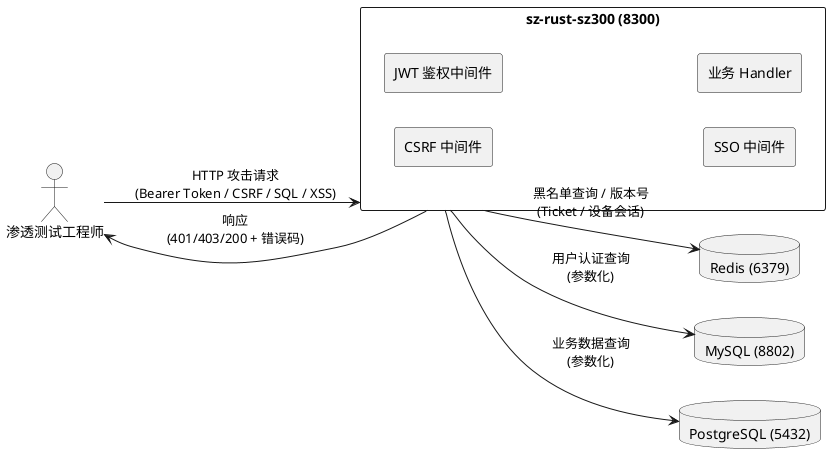
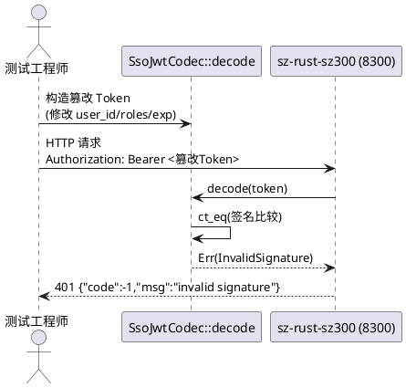
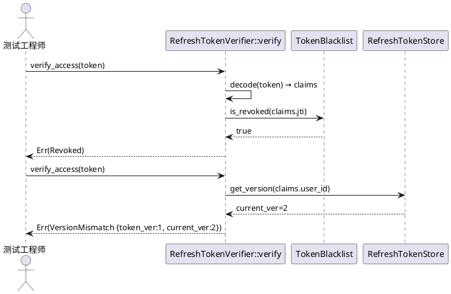
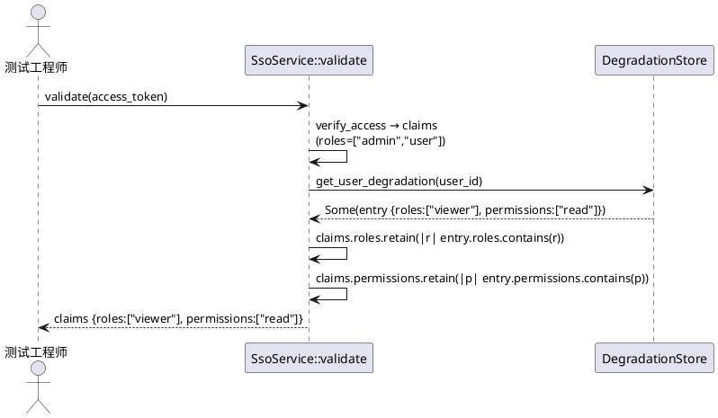
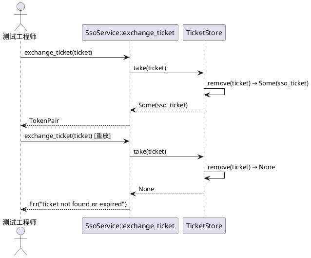
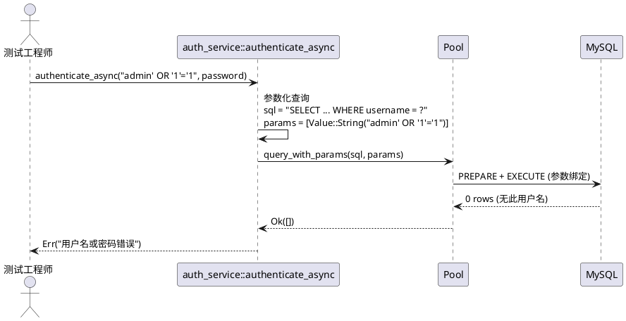
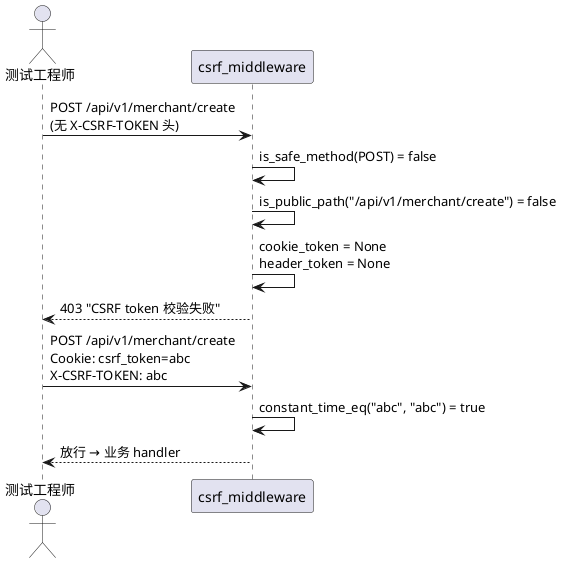

# sz-rust P0-3 白盒渗透测试需求规格

> 版本：1.0
> 日期：2026-08-09
> 来源：项目深度评估报告第七节 P0 第 3 项
> 测试类型：白盒渗透测试（源代码分析 + 实际请求验证）
> 被测目标：`packages/sz-rust-auth-facade` + `packages/sz-rust-middleware-facade` + `packages/sz-rust-sz300`
> 服务器：122.51.216.76，sz-rust-sz300 运行在端口 8300

---

# **1. 组件定位**

## **1.1 核心职责**

本组件负责对 sz-rust 认证体系与中间件层执行白盒渗透测试，验证 7 类攻击向量的防护有效性，输出可复现的 file:line 证据。

## **1.2 核心输入**

1. **被测源代码**：`packages/sz-rust-auth-facade/src/refresh.rs`（JWT 编解码 + 黑名单 + 降级 + Ticket + 审计）、`packages/sz-rust-auth-facade/src/sso.rs`（SSO 核心服务）、`packages/sz-rust-auth-facade/src/redis_store.rs`（Redis 存储后端）、`packages/sz-rust-middleware-facade/src/sso_middleware.rs`（SSO 中间件）、`packages/sz-rust-middleware-facade/src/csrf.rs`（CSRF 中间件）、`packages/sz-rust-sz300/src/middleware/auth_middleware.rs`（JWT 鉴权入口）、`packages/sz-rust-sz300/src/router.rs`（路由 + 中间件挂载）、`packages/sz-rust-sz300/src/services/auth_service.rs`（参数化查询）
2. **运行时服务**：sz-rust-sz300 HTTP 服务（122.51.216.76:8300）
3. **依赖中间件**：Redis（127.0.0.1:6379，通过 SSH 隧道本地 16379 访问）、MySQL（127.0.0.1:8802）、PostgreSQL（127.0.0.1:5432，数据库 lewuli）
4. **SSH 连接**：使用 Node.js ssh2 包连接服务器（密钥认证），禁止 sshpass / PowerShell 重定向

## **1.3 核心输出**

1. **测试报告**：每个测试用例的执行结果（通过/失败）+ file:line 证据 + 攻击 payload + 服务端响应
2. **漏洞清单**：发现的漏洞列表（含严重等级、复现步骤、修复建议）
3. **清理记录**：测试数据清理日志（Redis keys、DB rows、临时文件）

## **1.4 职责边界**

- **不做**：修改被测源代码（`packages/sz-rust-auth-facade`、`packages/sz-rust-middleware-facade`、`packages/sz-rust-sz300`），仅新增测试代码
- **不做**：修改上游 `../sz-orm/` 任何文件
- **不做**：性能压测、Soak 测试（属于 P0-2 / P4 范畴）
- **不做**：生成 design.md / tasks.md（由其他 Agent 负责）
- **不做**：修复发现的漏洞（仅报告，修复由后续任务处理）

---

# **2. 领域术语**

**白盒渗透测试**
: 测试人员拥有源代码访问权限，结合代码分析构造攻击 payload，并通过实际 HTTP 请求验证防护有效性的测试方法。

**EARS 格式**
: Easy Approach to Requirements Syntax，一种结构化需求写作格式，形式为 `WHEN <触发条件> THE SYSTEM SHALL <预期行为>`。

**JWT 签名篡改**
: 攻击者修改 JWT payload（如 user_id、roles、exp）后重新签名，试图伪造有效令牌的攻击手法。

**黑名单绕过**
: Token 被撤销（加入黑名单）后，攻击者仍尝试使用该 Token 访问受保护资源的攻击手法。

**降级提权**
: 攻击者持有低权限 Token，试图通过修改 Token claims 或绕过降级机制访问高权限资源的攻击手法。

**Ticket 重放**
: 攻击者截获跨域 SSO Ticket 后，多次重放该 Ticket 试图获取多个有效 TokenPair 的攻击手法。

**双提交 Cookie**
: CSRF 防护模式，服务端下发 csrf_token Cookie，前端发起写请求时在 X-CSRF-TOKEN 头携带相同值，服务端校验两者一致。

**file:line 证据**
: 测试报告中必须附带的证据，指向被测代码的具体文件路径与行号，证明防护逻辑确实存在于该位置。

---

# **3. 角色与边界**

## **3.1 核心角色**

- **渗透测试工程师**：执行白盒渗透测试，构造攻击 payload，验证防护有效性，输出测试报告
- **安全审计员**：复核测试报告，确认漏洞等级与修复优先级

## **3.2 外部系统**

- **sz-rust-sz300 HTTP 服务**：被测目标，运行在 122.51.216.76:8300
- **Redis**：Token 黑名单 + 版本号 + 设备会话存储，运行在 127.0.0.1:6379
- **MySQL**：用户认证数据，运行在 127.0.0.1:8802
- **PostgreSQL**：业务数据，运行在 127.0.0.1:5432，数据库 lewuli
- **SSH 服务器**：122.51.216.76，用于连接 Redis/MySQL/PostgreSQL 与部署测试脚本

## **3.3 交互上下文**

---

# **4. DFX约束**

## **4.1 性能**

1. 单个测试用例执行时间上限：30 秒（含 HTTP 请求 + Redis 查询 + 清理）
2. 完整测试套件执行时间上限：10 分钟（7 个场景 × 多个子用例）
3. 并发限制：同一时刻对 sz-rust-sz300 的并发请求数不超过 50（避免触发限流熔断干扰测试结果）

## **4.2 可靠性**

1. 测试用例必须可重复执行：同一用例连续执行 3 次结果一致
2. 测试失败时必须保留现场（攻击 payload + 服务端响应 + Redis 状态快照），便于复盘
3. 测试完成后必须清理所有测试数据（Redis keys、DB rows、临时文件），清理成功率 100%

## **4.3 安全性**

1. 测试脚本中的 JWT 密钥仅使用测试专用密钥（`pentest-secret-2026`），不泄露生产密钥
2. SSH 连接使用密钥认证，禁止密码登录、禁止 sshpass
3. 测试产生的 Token / Ticket 必须在测试结束后立即撤销 / 失效
4. 测试报告中的敏感字段（密钥、真实 Token）必须脱敏

## **4.4 可维护性**

1. 每个测试用例必须附 file:line 证据，指向被测代码的具体行号
2. 测试报告格式：JSON + Markdown 双输出，JSON 便于机器解析，Markdown 便于人工阅读
3. 测试日志级别：INFO（成功）/ WARN（发现漏洞）/ ERROR（测试基础设施故障）

## **4.5 兼容性**

1. 测试代码必须兼容 Windows 环境（Rust 2024 Edition，Cargo Workspace）
2. 所有 `async fn` 必须 `Send + 'static`
3. 禁止 `std::fs`，统一 `tokio::fs`
4. SSH 连接使用 Node.js ssh2 包（已安装在项目根 `package.json`）

---

# **5. 核心能力**

## **5.1 JWT 签名篡改测试**

### **5.1.1 业务规则**

1. **规则：篡改 payload 后重新签名必须被拒绝**
   a. 验收条件：WHEN 攻击者使用错误密钥对篡改后的 payload 重新签名 THE SYSTEM SHALL 返回 `InvalidSignature` 错误，HTTP 401
2. **规则：篡改 alg 头为 none 必须被拒绝**
   a. 验收条件：WHEN 攻击者将 JWT header 的 alg 改为 `none` 并移除签名 THE SYSTEM SHALL 返回 `InvalidSignature` 错误，HTTP 401
3. **规则：篡改 alg 头为 RS256 必须被拒绝**
   a. 验收条件：WHEN 攻击者将 JWT header 的 alg 改为 `RS256` THE SYSTEM SHALL 返回 `InvalidSignature` 错误，HTTP 401
4. **规则：常量时间签名比较**
   a. 验收条件：WHEN 验签逻辑执行时 THE SYSTEM SHALL 使用 `subtle::ConstantTimeEq`（ct_eq）进行签名比较，防时序攻击
5. **禁止项：禁止跳过签名校验直接解析 payload**
   a. 验收条件：WHEN 任意 JWT 输入 THE SYSTEM SHALL 先验签再解析 payload，验签失败立即返回

### **5.1.2 交互流程**

### **5.1.3 异常场景**

1. **签名不匹配**
   a. 触发条件：使用错误密钥签名
   b. 系统行为：`SsoJwtCodec::decode` 在 ct_eq 比较处返回 `InvalidSignature`
   c. 用户感知：HTTP 401，`{"code":-1,"msg":"invalid signature"}`
2. **alg 头篡改**
   a. 触发条件：header.alg != "HS256"
   b. 系统行为：`SsoJwtCodec::decode` 在 alg 校验处返回 `InvalidSignature`
   c. 用户感知：HTTP 401，`{"code":-1,"msg":"invalid signature"}`

### **5.1.4 测试目标与证据**

| 项目 | 内容 |
|------|------|
| 被测代码 | `packages/sz-rust-auth-facade/src/refresh.rs:232-275`（`SsoJwtCodec::decode`） |
| 签名比较 | `packages/sz-rust-auth-facade/src/refresh.rs:247`（`ct_eq` 常量时间比较） |
| alg 校验 | `packages/sz-rust-auth-facade/src/refresh.rs:258`（`if alg != "HS256"`） |
| 攻击向量 | ① 修改 payload.user_id 后用错误密钥签名 ② alg=none ③ alg=RS256 ④ 篡改 exp 延长过期 |
| 预期防护 | ct_eq 常量时间比较 + alg 白名单（仅 HS256） + 过期检查 |
| 验证方法 | 构造 4 类篡改 Token，发送 HTTP 请求到 `/api/v1/auth/me`，断言响应 401 + InvalidSignature |
| 严重等级 | **Critical**（签名绕过 = 完全认证失陷） |

---

## **5.2 黑名单绕过测试**

### **5.2.1 业务规则**

1. **规则：已撤销 Token 必须被拒绝**
   a. 验收条件：WHEN Token 的 jti 在黑名单中 THE SYSTEM SHALL 返回 `Revoked` 错误，HTTP 401
2. **规则：版本号不匹配必须被拒绝**
   a. 验收条件：WHEN Token 的 ver != 用户当前版本号 THE SYSTEM SHALL 返回 `VersionMismatch` 错误，HTTP 401
3. **规则：Refresh Token 复用必须触发全量撤销**
   a. 验收条件：WHEN 已轮换的 refreshToken 再次用于 refresh THE SYSTEM SHALL 返回 `ReuseDetected` + 递增该用户版本号（撤销所有 Token）
4. **规则：黑名单 TTL 必须与 Token 剩余 TTL 一致**
   a. 验收条件：WHEN Token 加入黑名单 THE SYSTEM SHALL 设置 TTL = Token 剩余有效期，避免黑名单无限膨胀
5. **禁止项：禁止 jti 为空的 Token 跳过黑名单检查**
   a. 验收条件：WHEN Token 的 jti 为空字符串 THE SYSTEM SHALL 跳过黑名单查询（兼容旧版无 jti Token），但后续签发的 Token 必须有 jti

### **5.2.2 交互流程**

### **5.2.3 异常场景**

1. **黑名单命中**
   a. 触发条件：Token 的 jti 已通过 `revoke` 加入黑名单
   b. 系统行为：`RefreshTokenVerifier::verify` 在 `blacklist.is_revoked` 处返回 `Revoked`
   c. 用户感知：HTTP 401，`{"code":-1,"msg":"token revoked"}`
2. **版本号不匹配**
   a. 触发条件：用户执行了 `revoke_all`（递增版本号），旧 Token 的 ver < 当前版本号
   b. 系统行为：`RefreshTokenVerifier::verify` 在版本校验处返回 `VersionMismatch`
   c. 用户感知：HTTP 401，`{"code":-1,"msg":"token version mismatch..."}`
3. **Refresh Token 复用**
   a. 触发条件：已轮换的 refreshToken（jti 已入黑名单）再次调用 `/sso/refresh`
   b. 系统行为：`RefreshTokenIssuer::rotate` 检测到复用 → `increment_version` → 返回 `ReuseDetected`
   c. 用户感知：HTTP 401，`{"code":-1,"msg":"refresh token reuse detected..."}`

### **5.2.4 测试目标与证据**

| 项目 | 内容 |
|------|------|
| 被测代码 | `packages/sz-rust-auth-facade/src/refresh.rs:837-875`（`RefreshTokenVerifier::verify`） |
| 黑名单检查 | `packages/sz-rust-auth-facade/src/refresh.rs:851`（`blacklist.is_revoked`） |
| 版本校验 | `packages/sz-rust-auth-facade/src/refresh.rs:864-872`（`store.get_version` + 版本比较） |
| 复用检测 | `packages/sz-rust-auth-facade/src/refresh.rs:1465-1475`（`rotate` 中的复用检测 + 全量撤销） |
| Memory 黑名单 | `packages/sz-rust-auth-facade/src/refresh.rs:789-796`（`MemoryTokenBlacklist::is_revoked`） |
| Redis 黑名单 | `packages/sz-rust-auth-facade/src/redis_store.rs`（`RedisTokenBlacklist`，EXISTS/SETEX） |
| 攻击向量 | ① 撤销 Token 后重放 ② revoke_all 后旧 Token 重放 ③ refreshToken 二次轮换 ④ 跨设备撤销后重放 |
| 预期防护 | jti 黑名单 + 版本号 + 复用检测全量撤销 |
| 验证方法 | 登录获取 TokenPair → 撤销 → 重放 → 断言 401 + Revoked/VersionMismatch/ReuseDetected |
| 严重等级 | **Critical**（黑名单绕过 = 撤销失效，被盗 Token 永久有效） |

---

## **5.3 降级提权测试**

### **5.3.1 业务规则**

1. **规则：降级后角色必须是原角色的子集**
   a. 验收条件：WHEN 用户被降级为 `["viewer"]` THE SYSTEM SHALL 在 validate 时将 claims.roles retain 为降级角色的子集
2. **规则：降级后权限必须是原权限的子集**
   a. 验收条件：WHEN 用户被降级为 `["read"]` THE SYSTEM SHALL 在 validate 时将 claims.permissions retain 为降级权限的子集
3. **规则：设备级降级优先于用户级降级**
   a. 验收条件：WHEN 同时存在用户级和设备级降级 THE SYSTEM SHALL 优先应用设备级降级
4. **规则：降级过期后自动恢复**
   a. 验收条件：WHEN 降级条目的 expires_at < 当前时间 THE SYSTEM SHALL 返回 None（降级失效），claims 保持原始角色/权限
5. **禁止项：禁止降级后权限超出原始权限**
   a. 验收条件：WHEN 降级角色包含原始角色不存在的项 THE SYSTEM SHALL 通过 retain 过滤，仅保留交集

### **5.3.2 交互流程**

### **5.3.3 异常场景**

1. **降级后访问高权限接口**
   a. 触发条件：用户被降级为 viewer，尝试访问 admin 接口
   b. 系统行为：`apply_degradation` 将 claims.roles retain 为 `["viewer"]`，后续 RBAC 校验失败
   c. 用户感知：HTTP 403，权限不足
2. **降级过期后恢复权限**
   a. 触发条件：降级条目 expires_at < now
   b. 系统行为：`get_user_degradation` 返回 None，claims 保持原始角色
   c. 用户感知：HTTP 200，正常访问

### **5.3.4 测试目标与证据**

| 项目 | 内容 |
|------|------|
| 被测代码 | `packages/sz-rust-auth-facade/src/sso.rs:593-630`（`apply_degradation`） |
| 子集过滤 | `packages/sz-rust-auth-facade/src/sso.rs:627-628`（`claims.roles.retain` + `claims.permissions.retain`） |
| 降级查询 | `packages/sz-rust-auth-facade/src/sso.rs:601-624`（设备级优先 → 用户级回退） |
| 降级存储 trait | `packages/sz-rust-auth-facade/src/refresh.rs:896-937`（`DegradationStore`） |
| 过期检查 | `packages/sz-rust-auth-facade/src/refresh.rs:977-983`（`expires_at > now` 判定） |
| 攻击向量 | ① 降级后访问高权限接口 ② 篡改 Token claims.roles ③ 降级过期后验证恢复 ④ 设备级降级优先级 |
| 预期防护 | retain 子集过滤 + 过期检查 + 设备级优先 |
| 验证方法 | 登录 → degrade_user → validate → 断言 claims.roles 为子集 → 访问高权限接口断言 403 |
| 严重等级 | **High**（提权 = 权限边界突破，但需先持有有效 Token） |

---

## **5.4 Ticket 重放测试**

### **5.4.1 业务规则**

1. **规则：Ticket 必须一次性消费**
   a. 验收条件：WHEN 同一 Ticket 第二次调用 `exchange_ticket` THE SYSTEM SHALL 返回 `InvalidConfig("ticket not found or expired")`
2. **规则：Ticket TTL 必须为 30 秒**
   a. 验收条件：WHEN Ticket 创建 30 秒后调用 exchange THE SYSTEM SHALL 返回 `InvalidConfig("ticket not found or expired")`
3. **规则：Ticket 必须使用 UUID v4**
   a. 验收条件：WHEN 生成 Ticket THE SYSTEM SHALL 使用 `uuid::Uuid::new_v4()`，不可预测
4. **规则：take 操作必须原子删除**
   a. 验收条件：WHEN `TicketStore::take` 被调用 THE SYSTEM SHALL 原子地取出并删除 Ticket，避免并发重放
5. **禁止项：禁止 peek 后再 take 绕过一次性消费**
   a. 验收条件：WHEN `validate_ticket`（peek）后再 `exchange_ticket`（take）THE SYSTEM SHALL take 仍然成功，但第二次 take 必须失败

### **5.4.2 交互流程**

### **5.4.3 异常场景**

1. **Ticket 重放**
   a. 触发条件：同一 Ticket 第二次 exchange
   b. 系统行为：`MemoryTicketStore::take` 在 `remove` 后返回 None
   c. 用户感知：HTTP 400，`{"code":-1,"msg":"ticket not found or expired"}`
2. **Ticket 过期**
   a. 触发条件：Ticket 创建后 30 秒再 exchange
   b. 系统行为：`take` 检查 `expires_at <= now` 返回 None
   c. 用户感知：HTTP 400，`{"code":-1,"msg":"ticket not found or expired"}`
3. **并发重放**
   a. 触发条件：两个并发请求同时 exchange 同一 Ticket
   b. 系统行为：`parking_lot::RwLock` 写锁保证原子性，仅一个成功
   c. 用户感知：一个 200 + TokenPair，另一个 400

### **5.4.4 测试目标与证据**

| 项目 | 内容 |
|------|------|
| 被测代码 | `packages/sz-rust-auth-facade/src/sso.rs:442-467`（`exchange_ticket`） |
| 一次性消费 | `packages/sz-rust-auth-facade/src/refresh.rs:1104-1113`（`MemoryTicketStore::take`，remove + 过期检查） |
| Ticket 生成 | `packages/sz-rust-auth-facade/src/sso.rs:418`（`uuid::Uuid::new_v4()`） |
| TTL 设置 | `packages/sz-rust-auth-facade/src/sso.rs:427`（`expires_at: now + 30`） |
| peek 不删除 | `packages/sz-rust-auth-facade/src/refresh.rs:1115-1122`（`MemoryTicketStore::peek`，仅读） |
| 攻击向量 | ① Ticket 二次 exchange ② Ticket 30 秒后 exchange ③ 并发 exchange ④ peek 后 exchange |
| 预期防护 | take 原子删除 + 30 秒 TTL + UUID v4 不可预测 |
| 验证方法 | generate_ticket → exchange_ticket（成功）→ exchange_ticket（失败）→ 断言第二次返回 ticket not found |
| 严重等级 | **High**（Ticket 重放 = 跨域 SSO 被劫持后可多次获取 Token） |

---

## **5.5 SQL 注入测试**

### **5.5.1 业务规则**

1. **规则：所有用户输入必须通过参数化绑定**
   a. 验收条件：WHEN 用户名包含 `' OR '1'='1` THE SYSTEM SHALL 通过 `?` 占位符绑定，不拼接进 SQL 文本
2. **规则：SQL 校验器必须拦截注入模式**
   a. 验收条件：WHEN SQL 包含 `'; DROP TABLE` / `OR 1=1` / `UNION SELECT` / `--` / `/*` THE SYSTEM SHALL 返回 `InjectionDetected` 错误
3. **规则：表名/列名必须通过 identifier 校验**
   a. 验收条件：WHEN 表名包含非 `[a-zA-Z0-9_]` 字符 THE SYSTEM SHALL 返回 `InvalidTableName` 错误
4. **规则：参数化 WHERE 条件必须使用 `?` 占位符**
   a. 验收条件：WHEN 调用 `where_eq` / `where_ne` / `where_gt` 等 API THE SYSTEM SHALL 生成 `field = ?` 且值通过 params 绑定
5. **禁止项：禁止使用 format! 拼接用户输入到 SQL**
   a. 验收条件：WHEN 代码审查发现 `format!("... WHERE username = '{}'", user_input)` THE SYSTEM SHALL 视为违规

### **5.5.2 交互流程**

### **5.5.3 异常场景**

1. **经典 OR 注入**
   a. 触发条件：用户名 = `' OR '1'='1`
   b. 系统行为：参数化绑定，`' OR '1'='1` 作为字符串字面量匹配 username
   c. 用户感知：HTTP 401，用户名或密码错误
2. **DROP TABLE 注入**
   a. 触发条件：用户名 = `'; DROP TABLE merchant_user; --`
   b. 系统行为：参数化绑定，整串作为 username 匹配，无表被删除
   c. 用户感知：HTTP 401，用户名或密码错误
3. **UNION SELECT 注入**
   a. 触发条件：用户名 = `' UNION SELECT 1,2 --`
   b. 系统行为：参数化绑定，SQL 校验器拦截 UNION SELECT 模式（若走校验器路径）
   c. 用户感知：HTTP 401，用户名或密码错误

### **5.5.4 测试目标与证据**

| 项目 | 内容 |
|------|------|
| 被测代码 | `packages/sz-rust-sz300/src/services/auth_service.rs:94-96`（参数化查询 + `?` 占位符） |
| SQL 校验器 | `sz-orm/packages/sz-orm-sql-validator/src/lib.rs:241-274`（`validate_no_injection_patterns`） |
| 注入模式列表 | `sz-orm/packages/sz-orm-sql-validator/src/lib.rs:246-262`（12 种可疑模式） |
| 表名校验 | `sz-orm/packages/sz-orm-sql-validator/src/lib.rs:314-338`（`validate_table_name`） |
| 列名校验 | `sz-orm/packages/sz-orm-sql-validator/src/lib.rs:341-360`（`validate_column_name`） |
| 参数化 WHERE | `sz-orm/packages/sz-orm-core/src/query.rs:581-696`（`where_eq`/`where_ne`/`where_gt` 等） |
| 攻击向量 | ① `' OR '1'='1` ② `'; DROP TABLE merchant_user; --` ③ `' UNION SELECT 1,2 --` ④ `admin'--` ⑤ `1; EXEC xp_cmdshell('dir')` |
| 预期防护 | `?` 占位符参数化 + SQL 校验器 12 种模式拦截 + identifier 校验 |
| 验证方法 | 构造 5 类注入 payload 调用 `/api/v1/auth/login`，断言 401 + 无表被删除/无数据泄露 |
| 严重等级 | **Critical**（SQL 注入 = 数据库完全失陷） |

---

## **5.6 XSS 测试**

### **5.6.1 业务规则**

1. **规则：HTML 输出必须经过 html_escape 转义**
   a. 验收条件：WHEN 用户输入包含 `` 且输出到 HTML THE SYSTEM SHALL 转义为 `&lt;script&gt;alert(&#39;xss&#39;)&lt;/script&gt;`
2. **规则：JSONP 回调名必须校验格式**
   a. 验收条件：WHEN JSONP 回调名包含非 `[a-zA-Z_][a-zA-Z0-9_.]*` 字符 THE SYSTEM SHALL 拒绝请求
3. **规则：Debug 页面所有用户输入必须转义**
   a. 验收条件：WHEN 错误页展示用户输入的 URI / Header / Message THE SYSTEM SHALL 经过 `html_escape` 转义
4. **规则：JSON API 响应必须由 serde 序列化**
   a. 验收条件：WHEN API 返回 JSON THE SYSTEM SHALL 通过 `serde_json` 序列化，自动转义特殊字符
5. **禁止项：禁止将用户输入直接拼接进 HTML**
   a. 验收条件：WHEN 代码审查发现 `format!("
{}
", user_input)` THE SYSTEM SHALL 视为违规

### **5.6.2 交互流程**

```plantuml
@startuml
actor "测试工程师" as tester
participant "Debug Page" as debug
participant "html_escape" as escape

tester -> debug : 请求 /debug?msg=<script>alert('xss')</script>
debug -> escape : html_escape(msg)
escape -> escape : & → &amp;\n< → &lt;\n> → &gt;\n" → &quot;\n' → &#39;
escape --> debug : "&lt;script&gt;alert(&#39;xss&#39;)&lt;/script&gt;"
debug --> tester : HTML 页面（已转义，不执行脚本）
@enduml
```

### **5.6.3 异常场景**

1. **Debug 页面 XSS**
   a. 触发条件：错误消息包含 ``
   b. 系统行为：`html_escape` 转义 `<` `>` `'` 等
   c. 用户感知：HTML 页面展示转义后的文本，不执行脚本
2. **JSONP 回调名注入**
   a. 触发条件：回调名 = `alert(document.cookie)//`
   b. 系统行为：回调名校验仅允许 `[a-zA-Z_][a-zA-Z0-9_.]*`，拒绝
   c. 用户感知：HTTP 400，回调名非法

### **5.6.4 测试目标与证据**

| 项目 | 内容 |
|------|------|
| HTML 转义 | `packages/sz-rust-infra-facade/src/debug_page.rs:515-528`（`html_escape`，5 个字符转义） |
| Debug 页面转义调用 | `packages/sz-rust-infra-facade/src/debug_page.rs:255-258`（title/file/method/uri 转义） |
| Debug Header 转义 | `packages/sz-rust-infra-facade/src/debug_page.rs:337-345`（header key/value 转义） |
| JSONP 回调名校验 | `packages/sz-rust-http-facade/src/response.rs:507,516`（`[a-zA-Z_][a-zA-Z0-9_.]*` 格式校验） |
| JSONP XSS 测试 | `packages/sz-rust-http-facade/src/response.rs:2042-2043`（`test_respond_jsonp_xss_injection_blocked`） |
| 攻击向量 | ① `` ② `` ③ `">` ④ JSONP 回调名注入 |
| 预期防护 | html_escape 5 字符转义 + JSONP 回调名格式校验 + serde_json 自动转义 |
| 验证方法 | 构造 4 类 XSS payload 触发 Debug 页面 / JSONP 端点，断言响应中不含可执行 `<script>` |
| 严重等级 | **Medium**（XSS = 客户端脚本执行，影响用户会话但不直接突破服务端） |

---

## **5.7 CSRF 测试**

### **5.7.1 业务规则**

1. **规则：写请求必须校验 CSRF Token**
   a. 验收条件：WHEN POST/PUT/DELETE 请求未携带 `X-CSRF-TOKEN` 头 THE SYSTEM SHALL 返回 HTTP 403
2. **规则：CSRF Token 必须双提交一致**
   a. 验收条件：WHEN Cookie 中的 `csrf_token` 与 Header 中的 `X-CSRF-TOKEN` 不一致 THE SYSTEM SHALL 返回 HTTP 403
3. **规则：安全方法跳过校验**
   a. 验收条件：WHEN GET/HEAD/OPTIONS 请求 THE SYSTEM SHALL 跳过 CSRF 校验直接放行
4. **规则：公开路径跳过校验**
   a. 验收条件：WHEN 请求路径在 `DEFAULT_PUBLIC_PATHS` 中（精确匹配）THE SYSTEM SHALL 跳过 CSRF 校验
5. **规则：CSRF Token 比较必须常量时间**
   a. 验收条件：WHEN 比较 Cookie token 与 Header token THE SYSTEM SHALL 使用 `constant_time_eq`，防时序攻击
6. **规则：公开路径必须精确匹配**
   a. 验收条件：WHEN 请求路径为 `/health_evil`（前缀匹配 `/health`）THE SYSTEM SHALL 不跳过校验（精确匹配避免绕过）
7. **禁止项：禁止使用前缀匹配公开路径**
   a. 验收条件：WHEN 代码审查发现 `path.starts_with("/health")` THE SYSTEM SHALL 视为违规（已修复为精确匹配）

### **5.7.2 交互流程**

### **5.7.3 异常场景**

1. **缺失 CSRF Token**
   a. 触发条件：POST 请求未携带 X-CSRF-TOKEN 头
   b. 系统行为：`csrf_middleware` 检测到 header_token = None，返回 403
   c. 用户感知：HTTP 403，`CSRF token 校验失败`
2. **Token 不匹配**
   a. 触发条件：Cookie csrf_token = "abc"，Header X-CSRF-TOKEN = "xyz"
   b. 系统行为：`constant_time_eq` 返回 false，返回 403
   c. 用户感知：HTTP 403，`CSRF token 校验失败`
3. **前缀绕过尝试**
   a. 触发条件：请求路径 = `/health_evil`（试图前缀匹配 `/health` 绕过）
   b. 系统行为：`is_public_path` 精确匹配，`/health_evil` 不在白名单，执行 CSRF 校验
   c. 用户感知：HTTP 403（若未携带 CSRF Token）

### **5.7.4 测试目标与证据**

| 项目 | 内容 |
|------|------|
| 被测代码 | `packages/sz-rust-middleware-facade/src/csrf.rs:99-138`（`csrf_middleware`） |
| 安全方法跳过 | `packages/sz-rust-middleware-facade/src/csrf.rs:104-106`（`is_safe_method`） |
| 公开路径跳过 | `packages/sz-rust-middleware-facade/src/csrf.rs:109-111`（`is_public_path` 精确匹配） |
| 常量时间比较 | `packages/sz-rust-middleware-facade/src/csrf.rs:125`（`constant_time_eq`） |
| 精确匹配防绕过 | `packages/sz-rust-middleware-facade/src/csrf.rs:67-69`（`is_public_path` 注释说明前缀匹配已修复） |
| CSRF 挂载 | `packages/sz-rust-sz300/src/router.rs:95`（`.layer(middleware::from_fn(csrf_middleware))`） |
| Token 生成 | `packages/sz-rust-middleware-facade/src/csrf.rs:75-80`（`generate_token`，OsRng 32 字节） |
| 攻击向量 | ① 无 CSRF Token 的 POST ② Cookie/Header 不一致 ③ 前缀绕过 `/health_evil` ④ 跨站伪造请求 |
| 预期防护 | 双提交 Cookie + 常量时间比较 + 精确匹配公开路径 + OsRng 生成 |
| 验证方法 | 构造 4 类 CSRF 攻击请求发送到 `/api/v1/merchant/create`，断言 403 / 放行 |
| 严重等级 | **High**（CSRF = 跨站伪造用户操作，修改数据/执行敏感操作） |

---

# **6. 数据约束**

## **6.1 测试用例对象**

1. **case_id**：测试用例唯一标识，格式 `PT-<场景编号>-<子用例编号>`（如 `PT-01-01`）
2. **scenario**：渗透测试场景名称（JWT 签名篡改 / 黑名单绕过 / 降级提权 / Ticket 重放 / SQL 注入 / XSS / CSRF）
3. **target_file**：被测代码文件路径（相对于项目根目录）
4. **target_line**：被测代码行号或行号范围
5. **attack_vector**：攻击向量描述（具体的攻击手法）
6. **attack_payload**：攻击 payload（HTTP 请求 / Token 内容 / SQL 字符串等）
7. **expected_behavior**：预期防护行为（错误码 / HTTP 状态码）
8. **actual_behavior**：实际服务端响应
9. **result**：测试结果（pass / fail / skip）
10. **severity**：严重等级（Critical / High / Medium / Low）
11. **evidence**：file:line 证据（指向被测代码的具体位置）

## **6.2 测试报告对象**

1. **report_id**：报告唯一标识（UUID v4）
2. **generated_at**：报告生成时间（Unix 时间戳）
3. **total_cases**：测试用例总数
4. **passed_cases**：通过用例数
5. **failed_cases**：失败用例数（发现漏洞）
6. **vulnerabilities**：漏洞清单（case_id + severity + description + remediation）
7. **cleanup_log**：清理日志（已删除的 Redis keys / DB rows / 临时文件）

## **6.3 严重等级定义**

1. **Critical**：攻击者可完全突破认证 / 数据库失陷 / 远程代码执行
2. **High**：攻击者可突破权限边界 / 撤销失效 / 跨站伪造操作
3. **Medium**：攻击者可执行客户端脚本 / 信息泄露
4. **Low**：攻击向量存在但影响有限 / 需特定条件触发

---

# **7. 验收标准**

## **7.1 测试覆盖率**

1. 7 个渗透测试场景全部覆盖，每个场景至少 3 个子用例
2. 每个子用例必须附 file:line 证据
3. 每个子用例必须可独立重复执行

## **7.2 测试结果**

1. 所有预期拒绝的攻击请求必须返回 401/403/400（不得返回 200）
2. 所有预期放行的正常请求必须返回 200（不得误杀）
3. 测试完成后 Redis 无残留测试 keys（`sso:bl:pentest-*` / `sso:ver:pentest-*` 等前缀）
4. 测试完成后 MySQL/PostgreSQL 无残留测试 rows
5. 测试完成后服务器无残留测试脚本文件

## **7.3 报告交付**

1. JSON 格式测试报告（机器可解析）
2. Markdown 格式测试报告（人工可阅读）
3. 漏洞清单（含严重等级、file:line 证据、复现步骤、修复建议）
4. 清理日志（证明测试数据已清理）