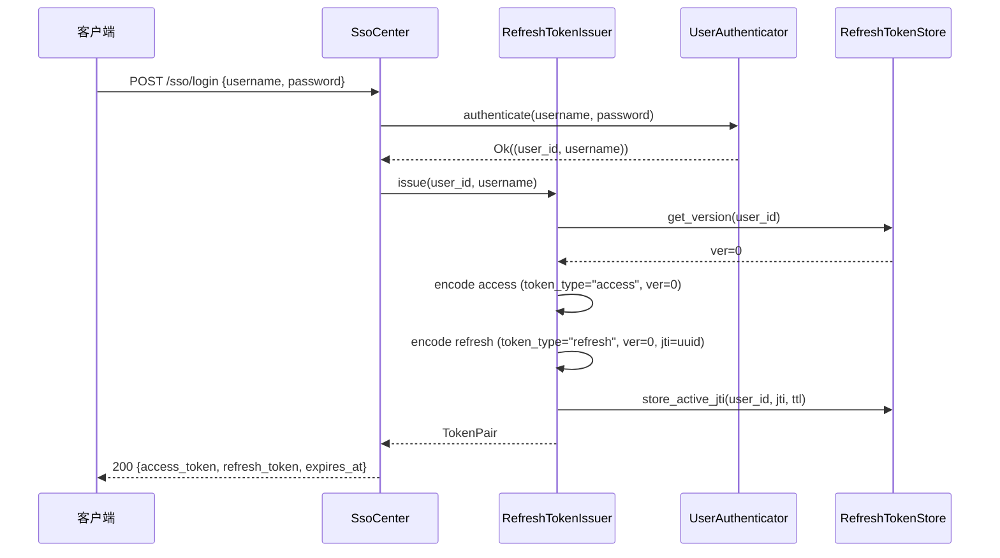
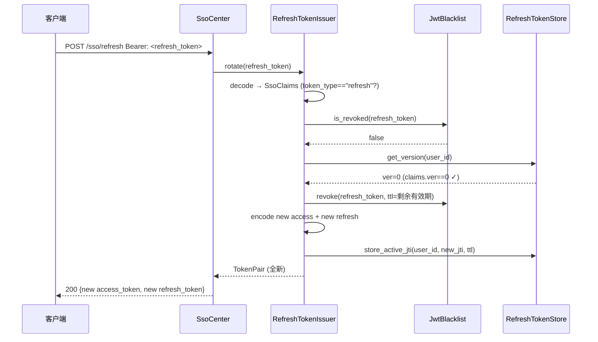
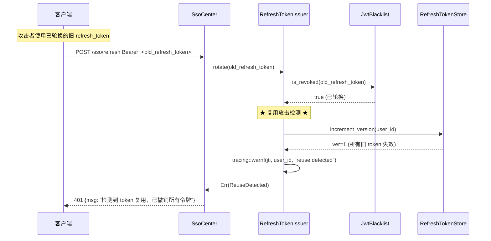

# design.md — SSO 单点登录 + Refresh Token 双 Token 机制

> **项目**：sz-rust（对标 ThinkPHP 8 的 Rust Web 框架，axum 0.8 + SZ-ORM）
> **版本**：v0.6.1 → v0.6.2（semver 兼容，仅新增 API）
> **设计版本**：design-v1.0
> **创建日期**：2026-08-07
> **基于规格**：[spec.md](./spec.md)（spec-v1.0）
> **目标 crate**：`sz-rust-auth-facade`（新增 `refresh.rs` + `sso.rs`）、`sz-rust-middleware-facade`（新增 `sso_middleware.rs`）
> **不修改**：上游 `sz-orm` 仓库、`sz-orm-auth` crate、现有 `auth_middleware`

---

## 0. 设计决策摘要（关键发现 → 决策）

### 0.1 关键发现：JwtClaims 不支持自定义 claim

读取 `sz-orm-auth-2.1.0/src/jwt.rs:34-51` 发现 `JwtClaims` 是**固定字段结构体**：

```rust
pub struct JwtClaims {
    pub sub: String,
    pub exp: i64,
    pub iat: i64,
    pub iss: Option<String>,
    pub roles: Vec<String>,
    pub permissions: Vec<String>,
    pub user_id: Option<i64>,
}
```

- 无 `token_type` 字段 → 无法区分 access/refresh token（FR-1.3 要求）
- 无 `jti` 字段 → 无法精确定位黑名单条目（FR-3.4 要求）
- 无 `extra`/`custom` Map → 无法注入任意自定义 claim
- `JwtEncoder::encode(&self, claims: &JwtClaims)` 只接受 `JwtClaims`，无法传入自定义结构体

### 0.2 决策：引入 SsoJwtCodec

| 决策 | 选择 | 理由 |
|------|------|------|
| JWT 编解码 | 新建 `SsoJwtCodec` + `SsoClaims` | JwtClaims 不支持 token_type/jti；不修改上游（C-6） |
| 签名算法 | 复用 HS256（hmac + sha2 + base64 + subtle） | 满足 FR-1.2「不引入新签名算法」精神；复用 RustCrypto audited crate |
| Secret 管理 | 复用同一 secret（从配置注入） | 与现有 JwtEncoder 共享密钥，本地验签零配置 |
| 用户级撤销 | `RefreshTokenStore` 维护 `user_id → token_version` | O(1) 撤销所有；无需扫描黑名单 |
| 单 token 撤销 | 复用现有 `JwtBlacklist` | 满足 FR-4.2「不新建独立黑名单存储」 |
| SsoCenter axum 集成 | feature gate `axum` | auth-facade 默认轻量，需要 HTTP 端点时启用 |
| 远程校验 | feature gate `remote-validate` | 默认零网络依赖（C-9） |

### 0.3 SsoClaims 字段设计

`SsoClaims` 是 `JwtClaims` 的**超集**，新增 `token_type`、`jti`、`ver` 三个字段：

```rust
pub struct SsoClaims {
    pub sub: String,           // 标准 JWT sub（user_id 字符串）
    pub exp: i64,              // 过期时间
    pub iat: i64,              // 签发时间
    pub iss: Option<String>,   // 签发人
    pub user_id: Option<i64>,  // 用户 ID
    pub token_type: String,    // "access" | "refresh"（新增）
    pub jti: String,           // JWT ID，UUID v4（新增）
    pub ver: u64,              // token 版本号，用于用户级撤销（新增）
    pub roles: Vec<String>,
    pub permissions: Vec<String>,
}
```

`ver` 字段用于「撤销用户所有 token」：签发时嵌入当前版本号，校验时与 `RefreshTokenStore` 中的当前版本号比较。撤销所有 = `increment_version(user_id)`，使该用户所有旧 token 立即失效（O(1)）。

---

## 1. 架构设计

### 1.1 模块划分

```
sz-rust-auth-facade/
├── src/
│   ├── lib.rs                    # 新增 pub mod refresh; pub mod sso;
│   ├── refresh.rs                # 【新增】双 Token 核心逻辑
│   │   ├── SsoJwtCodec           # JWT HS256 编解码（支持自定义 claim）
│   │   ├── SsoClaims             # claims 结构体
│   │   ├── TokenPair             # 双 Token 返回值
│   │   ├── RefreshTokenConfig    # 配置
│   │   ├── RefreshTokenIssuer    # 签发 + 轮换
│   │   ├── RefreshTokenVerifier  # 校验
│   │   ├── RefreshTokenRevoker   # 撤销
│   │   ├── RefreshTokenStore     # 存储抽象 trait
│   │   ├── MemoryRefreshTokenStore
│   │   ├── CacheRefreshTokenStore
│   │   └── RefreshTokenError     # 错误枚举
│   ├── sso.rs                    # 【新增】SSO 认证中心
│   │   ├── SsoCenter             # axum Router（feature = "axum"）
│   │   ├── SsoService            # 核心逻辑（不依赖 axum）
│   │   ├── UserAuthenticator     # trait（用户认证抽象）
│   │   ├── UserInfoProvider      # trait（用户信息抽象）
│   │   ├── UserInfo              # 用户信息结构体
│   │   └── SsoLoginRequest       # 请求体
│   ├── gateway.rs                # 不修改
│   ├── oauth.rs                  # 不修改
│   ├── wechat.rs                 # 不修改
│   └── redis_gateway.rs          # 不修改
└── Cargo.toml                    # 新增 hmac/sha2/base64/subtle/uuid/axum(reqwest) 依赖

sz-rust-middleware-facade/
├── src/
│   ├── lib.rs                    # 新增 pub mod sso_middleware;
│   ├── sso_middleware.rs         # 【新增】SSO 业务系统中间件
│   │   ├── SsoMiddlewareConfig   # Local | Remote 配置枚举
│   │   ├── sso_middleware        # axum middleware 函数
│   │   └── RemoteValidateConfig  # 远程校验配置
│   ├── auth.rs                   # 不修改（复用 AuthenticatedUser）
│   └── jwt_blacklist.rs          # 不修改（复用 JwtBlacklist）
└── Cargo.toml                    # 新增 sz-rust-auth-facade 依赖
```

### 1.2 依赖关系图

```
                    ┌──────────────────────────────────────────┐
                    │           sz-rust-auth-facade             │
                    │  ┌─────────────┐    ┌─────────────┐      │
                    │  │ refresh.rs  │    │   sso.rs    │      │
                    │  │             │    │             │      │
                    │  │ SsoJwtCodec │    │ SsoCenter   │      │
                    │  │ Issuer      │◄───│ SsoService  │      │
                    │  │ Verifier    │    │             │      │
                    │  │ Revoker     │    └──────┬──────┘      │
                    │  │ Store trait │           │             │
                    │  └──────┬──────┘           │             │
                    └─────────┼──────────────────┼─────────────┘
                              │                  │
                    ┌─────────▼──────────┐      │
                    │  JwtBlacklist       │      │
                    │  (middleware-facade)│      │
                    └─────────────────────┘      │
                              ▲                  │
                              │                  │
                    ┌─────────┴──────────────────┴─────────────┐
                    │        sz-rust-middleware-facade           │
                    │  ┌─────────────────────────────────┐      │
                    │  │      sso_middleware.rs           │      │
                    │  │  SsoMiddlewareConfig::Local      │      │
                    │  │  SsoMiddlewareConfig::Remote     │      │
                    │  └─────────────────────────────────┘      │
                    └────────────────────────────────────────────┘
                              ▲
                              │
                    ┌─────────┴─────────┐
                    │  sz-rust-sz300     │
                    │  controllers/auth  │
                    │  services/auth     │
                    └────────────────────┘
```

### 1.3 数据流

#### 1.3.1 登录签发双 Token

```
客户端                    SsoCenter              SsoService           RefreshTokenIssuer         UserAuthenticator
  │                          │                       │                       │                        │
  │ POST /sso/login          │                       │                       │                        │
  │ {username, password}     │                       │                       │                        │
  │─────────────────────────►│                       │                       │                        │
  │                          │ login()               │                       │                        │
  │                          │──────────────────────►│                       │                        │
  │                          │                       │ authenticate()       │                        │
  │                          │                       │──────────────────────────────────────────────►│
  │                          │                       │◄──────────────────────────────────────────────│
  │                          │                       │ (user_id, username)   │                        │
  │                          │                       │ issue(user_id)        │                        │
  │                          │                       │──────────────────────►│                        │
  │                          │                       │                       │ get_version(user_id)   │
  │                          │                       │                       │ SsoJwtCodec::encode(access)
  │                          │                       │                       │ SsoJwtCodec::encode(refresh)
  │                          │                       │                       │ store_active_jti(user_id, jti)
  │                          │                       │◄──────────────────────│                        │
  │                          │                       │ TokenPair             │                        │
  │                          │◄──────────────────────│                       │                        │
  │ 200 OK                   │                       │                       │                        │
  │ {access_token,           │                       │                       │                        │
  │  refresh_token, ...}     │                       │                       │                        │
  │◄─────────────────────────│                       │                       │                        │
```

#### 1.3.2 Token 轮换

```
客户端               SsoCenter          RefreshTokenIssuer         JwtBlacklist       RefreshTokenStore
  │                     │                      │                        │                    │
  │ POST /sso/refresh   │                      │                        │                    │
  │ Bearer: <refresh>   │                      │                        │                    │
  │────────────────────►│                      │                        │                    │
  │                     │ rotate(refresh_token)│                        │                    │
  │                     │─────────────────────►│                        │                    │
  │                     │                      │ verify(refresh_token)  │                    │
  │                     │                      │  → SsoClaims           │                    │
  │                     │                      │ is_revoked(token)?     │                    │
  │                     │                      │───────────────────────►│                    │
  │                     │                      │◄───────────────────────│ false              │
  │                     │                      │ get_version(user_id)   │                    │
  │                     │                      │────────────────────────────────────────────►│
  │                     │                      │◄────────────────────────────────────────────│ ver
  │                     │                      │ claims.ver == ver? ✓   │                    │
  │                     │                      │                        │                    │
  │                     │                      │ revoke(old_token)      │                    │
  │                     │                      │───────────────────────►│                    │
  │                     │                      │ issue new TokenPair    │                    │
  │                     │                      │────────────────────────────────────────────►│
  │                     │◄─────────────────────│ TokenPair              │                    │
  │ 200 OK              │                      │                        │                    │
  │◄────────────────────│                      │                        │                    │
```

#### 1.3.3 复用攻击检测

```
客户端               SsoCenter          RefreshTokenVerifier       JwtBlacklist       RefreshTokenStore
  │                     │                      │                        │                    │
  │ POST /sso/refresh   │                      │                        │                    │
  │ Bearer: <old_refresh>│                     │                        │                    │
  │────────────────────►│                      │                        │                    │
  │                     │ rotate(old_token)    │                        │                    │
  │                     │─────────────────────►│                        │                    │
  │                     │                      │ verify(old_token)      │                    │
  │                     │                      │ is_revoked(token)?     │                    │
  │                     │                      │───────────────────────►│                    │
  │                     │                      │◄───────────────────────│ true (已轮换)      │
  │                     │                      │                        │                    │
  │                     │                      │ ★ 检测到复用攻击 ★     │                    │
  │                     │                      │ increment_version(user_id)                  │
  │                     │                      │────────────────────────────────────────────►│
  │                     │                      │ tracing::warn!(jti, user_id)                │
  │                     │◄─────────────────────│ Err(ReuseDetected)     │                    │
  │ 401                 │                      │                        │                    │
  │◄────────────────────│                      │                        │                    │
```

#### 1.3.4 SSO 中间件本地验签

```
客户端            sso_middleware         SsoJwtCodec         JwtBlacklist       Handler
  │                   │                      │                   │                 │
  │ GET /api/data     │                      │                   │                 │
  │ Bearer: <access>  │                      │                   │                 │
  │──────────────────►│                      │                   │                 │
  │                   │ 白名单? 否           │                   │                 │
  │                   │ extract token        │                   │                 │
  │                   │ decode(token)        │                   │                 │
  │                   │─────────────────────►│                   │                 │
  │                   │◄─────────────────────│ SsoClaims         │                 │
  │                   │ token_type=="access"?│                   │                 │
  │                   │ is_revoked(token)?   │                   │                 │
  │                   │──────────────────────────────────────────►│                 │
  │                   │◄──────────────────────────────────────────│ false           │
  │                   │ inject AuthenticatedUser               │                 │
  │                   │ next.run(req)         │                   │                 │
  │                   │──────────────────────────────────────────────────────────►│
  │                   │◄──────────────────────────────────────────────────────────│ Response
  │◄──────────────────│                      │                   │                 │
```

#### 1.3.5 SSO 中间件远程校验（feature `remote-validate`）

```
客户端         sso_middleware      Cache(本地)     reqwest::Client      SsoCenter
  │                │                   │                 │                  │
  │ GET /api/data  │                   │                 │                  │
  │ Bearer: <token>│                   │                 │                  │
  │───────────────►│                   │                 │                  │
  │                │ sha256(token)     │                 │                  │
  │                │ cache.get(key)?   │                 │                  │
  │                │──────────────────►│                 │                  │
  │                │◄──────────────────│ miss            │                  │
  │                │ GET /sso/validate │                 │                  │
  │                │─────────────────────────────────────►│                  │
  │                │                   │                 │ HTTP GET /sso/validate
  │                │                   │                 │─────────────────►│
  │                │                   │                 │◄─────────────────│ {valid, user_id}
  │                │◄─────────────────────────────────────│ response        │
  │                │ cache.set(key, result, ttl)          │                 │
  │                │──────────────────►│                 │                  │
  │                │ inject AuthenticatedUser             │                 │
  │                │ next.run(req)     │                 │                  │
```

### 1.4 序列图（Mermaid）

#### 登录 → 签发双 Token



#### Token 轮换



#### 复用攻击检测



---

## 2. 详细 API 设计

### 2.1 SsoJwtCodec — JWT HS256 编解码（支持自定义 claim）

> **设计理由**：`sz-orm-auth-2.1.0` 的 `JwtClaims` 是固定字段结构体，不支持 `token_type`/`jti` 自定义 claim（见 §0.1）。`SsoJwtCodec` 复用相同的 RustCrypto audited crate（hmac + sha2 + base64 + subtle）实现 HS256，不引入新签名算法。

```rust
// sz-rust-auth-facade/src/refresh.rs

/// SSO JWT claims — JwtClaims 的超集，新增 token_type / jti / ver
///
/// 兼容现有 `sz_orm_auth::jwt::JwtClaims`：sub/exp/iat/iss/user_id/roles/permissions
/// 语义完全一致，新增字段使用 `#[serde(default)]` 确保旧 token 可解码（向前兼容）。
#[derive(Debug, Clone, serde::Serialize, serde::Deserialize, PartialEq)]
pub struct SsoClaims {
    /// 标准 JWT subject（user_id 字符串形式）
    pub sub: String,
    /// 过期时间（Unix timestamp，秒）
    pub exp: i64,
    /// 签发时间（Unix timestamp，秒）
    pub iat: i64,
    /// 签发人（可选，校验时与配置的 issuer 比较）
    #[serde(skip_serializing_if = "Option::is_none")]
    pub iss: Option<String>,
    /// 用户 ID
    #[serde(default, skip_serializing_if = "Option::is_none")]
    pub user_id: Option<i64>,
    /// Token 类型："access" 或 "refresh"
    #[serde(default = "default_token_type")]
    pub token_type: String,
    /// JWT ID（UUID v4，用于黑名单精确定位与审计）
    #[serde(default)]
    pub jti: String,
    /// Token 版本号（用于用户级撤销：increment_version 使所有旧 token 失效）
    #[serde(default)]
    pub ver: u64,
    /// 角色
    #[serde(default, skip_serializing_if = "Vec::is_empty")]
    pub roles: Vec<String>,
    /// 权限
    #[serde(default, skip_serializing_if = "Vec::is_empty")]
    pub permissions: Vec<String>,
}

fn default_token_type() -> String {
    "access".to_string()
}

impl SsoClaims {
    /// 创建 access token claims
    pub fn access(user_id: i64, exp: i64, issuer: &str, ver: u64) -> Self;
    /// 创建 refresh token claims
    pub fn refresh(user_id: i64, exp: i64, issuer: &str, ver: u64, jti: String) -> Self;
    /// 是否过期
    pub fn is_expired(&self) -> bool;
    /// 是否是 access token
    pub fn is_access(&self) -> bool { self.token_type == "access" }
    /// 是否是 refresh token
    pub fn is_refresh(&self) -> bool { self.token_type == "refresh" }
}

/// SSO JWT 编解码器 — HS256 签名/验签
///
/// 复用 RustCrypto audited crate（hmac + sha2 + base64 + subtle），
/// 与 `sz_orm_auth::jwt::JwtEncoder` 使用相同的算法和常量时间比较。
///
/// # 安全
///
/// - 签名比较使用 `subtle::ConstantTimeEq`（防时序攻击，对齐 jwt.rs:148）
/// - 拒绝 base64url padding（对齐 jwt.rs:218）
/// - 算法白名单：仅接受 HS256（对齐 jwt.rs:171）
pub struct SsoJwtCodec {
    secret: String,
}

impl SsoJwtCodec {
    /// 创建编解码器
    ///
    /// # 安全
    /// `Debug` 实现将 secret 脱敏为 `"[REDACTED]"`（对齐 auth.rs:179）
    pub fn new(secret: impl Into<String>) -> Self;

    /// 编码（签发）JWT
    pub fn encode(&self, claims: &SsoClaims) -> Result<String, RefreshTokenError>;

    /// 解码（验签 + 过期检查）JWT
    ///
    /// 校验链：(1) 格式合法 → (2) 签名有效 → (3) 算法 HS256 → (4) 未过期
    pub fn decode(&self, token: &str) -> Result<SsoClaims, RefreshTokenError>;
}

impl std::fmt::Debug for SsoJwtCodec {
    fn fmt(&self, f: &mut std::fmt::Formatter<'_>) -> std::fmt::Result {
        f.debug_struct("SsoJwtCodec")
            .field("secret", &"[REDACTED]")
            .finish_non_exhaustive()
    }
}
```

### 2.2 TokenPair + RefreshTokenConfig

```rust
/// 双 Token 返回值
#[derive(Debug, Clone, serde::Serialize)]
pub struct TokenPair {
    /// 短期 access token（默认 15min）
    pub access_token: String,
    /// 长期 refresh token（默认 7d）
    pub refresh_token: String,
    /// access token 过期时间（Unix timestamp，秒）
    pub access_expires_at: i64,
    /// refresh token 过期时间（Unix timestamp，秒）
    pub refresh_expires_at: i64,
    /// token 版本号
    pub ver: u64,
}

/// Refresh Token 配置
#[derive(Debug, Clone)]
pub struct RefreshTokenConfig {
    /// access token 有效期（默认 900s = 15min）
    pub access_token_ttl: std::time::Duration,
    /// refresh token 有效期（默认 604800s = 7d）
    pub refresh_token_ttl: std::time::Duration,
    /// JWT 签发人（默认 "sz-rust-sso"）
    pub issuer: String,
}

impl Default for RefreshTokenConfig {
    fn default() -> Self {
        Self {
            access_token_ttl: std::time::Duration::from_secs(900),
            refresh_token_ttl: std::time::Duration::from_secs(604_800),
            issuer: "sz-rust-sso".to_string(),
        }
    }
}
```

### 2.3 RefreshTokenStore — 存储抽象

```rust
/// Refresh Token 存储抽象
///
/// 职责：维护 `user_id → token_version`（用于用户级撤销）
///
/// # 设计
///
/// 撤销用户所有 token = `increment_version(user_id)`，使该用户所有旧 token
/// 的 `ver` 字段与当前版本号不匹配，校验时拒绝。O(1) 操作，无需扫描黑名单。
///
/// # 实现
///
/// - [`MemoryRefreshTokenStore`]：基于 `HashMap` + `RwLock`，单进程
/// - [`CacheRefreshTokenStore`]：基于现有 `Cache`，多进程共享
#[async_trait::async_trait]
pub trait RefreshTokenStore: Send + Sync {
    /// 获取用户当前 token 版本号
    async fn get_version(&self, user_id: i64) -> Result<u64, RefreshTokenError>;

    /// 递增用户 token 版本号（撤销该用户所有旧 token）
    ///
    /// 返回递增后的新版本号
    async fn increment_version(&self, user_id: i64) -> Result<u64, RefreshTokenError>;
}

/// 内存实现（单进程，测试用）
pub struct MemoryRefreshTokenStore {
    inner: Arc<parking_lot::RwLock<std::collections::HashMap<i64, u64>>>,
}

impl MemoryRefreshTokenStore {
    pub fn new() -> Self;
}

impl Default for MemoryRefreshTokenStore {
    fn default() -> Self { Self::new() }
}

/// Cache 实现（多进程共享，基于现有 sz_rust_cache_facade::Cache）
pub struct CacheRefreshTokenStore {
    cache: Arc<sz_rust_cache_facade::Cache>,
    key_prefix: String,
}

impl CacheRefreshTokenStore {
    /// key = "{prefix}:{user_id}" → version (u64 as string)
    pub fn new(cache: Arc<sz_rust_cache_facade::Cache>, key_prefix: impl Into<String>) -> Self;
}
```

### 2.4 RefreshTokenIssuer — 签发 + 轮换

```rust
/// Refresh Token 签发器 + 轮换器
///
/// 职责：
/// - `issue`: 登录成功后签发双 Token
/// - `rotate`: 用 refresh token 换取新双 Token（轮换）
/// - `revoke`: 撤销单个 refresh token
pub struct RefreshTokenIssuer {
    codec: SsoJwtCodec,
    blacklist: sz_rust_middleware_facade::jwt_blacklist::JwtBlacklist,
    store: Arc<dyn RefreshTokenStore>,
    config: RefreshTokenConfig,
}

impl RefreshTokenIssuer {
    pub fn new(
        codec: SsoJwtCodec,
        blacklist: sz_rust_middleware_facade::jwt_blacklist::JwtBlacklist,
        store: Arc<dyn RefreshTokenStore>,
        config: RefreshTokenConfig,
    ) -> Self;

    /// 签发双 Token（登录成功后调用）
    ///
    /// 1. 读取用户当前版本号 ver
    /// 2. 签发 access token（token_type="access", ver, jti=uuid）
    /// 3. 签发 refresh token（token_type="refresh", ver, jti=uuid）
    #[tracing::instrument(skip(self, username), fields(user_id = user_id))]
    pub async fn issue(
        &self,
        user_id: i64,
        username: &str,
    ) -> Result<TokenPair, RefreshTokenError>;

    /// 轮换 Token（用 refresh token 换取新双 Token）
    ///
    /// 1. 验证旧 refresh token（校验链见 RefreshTokenVerifier）
    /// 2. 将旧 refresh token 加入黑名单
    /// 3. 签发新双 Token（ver 不变）
    ///
    /// # 复用攻击检测
    ///
    /// 如果旧 refresh token 已在黑名单中（已轮换），说明检测到复用攻击：
    /// - `increment_version(user_id)` 撤销该用户所有 token
    /// - 记录 `tracing::warn!` 告警（含 user_id + jti，不含 token 明文）
    /// - 返回 `Err(RefreshTokenError::ReuseDetected)`
    #[tracing::instrument(skip(self, refresh_token))]
    pub async fn rotate(
        &self,
        old_refresh_token: &str,
    ) -> Result<TokenPair, RefreshTokenError>;

    /// 撤销单个 refresh token（用户主动撤销 /sso/revoke）
    ///
    /// 幂等：对已撤销的 token 再次撤销返回 Ok(())（FR-4.3）
    #[tracing::instrument(skip(self, refresh_token))]
    pub async fn revoke(
        &self,
        refresh_token: &str,
    ) -> Result<(), RefreshTokenError>;

    /// 撤销用户所有 token（复用攻击响应 / 管理员操作）
    ///
    /// `increment_version(user_id)` 使该用户所有旧 token 立即失效
    #[tracing::instrument(skip(self))]
    pub async fn revoke_all_for_user(
        &self,
        user_id: i64,
    ) -> Result<(), RefreshTokenError>;
}
```

### 2.5 RefreshTokenVerifier — 校验

```rust
/// Refresh Token 校验器
pub struct RefreshTokenVerifier {
    codec: SsoJwtCodec,
    blacklist: sz_rust_middleware_facade::jwt_blacklist::JwtBlacklist,
    store: Arc<dyn RefreshTokenStore>,
    issuer: String,
}

impl RefreshTokenVerifier {
    pub fn new(
        codec: SsoJwtCodec,
        blacklist: sz_rust_middleware_facade::jwt_blacklist::JwtBlacklist,
        store: Arc<dyn RefreshTokenStore>,
        issuer: impl Into<String>,
    ) -> Self;

    /// 校验 refresh token
    ///
    /// 校验链（FR-2.1）：
    /// (a) JWT 签名有效 → InvalidSignature
    /// (b) 未过期 → Expired
    /// (c) token_type == "refresh" → WrongTokenType
    /// (d) 不在黑名单中 → Revoked
    /// (e) 签发人匹配 → IssuerMismatch
    /// (f) ver == store.get_version(user_id) → Revoked（版本号不匹配）
    #[tracing::instrument(skip(self, token))]
    pub async fn verify(&self, token: &str) -> Result<SsoClaims, RefreshTokenError>;

    /// 校验 access token（用于 sso_middleware 本地验签）
    ///
    /// 校验链同上，但 (c) 改为 token_type == "access"
    #[tracing::instrument(skip(self, token))]
    pub async fn verify_access(&self, token: &str) -> Result<SsoClaims, RefreshTokenError>;
}
```

### 2.6 RefreshTokenRevoker — 撤销

```rust
/// Refresh Token 撤销器
///
/// 复用 `JwtBlacklist`（FR-4.2），不新建独立黑名单存储
pub struct RefreshTokenRevoker {
    blacklist: sz_rust_middleware_facade::jwt_blacklist::JwtBlacklist,
    store: Arc<dyn RefreshTokenStore>,
}

impl RefreshTokenRevoker {
    pub fn new(
        blacklist: sz_rust_middleware_facade::jwt_blacklist::JwtBlacklist,
        store: Arc<dyn RefreshTokenStore>,
    ) -> Self;

    /// 撤销单个 token（加入黑名单）
    ///
    /// TTL = token 剩余有效期（避免黑名单无限增长，FR-4.1）
    /// 幂等：对已撤销/已过期 token 返回 Ok(())（FR-4.3）
    #[tracing::instrument(skip(self, token))]
    pub async fn revoke(&self, token: &str) -> Result<(), RefreshTokenError>;

    /// 撤销用户所有 token（increment_version）
    #[tracing::instrument(skip(self))]
    pub async fn revoke_all_for_user(&self, user_id: i64) -> Result<(), RefreshTokenError>;
}
```

### 2.7 SsoCenter — SSO 认证中心

```rust
// sz-rust-auth-facade/src/sso.rs

/// 用户认证抽象（由业务层实现，如 auth_service）
#[async_trait::async_trait]
pub trait UserAuthenticator: Send + Sync {
    /// 认证用户名密码，返回 (user_id, username)
    ///
    /// 错误映射：
    /// - 用户名/密码为空 → InvalidCredentials
    /// - DB 查询失败 → ServiceUnavailable
    /// - 认证失败 → InvalidCredentials
    async fn authenticate(
        &self,
        username: &str,
        password: &str,
    ) -> Result<(i64, String), RefreshTokenError>;
}

/// 用户信息查询抽象
#[async_trait::async_trait]
pub trait UserInfoProvider: Send + Sync {
    /// 获取用户信息
    async fn get_user_info(&self, user_id: i64) -> Result<UserInfo, RefreshTokenError>;
}

/// 用户信息
#[derive(Debug, Clone, serde::Serialize)]
pub struct UserInfo {
    pub user_id: i64,
    pub username: String,
    #[serde(skip_serializing_if = "Vec::is_empty")]
    pub roles: Vec<String>,
    #[serde(skip_serializing_if = "Vec::is_empty")]
    pub permissions: Vec<String>,
}

/// 登录请求体
#[derive(Debug, Clone, serde::Deserialize)]
pub struct SsoLoginRequest {
    pub username: String,
    pub password: String,
}

/// SSO 认证中心核心逻辑（不依赖 axum）
pub struct SsoService {
    issuer: RefreshTokenIssuer,
    verifier: RefreshTokenVerifier,
    revoker: RefreshTokenRevoker,
    authenticator: Arc<dyn UserAuthenticator>,
    user_info_provider: Arc<dyn UserInfoProvider>,
}

impl SsoService {
    pub fn new(
        issuer: RefreshTokenIssuer,
        verifier: RefreshTokenVerifier,
        revoker: RefreshTokenRevoker,
        authenticator: Arc<dyn UserAuthenticator>,
        user_info_provider: Arc<dyn UserInfoProvider>,
    ) -> Self;

    /// 登录 → 签发双 Token
    pub async fn login(
        &self,
        req: SsoLoginRequest,
    ) -> Result<SsoLoginResponse, RefreshTokenError>;

    /// 刷新 → 轮换 Token
    pub async fn refresh(
        &self,
        refresh_token: &str,
    ) -> Result<TokenPair, RefreshTokenError>;

    /// 撤销 → 黑名单
    pub async fn revoke(&self, token: &str) -> Result<(), RefreshTokenError>;

    /// 校验 → 返回 user_id + expires_at
    pub async fn validate(
        &self,
        access_token: &str,
    ) -> Result<SsoValidateResponse, RefreshTokenError>;

    /// 用户信息
    pub async fn me(
        &self,
        access_token: &str,
    ) -> Result<UserInfo, RefreshTokenError>;
}

/// 登录响应
#[derive(Debug, Clone, serde::Serialize)]
pub struct SsoLoginResponse {
    pub access_token: String,
    pub refresh_token: String,
    pub access_expires_at: i64,
    pub refresh_expires_at: i64,
    pub user_id: i64,
    pub username: String,
}

/// 校验响应
#[derive(Debug, Clone, serde::Serialize)]
pub struct SsoValidateResponse {
    pub valid: bool,
    pub user_id: i64,
    pub expires_at: i64,
}

// ── axum 集成（feature = "axum"） ──

#[cfg(feature = "axum")]
pub mod axum_routes {
    use super::*;

    /// SSO 认证中心 axum Router
    ///
    /// 端点（FR-5.1）：
    /// - `POST /sso/login` — 登录签发双 Token
    /// - `POST /sso/refresh` — 轮换 Token
    /// - `POST /sso/revoke` — 撤销 Token
    /// - `GET  /sso/validate` — 校验 Token
    /// - `GET  /sso/me` — 获取用户信息
    pub fn sso_router(state: Arc<SsoService>) -> axum::Router {
        axum::Router::new()
            .route("/sso/login", axum::routing::post(login_handler))
            .route("/sso/refresh", axum::routing::post(refresh_handler))
            .route("/sso/revoke", axum::routing::post(revoke_handler))
            .route("/sso/validate", axum::routing::get(validate_handler))
            .route("/sso/me", axum::routing::get(me_handler))
            .with_state(state)
    }

    /// 所有 Token 响应设置安全头（FR-5.6）
    fn apply_security_headers(resp: axum::response::Response) -> axum::response::Response;

    /// 从 Authorization header 提取 Bearer token（FR-5.7）
    fn extract_bearer(headers: &axum::http::HeaderMap) -> Option<String>;

    async fn login_handler(
        State(svc): State<Arc<SsoService>>,
        Json(req): Json<SsoLoginRequest>,
    ) -> Response;

    async fn refresh_handler(
        State(svc): State<Arc<SsoService>>,
        headers: axum::http::HeaderMap,
    ) -> Response;

    async fn revoke_handler(
        State(svc): State<Arc<SsoService>>,
        headers: axum::http::HeaderMap,
    ) -> Response;

    async fn validate_handler(
        State(svc): State<Arc<SsoService>>,
        headers: axum::http::HeaderMap,
    ) -> Response;

    async fn me_handler(
        State(svc): State<Arc<SsoService>>,
        headers: axum::http::HeaderMap,
    ) -> Response;
}
```

### 2.8 SsoMiddlewareConfig + sso_middleware

```rust
// sz-rust-middleware-facade/src/sso_middleware.rs

/// SSO 中间件配置
///
/// 两种模式：
/// - `Local`：本地验签（共享 JWT secret，零网络开销）
/// - `Remote`：远程校验（不持有 secret，调用 SSO 认证中心）
pub enum SsoMiddlewareConfig {
    /// 本地验签模式（默认，FR-6.1）
    Local {
        /// JWT secret（与 SSO 认证中心共享）
        secret: String,
        /// 签发人
        issuer: String,
        /// 黑名单
        blacklist: sz_rust_middleware_facade::jwt_blacklist::JwtBlacklist,
        /// token 版本存储
        store: Arc<dyn sz_rust_auth_facade::refresh::RefreshTokenStore>,
        /// 白名单路由（支持 `*` 通配符）
        allow_all_action: Vec<String>,
    },

    /// 远程校验模式（feature `remote-validate`，FR-7.1）
    #[cfg(feature = "remote-validate")]
    Remote {
        /// 远程校验端点（如 "http://sso.example.com/sso/validate"）
        endpoint: String,
        /// 超时
        timeout: std::time::Duration,
        /// 本地缓存（缓存远程校验结果，FR-7.2）
        cache: Arc<sz_rust_cache_facade::Cache>,
        /// 缓存 TTL（默认 30s）
        cache_ttl: std::time::Duration,
        /// 白名单路由
        allow_all_action: Vec<String>,
        /// HTTP 客户端单例（Arc 复用连接池，FR-7.3）
        client: Arc<reqwest::Client>,
    },
}

/// Debug 实现：secret 脱敏（NFR-2.6）
impl std::fmt::Debug for SsoMiddlewareConfig {
    fn fmt(&self, f: &mut std::fmt::Formatter<'_>) -> std::fmt::Result {
        match self {
            Self::Local { secret, issuer, allow_all_action, .. } => f
                .debug_struct("SsoMiddlewareConfig::Local")
                .field("secret", &"[REDACTED]")
                .field("issuer", issuer)
                .field("allow_all_action", allow_all_action)
                .finish_non_exhaustive(),
            #[cfg(feature = "remote-validate")]
            Self::Remote { endpoint, timeout, cache_ttl, allow_all_action, .. } => f
                .debug_struct("SsoMiddlewareConfig::Remote")
                .field("endpoint", endpoint)
                .field("timeout", timeout)
                .field("cache_ttl", cache_ttl)
                .field("allow_all_action", allow_all_action)
                .finish_non_exhaustive(),
        }
    }
}

/// SSO 业务系统中间件
///
/// 对齐现有 `auth_middleware`（auth.rs:305）的流程，但增加：
/// - `token_type == "access"` 校验（FR-6.5，拒绝 refresh token 访问业务 API）
/// - token 版本号校验（用户级撤销）
/// - 远程校验模式（feature `remote-validate`）
#[tracing::instrument(skip_all)]
pub async fn sso_middleware(
    axum::extract::State(config): axum::extract::State<SsoMiddlewareConfig>,
    req: axum::extract::Request,
    next: axum::middleware::Next,
) -> axum::response::Response;
```

---

## 3. 数据结构设计

### 3.1 结构体总览

| 结构体 | 位置 | 职责 | Send+Sync |
|--------|------|------|-----------|
| `SsoClaims` | refresh.rs | JWT claims（含 token_type/jti/ver） | ✅（纯数据） |
| `SsoJwtCodec` | refresh.rs | JWT HS256 编解码 | ✅（secret: String） |
| `TokenPair` | refresh.rs | 双 Token 返回值 | ✅ |
| `RefreshTokenConfig` | refresh.rs | 配置 | ✅ |
| `RefreshTokenIssuer` | refresh.rs | 签发 + 轮换 | ✅（Arc<dyn Store>） |
| `RefreshTokenVerifier` | refresh.rs | 校验 | ✅ |
| `RefreshTokenRevoker` | refresh.rs | 撤销 | ✅ |
| `MemoryRefreshTokenStore` | refresh.rs | 内存存储 | ✅（Arc<RwLock>） |
| `CacheRefreshTokenStore` | refresh.rs | Cache 存储 | ✅（Arc<Cache>） |
| `SsoService` | sso.rs | SSO 核心逻辑 | ✅ |
| `SsoLoginRequest` | sso.rs | 登录请求体 | ✅ |
| `SsoLoginResponse` | sso.rs | 登录响应 | ✅ |
| `SsoValidateResponse` | sso.rs | 校验响应 | ✅ |
| `UserInfo` | sso.rs | 用户信息 | ✅ |
| `SsoMiddlewareConfig` | sso_middleware.rs | 中间件配置 | ✅ |

### 3.2 SsoClaims 序列化示例

**Access Token claims**：
```json
{
  "sub": "12345",
  "exp": 1723030807,
  "iat": 1723029907,
  "iss": "sz-rust-sso",
  "user_id": 12345,
  "token_type": "access",
  "jti": "a1b2c3d4-e5f6-7890-abcd-ef1234567890",
  "ver": 0,
  "roles": ["user", "editor"],
  "permissions": ["read:posts", "write:posts"]
}
```

**Refresh Token claims**：
```json
{
  "sub": "12345",
  "exp": 1723634707,
  "iat": 1723029907,
  "iss": "sz-rust-sso",
  "user_id": 12345,
  "token_type": "refresh",
  "jti": "f9e8d7c6-b5a4-3210-fedc-ba9876543210",
  "ver": 0
}
```

### 3.3 敏感字段脱敏

| 类型 | 字段 | 脱敏方式 | 证据 |
|------|------|----------|------|
| `SsoJwtCodec` | `secret` | `Debug` → `"[REDACTED]"` | 对齐 auth.rs:179 |
| `SsoMiddlewareConfig::Local` | `secret` | `Debug` → `"[REDACTED]"` | 对齐 auth.rs:179 |
| `RefreshTokenConfig` | 无 secret | N/A | secret 通过 `SsoJwtCodec` 注入 |

---

## 4. 错误处理设计

### 4.1 RefreshTokenError 枚举

```rust
/// Refresh Token 错误类型
///
/// 细分错误（FR-2.2）：不返回笼统的「校验失败」，每个失败原因有独立变体
#[derive(Debug, thiserror::Error)]
pub enum RefreshTokenError {
    /// 用户名或密码为空/错误（FR-1.4）
    #[error("invalid credentials")]
    InvalidCredentials,

    /// JWT 签名无效
    #[error("invalid signature")]
    InvalidSignature,

    /// Token 已过期
    #[error("token expired")]
    Expired,

    /// Token 类型错误（access 用作 refresh 或反之，FR-2.3）
    #[error("wrong token type: expected {expected}, got {actual}")]
    WrongTokenType { expected: String, actual: String },

    /// Token 已撤销（在黑名单中，FR-3.2）
    #[error("token revoked")]
    Revoked,

    /// 签发人不匹配
    #[error("issuer mismatch: expected {expected}, got {actual}")]
    IssuerMismatch { expected: String, actual: String },

    /// Token 版本号不匹配（用户级撤销）
    #[error("token version mismatch: token ver={token_ver}, current ver={current_ver}")]
    VersionMismatch { token_ver: u64, current_ver: u64 },

    /// 检测到复用攻击（NFR-2.5）
    #[error("refresh token reuse detected, all tokens for user revoked")]
    ReuseDetected,

    /// 服务不可用（DB/Cache 故障，FR-1.5）
    #[error("service unavailable")]
    ServiceUnavailable,

    /// Cache 操作失败
    #[error("cache error: {0}")]
    Cache(String),

    /// JWT 编解码内部错误
    #[error("jwt error: {0}")]
    Jwt(String),

    /// 用户不存在
    #[error("user not found")]
    UserNotFound,
}
```

### 4.2 错误到 HTTP 响应映射

| `RefreshTokenError` | HTTP Status | `code` | `msg` | 对应 `ErrorCode` |
|---------------------|-------------|--------|-------|-------------------|
| `InvalidCredentials` | 401 | -1 | `"用户名或密码错误"` | `NotLogin` |
| `InvalidSignature` | 401 | -1 | `"token 签名无效"` | `NotLogin` |
| `Expired` | 401 | -1 | `"token 已过期"` | `NotLogin` |
| `WrongTokenType` | 401 | -1 | `"token 类型错误"` | `NotLogin` |
| `Revoked` | 401 | -1 | `"token 已撤销"` | `NotLogin` |
| `IssuerMismatch` | 401 | -1 | `"token 签发人不匹配"` | `NotLogin` |
| `VersionMismatch` | 401 | -1 | `"token 已失效"` | `NotLogin` |
| `ReuseDetected` | 401 | -1 | `"检测到 token 复用，已撤销所有令牌"` | `NotLogin` |
| `ServiceUnavailable` | 503 | 500 | `"认证服务暂时不可用"` | `DbError` |
| `Cache(_)` | 503 | 500 | `"认证服务暂时不可用"` | `DbError` |
| `Jwt(_)` | 401 | -1 | `"token 无效"` | `NotLogin` |
| `UserNotFound` | 401 | -2 | `"用户不存在"` | `UserNotFound` |

### 4.3 错误转换函数

```rust
/// 将 RefreshTokenError 转换为 HTTP 响应
///
/// 所有 Token 相关响应设置安全头（FR-5.6）：
/// - `Cache-Control: no-store`
/// - `Pragma: no-cache`
pub fn refresh_error_to_response(err: RefreshTokenError) -> axum::response::Response {
    let (http_status, code, msg) = match &err {
        RefreshTokenError::InvalidCredentials => (401, -1, "用户名或密码错误"),
        RefreshTokenError::InvalidSignature => (401, -1, "token 签名无效"),
        RefreshTokenError::Expired => (401, -1, "token 已过期"),
        RefreshTokenError::WrongTokenType { .. } => (401, -1, "token 类型错误"),
        RefreshTokenError::Revoked => (401, -1, "token 已撤销"),
        RefreshTokenError::IssuerMismatch { .. } => (401, -1, "token 签发人不匹配"),
        RefreshTokenError::VersionMismatch { .. } => (401, -1, "token 已失效"),
        RefreshTokenError::ReuseDetected => (401, -1, "检测到 token 复用，已撤销所有令牌"),
        RefreshTokenError::ServiceUnavailable => (503, 500, "认证服务暂时不可用"),
        RefreshTokenError::Cache(_) => (503, 500, "认证服务暂时不可用"),
        RefreshTokenError::Jwt(_) => (401, -1, "token 无效"),
        RefreshTokenError::UserNotFound => (401, -2, "用户不存在"),
    };
    // 构造 JSON 响应 + 安全头
    // ...
}
```

### 4.4 fail-closed 策略（NFR-4.1）

```rust
// 黑名单查询失败时 fail-closed（拒绝所有请求）
match blacklist.is_revoked(token) {
    Ok(false) => { /* 继续校验 */ }
    Ok(true) => return Err(RefreshTokenError::Revoked),
    Err(e) => {
        // fail-closed：Cache 故障时返回 503，不放行
        tracing::error!(error = %e, "blacklist check failed, fail-closed");
        return Err(RefreshTokenError::Cache(e.to_string()));
    }
}
```

---

## 5. 存储抽象设计

### 5.1 RefreshTokenStore trait

```rust
#[async_trait::async_trait]
pub trait RefreshTokenStore: Send + Sync {
    async fn get_version(&self, user_id: i64) -> Result<u64, RefreshTokenError>;
    async fn increment_version(&self, user_id: i64) -> Result<u64, RefreshTokenError>;
}
```

### 5.2 MemoryRefreshTokenStore

```rust
pub struct MemoryRefreshTokenStore {
    inner: Arc<parking_lot::RwLock<std::collections::HashMap<i64, u64>>>,
}

#[async_trait::async_trait]
impl RefreshTokenStore for MemoryRefreshTokenStore {
    async fn get_version(&self, user_id: i64) -> Result<u64, RefreshTokenError> {
        let guard = self.inner.read();
        Ok(guard.get(&user_id).copied().unwrap_or(0))
    }

    async fn increment_version(&self, user_id: i64) -> Result<u64, RefreshTokenError> {
        let mut guard = self.inner.write();
        let new_ver = guard.entry(user_id).and_modify(|v| *v += 1).or_insert(1);
        Ok(*new_ver)
    }
}
```

### 5.3 CacheRefreshTokenStore

```rust
pub struct CacheRefreshTokenStore {
    cache: Arc<sz_rust_cache_facade::Cache>,
    key_prefix: String,
}

impl CacheRefreshTokenStore {
    fn make_key(&self, user_id: i64) -> String {
        format!("{}:{}", self.key_prefix, user_id)
    }
}

#[async_trait::async_trait]
impl RefreshTokenStore for CacheRefreshTokenStore {
    async fn get_version(&self, user_id: i64) -> Result<u64, RefreshTokenError> {
        let key = self.make_key(user_id);
        // Cache::get 返回 Option<Value>，None → 版本号 0
        match self.cache.get(&key) {
            Ok(Some(sz_rust_orm_facade::Value::String(s))) => {
                s.parse::<u64>().unwrap_or(0)
            }
            Ok(Some(sz_rust_orm_facade::Value::Int(n))) => n as u64,
            _ => 0,
        }
        // 注：Cache::get 是同步的（基于内存驱动），无需 .await
    }

    async fn increment_version(&self, user_id: i64) -> Result<u64, RefreshTokenError> {
        let key = self.make_key(user_id);
        let current = self.get_version(user_id).await?;
        let new_ver = current + 1;
        self.cache
            .set(&key, sz_rust_orm_facade::Value::Int(new_ver as i64), None)
            .map_err(|e| RefreshTokenError::Cache(e.to_string()))?;
        Ok(new_ver)
    }
}
```

### 5.4 存储选择指南

| 场景 | 推荐 Store | 理由 |
|------|-----------|------|
| 单进程部署 | `MemoryRefreshTokenStore` | 零依赖，最快 |
| 多进程部署（如 gunicorn 多 worker） | `CacheRefreshTokenStore`（Redis 驱动） | 跨进程共享版本号 |
| 测试 | `MemoryRefreshTokenStore` | 确定性，无外部依赖 |

---

## 6. 中间件设计

### 6.1 本地验签模式（默认）

```rust
// sso_middleware 本地验签流程
async fn sso_middleware_local(
    config: &SsoMiddlewareConfig::Local,
    req: Request,
    next: Next,
) -> Response {
    // 1. 白名单检查（FR-6.4）
    let route_uri = extract_route_uri(&req);
    if is_route_allowed(&route_uri, &config.allow_all_action) {
        return next.run(req).await.into_response();
    }

    // 2. 提取 Bearer token（FR-5.7）
    let token = match extract_bearer_token(&req) {
        Some(t) => t,
        None => return not_login_response("缺少必要的参数,请重新登陆!"),
    };

    // 3. 本地验签（FR-6.1）
    let codec = SsoJwtCodec::new(&config.secret);
    let claims = match codec.decode(&token) {
        Ok(c) => c,
        Err(_) => return not_login_response("缺少必要的参数,请重新登陆!"),
    };

    // 4. token_type 校验（FR-6.5，拒绝 refresh token）
    if !claims.is_access() {
        return not_login_response("token 类型错误");
    }

    // 5. 签发人校验
    if claims.iss.as_deref() != Some(&config.issuer) {
        return not_login_response("缺少必要的参数,请重新登陆!");
    }

    // 6. 黑名单校验（fail-closed，NFR-4.1）
    match config.blacklist.is_revoked(&token) {
        Ok(true) => return not_login_response("token 已撤销"),
        Ok(false) => {}
        Err(e) => {
            tracing::error!(error = %e, "blacklist check failed, fail-closed");
            return service_unavailable_response();
        }
    }

    // 7. 版本号校验
    let user_id = match claims.user_id {
        Some(id) if id > 0 => id,
        _ => return not_login_response("not_login"),
    };
    match config.store.get_version(user_id).await {
        Ok(current_ver) if current_ver == claims.ver => {}
        Ok(_) => return not_login_response("token 已失效"),
        Err(e) => {
            tracing::error!(error = %e, "version check failed, fail-closed");
            return service_unavailable_response();
        }
    }

    // 8. 注入 AuthenticatedUser（复用 auth.rs:390）
    let mut req = req;
    req.extensions_mut().insert(AuthenticatedUser { user_id });
    next.run(req).await.into_response()
}
```

### 6.2 远程校验模式（feature `remote-validate`）

```rust
#[cfg(feature = "remote-validate")]
async fn sso_middleware_remote(
    config: &SsoMiddlewareConfig::Remote,
    req: Request,
    next: Next,
) -> Response {
    // 1. 白名单检查
    let route_uri = extract_route_uri(&req);
    if is_route_allowed(&route_uri, &config.allow_all_action) {
        return next.run(req).await.into_response();
    }

    // 2. 提取 Bearer token
    let token = match extract_bearer_token(&req) {
        Some(t) => t,
        None => return not_login_response("缺少必要的参数,请重新登陆!"),
    };

    // 3. 本地缓存查询（FR-7.2）
    let cache_key = format!("sso:rv:{}", sha256_hex(token.as_bytes()));
    if let Ok(Some(cached)) = config.cache.get(&cache_key) {
        // 缓存命中，直接使用
        if let Some(user_id) = parse_cached_user_id(&cached) {
            let mut req = req;
            req.extensions_mut().insert(AuthenticatedUser { user_id });
            return next.run(req).await.into_response();
        }
    }

    // 4. 远程校验（FR-7.1，复用 reqwest::Client 单例 FR-7.3）
    let result = tokio::time::timeout(
        config.timeout,
        config.client
            .get(&format!("{}/sso/validate", config.endpoint))
            .header("Authorization", format!("Bearer {}", token))
            .send(),
    ).await;

    match result {
        Ok(Ok(resp)) if resp.status().is_success() => {
            // 5. 解析响应
            let body: SsoValidateResponse = match resp.json().await {
                Ok(b) => b,
                Err(_) => return service_unavailable_response(),
            };
            if !body.valid {
                return not_login_response("token 无效");
            }
            // 6. 缓存结果（FR-7.2）
            let _ = config.cache.set(
                &cache_key,
                Value::Int(body.user_id),
                Some(config.cache_ttl),
            );
            // 7. 注入 AuthenticatedUser
            let mut req = req;
            req.extensions_mut().insert(AuthenticatedUser { user_id: body.user_id });
            next.run(req).await.into_response()
        }
        _ => {
            // 超时或非 2xx → 503（FR-7.4）
            service_unavailable_response()
        }
    }
}
```

### 6.3 白名单匹配（复用现有逻辑）

```rust
/// 检查路由是否在白名单中（支持 `*` 通配符）
///
/// 复用 auth.rs 中的 `is_route_allowed` 逻辑
fn is_route_allowed(route_uri: &str, allow_list: &[String]) -> bool {
    for pattern in allow_list {
        if pattern == route_uri {
            return true;
        }
        // 通配符匹配：`/upload.library/*` 匹配 `/upload.library/anything`
        if pattern.ends_with("/*") {
            let prefix = &pattern[..pattern.len() - 2];
            if route_uri.starts_with(prefix) {
                return true;
            }
        }
    }
    false
}
```

---

## 7. 测试设计

### 7.1 单元测试（refresh.rs）

| 测试名 | 覆盖需求 | 描述 |
|--------|---------|------|
| `test_sso_jwt_codec_encode_decode_roundtrip` | FR-1.2 | SsoJwtCodec 编解码往返 |
| `test_sso_jwt_codec_rejects_wrong_secret` | FR-2.1(a) | 错误 secret 验签失败 |
| `test_sso_jwt_codec_rejects_expired` | FR-2.1(b) | 过期 token 被拒绝 |
| `test_sso_jwt_codec_rejects_padding` | — | base64url 拒绝 `=` padding |
| `test_sso_jwt_codec_debug_redacts_secret` | NFR-2.6 | Debug 输出不含 secret |
| `test_sso_claims_access_vs_refresh` | FR-1.3 | token_type 区分 access/refresh |
| `test_sso_claims_default_token_type` | — | 旧 token 无 token_type → 默认 "access" |
| `test_issuer_issue_returns_pair` | FR-1.1 | issue 返回 TokenPair |
| `test_issuer_issue_access_ttl` | AC-1.1 | access token exp - iat ≈ 900 |
| `test_issuer_issue_refresh_ttl` | AC-1.1 | refresh token exp - iat ≈ 604800 |
| `test_issuer_rotate_returns_new_pair` | FR-3.1 | rotate 返回全新 TokenPair |
| `test_issuer_rotate_revokes_old` | AC-1.2 | 旧 refresh token 轮换后返回 Revoked |
| `test_issuer_rotate_reuse_detection` | NFR-2.5 | 复用攻击 → ReuseDetected + 撤销所有 |
| `test_issuer_revoke_idempotent` | FR-4.3 | 对已撤销 token 再次撤销返回 Ok |
| `test_issuer_revoke_expired_is_noop` | FR-4.3 | 对已过期 token 撤销返回 Ok（不写黑名单） |
| `test_verifier_rejects_access_as_refresh` | AC-1.3 | access token 用作 refresh → WrongTokenType |
| `test_verifier_rejects_refresh_as_access` | AC-1.3 | refresh token 用作 access → WrongTokenType |
| `test_verifier_rejects_wrong_issuer` | FR-2.1(e) | 签发人不匹配 → IssuerMismatch |
| `test_verifier_rejects_revoked` | FR-2.1(d) | 黑名单中 → Revoked |
| `test_verifier_rejects_version_mismatch` | — | 版本号不匹配 → VersionMismatch |
| `test_memory_store_get_version_default` | — | 新用户版本号 = 0 |
| `test_memory_store_increment` | — | increment_version 递增 |
| `test_cache_store_get_set` | — | CacheRefreshTokenStore 读写 |
| `test_config_default_values` | — | 默认配置值正确 |

### 7.2 单元测试（sso.rs）

| 测试名 | 覆盖需求 | 描述 |
|--------|---------|------|
| `test_sso_service_login_success` | FR-5.2 | 登录成功返回双 Token |
| `test_sso_service_login_empty_credentials` | FR-1.4 | 空用户名/密码 → InvalidCredentials |
| `test_sso_service_refresh_success` | FR-5.3 | 刷新成功返回新 TokenPair |
| `test_sso_service_refresh_invalid_token` | FR-5.4 | 无效 refresh → 401 |
| `test_sso_service_revoke_success` | AC-1.4 | 撤销后刷新 → 401 |
| `test_sso_service_validate_valid` | FR-5.5 | 有效 access → {valid: true} |
| `test_sso_service_validate_invalid` | — | 无效 access → {valid: false} |
| `test_sso_service_me_returns_user_info` | — | me 返回用户信息 |

### 7.3 中间件测试（sso_middleware.rs）

| 测试名 | 覆盖需求 | 描述 |
|--------|---------|------|
| `test_middleware_local_valid_access` | AC-1.5 | 有效 access → 放行 + AuthenticatedUser |
| `test_middleware_local_missing_token` | FR-6.3 | 无 token → 401 |
| `test_middleware_local_expired` | FR-6.3 | 过期 → 401 |
| `test_middleware_local_refresh_rejected` | FR-6.5 | refresh token → 401 |
| `test_middleware_local_whitelist` | AC-1.6 | 白名单路由 → 放行 |
| `test_middleware_local_whitelist_wildcard` | FR-6.4 | `*` 通配符白名单 |
| `test_middleware_local_blacklist_fail_closed` | AC-2.7 | 黑名单故障 → 503 |
| `test_middleware_local_version_mismatch` | — | 版本号不匹配 → 401 |
| `test_middleware_local_wrong_issuer` | FR-6.3 | 签发人不匹配 → 401 |
| `test_middleware_security_headers` | FR-5.6 | 响应含 Cache-Control: no-store |

### 7.4 远程校验测试（feature `remote-validate`）

| 测试名 | 覆盖需求 | 描述 |
|--------|---------|------|
| `test_middleware_remote_valid` | AC-1.7 | 远程校验通过 → 放行 |
| `test_middleware_remote_cache_hit` | AC-1.7 | 缓存命中 → 不发起远程调用 |
| `test_middleware_remote_timeout` | FR-7.4 | 超时 → 503 |
| `test_middleware_remote_non_2xx` | FR-7.4 | 远程返回非 2xx → 503 |
| `test_middleware_remote_client_reuse` | FR-7.3 | 同一 Client 实例复用 |

### 7.5 边界测试（AC-3.4）

| 测试名 | 场景 |
|--------|------|
| `test_boundary_empty_token` | (a) 空 Token |
| `test_boundary_tampered_token` | (b) 篡改的 Token（改 payload 一字节） |
| `test_boundary_expired_1s` | (c) 过期 1 秒的 Token |
| `test_boundary_missing_token_type` | (d) token_type 缺失（旧格式） |
| `test_boundary_blacklist_timeout` | (e) 黑名单查询超时 → 503 fail-closed |
| `test_boundary_revoke_idempotent` | (f) 撤销后幂等再次撤销 |
| `test_boundary_concurrent_rotate` | (g) 并发 100 个轮换请求 |

### 7.6 集成测试

```rust
// tests/sso_integration.rs
// 端到端：登录 → 调用业务 API → 刷新 → 调用业务 API → 撤销 → 调用业务 API(401)

#[tokio::test]
async fn test_full_sso_flow() {
    // 1. 启动 SsoCenter + 业务系统（sso_middleware）
    // 2. POST /sso/login → 获取 TokenPair
    // 3. GET /api/data with access_token → 200
    // 4. POST /sso/refresh → 新 TokenPair
    // 5. GET /api/data with new access_token → 200
    // 6. GET /api/data with old access_token → 401（旧 refresh 已黑名单）
    // 7. POST /sso/revoke → 200
    // 8. POST /sso/refresh with revoked → 401
}

#[tokio::test]
async fn test_reuse_attack_full_flow() {
    // 1. 登录 → TokenPair
    // 2. rotate(refresh) → TokenPair2
    // 3. rotate(old_refresh) → 401 ReuseDetected
    // 4. GET /api/data with access_token (from step 1) → 401（版本号失效）
}
```

### 7.7 基准测试（benches/sso_bench.rs）

```rust
// benches/sso_bench.rs
use criterion::{criterion_group, criterion_main, Criterion};

fn bench_local_validate(c: &mut Criterion) {
    // NFR-1.1: p99 < 1μs
    // SsoJwtCodec::decode + 黑名单查询
    c.bench_function("local_validate", |b| {
        b.iter(|| {
            // decode access token + is_revoked
        });
    });
}

fn bench_rotate(c: &mut Criterion) {
    // NFR-1.2: p99 < 50μs
    // 签发 2 个 JWT + 1 次黑名单写入
    c.bench_function("rotate", |b| {
        b.iter(|| {
            // rotate refresh token
        });
    });
}

criterion_group!(benches, bench_local_validate, bench_rotate);
criterion_main!(benches);
```

---

## 8. 依赖设计

### 8.1 sz-rust-auth-facade/Cargo.toml 变更

```toml
[dependencies]
# 现有
parking_lot = { workspace = true }
serde = { workspace = true }
serde_json = { workspace = true }
hex = { workspace = true }
sha1 = { workspace = true }
thiserror = { workspace = true }
redis = { workspace = true, optional = true }
futures = { workspace = true, optional = true }

# 【新增】SsoJwtCodec 依赖（HS256 签名，复用 RustCrypto audited crate）
hmac = "0.12"          # HMAC-SHA256
sha2 = { workspace = true }   # SHA-256（workspace 已有）
base64 = { workspace = true } # base64url（workspace 已有）
subtle = "2"           # 常量时间比较（防时序攻击）
uuid = { workspace = true }   # jti 生成（workspace 已有，v4 feature）
async-trait = { workspace = true }  # RefreshTokenStore trait
tracing = { workspace = true }      # 日志（skip 敏感参数）
chrono = { workspace = true }       # 时间戳

# 【新增】axum 集成（可选，feature = "axum"）
axum = { workspace = true, optional = true }

# 【新增】远程校验（可选，feature = "remote-validate"）
reqwest = { workspace = true, optional = true }

# 【新增】复用现有中间件（JwtBlacklist）
sz-rust-middleware-facade = { workspace = true }
sz-rust-cache-facade = { workspace = true }
sz-rust-orm-facade = { workspace = true }  # Value 类型

[features]
# 现有
redis-gateway = ["redis", "futures"]
# 【新增】axum 集成（SsoCenter HTTP 端点）
axum = ["dep:axum"]
# 【新增】远程校验
remote-validate = ["dep:reqwest"]
```

### 8.2 sz-rust-middleware-facade/Cargo.toml 变更

```toml
[dependencies]
# 现有（不修改）
# ...

# 【新增】SSO 中间件依赖
sz-rust-auth-facade = { workspace = true }  # SsoJwtCodec, RefreshTokenVerifier
uuid = { workspace = true }                 # jti 生成

# 【新增】远程校验（可选）
reqwest = { workspace = true, optional = true }

[features]
# 【新增】远程校验
remote-validate = ["dep:reqwest", "sz-rust-auth-facade/remote-validate"]
```

### 8.3 workspace Cargo.toml 变更

```toml
[workspace.dependencies]
# 【新增】hmac（RustCrypto audited，HS256 签名）
hmac = "0.12"
# 【新增】subtle（RustCrypto audited，常量时间比较）
subtle = "2"
```

### 8.4 依赖审计

| 新增依赖 | 版本 | 用途 | 安全审计 |
|---------|------|------|---------|
| `hmac` | 0.12 | HMAC-SHA256 签名 | RustCrypto audited，与 sz-orm-auth 相同 |
| `subtle` | 2 | 常量时间比较 | RustCrypto audited，与 sz-orm-auth 相同 |
| `sha2` | workspace | SHA-256 | 已在 workspace，sz-orm-auth 也使用 |
| `base64` | workspace | base64url | 已在 workspace，sz-orm-auth 也使用 |
| `uuid` | workspace | jti 生成 | 已在 workspace（v4 feature） |
| `async-trait` | workspace | trait async fn | 已在 workspace |
| `axum` | workspace, optional | SsoCenter HTTP 端点 | 已在 workspace |
| `reqwest` | workspace, optional | 远程校验 | 已在 workspace |

**不引入任何新的 unaudited 依赖。** 所有新增依赖要么已在 workspace，要么是 RustCrypto audited crate（与 sz-orm-auth 使用相同的密码学实现）。

---

## 9. 文件变更清单

### 9.1 新增文件

| 文件路径 | 行数估计 | 职责 |
|---------|---------|------|
| `packages/sz-rust-auth-facade/src/refresh.rs` | ~600 | 双 Token 核心逻辑 |
| `packages/sz-rust-auth-facade/src/sso.rs` | ~400 | SSO 认证中心 |
| `packages/sz-rust-middleware-facade/src/sso_middleware.rs` | ~350 | SSO 业务系统中间件 |
| `packages/sz-rust-auth-facade/benches/sso_bench.rs` | ~80 | 基准测试 |
| `packages/sz-rust-auth-facade/tests/sso_integration.rs` | ~200 | 集成测试 |

### 9.2 修改文件

| 文件路径 | 变更内容 | 影响范围 |
|---------|---------|---------|
| `packages/sz-rust-auth-facade/src/lib.rs` | 新增 `pub mod refresh; pub mod sso;` | +2 行 |
| `packages/sz-rust-auth-facade/Cargo.toml` | 新增依赖 + feature | +15 行 |
| `packages/sz-rust-middleware-facade/src/lib.rs` | 新增 `pub mod sso_middleware;` | +1 行 |
| `packages/sz-rust-middleware-facade/Cargo.toml` | 新增依赖 + feature | +5 行 |
| `Cargo.toml`（workspace） | 新增 `hmac` + `subtle` 到 workspace.dependencies | +2 行 |
| `packages/sz-rust-sz300/src/controllers/auth.rs:172` | 替换空实现 → 调用 `SsoService::refresh` | ~10 行变更 |

### 9.3 不修改的文件（证据）

| 文件 | 理由 |
|------|------|
| `packages/sz-rust-middleware-facade/src/auth.rs` | NFR-3.2：现有 `auth_middleware` 保持不变 |
| `packages/sz-rust-middleware-facade/src/jwt_blacklist.rs` | FR-4.2：复用，不修改 |
| `packages/sz-rust-middleware-facade/src/sanctum.rs` | 独立，不涉及 SSO |
| `packages/sz-rust-auth-facade/src/{oauth,wechat,gateway,redis_gateway}.rs` | NFR-3.1：现有模块签名不变 |
| `sz-orm-auth`（上游） | C-6：不修改上游仓库 |

### 9.4 sz-rust-sz300/controllers/auth.rs 变更详情

**现状**（auth.rs:172）：
```rust
pub async fn refresh(State(_state): State<AppState>, req: Request<Body>) -> Response {
    let _data = req;
    let ctrl = AuthController;
    ctrl.render_success("ok", json!({}))  // 空实现
}
```

**变更后**：
```rust
pub async fn refresh(State(state): State<AppState>, req: Request<Body>) -> Response {
    // 从 Authorization header 提取 refresh token
    let refresh_token = match extract_bearer_from_request(&req) {
        Some(t) => t,
        None => return AuthController.render_error("缺少必要的参数,请重新登陆!"),
    };
    // 调用 SsoService::refresh（复用全局 SsoService 实例）
    match state.sso_service.refresh(&refresh_token).await {
        Ok(pair) => AuthController.render_success("ok", json!({
            "access_token": pair.access_token,
            "refresh_token": pair.refresh_token,
            "access_expires_at": pair.access_expires_at,
            "refresh_expires_at": pair.refresh_expires_at,
        })),
        Err(e) => refresh_error_to_response(e),
    }
}
```

**HTTP 路由 `/auth/refresh` 不变**（NFR-3.3），对前端透明。

---

## 10. 设计决策记录（ADR 风格）

### ADR-1：引入 SsoJwtCodec 而非复用 JwtEncoder

**上下文**：spec.md FR-1.2 要求「使用 sz_orm_auth::jwt::JwtEncoder 签发 refreshToken」，FR-1.3 要求「设置 token_type = "refresh" 自定义 claim」。但 sz-orm-auth-2.1.0 的 `JwtClaims` 是固定字段结构体，不支持自定义 claim，且 `JwtEncoder::encode` 只接受 `JwtClaims`。

**决策**：新建 `SsoJwtCodec`，复用相同的 RustCrypto audited crate（hmac + sha2 + base64 + subtle）实现 HS256，不引入新签名算法。

**替代方案**：
- 方案 B：将 token_type 编码到 `roles` 字段，jti 编码到 `permissions` 字段。零新依赖，但语义不清晰，abusing 字段。
- 方案 C：修改上游 sz-orm-auth 增加 `extra: HashMap<String, Value>` 字段。违反 C-6（不修改上游）。

**后果**：
- 正面：语义清晰，支持未来扩展（aud 等），安全有保障（RustCrypto audited）
- 负面：新增 ~100 行 JWT 编解码代码，新增 2 个依赖（hmac, subtle）
- 中性：与 sz-orm-auth 的 JwtEncoder 共存，业务层可按需选择

### ADR-2：token_version 用于用户级撤销

**上下文**：NFR-2.5 要求复用攻击响应时「撤销该用户的所有 Token（access + refresh）」。FR-4.4 要求撤销时同时撤销 accessToken。现有 JwtBlacklist 按 token sha256 hash 存储，不支持按 user_id 查询/撤销。

**决策**：在 `SsoClaims` 中嵌入 `ver: u64` 字段，`RefreshTokenStore` 维护 `user_id → current_version`。撤销所有 = `increment_version(user_id)`，O(1) 操作。校验时比较 token 中的 ver 与 store 中的当前版本号。

**替代方案**：
- 方案 B：维护 `user_id → set of active jti`，撤销所有时遍历集合加入黑名单。需要存储 token 明文或 jti→token 映射，且撤销是 O(n)。
- 方案 C：维护 `user_id → revoke_timestamp`，校验时比较 token 的 iat 与撤销时间戳。可行但语义不如 version 直观。

**后果**：
- 正面：O(1) 撤销所有，无需扫描黑名单，无需存储 token 明文
- 负面：SsoClaims 增加 8 字节（ver 字段），RefreshTokenStore 增加一次 async 查询

### ADR-3：SsoCenter axum 集成通过 feature gate

**上下文**：C-8 要求 SsoCenter 代码在 `sz-rust-auth-facade/src/sso.rs`，但 auth-facade 当前不依赖 axum。直接引入 axum 会改变 auth-facade 的轻量定位。

**决策**：通过 feature gate `axum` 可选启用 axum 集成。`SsoService` 核心逻辑不依赖 axum，axum handler 在 `#[cfg(feature = "axum")]` 下。

**后果**：
- 正面：auth-facade 默认保持轻量，需要 HTTP 端点时启用 feature
- 负面：feature gate 增加少量复杂度

### ADR-4：复用攻击检测策略

**上下文**：FR-3.2 要求轮换后旧 refresh token 立即失效（加入黑名单）。NFR-2.5 要求检测到复用攻击时撤销用户所有 Token。

**决策**：轮换时将旧 refresh token 加入 JwtBlacklist。当已黑名单的 refresh token 再次用于刷新时，判定为复用攻击，触发 `increment_version(user_id)` 撤销所有 + 记录告警。

**边界**：正常用户可能在网络重试时使用已轮换的 token（如请求超时后重试），也会触发复用攻击检测。这是安全 vs 体验的权衡，选择安全优先（撤销所有），用户需重新登录。`tracing::warn!` 告警含 user_id + jti，便于审计区分攻击 vs 重试。

### ADR-5：RefreshTokenStore 仅维护版本号

**上下文**：spec.md C-10 要求「Refresh Token 存储抽象为 RefreshTokenStore trait，默认提供 MemoryRefreshTokenStore 与 CacheRefreshTokenStore」。

**决策**：RefreshTokenStore 仅维护 `user_id → token_version`，不存储活跃 jti 集合。活跃 jti 跟踪由 JwtBlacklist 承担（轮换时旧 token 加入黑名单）。

**理由**：
- JwtBlacklist 已承担「token 是否已撤销」的职责
- RefreshTokenStore 只需承担「用户所有 token 是否已撤销」的职责（通过版本号）
- 两个职责分离，不重叠

**后果**：RefreshTokenStore trait 极简（2 个方法），实现简单。

---

## 11. 验收标准映射

| spec.md 验收标准 | design.md 对应设计 | 验证方式 |
|-----------------|-------------------|---------|
| AC-1.1 登录签发双 Token | §2.4 `RefreshTokenIssuer::issue` | 单元测试 `test_issuer_issue_*` |
| AC-1.2 Token 轮换 | §2.4 `RefreshTokenIssuer::rotate` | 单元测试 `test_issuer_rotate_*` |
| AC-1.3 Token 类型隔离 | §2.5 `RefreshTokenVerifier::verify` | 单元测试 `test_verifier_rejects_*` |
| AC-1.4 撤销生效 | §2.6 `RefreshTokenRevoker::revoke` | 单元测试 `test_sso_service_revoke_*` |
| AC-1.5 SSO 中间件本地验签 | §6.1 `sso_middleware_local` | 中间件测试 `test_middleware_local_*` |
| AC-1.6 SSO 中间件白名单 | §6.3 `is_route_allowed` | 中间件测试 `test_middleware_local_whitelist*` |
| AC-1.7 远程校验 | §6.2 `sso_middleware_remote` | 远程校验测试 `test_middleware_remote_*` |
| AC-2.1 本地验签性能 | §7.7 `bench_local_validate` | `cargo bench` |
| AC-2.2 Token 轮换性能 | §7.7 `bench_rotate` | `cargo bench` |
| AC-2.3 无 unsafe | `#![deny(unsafe_code)]` | `cargo build --all-features` |
| AC-2.4 semver 兼容 | §9.2 仅新增 API | `cargo semver-checks` |
| AC-2.6 日志脱敏 | §3.3 + `#[tracing::instrument(skip)]` | 日志审查测试 |
| AC-2.7 fail-closed | §4.4 | 测试 `test_middleware_local_blacklist_fail_closed` |
| AC-2.8 复用攻击检测 | §2.4 rotate + ADR-4 | 测试 `test_issuer_rotate_reuse_detection` |
| AC-3.1 测试覆盖 ≥ 90% | §7 | `cargo tarpaulin` |
| AC-3.4 边界测试 | §7.5 | 边界测试套件 |

---

## 12. 变更记录

| 日期 | 版本 | 变更 | 作者 |
|------|------|------|------|
| 2026-08-07 | design-v1.0 | 初稿，基于 spec-v1.0 + 代码现状分析生成 | spec-design-agent |