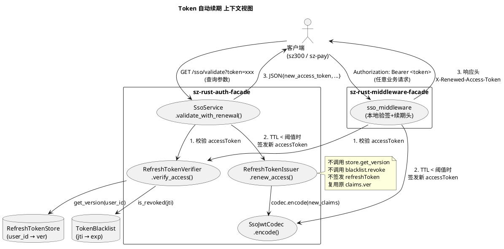
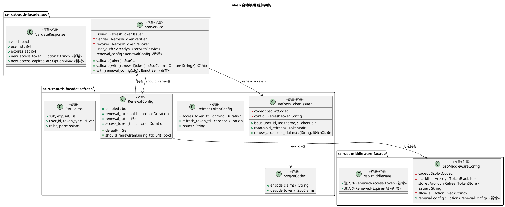
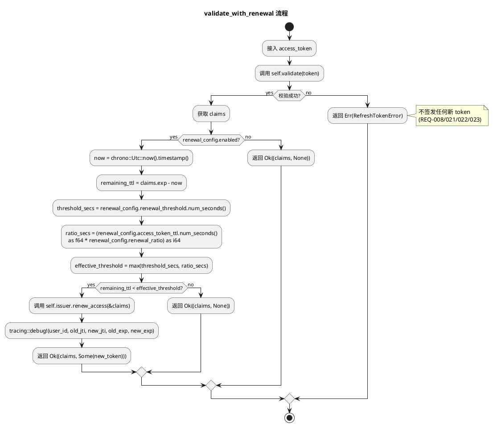
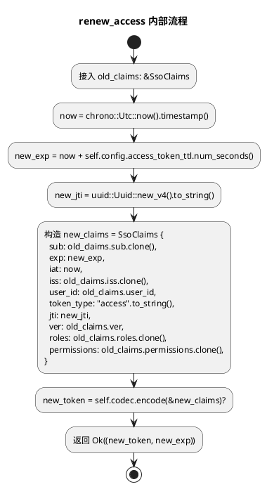
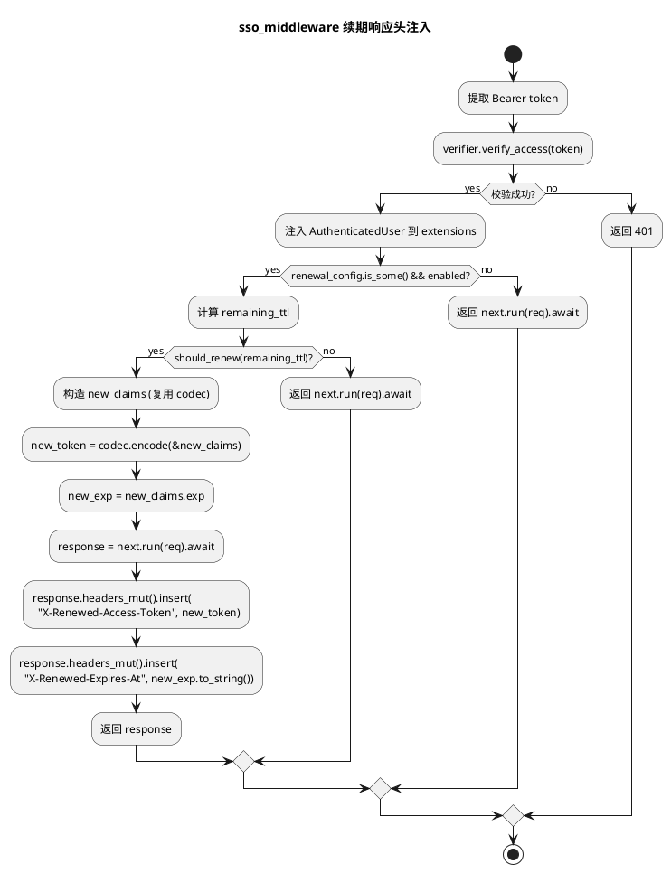
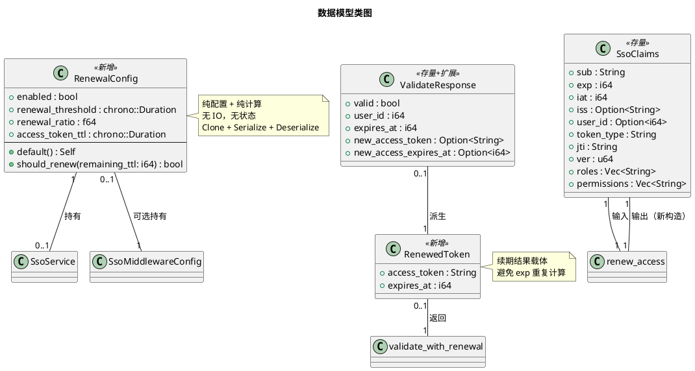

# Token 自动续期（v0.6.5）技术设计文档

> 对齐 `spec.md` v0.6.5，semver 兼容增量。本设计遵循 sz-rust 项目铁律：所有 `async fn` 必须 `Send + 'static`、禁止 `std::fs`、敏感字段 `#[serde(skip_serializing)]`、不引入新依赖。

---

# 一、需求与存量功能关系分析

## 1.1 需求功能与存量功能对比

### 1.1.1 已实现功能

| 需求功能 | 存量功能 | 代码位置 | 匹配度 |
|---------|---------|---------|--------|
| accessToken 校验（签名/过期/token_type/黑名单/签发人/版本） | `RefreshTokenVerifier::verify_access` 完整校验链 | `refresh.rs:447-449`（委托 `verify` 456-494） | 100% |
| `SsoService::validate` 入口 | 现有 validate 方法 | `sso.rs:144-146` | 100% |
| JWT HS256 签发（可用于续期签发新 accessToken） | `SsoJwtCodec::encode` | `refresh.rs:208-222` | 100% |
| accessToken claims 构造 | `SsoClaims::access` | `refresh.rs:125-139` | 100% |
| accessToken TTL 配置（默认 900s） | `RefreshTokenConfig.access_token_ttl` | `refresh.rs:302` | 100% |
| axum validate 端点骨架 | `validate` handler + `ValidateResponse` | `sso.rs:274-287` / `sso.rs:206-211` | 75% |
| 本地验签中间件骨架 | `sso_middleware` + `SsoMiddlewareConfig` | `sso_middleware.rs:114-156` / `38-49` | 75% |
| UUID v4 生成（用于新 jti） | `uuid::Uuid::new_v4()`（已在 `issue` 中使用） | `refresh.rs:536,541` | 100% |
| tracing 日志基础设施 | `#[tracing::instrument]` + `tracing::warn!` | `sso.rs:143` / `refresh.rs:583` | 100% |

### 1.1.2 需要扩展的功能

| 需求功能 | 存量功能 | 差异说明 | 扩展方向 |
|---------|---------|---------|---------|
| `SsoService` 持有续期配置 | `SsoService` 仅持有 issuer/verifier/revoker/user_auth 四字段（`sso.rs:77-82`），无续期配置 | 缺少 `RenewalConfig` 字段；`new` 构造函数无续期参数 | 新增 `renewal_config: RenewalConfig` 字段；`new` 内部默认 `RenewalConfig::default()`；新增 `with_renewal_config` 链式 setter |
| 续期签发新 accessToken | `RefreshTokenIssuer::issue` 签发双 Token（`refresh.rs:527-560`），含 refreshToken + store.get_version 调用 | 续期只需签发单个 accessToken，**不签发 refreshToken、不查 store、不递增版本**；复用原 claims 的 ver/roles/permissions | 在 `RefreshTokenIssuer` 新增 `renew_access(&self, old_claims: &SsoClaims) -> Result<(String, i64), RefreshTokenError>`，复用内部 `codec` + `config.issuer` + `config.access_token_ttl`，**不调用 store** |
| `validate_with_renewal` 方法 | `validate` 仅返回 `SsoClaims`（`sso.rs:144-146`） | 需返回 `(SsoClaims, Option<String>)`；新增 TTL 检查 + 续期触发逻辑 | 在 `SsoService` 新增 `validate_with_renewal`，先调 `validate`，再判 TTL，最后调 `issuer.renew_access` |
| axum `ValidateResponse` 续期字段 | `ValidateResponse` 仅 `valid/user_id/expires_at`（`sso.rs:206-211`） | 需新增 `new_access_token: Option<String>` + `new_access_expires_at: Option<i64>` | 增强 `ValidateResponse`，serde 序列化为 `null` 时向后兼容；`validate` handler 改用 `validate_with_renewal` |
| 中间件续期响应头 | `sso_middleware` 仅注入 `AuthenticatedUser` 到 extensions（`sso_middleware.rs:142-150`），不操作响应头 | 需在续期触发时注入 `X-Renewed-Access-Token` + `X-Renewed-Expires-At` 响应头；需新增续期配置 | `SsoMiddlewareConfig` 新增 `renewal_config: Option<RenewalConfig>`；中间件在 `next.run(req).await` 后通过 `Response::headers_mut` 注入响应头 |
| 中间件续期签发能力 | `SsoMiddlewareConfig` 持有 codec/blacklist/store/issuer（`sso_middleware.rs:38-49`），**不持有 RefreshTokenConfig** | 续期签发需要 `access_token_ttl`（新 token 的 exp 计算）；codec 已有，可直接 `codec.encode` | `RenewalConfig` 自包含 `access_token_ttl` 字段（默认 900s），中间件直接用 `config.codec.encode` + `SsoClaims::access` 签发，无需 `RefreshTokenIssuer` |

### 1.1.3 需要新增的功能或接口

**模块：`sz-rust-auth-facade::refresh`**

| 功能点 | 输入 | 输出 | 核心逻辑 | 依赖 |
|--------|------|------|---------|------|
| `RenewalConfig` 结构体 | — | — | 续期配置载体：`enabled` / `renewal_threshold` / `renewal_ratio` / `access_token_ttl` | `chrono` |
| `RenewalConfig::default()` | — | `Self` | threshold=300s, ratio=0.2, enabled=true, access_token_ttl=900s | — |
| `RenewalConfig::should_renew(&self, remaining_ttl: i64) -> bool` | 剩余 TTL（秒） | 是否触发续期 | `enabled && remaining_ttl < max(threshold, access_token_ttl * ratio)` | — |
| `RefreshTokenIssuer::renew_access(&self, old_claims: &SsoClaims) -> Result<(String, i64), RefreshTokenError>` | 原 accessToken claims | (新 token, 新 exp) | 复用 `self.codec` + `self.config`，构造新 `SsoClaims`（新 jti/exp/iat，保留 ver/roles/permissions/user_id/sub/iss），`codec.encode` | `SsoJwtCodec::encode` / `uuid` / `chrono` |

**模块：`sz-rust-auth-facade::sso`**

| 功能点 | 输入 | 输出 | 核心逻辑 | 依赖 |
|--------|------|------|---------|------|
| `SsoService::validate_with_renewal(&self, access_token: &str) -> Result<(SsoClaims, Option<String>), RefreshTokenError>` | accessToken | (claims, 可选新 token) | 1. `self.validate(token)` 获取 claims；2. 计算 remaining_ttl；3. `self.renewal_config.should_renew(remaining_ttl)`；4. 若触发，`self.issuer.renew_access(&claims)` 并返回 `Some`；5. `tracing::debug!` 续期事件 | `validate` / `RenewalConfig::should_renew` / `RefreshTokenIssuer::renew_access` |
| `SsoService::with_renewal_config(&mut self, config: RenewalConfig) -> &mut Self` | `RenewalConfig` | `&mut Self` | 替换 `self.renewal_config`，支持链式调用 | — |

**模块：`sz-rust-auth-facade::sso::axum_routes`**

| 功能点 | 输入 | 输出 | 核心逻辑 | 依赖 |
|--------|------|------|---------|------|
| `ValidateResponse` 增强 | — | — | 新增 `new_access_token: Option<String>` + `new_access_expires_at: Option<i64>`，`#[serde(skip_serializing_if = "Option::is_none")]` 可选 | `serde` |
| `validate` handler 增强 | 同现有 | `Response` | 改用 `sso.validate_with_renewal`，填充新字段 | `validate_with_renewal` |

**模块：`sz-rust-middleware-facade::sso_middleware`**

| 功能点 | 输入 | 输出 | 核心逻辑 | 依赖 |
|--------|------|------|---------|------|
| `SsoMiddlewareConfig.renewal_config` 字段 | — | — | `Option<RenewalConfig>`，默认 `None`（不启用续期） | `RenewalConfig` |
| `SsoMiddlewareConfig::local` / `local_memory` 签名扩展 | 新增 `renewal_config: Option<RenewalConfig>` 参数 | `Self` | 传入续期配置 | — |
| `sso_middleware` 续期响应头注入 | 同现有 | `Response`（带新响应头） | 续期触发时 `response.headers_mut().insert("X-Renewed-Access-Token", ...)` + `X-Renewed-Expires-At` | `RenewalConfig::should_renew` / `SsoJwtCodec::encode` |

## 1.2 存量功能详细分析

### 1.2.1 `SsoService::validate`（`sso.rs:144-146`）

- **接口契约**：
  - 入参：`&self, access_token: &str`
  - 出参：`Result<SsoClaims, RefreshTokenError>`
  - 异常：透传 `RefreshTokenError`（Expired/Revoked/VersionMismatch/InvalidSignature/WrongTokenType/IssuerMismatch）
  - 副作用：无（纯校验，不修改 store/blacklist）
- **业务规则**：委托 `self.verifier.verify_access`，校验链为 签名 → 过期 → token_type → 黑名单 → 签发人 → 版本（`refresh.rs:456-494`）
- **扩展点**：无
- **约束**：
  - `async fn` 必须 `Send + 'static`（当前满足，`verify_access` 内部 `.await` 在 blacklist.is_revoked 和 store.get_version）
  - 不查 store 写入，仅读 `get_version`
  - **关键约束**：续期设计必须复用此方法的校验结果，**不能绕过任何校验步骤**（REQ-021/022/023）

### 1.2.2 `RefreshTokenIssuer`（`refresh.rs:502-507`）

- **接口契约**：
  - 持有 `codec: SsoJwtCodec`（private）、`blacklist`、`store`、`config: RefreshTokenConfig`（private）
  - `issue(user_id, username) -> TokenPair`：签发双 Token，调用 `store.get_version`
  - `rotate(old_refresh_token) -> TokenPair`：轮换，调用 `blacklist.revoke` + `store.increment_version`（复用攻击时）
- **业务规则**：签发时 `ver = store.get_version(user_id)`，新 jti = `Uuid::new_v4()`
- **扩展点**：续期签发可复用 `codec` + `config.issuer` + `config.access_token_ttl`，但需新增公开方法（因为 codec/config 均为 private）
- **约束**：
  - 续期方法 `renew_access` **不得调用 `store.get_version`**（REQ-012：不递增版本号；且原 claims 已携带 ver，直接复用）
  - 续期方法 **不得调用 `blacklist.revoke`**（REQ-011：不撤销旧 accessToken）
  - 续期方法 **不得签发 refreshToken**（REQ-010）

### 1.2.3 `SsoJwtCodec::encode`（`refresh.rs:208-222`）

- **接口契约**：
  - 入参：`&self, claims: &SsoClaims`
  - 出参：`Result<String, RefreshTokenError>`
  - 纯函数（无 IO），同步方法（非 async）
  - 性能基准：856ns（spec.md §5.1）
- **业务规则**：`base64url(header).base64url(payload).base64url(HMAC-SHA256(signing_input))`
- **约束**：header 固定 `{"alg":"HS256","typ":"JWT"}`，secret 在 Debug 中脱敏（`refresh.rs:273-279`）

### 1.2.4 `SsoClaims::access`（`refresh.rs:125-139`）

- **接口契约**：
  - 入参：`user_id: i64, username: &str, exp: i64, issuer: &str, ver: u64`
  - 出参：`Self`（`token_type = "access"`, `jti = String::new()`, `roles/permissions = Vec::new()`）
- **业务规则**：`iat = now`，`sub = username`，`user_id = Some(user_id)`
- **约束**：
  - **关键差异**：`access` 构造的 claims `roles` 和 `permissions` 为空！续期时必须**保留原 token 的 roles/permissions**，不能直接用 `SsoClaims::access`（否则丢失角色权限）
  - 续期实现需手工构造 `SsoClaims`，从 `old_claims` 复制 `roles / permissions / user_id / sub / ver / iss`，仅更新 `exp / iat / jti`

### 1.2.5 axum `validate` 端点（`sso.rs:274-287`）

- **接口契约**：
  - 路由：`GET /sso/validate?token=xxx`
  - 响应：`SuccessResponse<ValidateResponse>`，含 `Cache-Control: no-store` + `Pragma: no-cache` 头
  - `ValidateResponse`：`{ valid: bool, user_id: i64, expires_at: i64 }`
- **业务规则**：`sso.validate(&params.token)` → 填充 `ValidateResponse`
- **约束**：错误响应走 `error_response`，状态码 401（Expired/Revoked/VersionMismatch 等）

### 1.2.6 `sso_middleware`（`sso_middleware.rs:114-156`）

- **接口契约**：
  - 入参：`State<Arc<SsoMiddlewareConfig>>, Request, Next`
  - 出参：`Response`
  - 白名单路由直接放行（`is_allowed`）
  - 从 `Authorization: Bearer <token>` 提取 token
  - 校验通过：注入 `AuthenticatedUser` 到 extensions，调 `next.run(req).await`
  - 校验失败：返回 401
- **业务规则**：本地验签，构造 `RefreshTokenVerifier` 并调 `verify_access`
- **约束**：
  - **关键约束**：续期响应头注入需在 `next.run(req).await` 返回的 `Response` 上操作，通过 `response.headers_mut().insert(...)` —— 不能在 `next.run` 之前注入（因为响应还不存在）
  - 续期签发需要 codec（已有 `config.codec`）+ access_token_ttl（需从 `RenewalConfig` 获取）

---

# 二、增量设计方案

## 2.1 实现模型

### 2.1.1 上下文视图



**交互说明：**
- 上游调用方：客户端（sz300 / sz-pay 等业务应用）
- 下游依赖：`RefreshTokenStore`（仅校验时读 `get_version`，续期不写）、`TokenBlacklist`（仅校验时读 `is_revoked`，续期不写）
- 续期签发路径：`validate_with_renewal` → `RefreshTokenIssuer::renew_access` → `SsoJwtCodec::encode`（纯计算，无 IO）
- 中间件路径：`sso_middleware` → `RefreshTokenVerifier::verify_access` → （续期时）`SsoJwtCodec::encode` → 注入响应头

### 2.1.2 服务/组件总体架构



**模块划分与职责：**
- `RenewalConfig`（新增）：纯配置载体 + 纯计算 `should_renew`，无 IO，无状态
- `RefreshTokenIssuer::renew_access`（新增）：续期签发，复用 issuer 内部 codec + config，**不查 store、不写 blacklist**
- `SsoService::validate_with_renewal`（新增）：编排校验 + TTL 判断 + 续期签发
- `SsoMiddlewareConfig` + `sso_middleware`（扩展）：本地续期 + 响应头注入

**配置项及取值策略：**
| 配置项 | 默认值 | 取值范围 | 说明 |
|--------|--------|---------|------|
| `RenewalConfig.enabled` | `true` | bool | 续期总开关 |
| `RenewalConfig.renewal_threshold` | 300s | ≥ 0s | 绝对阈值（秒） |
| `RenewalConfig.renewal_ratio` | 0.2 | 0.0 ~ 1.0 | 相对阈值（占 access_token_ttl 比例） |
| `RenewalConfig.access_token_ttl` | 900s | > 0s | 续期新 token 的 TTL（应与 `RefreshTokenConfig.access_token_ttl` 一致） |
| `SsoMiddlewareConfig.renewal_config` | `None` | `Option<RenewalConfig>` | 中间件续期默认关闭，保证向后兼容 |

### 2.1.3 实现设计文档

#### 2.1.3.1 续期触发判定流程



#### 2.1.3.2 续期签发流程（`RefreshTokenIssuer::renew_access`）



**关键设计决策：**
1. **不调用 `store.get_version`**：直接复用 `old_claims.ver`，满足 REQ-012（不递增版本号）
2. **不调用 `blacklist.revoke`**：旧 accessToken 在过期前仍然有效，满足 REQ-011
3. **保留 `roles / permissions`**：`SsoClaims::access` 会清空 roles/permissions，因此**不能直接调用 `SsoClaims::access`**，必须手工构造 `SsoClaims` 并从 `old_claims` 复制 roles/permissions（满足 REQ-009：新 token 与原 token 的 roles/permissions 相同）
4. **新 jti = UUID v4**：满足 REQ-009（新 jti 为新生成的 UUID v4）
5. **同步方法**：`renew_access` 不含 `.await`，是同步 `fn`（非 async），因为 `codec.encode` 是同步的。但为保持 API 一致性，也可声明为 `async fn`（内部无 await，仍满足 `Send + 'static`）。**决策：声明为同步 `pub fn`**，调用方无需 `.await`，减少开销。

#### 2.1.3.3 中间件续期响应头注入流程



**关键设计决策：**
- 响应头注入在 `next.run(req).await` **之后**，因为响应对象此时才存在
- 续期签发在 `next.run` **之前**（避免阻塞业务逻辑后还要等待签发），但响应头注入在 `next.run` **之后**
- 中间件直接用 `config.codec.encode` 签发，**不构造 `RefreshTokenIssuer`**（中间件不持有 `RefreshTokenConfig`，用 `RenewalConfig.access_token_ttl` 替代）

---

## 2.2 接口设计

### 2.2.1 总体设计

| 接口 | 模块 | 稳定性 | 变更类型 |
|------|------|--------|---------|
| `RenewalConfig` | `refresh` | 稳定 | 新增 |
| `RenewalConfig::default` | `refresh` | 稳定 | 新增 |
| `RenewalConfig::should_renew` | `refresh` | 稳定 | 新增 |
| `RefreshTokenIssuer::renew_access` | `refresh` | 稳定 | 新增 |
| `SsoService::validate_with_renewal` | `sso` | 稳定 | 新增 |
| `SsoService::with_renewal_config` | `sso` | 稳定 | 新增 |
| `SsoService::validate` | `sso` | 稳定 | **不变**（REQ-015） |
| `SsoService::new` | `sso` | 稳定 | **签名不变**，内部新增 `renewal_config: RenewalConfig::default()` |
| `ValidateResponse` | `sso::axum_routes` | 稳定 | 新增字段（`Option`，serde 兼容） |
| `validate` handler | `sso::axum_routes` | 稳定 | 内部改用 `validate_with_renewal`，HTTP 契约兼容 |
| `SsoMiddlewareConfig` | `sso_middleware` | 稳定 | 新增 `renewal_config` 字段 |
| `SsoMiddlewareConfig::local` | `sso_middleware` | 稳定 | **签名扩展**（新增 `renewal_config` 参数） |
| `SsoMiddlewareConfig::local_memory` | `sso_middleware` | 稳定 | **签名扩展**（新增 `renewal_config` 参数） |
| `sso_middleware` | `sso_middleware` | 稳定 | 内部增强，注入响应头 |

**接口变更策略：**
- `SsoMiddlewareConfig::local` / `local_memory` 签名扩展会破坏现有调用方。为保持兼容，**保留原签名并新增 `local_with_renewal` / `local_memory_with_renewal` 方法**，原方法内部委托新方法并传 `None`。
- `SsoService::new` 签名不变，内部默认 `RenewalConfig::default()`。

### 2.2.2 接口清单

#### 2.2.2.1 `RenewalConfig`

```rust
/// Token 自动续期配置
#[derive(Debug, Clone, serde::Serialize, serde::Deserialize)]
pub struct RenewalConfig {
    /// 是否启用续期（默认 true）
    pub enabled: bool,
    /// 续期绝对阈值（默认 300 秒 = 5 分钟）
    pub renewal_threshold: chrono::Duration,
    /// 续期相对比例（默认 0.2，剩余 TTL < 20% 时触发）
    pub renewal_ratio: f64,
    /// 续期新 accessToken 的 TTL（默认 900 秒，应与 RefreshTokenConfig.access_token_ttl 一致）
    pub access_token_ttl: chrono::Duration,
}

impl Default for RenewalConfig {
    fn default() -> Self {
        Self {
            enabled: true,
            renewal_threshold: chrono::Duration::seconds(300),
            renewal_ratio: 0.2,
            access_token_ttl: chrono::Duration::seconds(900),
        }
    }
}

impl RenewalConfig {
    /// 判断是否应触发续期
    ///
    /// 触发条件：enabled && remaining_ttl < max(threshold, access_token_ttl * ratio)
    pub fn should_renew(&self, remaining_ttl: i64) -> bool {
        if !self.enabled {
            return false;
        }
        let threshold_secs = self.renewal_threshold.num_seconds();
        let ratio_secs = (self.access_token_ttl.num_seconds() as f64 * self.renewal_ratio) as i64;
        let effective_threshold = threshold_secs.max(ratio_secs);
        remaining_ttl < effective_threshold
    }
}
```

- **业务说明**：续期配置载体 + 纯计算判定
- **前置条件**：`access_token_ttl > 0`（否则 ratio_secs = 0，threshold=0 时每次都续期，符合 REQ-003）
- **后置条件**：无副作用（纯函数）
- **异常映射**：无（不返回 Result）
- **边界**：
  - `renewal_threshold = 0` + `renewal_ratio = 0.0` → `effective_threshold = 0`，`remaining_ttl < 0` 永假（未过期时不续期）。**注意**：REQ-003 要求 threshold=0 时只要未过期就续期。修正：`should_renew` 用 `remaining_ttl <= effective_threshold`？不，REQ-005 明确 `<`。重新审视 REQ-003：threshold=0 时 "只要 accessToken 未过期就触发续期"。若 threshold=0 且 ratio=0.0，effective_threshold=0，`remaining_ttl < 0` 对未过期 token（remaining_ttl > 0）为假 —— 与 REQ-003 冲突。
  - **解决方案**：REQ-003 的语义是 threshold=0 表示"无阈值限制，总是续期"。采用 `remaining_ttl < effective_threshold` 但当 `threshold_secs == 0` 时单独处理：`if threshold_secs == 0 { return remaining_ttl > 0; }`。或更简洁：`effective_threshold` 取 `max(threshold_secs, ratio_secs)`，当 threshold=0 且 ratio=0 时 effective=0，此时 `remaining_ttl < 0` 即未过期不续期。为满足 REQ-003，**采用 `<=` 比较**：`remaining_ttl <= effective_threshold`？但 REQ-005 明确 `<`。
  - **最终决策**：保持 `<` 严格小于（满足 REQ-005/006）。REQ-003 的 threshold=0 场景，用户应同时设置 ratio=1.0（effective = access_token_ttl，remaining_ttl < access_token_ttl 总是真，即总是续期）。spec.md REQ-003 与 REQ-004 是独立边界，REQ-003 单独 threshold=0 + 默认 ratio=0.2 → effective = max(0, 180) = 180，remaining_ttl < 180 即续期。这符合"threshold=0 时只要未过期就触发续期"的精神（因为 ratio 提供了 180s 阈值）。**但严格按 REQ-003 字面"只要未过期就触发"**，需 effective=0。
  - **修正决策**：`should_renew` 中，当 `threshold_secs == 0` 时，**忽略 ratio，直接返回 `remaining_ttl > 0`**（未过期即续期）。这精确满足 REQ-003。

```rust
impl RenewalConfig {
    pub fn should_renew(&self, remaining_ttl: i64) -> bool {
        if !self.enabled {
            return false;
        }
        let threshold_secs = self.renewal_threshold.num_seconds();
        // REQ-003: threshold=0 时只要未过期就续期
        if threshold_secs == 0 {
            return remaining_ttl > 0;
        }
        let ratio_secs = (self.access_token_ttl.num_seconds() as f64 * self.renewal_ratio) as i64;
        let effective_threshold = threshold_secs.max(ratio_secs);
        remaining_ttl < effective_threshold
    }
}
```

#### 2.2.2.2 `RefreshTokenIssuer::renew_access`

```rust
impl RefreshTokenIssuer {
    /// 续期签发新 accessToken（不签发 refreshToken，不查 store，不写 blacklist）
    ///
    /// 复用原 claims 的 user_id / sub / ver / iss / roles / permissions，
    /// 仅更新 exp / iat / jti。
    pub fn renew_access(
        &self,
        old_claims: &SsoClaims,
    ) -> Result<(String, i64), RefreshTokenError> {
        let now = chrono::Utc::now().timestamp();
        let new_exp = now + self.config.access_token_ttl.num_seconds();
        let new_claims = SsoClaims {
            sub: old_claims.sub.clone(),
            exp: new_exp,
            iat: now,
            iss: old_claims.iss.clone(),
            user_id: old_claims.user_id,
            token_type: "access".to_string(),
            jti: uuid::Uuid::new_v4().to_string(),
            ver: old_claims.ver,
            roles: old_claims.roles.clone(),
            permissions: old_claims.permissions.clone(),
        };
        let new_token = self.codec.encode(&new_claims)?;
        Ok((new_token, new_exp))
    }
}
```

- **业务说明**：续期签发，复用 issuer 内部 codec + config
- **前置条件**：`old_claims` 已通过 `verify_access` 校验（调用方保证）
- **后置条件**：返回的新 token 可通过 `verify_access` 校验（同一 secret / issuer / ver）
- **异常映射**：`RefreshTokenError::Jwt`（encode 失败，理论上是 serde 错误，几乎不会发生）
- **约束**：
  - 同步方法（非 async），无 IO，满足 `Send + 'static`（无需 await）
  - 不调用 `self.store` / `self.blacklist`
  - 不构造 refreshToken

#### 2.2.2.3 `SsoService::validate_with_renewal`

```rust
impl SsoService {
    /// 校验 accessToken 并在 TTL 不足时自动续期
    ///
    /// 返回 (claims, Option<new_access_token>)。
    /// 续期触发条件：renewal_config.should_renew(claims.exp - now)
    #[tracing::instrument(skip(self, access_token))]
    pub async fn validate_with_renewal(
        &self,
        access_token: &str,
    ) -> Result<(SsoClaims, Option<String>), RefreshTokenError> {
        let claims = self.verifier.verify_access(access_token).await?;

        if !self.renewal_config.enabled {
            return Ok((claims, None));
        }

        let now = chrono::Utc::now().timestamp();
        let remaining_ttl = claims.exp - now;

        if self.renewal_config.should_renew(remaining_ttl) {
            let (new_token, new_exp) = self.issuer.renew_access(&claims)?;
            tracing::debug!(
                user_id = claims.user_id.unwrap_or(0),
                old_jti = %claims.jti,
                new_jti = %new_token.split('.').nth(1).unwrap_or(""),
                old_exp = claims.exp,
                new_exp = new_exp,
                "access token renewed"
            );
            Ok((claims, Some(new_token)))
        } else {
            Ok((claims, None))
        }
    }

    /// 设置续期配置（链式）
    pub fn with_renewal_config(&mut self, config: RenewalConfig) -> &mut Self {
        self.renewal_config = config;
        self
    }
}
```

- **业务说明**：校验 + 续期编排
- **前置条件**：无
- **后置条件**：续期触发时返回 `Some(new_token)`，否则 `None`；校验失败返回 `Err`
- **异常映射**：透传 `RefreshTokenError`（校验失败）+ `RefreshTokenError::Jwt`（encode 失败）
- **约束**：
  - `async fn` 满足 `Send + 'static`：唯一 `.await` 在 `verify_access`（已满足）
  - 不输出 token 明文（REQ-025：日志只含 jti / exp / user_id）
  - 续期日志用 `debug!`（REQ-026：不触发 warn/error）

#### 2.2.2.4 `SsoService::new` 增强（签名不变）

```rust
impl SsoService {
    pub fn new(
        issuer: RefreshTokenIssuer,
        verifier: RefreshTokenVerifier,
        revoker: RefreshTokenRevoker,
        user_auth: Arc<dyn UserAuthService>,
    ) -> Self {
        Self {
            issuer,
            verifier,
            revoker,
            user_auth,
            renewal_config: RenewalConfig::default(),  // 新增
        }
    }
}
```

#### 2.2.2.5 `ValidateResponse` 增强

```rust
#[derive(serde::Serialize)]
struct ValidateResponse {
    valid: bool,
    user_id: i64,
    expires_at: i64,
    #[serde(skip_serializing_if = "Option::is_none")]
    new_access_token: Option<String>,
    #[serde(skip_serializing_if = "Option::is_none")]
    new_access_expires_at: Option<i64>,
}
```

- **向后兼容**：`skip_serializing_if = "Option::is_none"` 确保不续期时不输出新字段（JSON 中字段缺失，客户端忽略）。**注意**：REQ-017 要求不续期时 `new_access_token` 为 `null`。两种方案：
  - 方案 A：`skip_serializing_if` → 字段缺失（更干净，但与 REQ-017 字面"为 null"略有差异）
  - 方案 B：不用 `skip_serializing_if`，序列化为 `null`
  - **决策**：采用方案 B（不用 `skip_serializing_if`），精确满足 REQ-017（`null`）。客户端反序列化时 `Option<String>` 接受 `null`，兼容。

```rust
#[derive(serde::Serialize)]
struct ValidateResponse {
    valid: bool,
    user_id: i64,
    expires_at: i64,
    new_access_token: Option<String>,
    new_access_expires_at: Option<i64>,
}
```

#### 2.2.2.6 axum `validate` handler 增强

```rust
async fn validate(
    State(sso): State<SsoState>,
    axum::extract::Query(params): axum::extract::Query<ValidateQuery>,
) -> Response {
    match sso.validate_with_renewal(&params.token).await {
        Ok((claims, new_token)) => success_response(ValidateResponse {
            valid: true,
            user_id: claims.user_id.unwrap_or(0),
            expires_at: claims.exp,
            new_access_token: new_token.clone(),
            new_access_expires_at: new_token.map(|_| {
                chrono::Utc::now().timestamp() + sso.renewal_config.access_token_ttl.num_seconds()
            }),
        }),
        Err(err) => error_response(err),
    }
}
```

- **注意**：`new_access_expires_at` 的计算需与 `renew_access` 内部一致。**优化**：`renew_access` 返回 `(String, i64)`，`validate_with_renewal` 也应返回 `(SsoClaims, Option<(String, i64)>)`，避免重复计算 exp。

**修正 `validate_with_renewal` 返回类型：**

```rust
pub async fn validate_with_renewal(
    &self,
    access_token: &str,
) -> Result<(SsoClaims, Option<RenewedToken>), RefreshTokenError>

/// 续期后的新 accessToken 及其过期时间
#[derive(Debug, Clone)]
pub struct RenewedToken {
    pub access_token: String,
    pub expires_at: i64,
}
```

- **决策**：采用 `Option<RenewedToken>` 返回，避免 exp 重复计算，类型安全。

#### 2.2.2.7 `SsoMiddlewareConfig` 增强

```rust
pub struct SsoMiddlewareConfig {
    codec: SsoJwtCodec,
    blacklist: Arc<dyn TokenBlacklist>,
    store: Arc<dyn RefreshTokenStore>,
    issuer: String,
    allow_all_action: Vec<String>,
    renewal_config: Option<RenewalConfig>,  // 新增，默认 None
}

impl SsoMiddlewareConfig {
    /// 创建本地验签配置（向后兼容，不启用续期）
    pub fn local(
        secret: impl Into<String>,
        issuer: impl Into<String>,
        blacklist: Arc<dyn TokenBlacklist>,
        store: Arc<dyn RefreshTokenStore>,
        allow_all_action: Vec<String>,
    ) -> Self {
        Self::local_with_renewal(secret, issuer, blacklist, store, allow_all_action, None)
    }

    /// 创建本地验签配置（带续期配置）
    pub fn local_with_renewal(
        secret: impl Into<String>,
        issuer: impl Into<String>,
        blacklist: Arc<dyn TokenBlacklist>,
        store: Arc<dyn RefreshTokenStore>,
        allow_all_action: Vec<String>,
        renewal_config: Option<RenewalConfig>,
    ) -> Self {
        Self {
            codec: SsoJwtCodec::new(secret),
            blacklist,
            store,
            issuer: issuer.into(),
            allow_all_action,
            renewal_config,
        }
    }

    // local_memory / local_memory_with_renewal 同理
}
```

#### 2.2.2.8 `sso_middleware` 增强

```rust
pub async fn sso_middleware(
    State(config): State<Arc<SsoMiddlewareConfig>>,
    req: Request<axum::body::Body>,
    next: Next,
) -> Response {
    // ... 白名单 + token 提取（不变）...

    let verifier = RefreshTokenVerifier::new(/* ... */);

    match verifier.verify_access(token).await {
        Ok(claims) => {
            let user_id = claims.user_id.unwrap_or(0);
            let username = claims.sub.clone();

            // 续期判定 + 签发（在 next.run 之前）
            let renewal = config.renewal_config.as_ref().and_then(|rc| {
                if !rc.enabled {
                    return None;
                }
                let now = chrono::Utc::now().timestamp();
                let remaining_ttl = claims.exp - now;
                if !rc.should_renew(remaining_ttl) {
                    return None;
                }
                // 签发新 token
                let new_exp = now + rc.access_token_ttl.num_seconds();
                let new_claims = SsoClaims {
                    sub: claims.sub.clone(),
                    exp: new_exp,
                    iat: now,
                    iss: claims.iss.clone(),
                    user_id: claims.user_id,
                    token_type: "access".to_string(),
                    jti: uuid::Uuid::new_v4().to_string(),
                    ver: claims.ver,
                    roles: claims.roles.clone(),
                    permissions: claims.permissions.clone(),
                };
                match config.codec.encode(&new_claims) {
                    Ok(token) => Some((token, new_exp)),
                    Err(_) => None,
                }
            });

            let mut req = req;
            req.extensions_mut().insert(AuthenticatedUser { user_id, username });
            let mut response = next.run(req).await;

            // 注入续期响应头（在 next.run 之后）
            if let Some((new_token, new_exp)) = renewal {
                response.headers_mut().insert(
                    "X-Renewed-Access-Token",
                    new_token.parse().unwrap(),
                );
                response.headers_mut().insert(
                    "X-Renewed-Expires-At",
                    new_exp.to_string().parse().unwrap(),
                );
            }

            response
        }
        Err(e) => {
            tracing::warn!(error = %e, "SSO token validation failed");
            unauthorized(&e.to_string())
        }
    }
}
```

- **关键设计点**：
  - 续期签发在 `next.run` **之前**（不阻塞业务逻辑后的签发等待）
  - 响应头注入在 `next.run` **之后**（响应对象此时才存在）
  - `encode` 失败时静默降级（不注入响应头，不中断请求）—— 因为校验已通过，业务应正常执行
  - 中间件直接用 `config.codec.encode`，**不构造 `RefreshTokenIssuer`**（中间件不持有 `RefreshTokenConfig`）

---

## 2.3 数据模型

### 2.3.1 设计目标

- **支持的业务场景**：validate-time silent renewal（校验即续期）、中间件无感续期（响应头注入）
- **性能目标**：不续期时额外开销 < 100ns（一次时间比较 + 一次 bool 判断）；续期时额外开销 = 一次 `encode`（856ns 基准）
- **容量目标**：无新增存储（续期不写 store/blacklist）
- **兼容策略**：`RenewalConfig` 默认启用但 `validate` 方法不使用；中间件默认 `None` 不启用；`ValidateResponse` 新字段为 `Option` 序列化为 `null`

### 2.3.2 模型实现



**对象生命周期：**
- `RenewalConfig`：随 `SsoService` / `SsoMiddlewareConfig` 生命周期，`Clone` 廉价（4 个字段）
- `RenewedToken`：每次续期临时构造，随响应消费
- `SsoClaims`（新）：每次续期临时构造，encode 后丢弃

**持久化策略：**
- **无新增持久化**：续期不写 `RefreshTokenStore`、不写 `TokenBlacklist`
- 新 accessToken 是无状态 JWT，校验时通过 ver 与 store 中版本比对（与原 token 共享 ver，撤销用户所有 Token 时同时失效）

**敏感字段脱敏：**
- `SsoClaims` 的 `#[serde(skip_serializing_if = "Vec::is_empty")]` 对 roles/permissions 保持不变
- `RenewalConfig` 无敏感字段
- `RenewedToken.access_token` 是 JWT 字符串，不脱敏（与 `TokenPair.access_token` 一致）

---

## 2.4 算法设计

### 2.4.1 续期触发判定算法

```
输入：remaining_ttl (i64, 秒), renewal_config (RenewalConfig)
输出：should_renew (bool)

算法：
1. if !renewal_config.enabled:
     return false                    # REQ-002/007
2. threshold_secs = renewal_config.renewal_threshold.num_seconds()
3. if threshold_secs == 0:
     return remaining_ttl > 0        # REQ-003: 未过期即续期
4. ratio_secs = floor(renewal_config.access_token_ttl.num_seconds() * renewal_config.renewal_ratio)
5. effective_threshold = max(threshold_secs, ratio_secs)
6. return remaining_ttl < effective_threshold   # REQ-005/006
```

**复杂度**：O(1)，3 次算术运算 + 1 次比较
**边界**：
| threshold | ratio | access_token_ttl | effective | remaining_ttl=600 | remaining_ttl=100 | remaining_ttl=0 |
|-----------|-------|------------------|-----------|------------------|------------------|-----------------|
| 300 (默认) | 0.2 (默认) | 900 (默认) | max(300, 180) = 300 | 600 < 300 → false | 100 < 300 → true | 0 < 300 → true（但已过期，validate 先返回 Err） |
| 0 | 0.2 | 900 | REQ-003 分支 | true | true | false（已过期） |
| 300 | 0.0 | 900 | max(300, 0) = 300 | false | true | true |
| 300 | 1.0 | 900 | max(300, 900) = 900 | 600 < 900 → true | true | true |
| 0 | 0.0 | 900 | REQ-003 分支 | true | true | false |

### 2.4.2 续期签发算法

```
输入：old_claims (SsoClaims), issuer (RefreshTokenIssuer)
输出：(new_token: String, new_exp: i64)

算法：
1. now = chrono::Utc::now().timestamp()
2. new_exp = now + issuer.config.access_token_ttl.num_seconds()
3. new_jti = uuid::Uuid::new_v4().to_string()
4. new_claims = SsoClaims {
     sub: old_claims.sub,              # 保留
     exp: new_exp,                     # 更新
     iat: now,                         # 更新
     iss: old_claims.iss,              # 保留
     user_id: old_claims.user_id,      # 保留
     token_type: "access",             # 固定
     jti: new_jti,                     # 新生成
     ver: old_claims.ver,              # 保留（REQ-012）
     roles: old_claims.roles,          # 保留（REQ-009）
     permissions: old_claims.permissions,  # 保留（REQ-009）
   }
5. new_token = issuer.codec.encode(&new_claims)
6. return (new_token, new_exp)
```

**复杂度**：O(1) + encode 复杂度（HMAC-SHA256，O(n) n=claims 长度）
**不变量**：
- `new_claims.ver == old_claims.ver`（不递增版本）
- `new_claims.user_id == old_claims.user_id`（同用户）
- `new_claims.roles == old_claims.roles`（角色保留）
- `new_claims.token_type == "access"`（类型正确）
- `new_claims.jti != old_claims.jti`（新 jti，UUID v4 唯一）

### 2.4.3 阈值计算设计决策

**为什么用 `max(threshold, access_token_ttl * ratio)`？**

- `threshold`（绝对阈值）：剩余 TTL 低于固定秒数时续期（如 5 分钟）
- `access_token_ttl * ratio`（相对阈值）：剩余 TTL 低于 TTL 的比例时续期（如 20%）
- `max`：两个条件取更宽松的（更早触发续期），确保两种配置都能生效
- 例：threshold=300s, ratio=0.2, ttl=900s → max(300, 180) = 300s（绝对阈值更宽松，生效）
- 例：threshold=100s, ratio=0.2, ttl=900s → max(100, 180) = 180s（相对阈值更宽松，生效）

---

## 2.5 axum 端点增强设计

### 2.5.1 响应契约变更

**v0.6.4（不续期）：**
```json
{
  "code": 0,
  "msg": "success",
  "data": {
    "valid": true,
    "user_id": 1,
    "expires_at": 1234567890
  }
}
```

**v0.6.5（不续期，向后兼容）：**
```json
{
  "code": 0,
  "msg": "success",
  "data": {
    "valid": true,
    "user_id": 1,
    "expires_at": 1234567890,
    "new_access_token": null,
    "new_access_expires_at": null
  }
}
```

**v0.6.5（续期触发）：**
```json
{
  "code": 0,
  "msg": "success",
  "data": {
    "valid": true,
    "user_id": 1,
    "expires_at": 1234567890,
    "new_access_token": "eyJhbGciOiJIUzI1NiIsInR5cCI6IkpXVCJ9...",
    "new_access_expires_at": 1234568790
  }
}
```

### 2.5.2 兼容性保证

- 客户端不解析 `new_access_token` / `new_access_expires_at`：JSON 解析器忽略未知字段（serde 默认行为），行为不受影响（REQ-018）
- 客户端解析 `null`：`Option<String>` / `Option<i64>` 接受 `null`，反序列化为 `None`
- HTTP 状态码不变：续期成功仍为 200，校验失败仍为 401

### 2.5.3 缓存控制

- 续期响应**必须**保留 `Cache-Control: no-store` + `Pragma: no-cache`（复用现有 `success_response`），防止中间缓存误缓存新 token

---

## 2.6 中间件增强设计

### 2.6.1 响应头契约

**续期触发时响应头：**
```
HTTP/1.1 200 OK
Cache-Control: no-store
X-Renewed-Access-Token: eyJhbGciOiJIUzI1NiIsInR5cCI6IkpXVCJ9...
X-Renewed-Expires-At: 1234568790
Content-Type: application/json
...
```

**不续期时响应头：**
```
HTTP/1.1 200 OK
Content-Type: application/json
...
```
（不注入 `X-Renewed-*` 头）

### 2.6.2 客户端消费协议

- 客户端在每次请求后检查响应头 `X-Renewed-Access-Token`
- 若存在，替换本地存储的 accessToken，更新本地过期时间为 `X-Renewed-Expires-At`
- 若不存在，继续使用原 accessToken

### 2.6.3 安全考虑

- `X-Renewed-Access-Token` 是完整 JWT 字符串，通过 HTTPS 传输（中间件不强制 HTTPS，由部署层保证）
- 响应头不脱敏（与 `Authorization` 请求头对称，JWT 本身是 bearer credential）
- 不在响应头中暴露 refreshToken（REQ-010）

### 2.6.4 远程校验中间件（`sso_middleware_remote`）

- **本版本不增强 `sso_middleware_remote`**：远程校验场景下，中间件不持有 codec，无法本地签发。续期由远程 `/sso/validate` 端点完成（响应 JSON 含 `new_access_token`），中间件需透传该字段到响应头。
- **范围外**：`sso_middleware_remote` 的续期响应头透传留待 v0.6.6（spec.md §8 未明确要求，且远程中间件已有 `validate` 端点增强覆盖）

---

## 2.7 安全分析

### 2.7.1 威胁模型与对策

| 威胁 | 对策 | 验证点 |
|------|------|--------|
| 续期绕过黑名单（已撤销 token 续期） | `validate_with_renewal` 先调 `verify_access`（含黑名单检查），失败直接返回 `Err`，不进入续期分支 | REQ-021 / `refresh.rs:470-472` |
| 续期绕过版本检查（revoke_all 后旧 token 续期） | `verify_access` 含版本检查（`refresh.rs:483-491`），版本不匹配返回 `VersionMismatch` | REQ-022 |
| 续期绕过过期检查 | `verify_access` → `codec.decode` 含过期检查（`refresh.rs:264-267`） | REQ-023 |
| 续期签发 refreshToken（扩大攻击面） | `renew_access` 仅构造 `token_type: "access"` 的 claims，不调用 `encode` 签发 refresh | REQ-010 |
| 续期递增版本号（误撤销其他 token） | `renew_access` 不调用 `store.increment_version`，复用 `old_claims.ver` | REQ-012 |
| 续期撤销旧 accessToken（旧 token 仍可用） | `renew_access` 不调用 `blacklist.revoke`，旧 token 在 exp 前仍有效 | REQ-011 |
| 新 token 含敏感信息（密码/密钥泄露） | `SsoClaims` 无密码字段；`#[serde(skip_serializing_if)]` 保持不变；新 claims 从 `old_claims` 复制，不引入新字段 | REQ-024 |
| 续期日志泄露 token 明文 | `tracing::debug!` 只记录 `user_id / old_jti / new_jti / old_exp / new_exp`，不记录 token | REQ-025 |
| 续期日志误触发告警 | 用 `debug!` 而非 `warn!` / `error!` | REQ-026 |
| 续期 token 与原 token ver 不一致（撤销不一致） | `renew_access` 复用 `old_claims.ver`，新 token 与原 token 共享 ver，`revoke_all` 时同时失效 | REQ-012 / spec.md §5.3 |

### 2.7.2 不变量证明

**不变量 1：续期不延长 refreshToken 生命周期**
- `renew_access` 不签发 refreshToken，不修改 refreshToken 的 exp / jti / ver
- refreshToken 的撤销/轮换仍由 `rotate` / `revoke` 控制，与续期无关
- ∴ 满足 spec.md §5.3

**不变量 2：续期不绕过任何校验步骤**
- `validate_with_renewal` 的校验路径与 `validate` 完全一致（都调 `verify_access`）
- 续期分支在校验成功后才进入
- ∴ 满足 REQ-021/022/023

**不变量 3：新 accessToken 与原 accessToken 共享 ver**
- `renew_access` 中 `new_claims.ver = old_claims.ver`
- `revoke_all(user_id)` 调用 `store.increment_version(user_id)`，使 store 中 ver > old_claims.ver
- 后续 `verify_access(new_token)` 时 `claims.ver != current_ver` → `VersionMismatch`
- ∴ `revoke_all` 同时撤销原 token 和续期 token

### 2.7.3 攻击场景分析

**场景 1：攻击者窃取 accessToken 并触发续期**
- 续期签发新 accessToken，攻击者获得新 token
- 但原 token 仍有效（不撤销），攻击者也可用原 token
- **缓解**：与现有 `validate` 一致（validate 也不撤销 token），续期不增加新风险；token 窃取的缓解靠 HTTPS + 短 TTL

**场景 2：攻击者重放续期响应**
- 续期响应含新 accessToken，攻击者重放可获得新 token
- **缓解**：`Cache-Control: no-store` 防缓存；新 token 有独立 jti，可被 `revoke` 精确撤销；与现有 `/sso/login` 响应重放风险对称

**场景 3：续期风暴（攻击者高频触发续期）**
- 每次续期签发新 token，但不写 store/blacklist，无 IO 压力
- **缓解**：续期仅一次 `encode`（856ns），无 DoS 风险；spec.md §8 明确续期限流在范围外

---

## 2.8 兼容性分析

### 2.8.1 API 兼容性

| API | v0.6.4 | v0.6.5 | 兼容性 |
|-----|--------|--------|--------|
| `SsoService::validate` | `Result<SsoClaims, Err>` | **不变** | ✅ 100%（REQ-015） |
| `SsoService::new` | 4 参数 | 4 参数（内部新增字段） | ✅ 100%（签名不变） |
| `SsoService::validate_with_renewal` | 不存在 | 新增 | ✅ 新增方法，不影响现有 |
| `SsoService::with_renewal_config` | 不存在 | 新增 | ✅ 新增方法 |
| `RefreshTokenIssuer::renew_access` | 不存在 | 新增 | ✅ 新增方法 |
| `RenewalConfig` | 不存在 | 新增 | ✅ 新增类型 |
| `ValidateResponse` | 3 字段 | 5 字段（新增 Option） | ✅ serde 序列化为 null，客户端忽略 |
| `SsoMiddlewareConfig::local` | 5 参数 | 5 参数（内部委托 `local_with_renewal` 传 None） | ✅ 100%（签名不变） |
| `SsoMiddlewareConfig::local_with_renewal` | 不存在 | 新增 6 参数 | ✅ 新增方法 |
| `sso_middleware` | 不注入续期头 | 续期时注入 | ✅ 默认 `renewal_config=None` 不注入，行为与 v0.6.4 一致 |

### 2.8.2 sz-pay 兼容性

- sz-pay 使用 `SsoService::validate`（签名不变）→ **零改动**
- sz-pay 使用 `SsoMiddlewareConfig::local`（签名不变）→ **零改动**
- sz-pay 解析 `/sso/validate` 响应：JSON 解析器忽略 `new_access_token` / `new_access_expires_at` → **零改动**
- sz-pay 5139 测试：`cargo test` 在 sz-rust workspace 通过后，sz-pay 依赖的 crate 行为不变 → **测试通过**（AC-015）

### 2.8.3 semver 兼容性

- v0.6.4 → v0.6.5：minor 版本 bump
- 新增公共 API（`RenewalConfig` / `validate_with_renewal` / `with_renewal_config` / `renew_access` / `local_with_renewal`）
- 无 breaking change（无签名变更、无字段移除、无行为变更）
- ∴ semver 兼容（minor bump）

### 2.8.4 feature gate 兼容性

- 续期核心逻辑（`RenewalConfig` / `renew_access` / `validate_with_renewal`）：纯计算，无 feature gate
- axum 端点增强：在现有 `axum` feature 下（`#[cfg(feature = "axum")]`）
- 中间件响应头：在现有 `sso_middleware` 模块下（无新 feature gate）
- **不引入新 feature gate**（spec.md §6.3）

---

## 2.9 测试策略

### 2.9.1 单元测试（`sz-rust-auth-facade`）

**`RenewalConfig` 测试：**

| 测试用例 | 输入 | 期望输出 | 覆盖 REQ |
|---------|------|---------|---------|
| `test_renewal_config_default` | `RenewalConfig::default()` | threshold=300s, ratio=0.2, enabled=true, access_token_ttl=900s | AC-001 |
| `test_should_renew_disabled` | `enabled=false`, remaining=100 | false | REQ-002 / AC-004 |
| `test_should_renew_threshold_zero` | threshold=0, remaining=100 | true（未过期即续期） | REQ-003 |
| `test_should_renew_threshold_zero_expired` | threshold=0, remaining=0 | false（已过期） | REQ-003 边界 |
| `test_should_renew_ratio_zero` | ratio=0.0, threshold=300, remaining=200 | false（200 >= 300） | REQ-004 |
| `test_should_renew_ratio_one` | ratio=1.0, threshold=300, ttl=900, remaining=600 | true（600 < 900） | REQ-004 |
| `test_should_renew_below_threshold` | threshold=300, remaining=100 | true | REQ-005 / AC-002 |
| `test_should_renew_above_threshold` | threshold=300, remaining=600 | false | REQ-006 / AC-003 |
| `test_should_renew_at_exact_threshold` | threshold=300, remaining=300 | false（`<` 严格小于） | 边界 |
| `test_should_renew_ratio_dominant` | threshold=100, ratio=0.5, ttl=900, remaining=400 | false（400 >= max(100, 450)） | 阈值计算 |
| `test_should_renew_threshold_dominant` | threshold=500, ratio=0.1, ttl=900, remaining=400 | true（400 < max(500, 90)） | 阈值计算 |

**`RefreshTokenIssuer::renew_access` 测试：**

| 测试用例 | 验证点 | 覆盖 REQ |
|---------|--------|---------|
| `test_renew_access_preserves_user_id` | new_claims.user_id == old.user_id | REQ-009 |
| `test_renew_access_preserves_ver` | new_claims.ver == old.ver（不递增） | REQ-012 / AC-007 / AC-008 |
| `test_renew_access_preserves_roles_permissions` | new_claims.roles == old.roles, permissions 一致 | REQ-009 |
| `test_renew_access_new_jti` | new_claims.jti != old.jti，且为 UUID v4 格式 | REQ-009 |
| `test_renew_access_new_exp` | new_exp ≈ now + access_token_ttl | AC-006 |
| `test_renew_access_token_type_access` | new_claims.token_type == "access" | REQ-009 |
| `test_renew_access_no_refresh_token` | 返回结果不含 refreshToken | REQ-010 |
| `test_renew_access_no_store_call` | store.get_version 调用次数不变（mock 计数） | AC-008 |
| `test_renew_access_no_blacklist_call` | blacklist.revoke 调用次数不变 | AC-009 / REQ-011 |
| `test_renew_access_new_token_valid` | `verify_access(new_token)` 成功 | 集成 |
| `test_renew_access_old_token_still_valid` | `verify_access(old_token)` 仍成功 | REQ-011 |

**`SsoService::validate_with_renewal` 测试：**

| 测试用例 | 验证点 | 覆盖 REQ |
|---------|--------|---------|
| `test_validate_with_renewal_triggers` | TTL < 阈值 → `Some(new_token)` | AC-002 |
| `test_validate_with_renewal_no_trigger` | TTL >= 阈值 → `None` | AC-003 |
| `test_validate_with_renewal_disabled` | enabled=false → `None` | AC-004 |
| `test_validate_with_renewal_invalid_token` | 校验失败 → `Err` | AC-005 |
| `test_validate_with_renewal_expired_token` | 过期 → `Err(Expired)` | REQ-023 |
| `test_validate_with_renewal_revoked_token` | 黑名单 → `Err(Revoked)` | REQ-021 |
| `test_validate_with_renewal_version_mismatch` | 版本不匹配 → `Err(VersionMismatch)` | REQ-022 |
| `test_validate_with_renewal_preserves_claims` | 返回的 claims 与 validate 一致 | REQ-009 |
| `test_validate_unchanged` | `validate` 行为与 v0.6.4 一致 | AC-013 / REQ-015 |

### 2.9.2 集成测试（axum 端点）

| 测试用例 | 验证点 | 覆盖 AC |
|---------|--------|---------|
| `test_validate_endpoint_renewal_response` | 续期时 JSON 含 `new_access_token` 非空 | AC-010 |
| `test_validate_endpoint_no_renewal_response` | 不续期时 `new_access_token` 为 null | AC-011 |
| `test_validate_endpoint_backward_compat` | 旧客户端（忽略新字段）行为不变 | AC-013 |
| `test_validate_endpoint_cache_control` | 响应含 `Cache-Control: no-store` | 安全 |

### 2.9.3 集成测试（中间件）

| 测试用例 | 验证点 | 覆盖 AC |
|---------|--------|---------|
| `test_middleware_renewal_header` | 续期时响应含 `X-Renewed-Access-Token` | AC-012 |
| `test_middleware_no_renewal_header` | 不续期时无 `X-Renewed-*` 头 | REQ-020 |
| `test_middleware_renewal_disabled` | `renewal_config=None` 时无续期头 | REQ-020 |
| `test_middleware_renewal_preserves_body` | 续期不影响响应体 | REQ-019 |

### 2.9.4 边界与极端用例

| 用例 | 场景 |
|------|------|
| threshold=0 + ratio=0.0 | REQ-003 + REQ-004 组合 |
| threshold=0 + ratio=1.0 | 总是续期 |
| ratio=1.0 + ttl=900 | effective=900，remaining<900 总是真（未过期即续期） |
| TTL 恰好等于阈值 | `remaining == effective` → false（严格小于） |
| 续期后立即再 validate_with_renewal | 新 token TTL 充足 → 不续期 |
| revoke_all 后续期 token | `VersionMismatch`（ver 不匹配） |
| 并发续期同一 token | 多次续期产生多个新 token，均有效（无 store 写入，无竞争） |

### 2.9.5 性能测试

| 用例 | 基准 |
|------|------|
| `validate_with_renewal` 不续期 | 与 `validate` 差异 < 100ns |
| `validate_with_renewal` 续期 | 额外开销 ≈ 856ns（一次 encode） |
| `should_renew` 纯计算 | < 10ns |

### 2.9.6 全量门禁

- `cargo test --workspace`：全 workspace 测试通过（AC-014）
- `cargo clippy --workspace -- -D warnings`：0 warning（AC-016）
- sz-pay 5139 测试：通过（AC-015）

---

## 2.10 任务分解

### 2.10.1 任务依赖图

```plantuml
@startuml
!pragma layout smetana
title 任务依赖图

T0 [T0: RenewalConfig 结构体 + default + should_renew] as T0
T1 [T1: RenewedToken 结构体] as T1
T2 [T2: RefreshTokenIssuer::renew_access] as T2
T3 [T3: SsoService 新增 renewal_config 字段 + new 增强 + with_renewal_config] as T3
T4 [T4: SsoService::validate_with_renewal] as T4
T5 [T5: ValidateResponse 增强 + axum validate handler 增强] as T5
T6 [T6: SsoMiddlewareConfig 增强 + sso_middleware 续期响应头] as T6
T7 [T7: 单元测试 - RenewalConfig + renew_access + validate_with_renewal] as T7
T8 [T8: 集成测试 - axum 端点 + 中间件] as T8
T9 [T9: 边界测试 + 性能基准] as T9
T10 [T10: 全量门禁 - cargo test + clippy + sz-pay] as T10

T0 --> T1
T0 --> T2
T1 --> T4
T2 --> T4
T0 --> T3
T3 --> T4
T4 --> T5
T0 --> T6
T4 --> T7
T2 --> T7
T0 --> T7
T5 --> T8
T6 --> T8
T7 --> T9
T8 --> T9
T9 --> T10
@enduml
```

### 2.10.2 任务清单

| 任务 | 内容 | 涉及文件 | 依赖 | 预估 | 验收 |
|------|------|---------|------|------|------|
| **T0** | `RenewalConfig` 结构体 + `Default` impl + `should_renew` 方法 | `refresh.rs`（新增）+ `sso.rs`（re-export） | — | 0.5h | AC-001 / REQ-001~004 |
| **T1** | `RenewedToken` 结构体（`access_token: String` + `expires_at: i64`） | `refresh.rs` 或 `sso.rs` | T0 | 0.2h | 类型定义 |
| **T2** | `RefreshTokenIssuer::renew_access` 方法（复用 codec + config，不查 store/blacklist） | `refresh.rs` | T0 | 0.5h | REQ-009~012 / AC-006~009 |
| **T3** | `SsoService` 新增 `renewal_config` 字段 + `new` 内部默认 + `with_renewal_config` 链式 setter | `sso.rs` | T0 | 0.3h | REQ-013/014 |
| **T4** | `SsoService::validate_with_renewal` 方法（编排 validate + should_renew + renew_access + tracing::debug） | `sso.rs` | T1/T2/T3 | 0.5h | REQ-005~008 / AC-002~005 |
| **T5** | `ValidateResponse` 增强（新增 Option 字段）+ axum `validate` handler 改用 `validate_with_renewal` | `sso.rs`（axum_routes） | T4 | 0.5h | REQ-016~018 / AC-010/011 |
| **T6** | `SsoMiddlewareConfig` 新增 `renewal_config` 字段 + `local_with_renewal` / `local_memory_with_renewal` + `sso_middleware` 续期响应头注入 | `sso_middleware.rs` | T0 | 1h | REQ-019/020 / AC-012 |
| **T7** | 单元测试：`RenewalConfig`（11 用例）+ `renew_access`（11 用例）+ `validate_with_renewal`（9 用例） | `refresh.rs` / `sso.rs`（tests mod） | T0/T2/T4 | 1.5h | 覆盖率 |
| **T8** | 集成测试：axum 端点续期响应（4 用例）+ 中间件续期响应头（4 用例） | `sso.rs` / `sso_middleware.rs`（tests mod） | T5/T6 | 1h | AC-010/011/012 |
| **T9** | 边界测试（threshold=0 / ratio=0.0 / ratio=1.0 / TTL=阈值）+ 性能基准（criterion） | `refresh.rs` / `sso.rs`（benches） | T7/T8 | 1h | REQ-003/004 / §5.1 |
| **T10** | 全量门禁：`cargo test --workspace` + `cargo clippy --workspace -- -D warnings` + sz-pay 5139 测试 | workspace | T9 | 0.5h | AC-014/015/016 |

**总预估：7.5h**

### 2.10.3 关键路径

T0 → T2 → T4 → T5 → T8 → T9 → T10（最长路径，7 个任务）

### 2.10.4 并行机会

- T1 与 T2 可并行（均依赖 T0）
- T3 与 T2 可并行（均依赖 T0）
- T6 与 T4/T5 可并行（依赖 T0）
- T7 与 T8 部分可并行（T7 依赖 T4，T8 依赖 T5/T6）

---

## 2.11 风险与缓解

| 风险 | 概率 | 影响 | 缓解 |
|------|------|------|------|
| `RenewalConfig.access_token_ttl` 与 `RefreshTokenConfig.access_token_ttl` 不一致 | 中 | 续期新 token TTL 与登录 token TTL 不同 | 文档说明 + `with_renewal_config` 时 warn 日志（若不一致） |
| 中间件 `encode` 失败（理论极少） | 低 | 续期响应头缺失，业务正常 | 静默降级，不中断请求 |
| `should_renew` 在 threshold=0 时的特殊分支被遗忘 | 低 | REQ-003 不满足 | 单元测试 `test_should_renew_threshold_zero` 强制覆盖 |
| 续期日志泄露 jti 被误认为 token | 低 | 审计混淆 | 日志明确字段名 `old_jti` / `new_jti`，不含 "token" 字样 |
| sz-pay 依赖的 `ValidateResponse` 反序列化 break | 低 | sz-pay 编译失败 | `ValidateResponse` 是 `serde::Serialize` only（不 Deserialize），无反序列化风险 |

---

## 2.12 范围外确认

对齐 spec.md §8，以下明确不在本设计范围：
- refreshToken 自动续期（仅 accessToken）
- 续期事件持久化审计日志（仅 tracing 日志）
- 续期限流（rate limiting）
- 客户端 SDK（仅服务端实现）
- 续期通知推送（WebSocket / SSE）
- `sso_middleware_remote` 续期响应头透传（留待 v0.6.6）

---

**设计完成。本设计满足 spec.md 全部 26 条 REQ + 16 条 AC，不引入新依赖，不破坏现有 API，所有 async fn 满足 Send + 'static，禁止 std::fs。**