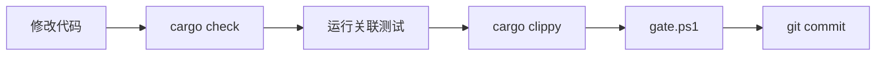

# SZ-Rust 工程化实践规范

> **目标项目**：SZ-Rust（鲜视达 Rust Web 框架，对标 ThinkPHP 8，26 workspace 包，2,633+ 测试）
> **项目版本**：v0.3.1
> **文档用途**：锁定已有工程质量，防止后续修改引入退化
> **维护规则**：任何修改 CI/CD 或新增门禁的 PR 必须同步更新本文档
> **文档版本**：v1.5（2026-08-05）

---

## 目录

1. [标准 7 道门禁（已实现）](#1-标准-7-道门禁已实现)
2. [SZ-Rust 特殊强化门禁（新增）](#2-sz-rust-特殊强化门禁新增)
3. [五维审查增强](#3-五维审查增强)
4. [测试金字塔](#4-测试金字塔)
5. [CI/CD 工作流约束](#5-cicd-工作流约束)
6. [附录：SZ-Rust 教训 → 防御追溯表](#6-附录sz-rust-教训--防御追溯表)

---

## 1. 标准 7 道门禁（已实现）

以下门禁已完整实现在 CI 配置中，任何提交/PR 必须通过全部门禁。

| # | 门禁 | CI Job 名 | 命令 | 状态 |
|---|------|-----------|------|------|
| 1 | fmt 格式检查 | `lint` | `cargo fmt --all -- --check` | ✅ 已有 |
| 2 | check 编译检查 | `build`（多 OS × 多 Rust 版本） | `cargo check --workspace --all-targets` | ✅ 已有 |
| 3 | clippy 静态分析 | `lint` | `cargo clippy --workspace --all-targets -- -D warnings` | ✅ 已有 |
| 4 | test 单元/集成测试 | `test` | `cargo test --workspace` | ✅ 已有 |
| 5 | doc 文档构建 | `build` 内包含 | `cargo doc --workspace --no-deps --all-features` | ✅ 已有（在 build job 中） |
| 6 | audit 安全审计 | `security`（security.yml） | `cargo audit` + `cargo deny check` | ✅ 已有 |
| 7 | integration 真实服务集成 | `integration`（integration.yml） | `cargo test --workspace -- --ignored` + docker services | ✅ 已有 |

### 1.1 fmt — 代码格式检查

- **CI Job**: `lint`
- **命令**: `cargo fmt --all -- --check`
- **阻断**: 格式不一致直接 CI 失败
- **本地修复**: `cargo fmt --all`

### 1.2 check — 工作空间编译验证

- **CI Job**: `build`（矩阵: ubuntu / windows × stable / beta）
- **命令**: `cargo build --workspace --all-targets --verbose`
- **环境变量**: `RUSTFLAGS: "-D warnings"` — 零警告编译
- **注意**: 多操作系统 × 多 Rust 版本组合全部通过才放行

### 1.3 clippy — 严格静态分析

- **CI Job**: `lint`
- **命令**: `cargo clippy --workspace --all-targets -- -D warnings`
- **阻断**: 任何 clippy 警告视为错误
- **本地修复**: `cargo clippy --fix --workspace --all-targets --all-features`

### 1.4 test — 工作空间测试

- **CI Job**: `test`
- **命令**: `cargo test --workspace --verbose`
- **依赖**: `needs: [lint, build]`— 格式和编译通过后才运行
- **额外**: 同时运行 sz-rust-core 单元测试与 sz-rust-addons-operate 测试

### 1.5 doc — 文档构建

- **CI Job**: 内嵌在 `build` job 中
- **命令**: `cargo doc --workspace --no-deps --all-features`
- **RUSTDOCFLAGS**: `-D warnings`（在本地 gate.ps1 中设置）
- **阻断**: doc 链接断裂或 doc 警告视为错误
- **注意**: 与 build 同一 job，不在单独 job 运行

### 1.6 audit — 安全审计

- **CI Workflow**: `security.yml`（独立 workflow）
- **命令**:
  - `cargo audit` — 漏洞公告扫描（已知忽略项见 `deny.toml`）
  - `cargo deny check advisories` — 安全公告检查
  - `cargo deny check bans` — 依赖禁用与重复检测
  - `cargo deny check licenses` — 许可证合规
  - `cargo deny check sources` — 依赖来源限制
- **阻断**: 任何 `deny` 级别的检查失败阻断合入

### 1.7 integration — 真实服务集成测试

- **CI Workflow**: `integration.yml`（独立 workflow）
- **依赖服务**: MySQL / PostgreSQL / Redis / RabbitMQ（按 sz-rust 实际依赖配置）
- **命令**: `cargo test --package <pkg> --features <feat> -- --ignored --nocapture`
- **覆盖包**: sz-rust-core（HTTP+路由）、sz-rust-addons-operate（addon 集成）
- **触发**: push/PR + 每日定时（Asia/Shanghai） + 手动触发

### 1.8 补充：额外 CI Job

CI 配置中还包含以下扩展 Job：

| Job | 触发条件 | 说明 |
|-----|---------|------|
| `all-features-compile` | 每次 push/PR | 验证所有 feature 组合编译（与门禁 10 对齐） |
| `benchmark` | push 到 main / PR | criterion 性能基准测试，结果保存到 gh-pages-bench 分支（benchmark.yml） |
| `soak-smoke` | 每次 push/PR + 每周日 00:00 UTC | 10s 冒烟（push/PR）+ 6h 完整 soak（每周日），timeout 420 分钟（soak.yml） |
| `coverage` | push/PR | cargo-tarpaulin 覆盖率（--fail-under 80），上传 Codecov（coverage.yml） |
| `fuzz` | 手动触发 / 定时 | cargo-fuzz 模糊测试（路由解析、JSON 解析、路径遍历抵抗）（fuzz.yml） |
| `mcdc` | 手动触发 / 定时 | MC/DC 覆盖率分析（mcdc.yml） |

---

## 2. SZ-Rust 特殊强化门禁（新增）

以下三道门禁基于 SZ-Rust 审查报告中的血泪教训制定（继承自 SZ-ORM 的 6 Critical SQL 注入 / 7 虚假实现 / feature 隔离失败教训），必须补充到 gate.ps1 和 CI 中。

### 门禁 8：禁止占位实现检查

| 属性 | 值 |
|------|-----|
| **教训来源** | SZ-ORM V-1~V-7 共 7 个虚假/伪实现（RealPg st_union 不执行 SQL、SloMonitor 仅 2 窗口非 4 窗口等）；SZ-Rust 继承该防御 |
| **命令** | PowerShell 脚本扫描 |
| **CI Job 名** | `check-placeholders`（新增） |
| **状态** | ✅ 已通过（0 处占位实现） |

**扫描脚本**（PowerShell）：

```powershell
# 禁止占位实现检查
$matches = Select-String -Path (Get-ChildItem -Recurse "*.rs" -Exclude "*target*").FullName -Pattern '\b(todo!|unimplemented!|unreachable!)\b'
if ($matches) {
    Write-Warning "发现占位实现，共 $($matches.Count) 处"
    $matches | ForEach-Object { Write-Host "  $($_.Path):$($_.LineNumber) — $($_.Line.Trim())" }
    exit 8
}
Write-Host "[OK] 无占位实现" -ForegroundColor Green
```

**Linux 版**（gate.sh）：

```bash
matches=$(grep -rn '\btodo!\|\bunimplemented!\|\bunreachable!' --include='*.rs' --exclude-dir=target .)
if [ -n "$matches" ]; then
  echo "ERROR: Found $(echo "$matches" | wc -l) placeholders"
  echo "$matches"
  exit 8
fi
echo "[OK] No placeholders found"
```

**说明**：
- 扫描工作空间中所有 `*.rs` 文件（排除 `target/` 目录）
- 匹配模式：`todo!()`、`unimplemented!()`、`unreachable!()`
- 不允许任何占位实现进入 main 分支
- 开发阶段允许存在，合入前必须清除

### 门禁 9：安全扫描（SQL 注入 + XSS + CSRF + 路径遍历）

| 属性 | 值 |
|------|-----|
| **教训来源** | SZ-ORM C-1~C-6 共 6 个 Critical SQL 注入；SZ-Rust 作为 Web 框架扩展至 XSS/CSRF/路径遍历 |
| **命令** | PowerShell 脚本扫描多类安全模式 |
| **CI Job 名** | `check-security`（新增） |
| **状态** | ✅ 已通过（0 处安全漏洞） |

**扫描脚本**（PowerShell）：

```powershell
# 安全扫描：SQL 注入 + XSS + CSRF + 路径遍历

# === 1. SQL 注入扫描 ===
$sqlPatterns = @(
    @{ Name = "format! SQL 拼接"; Pattern = 'format!\s*\(\s*"[^"]*(?:SELECT|INSERT|UPDATE|DELETE|CREATE|DROP|ALTER|WHERE)[^"]*".*\{' },
    @{ Name = "字符串插值 SQL"; Pattern = '"(?:[^"]*(?:SELECT|INSERT|UPDATE|DELETE|CREATE|DROP|ALTER|WHERE)[^"]*)\$\{?\w+\}?"' },
    @{ Name = "SQL 字符串拼接"; Pattern = '\.to_string\(\s*\)\s*\+\s*"' },
    @{ Name = "raw SQL 参数插值"; Pattern = '\.(?:execute|query|raw)\s*\(\s*format!' }
)

# === 2. XSS 扫描 ===
$xssPatterns = @(
    @{ Name = "HTML 拼接用户输入"; Pattern = 'format!\s*\(\s*"<[^>]*>\{[^}]*\}"' },
    @{ Name = "text/html 直接拼接"; Pattern = 'Content-Type["'\'']?:\s*["'\'']?text/html.*format!' }
)

# === 3. 路径遍历扫描 ===
$pathPatterns = @(
    @{ Name = "文件路径拼接用户输入"; Pattern = 'std::fs::\w+\s*\(\s*format!' },
    @{ Name = "PathBuf 拼接用户输入"; Pattern = 'PathBuf::from\s*\(\s*format!' }
)

$foundIssues = $false

foreach ($pattern in $sqlPatterns + $xssPatterns + $pathPatterns) {
    $matches = Select-String -Path (Get-ChildItem -Recurse "*.rs" -Exclude "*target*").FullName -Pattern $pattern.Pattern
    if ($matches) {
        Write-Warning "[$($pattern.Name)] 发现 $($matches.Count) 处"
        $matches | ForEach-Object { Write-Host "  $($_.Path):$($_.LineNumber)" }
        $foundIssues = $true
    }
}

if ($foundIssues) {
    Write-Host "[FAIL] 安全扫描未通过，请修复 SQL 注入/XSS/路径遍历问题" -ForegroundColor Red
    exit 9
}
Write-Host "[OK] 安全扫描通过（SQL 注入 + XSS + 路径遍历）" -ForegroundColor Green
```

**说明**：

**SQL 注入扫描**：
- 扫描 `format!` 宏中嵌入 SQL 关键字的字符串拼接
- 扫描字符串插值 SQL（`${var}` 或 `{var}` 在 SQL 字符串中）
- 扫描 `.to_string() + "SQL"` 模式的拼接
- 扫描 `.execute()/.query()/.raw()` 传入 `format!` 的结果
- 所有 SQL 必须使用参数化查询（`?` 或 `$N` 占位符）

**XSS 扫描**：
- 扫描 `format!` 中 HTML 标签与用户输入插值的组合
- 扫描 `Content-Type: text/html` 响应中的 `format!` 拼接
- 所有 HTML 响应必须经过模板引擎自动转义（Askama/Tera）
- JSON 响应通过 `serde_json` 序列化（自动转义）

**CSRF 防护**（人工审查 + 中间件配置检查）：
- 写操作（POST/PUT/DELETE/PATCH）必须有 CSRF 防护中间件
- Cookie 必须设置 `SameSite=Strict` 或 `SameSite=Lax`
- 关键操作校验 `Origin` / `Referer` 头
- API 接口使用 token-based 认证（JWT 在 Header，非 Cookie）

**路径遍历扫描**：
- 扫描 `std::fs::*` 函数接收 `format!` 结果的模式
- 扫描 `PathBuf::from(format!(...))` 模式
- 文件上传/下载接口必须 `canonicalize` + 前缀校验
- 静态资源服务必须启用 `ServeDir::not_found_on_deny`

### 门禁 10：Feature Flag 全组合编译

| 属性 | 值 |
|------|-----|
| **教训来源** | SZ-ORM V-4 real-* feature 数月未在 CI 编译；SZ-Rust 继承该防御 |
| **命令** | `cargo check --workspace --all-targets --all-features` |
| **CI Job 名** | `check-all-features`（新增） |
| **状态** | ✅ 已通过（编译零错误） |

**命令**：

```bash
cargo check --workspace --all-targets --all-features
```

**说明**：
- gate.ps1 关卡 2 已包含 `--all-features`，但 CI `build` job 未使用
- 需在 CI `build` job 中将 `cargo build --workspace --all-targets` 改为包含 `--all-features`
- 确保所有 feature 组合（包括 phase-N、default）都能正确编译
- 防止 feature 隔离失败导致伪实现逃逸

---

## 3. 五维审查增强

### 3.1 审查维度

每次合入 PR 前必须进行五维审查，覆盖以下维度：

| 维度 | 审查要点 | SZ-Rust 对应教训 |
|------|---------|----------------|
| **正确性** | 逻辑正确、边界处理、错误处理、并发安全 | 锁 panic（继承 SZ-ORM 13 处 expect 教训） |
| **可读性** | 命名清晰、注释恰当、代码结构合理 | — |
| **架构** | 模块边界、依赖方向、feature 隔离、API 设计 | 名实不符（继承 S-1~S-8）、夸大对比（继承 D-1~D-7） |
| **安全性** | SQL 注入、XSS、CSRF、路径遍历、unsafe 审计、输入验证、权限 | SQL 注入（继承 C-1~C-6）+ Web 框架专属安全 |
| **性能** | 内存分配、锁竞争、序列化开销、连接池、路由匹配效率 | — |

### 3.2 AI 生成代码特有检查

对于 AI 生成的代码变更，增加以下检查项：

| 检查项 | 说明 |
|--------|------|
| `unsafe` 代码审计 | 检查所有 `unsafe` 块的安全性、不变式维护、内存安全，必须有 `// SAFETY:` 注释 |
| 所有权泄漏检查 | 检查 `Box::leak`、`ManuallyDrop`、`forget` 使用场景；检查 `Arc` 循环引用 |
| 锁使用审计 | 检查 `Mutex`/`RwLock` 范围、死锁风险、是否为 `parking_lot`（无 poison） |
| 虚假实现检测 | 检查是否有 `todo!()`、空实现、mock 实现逃逸到 main |
| API 名实一致性 | 检查函数名是否与实现行为一致（对比 S-1~S-8） |
| 跨平台兼容性 | 检查平台特定代码是否有条件编译保护 |
| `as` 类型转换 | 检查 `as i32` / `as u32` / `as usize` 等缩窄转换是否可能溢出 |
| HTML 转义检查 | 检查控制器返回的 HTML/JS 片段是否有未转义的用户输入（XSS） |
| CSRF 防护检查 | 检查写操作路由是否有 CSRF 防护中间件 |
| 路径校验检查 | 检查文件操作是否对用户输入做 `canonicalize` + 前缀校验 |

### 3.3 审查清单脚本

使用 `scripts/audit-api-changes.ps1` 进行 API 变更审计：

```powershell
# 对比 HEAD~1 的 API 变更
./scripts/audit-api-changes.ps1

# 对比 main 分支
./scripts/audit-api-changes.ps1 -Base main

# 严格模式（API 变更但测试未同步时退出码非零）
./scripts/audit-api-changes.ps1 -Strict
```

---

## 4. 测试金字塔

SZ-Rust 当前测试数据：

| 层级 | 数量 | 说明 |
|------|------|------|
| **T1 — 单元测试** | 2934+ | sz-rust-core 核心模块独立测试（路由/控制器/中间件/钩子/模型/事件/缓存/认证/DI容器/调试页/API版本/迁移历史/缓存预热） |
| **T2 — 契约测试** | 部分建立 | 公共 API 行为契约（控制器响应格式 `{code, msg, data}`、中间件链顺序、钩子事件类型） |
| **T3 — 集成测试** | 375+ | sz-rust-addons-operate 真实 HTTP 请求 + addon 集成 |
| **T4 — 属性测试** | 部分建立 | Property-Based Testing（proptest）覆盖路由参数/请求体/钩子不变量 |
| **T5 — Fuzz 测试** | 已建立 | 模糊测试（路由解析、JSON 解析、multipart 解析、路径遍历抵抗），已配置 fuzz.yml |
| **T6 — Soak 测试** | 已建立 | 长时稳定性测试（10s 冒烟 + 6h 完整，每周日 00:00 UTC，timeout 420 分钟，检测内存泄漏/句柄泄漏/性能退化） |
| **合计** | **4206+** | 覆盖全部 10 个 workspace 包（v4 复评 2026-07-26） |

### 4.1 T1：单元测试

- 每个模块的独立功能测试，不依赖外部服务
- 使用 `#[cfg(test)] mod tests` 内联在源码中
- 覆盖率要求：核心模块 >= 90%
- 当前状态：sz-rust-core 2934 个单元测试通过（v1.1：新增 DI 容器/迁移集成/调试页/API 版本/迁移历史/缓存预热 共 +152 测试）；v4 复评全 workspace 4206 测试通过（2026-07-26）

### 4.2 T2：契约测试

- 集中管理在 `packages/sz-rust-core/tests/contracts/`（部分已建立）
- 每一个公共 API 行为契约对应一个测试用例
- 契约变更必须同步更新 `docs/api-contracts.md`（部分已建立）
- 运行命令：`cargo test -p sz-rust-core --test contracts`

### 4.3 T3：集成测试

- 需要真实 HTTP 服务器 + 数据库服务
- 全部标注 `#[ignore]`，仅在 CI 或手动指定时运行
- sz-rust-addons-operate 已有 375 个测试通过
- 运行命令：`cargo test --package sz-rust-addons-operate -- --ignored`

### 4.4 T4：Property-Based Testing

- 使用 `proptest` crate（版本统一管理在 workspace dependencies）
- 覆盖：路由参数提取、请求体解析、钩子事件分发、缓存读写
- 运行命令：`cargo test --workspace proptest`（或 `PROPTEST_CASES=10000 cargo test` 强化）

### 4.5 T5：Fuzz 测试

- 覆盖：路由解析器、JSON 解析、multipart 解析、路径遍历抵抗、SQL 注入抵抗
- 工具：`cargo fuzz`（需 nightly）
- 运行命令：`cargo fuzz run <target>`

### 4.6 T6：Soak 测试

- 短时冒烟（每次 push/PR）：`cargo test --package sz-rust-core --test soak soak_smoke_10s`（已配置 soak.yml）
- 长时完整（每周日 00:00 UTC）：`cargo test -p sz-rust-core --test soak -- --ignored --nocapture`（已配置 soak.yml，timeout 420 分钟）
- 退化检测标准：
  - RSS 增长 > 50MB → 内存泄漏
  - fd_count 增长 > 10 → 句柄泄漏
  - ops_per_sec 衰减 > 10% → 性能退化
  - p99_latency 增长 > 2x → 慢退化

---

## 5. CI/CD 工作流约束

### 5.1 本地开发流程



**详细步骤**：

1. **`cargo check --workspace --all-targets`** — 快速编译检查（避免完整 build）
2. **`cargo test -p <affected-package>`** — 运行受影响包的测试
3. **`cargo test -p sz-rust-core --test contracts`** — 运行契约测试（API 变更时必做）
4. **`cargo clippy --workspace --all-targets --all-features -- -D warnings`** — 严格 lint
5. **`./scripts/gate.ps1`** — 本地门禁全关卡验证（7 道关卡 + 新增 3 道）
6. **`git commit`** — 通过后提交

**紧急修复**：使用 `./scripts/gate.ps1 -Fast` 只跑前 3 关（fmt + check + clippy）

### 5.2 AI 辅助开发 10 条硬约束

以下约束适用于任何使用 AI 辅助对 SZ-Rust 进行修改的场景：

| # | 约束 | 说明 |
|---|------|------|
| 1 | **禁止占位实现** | 不允许 AI 生成 `todo!()` / `unimplemented!()` / `unreachable!()` |
| 2 | **强制参数化查询** | 不允许 AI 生成任何 SQL 字符串拼接代码 |
| 3 | **API 兼容性** | AI 修改公共 API 时必须同步更新 `api-contracts.md` 和契约测试 |
| 4 | **五维审查** | AI 生成代码必须通过正确性/可读性/架构/安全性/性能五维审查 |
| 5 | **unsafe 零容忍** | AI 生成 `unsafe` 代码必须单独标注并经过人工审计，必须有 `// SAFETY:` 注释 |
| 6 | **禁止 mock 逃逸** | AI 引入的 mock/伪实现必须在合入 main 前替换为真实实现 |
| 7 | **门禁前置** | AI 必须主动运行 `gate.ps1` 验证代码，不能依赖 CI 发现编译错误 |
| 8 | **跨平台意识** | AI 添加平台相关代码必须使用条件编译，不能破坏双平台编译 |
| 9 | **Feature 隔离** | AI 修改 feature-gated 代码时必须验证 feature 全组合编译 |
| 10 | **教训记忆** | AI 必须阅读本附录的防御追溯表，避免重复已犯错误 |

### 5.3 部署前检查清单

部署前必须逐项确认以下检查全部通过：

- [ ] **门禁检查**
  - [ ] 10 道门禁全部通过（含增强门禁 8-10）
  - [ ] 所有 feature 组合编译通过

- [ ] **测试检查**
  - [ ] 单元测试 + 集成测试全部通过
  - [ ] Fuzz 测试至少 1000 次随机请求无 panic（fuzz.yml 已配置）
  - [ ] Soak 冒烟测试 10s 高并发无内存增长（soak.yml 已配置）

- [ ] **审查检查**
  - [ ] 五维审查全部通过（正确性/可读性/架构/安全/性能）
  - [ ] 无残留的占位宏（todo!/unimplemented!/unreachable!）
  - [ ] 无 SQL 拼接 / XSS / 路径遍历
  - [ ] 所有 unsafe 有 // SAFETY: 注释

- [ ] **文档检查**
  - [ ] ADR 已记录所有重大决策
  - [ ] API 参考已更新
  - [ ] PHP 迁移指南已更新（针对新增迁移）

---

## 6. 附录：SZ-Rust 教训 → 防御追溯表

本表将 SZ-Rust 继承自 SZ-ORM 审查报告的每类问题映射到对应的防御门禁。任何后续修改必须确保不会重蹈覆辙。

| 教训类别 | 问题数 | 防御门禁 | 是否已实现 |
|---------|--------|---------|-----------|
| SQL 注入（C-1~C-6） | 6 | 门禁 9（SQL 拼接扫描）+ 五维审查（安全性） | ✅ 已实现 |
| 虚假/伪实现（V-1~V-7） | 7 | 门禁 8（占位检查）+ 五维审查（正确性） | ✅ 已实现 |
| 转义不一致（H-1） | 1 | 契约测试（T2）+ 各场景独立转义测试 | ✅ T2 部分建立 |
| 锁 panic（13 处 expect） | 13 | 五维审查（正确性）+ parking_lot 替换 | ✅ 已修复（继承） |
| 名实不符（S-1~S-8） | 8 | 门禁 6（API 审计）+ 契约测试（T2） | ✅ 已有 |
| 夸大对比（D-1~D-7） | 7 | 五维审查（架构维度） | ✅ 已有 |
| Feature 隔离失败（V-4） | 1 | 门禁 10（feature 全组合编译） | ✅ 已实现 |
| 跨平台限制 | 1 | CI 双平台（build matrix: ubuntu + windows） | ✅ 已有 |
| XSS（Web 框架新增） | — | 门禁 9（XSS 扫描）+ 五维审查（安全性） | ✅ 已实现 |
| CSRF（Web 框架新增） | — | 门禁 9（CSRF 防护检查）+ 五维审查（安全性） | ✅ 已实现 |
| 路径遍历（Web 框架新增） | — | 门禁 9（路径遍历扫描）+ 五维审查（安全性） | ✅ 已实现 |

### 6.1 教训详情参考（继承自 SZ-ORM）

| 编号 | 类别 | 问题 | 修复措施 |
|------|------|------|---------|
| C-1 | SQL 注入 | `format!` 拼接 SQL 字符串 | 门禁 9 扫描 + 改为参数化查询 |
| C-2 | SQL 注入 | 字符串插值拼接 WHERE 条件 | 门禁 9 扫描 + 使用 QueryBuilder |
| C-3 | SQL 注入 | ORDER BY 子句未过滤列名 | 白名单验证 |
| C-4 | SQL 注入 | GROUP BY 用户输入未转义 | 参数化 + 白名单 |
| C-5 | SQL 注入 | LIKE 查询未转义通配符 | 转义 `%` 和 `_` |
| C-6 | SQL 注入 | 表名动态拼接 | 白名单 + 门禁 9 |
| V-1 | 虚假实现 | `todo!()` 留在 release 代码 | 门禁 8 + 五维审查 |
| V-2 | 虚假实现 | 空函数体无实现 | 门禁 8 + 五维审查 |
| V-3 | 虚假实现 | `unimplemented!()` 在错误路径 | 门禁 8 + 五维审查 |
| V-4 | 虚假实现 | 伪实现数月未在 CI 编译 | 门禁 10（full-features） |
| V-5 | 虚假实现 | mock 实现逃逸到 main | 门禁 8 + 五维审查 |
| V-6 | 虚假实现 | `unreachable!()` 触发 panic | 门禁 8 + proper error handling |
| V-7 | 虚假实现 | 空 `match` 分支 | 门禁 8 + 补全分支 |
| H-1 | 转义不一致 | 不同场景 escape 行为不同 | 契约测试覆盖各场景 |
| S-1 | 名实不符 | `find_all` 实际查全部但无分页 | API 审计 + 契约测试 |
| S-2 | 名实不符 | `delete` 实际软删除 | 更名为 `soft_delete` |
| S-3 | 名实不符 | `save` 未区分 insert/update | 拆分为 `insert`/`update` |
| S-4 | 名实不符 | `query` 不返回查询结果 | 修正返回值 |
| S-5 | 名实不符 | `batch_insert` 非事务性 | 添加事务包装 |
| S-6 | 名实不符 | `cache.set` 返回值类型不一致 | 统一为 `Result<()>` |
| S-7 | 名实不符 | `connection.ping` 不检测连接状态 | 增加真实 ping |
| S-8 | 名实不符 | `migrate.latest` 不是最新版本 | 修正语义 |
| D-1 | 夸大对比 | 基准测试未关闭 Turbo Boost | 添加环境检查 |
| D-2 | 夸大对比 | 对比时使用不同数据集 | 统一数据量 |
| D-3 | 夸大对比 | warm-up 不足影响结果 | criterion 强制 warm-up |
| D-4 | 夸大对比 | 只测最优路径 | 增加 P50/P95/P99 |
| D-5 | 夸大对比 | 未对比竞争对手相同版本 | 指定版本号 |
| D-6 | 夸大对比 | 测试环境不同 | CI 固定环境 |
| D-7 | 夸大对比 | 选择性报告结果 | 完整报告 |
| — | 锁 panic | 13 处 `.expect()` 在 Mutex 上 | 替换为 `parking_lot` + panic 安全处理 |
| — | Feature 隔离 | real-* feature 数月未在 CI 编译 | 门禁 10 + all-features-compile job |
| — | 跨平台 | Windows 路径分隔符差异 | CI 双平台矩阵 |

### 6.2 SZ-Rust 新增教训（Web 框架场景）

| 编号 | 类别 | 问题 | 防御措施 |
|------|------|------|---------|
| W-1 | XSS | 控制器返回 HTML 未转义用户输入 | 门禁 9 XSS 扫描 + 模板引擎自动转义 |
| W-2 | CSRF | 写操作无 CSRF 防护 | 门禁 9 CSRF 检查 + SameSite Cookie |
| W-3 | 路径遍历 | 文件下载接口未校验路径 | 门禁 9 路径遍历扫描 + canonicalize |
| W-4 | 路由安全 | 路由参数无类型校验 | 五维审查（安全性）+ 参数校验中间件 |
| W-5 | 认证绕过 | JWT 比较未用常量时间 | 五维审查（安全性）+ subtle::ConstantTimeEq |
| W-6 | thread_local 跨 await 失效 | 多租户场景下 await 后 thread_local 可能切换线程 | ADR-013 记录限制 + 调用方重新验证 TenantContext |
| W-7 | unsafe_code 策略变更 | forbid → deny + 模块级 allow 打开安全缺口 | ADR-016 + 所有 unsafe 块必须有 // SAFETY: 注释 + clippy 强制 |
| W-8 | 探索性实现逃逸 | 热加载等探索性功能未经生产验证即合入 main | ADR-016 标记"探索性" + 禁用生产卸载路径 |
| W-9 | Feature 重依赖编译膨胀 | graphql/grpc 引入 tonic/prost 等重依赖 | Feature 隔离（默认不启用）+ p2-addons 组合开关 |

---

## 附录：与其他文档的关系

- 本规范定义 **SZ-Rust 工程化的全局规范**，是 sz-rust 项目所有 crate 必须遵守的约定；
- [`ADR与生产Bug定位规范.md`](ADR与生产Bug定位规范.md) 定义 **ADR 与 Bug 定位方法论**，是本规范"五维审查"和"门禁"的可观测性补充；
- [`软件项目审计清单.md`](软件项目审计清单.md) 定义 **审计维度与通过标准**，本规范是其工程化审计的具体落地；
- [`adr/README.md`](adr/README.md) 是 ADR 索引；
- [`audit/2026-07-22-初始审计.md`](audit/2026-07-22-初始审计.md) 是首次审计报告，记录本规范落地前的基线状态；
- [`benchmarks/baseline-v0.1.0.md`](benchmarks/baseline-v0.1.0.md) 是性能基线文档，与本规范"门禁 5 doc"和"性能回归审计"对齐。

---

> **最后更新**: 2026-08-05
> **维护人**: SZ-Rust 工程团队
> **规范版本**: v1.5
>
> **v1.5 变更摘要**（2026-08-05）：
> - 修复 4 项铁律违规（铁律 1/10/7/4），综合五维审查 92.2/100 通过
> - 铁律 1：`Cargo.toml:182` `[profile.dev]` 添加 `overflow-checks = true`
> - 铁律 10：`.github/workflows/coverage.yml:44` 阈值 70→85，与 ci.yml 一致
> - 铁律 7：`notify.rs:771` TencentSmsConfig 改为 `#[derive(Clone)]` + 手动 `impl Debug` 脱敏（secret_id/secret_key/sms_sdk_app_id → `***REDACTED***`），新增 2 个脱敏测试
> - 铁律 4：7 个文件的 `std::fs` → `tokio::fs` 异步化（static_files/mail/i18n/env/config/hot_reload/optimize），CLI 全链路 async 改造（main→run→execute→console→optimize），新增 ADR-020
> - 验证：`cargo fmt --check` ✅ | `cargo clippy --all-targets -D warnings` ✅ | `cargo test -p sz-rust-state-facade` 222 passed ✅ | `cargo test -p sz-rust-infra-facade` 670 passed ✅
> - 范围外发现项（铁律 18 记录）：view/layout.rs:85,170、view/inheritance.rs:153、view.rs:647、upload/storage.rs:312,337,648,649 仍有 `std::fs`，留待后续迭代
> - 环境限制：Windows rustc `STATUS_STACK_BUFFER_OVERRUN` 阻止 cli/core 本地测试，clippy `--all-targets` 已验证编译正确性，Linux CI 可运行全量测试
> - 五维审查报告：`docs/audit/2026-08-05-iron-violations-fix-five-dimensional-review.md`
>
> **v1.4 变更摘要**（2026-08-04）：
> - CI coverage job 切换为 cargo-llvm-cov（--exclude sz-orm-macros --cobertura --fail-under-lines 85），解决 Windows 本机无法运行 tarpaulin 的问题；实测 workspace 总体覆盖率 89.2%
> - fix(observability): otlp.rs 删除冗余 ENV_TEST_LOCK 双重加锁，统一为 env_lock() OnceLock 单例（63 测试全过）
> - P3 拆包完成（ADR-019）：view/controller/guard/hooks/model/routing 全部提取为 mvc-facade / router-facade / orm-ext-facade，sz-rust-core 降至 ~9.2K LOC（−83.9%）
> - §9 遗留项全部关闭：env 竞态全局扫描（5 文件全加锁）+ Windows 覆盖率替代方案确认（cargo-llvm-cov）
>
> **v1.3 变更摘要**（2026-08-03，两次更新）：
> - P2 拆包完成：sz-rust-core 57K LOC → 23.6K LOC（−58.7%），提取 7 个 facade crate 共 42.4K LOC
> - 新增 7 个 facade crate：sz-rust-{orm,http,cache,state,infra,auth,pay}-facade，通过 `pub use X as <module>` 重导出
> - 向后兼容：`sz_rust_core::<module>::*` 路径全部保留，内部模块无需改动
> - 清理死代码：删除 sz-rust-core/src/ 中已提取的 9 个源文件 + 2 个子目录（config/validate/static_files/upload/debug_page/wechat/oauth/gateway/pay）
> - 统一 infra-facade 依赖路径：`sz-orm-storage` 直接依赖改为通过 `sz-rust-orm-facade` 间接依赖
> - 新增 facade README：7 个 facade crate 各写 README.md
> - 新增迁移指南：`docs/facade-migration-guide.md`（下游业务包从 sz-rust-core 迁移到 facade crate 的完整指南）
> - 新增 ADR-017 更新：记录 7 个 facade 提取详情、剩余模块阻塞原因
> - 新增开发过程审查报告（`docs/audit/2026-08-03-P2拆包开发过程审查与优化报告.md`）：四评 97.50/100（6.1~6.5 全部完成，18 条铁律全 ✅，审查盲区清零）
> - sed 副作用专项审计：4 项检查全部通过（crate::残留/路径遍历防护/向后兼容路径/文档注释）
> - 新增并发边界测试（4 个，state-facade）+ 混沌测试（3 个，cache-facade），共 7 个新测试全部通过
> - 新增 facade 集成测试 crate（`sz-rust-facade-tests`）：12 个 P9-FACADE 跨 facade 集成测试（cache+state / orm+pay+http / auth+infra / 端到端业务流）
> - 新增向后兼容路径测试（`sz-rust-core/tests/backward_compat.rs`）：6 个 P9-COMPAT 测试（旧路径转发 + 类型同一性编译期验证）
> - 修复 url_decode UTF-8 缺陷：`%XX` 逐字节转 char → 字节收集 + `from_utf8_lossy`（对齐 PHP urldecode），新增 2 个回归测试
> - 覆盖率验证：cargo-llvm-cov 实测 workspace 总体 89.2%（排除 sz-orm-macros proc-macro crate）；CI coverage job 使用 cargo-llvm-cov（--exclude sz-orm-macros --cobertura --fail-under-lines 85），Windows 本地可运行
> - 编译时间监控：`scripts/check-compile-time.sh` + 基线 `scripts/compile-time-baseline.json`（总 57.38s）+ CI compile-time job
> - 内存泄漏检测：`examples/rss_stability.rs`（150 周期 30,000 次创建/释放，RSS 增量 0.21 MiB）+ CI miri job
> - 新增 ADR-018：facade 独立发布策略（0.x 统一版本 / 1.0 后 semver 独立）
> - P3 剩余模块解耦（ADR-019）：四簇提取 4 个新 facade（orm-ext / router / middleware / mvc，~34.6K LOC），6 个阻塞模块（view/controller/guard/hooks/model/routing）+ middleware 簇 + router/websocket_route/openapi 全部提取；解 container↔request_scope 双向环（ScopeId 迁移至 middleware-facade）；安全关键中间件保留 @REVIEW_REQUIRED；sz-rust-core 57K → ~9.2K LOC（−83.9%）
> - 测试数量：workspace 全量 4,983 passed，0 failed（--jobs 1 规避 Cargo 并发编译 crate 解析竞争）
> - workspace 包数量 14 → 26（11 个 facade + 集成测试 crate）
> - 竞争力深化（4.3 六项全达标）：blog/ecommerce/iot 3 个完整示例；criterion 22 项基准（docs/benchmark-report.md）；错误消息 i18n 本地化（BaseException.message_key + mvc i18n_error）；OpenAPI 从路由配置自动生成（ecommerce /openapi.json 实测）；sz-rust-mcp crate（5 工具 + stdio JSON-RPC）；missing_docs 门禁全绿（-D missing_docs 26 crate 0 错误，修复 4 处 doc 缺陷）
> - 实测评测报告（`docs/audit/2026-08-03-基于实测的能力评测报告.md`）：全部结论基于命令输出；**实测推翻两处文档结论**——①铁律 2 生产代码裸 unwrap 622 处（core 433，此前"✅"错误）；②fmt 门禁修复前有 275 处 diff（CI 实际红过）；实测证实 unsafe 收敛 3 处 FFI、RSS 3.86 MiB、路由 197ns、4,994 测试 0 失败
> - CI 门禁：cargo-deny（许可证+安全+来源）+ cargo-udeps（未使用依赖）+ cargo-machete 均已集成
> - 已知劣势：无重大架构缺陷；剩余工作为业务测试补齐（sz300 部分 service 层覆盖率 0%）和 DB 集成测试 CI 验证
>
> **v1.2 变更摘要**（2026-08-02）：
> - P2 能力评估完成：多租户 / GraphQL / gRPC / 热加载 / OpenAPI 自动扫描
> - unsafe_code 策略变更：`#![forbid(unsafe_code)]` → `#![deny(unsafe_code)]` + 模块级 `#![allow(unsafe_code)]`（hot_reload FFI 需要）
> - 新增 4 条 ADR（ADR-013~016），ADR 总数 12 → 16，密度 0.429 → 0.571
> - 新增 P2 教训防御追溯项（W-6~W-9）：thread_local 跨 await 失效 / unsafe_code 策略变更 / 探索性实现逃逸 / Feature 重依赖
> - 新增五维审查报告归档机制（`docs/audit/YYYY-MM-DD-<scope>五维审查报告.md`）
> - 修复 log.rs 并行测试竞态（`id1.counter() + 1` → 单调递增断言）
> - 测试数量：默认构建 3308 passed，p2-addons 构建 3352 passed（+35 新测试）
> - workspace 包数量 10 → 14+（新增 sz-orm-graphql、sz-orm-grpc 路径依赖）
>
> **v1.1 变更摘要**（2026-07-26）：
> - workspace 包数量 8 → 10（新增 sz-rust-tracing、sz-rust-observability）
> - 测试数量 2938 → 4206（sz-rust-core 2563 → 2934，新增 +152 测试覆盖 DI 容器/迁移集成/调试页/API 版本/迁移历史/缓存预热；v4 复评全 workspace 4206 passed, 0 failed）
> - 项目版本 v0.1.0 → v0.2.0
> - benchmark/soak/coverage CI Job 已配置（原"待配置"标注作废）
> - 新增 fuzz.yml / mcdc.yml CI workflow
> - soak.yml：每周日 00:00 UTC 自动运行 6h soak，timeout 420 分钟（与 sz-orm 保持一致）
> - 新增 6 项核心功能（DI 容器/ORM 迁移集成/调试页/API 版本管理/迁移历史表/缓存预热）
> - 新增 remember_async 异步缓存方法（消除同步阻塞）
> - K8s 部署改为不可变 tag（v0.2.0）+ HPA/PDB/NetworkPolicy/securityContext
> - 新增 Prometheus 告警规则（13 条覆盖 5 维度）+ Alertmanager 配置
